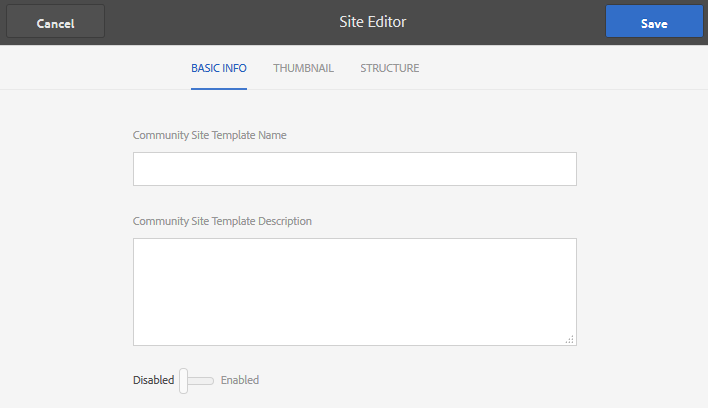

# Modèles de site {#site-templates}

La console Modèles de site est très similaire à la console [Modèles de groupe](tools-groups.md), qui se concentre sur des fonctions présentant un intérêt pour les groupes communautaires.

>[!NOTE]
>
>Les consoles pour la création de [sites communautaires](sites-console.md), [modèles de sites communautaires](sites.md), [modèles de groupes communautaires](tools-groups.md) et [fonctions communautaires](functions.md) ne sont utilisées que dans l&#39;environnement d&#39;auteur.

## Console Modèles de site {#site-templates-console}

Dans l’environnement de l’auteur, pour accéder à la console des sites de la communauté

* A partir de la navigation globale : **[!UICONTROL Outils > Communautés > Modèles de site]**

Cette console affiche les modèles à partir desquels un [site communautaire](sites-console.md) peut être créé et permet de créer de nouveaux modèles de site.

## Créer un modèle de site {#create-site-template}

Pour commencer à créer un modèle de site, sélectionnez `Create`.

Le panneau Editeur de site qui contient 3 sous-panneaux s’affiche alors :

### Informations de base {#basic-info}

Dans le panneau Informations de base, un nom, une description et si le modèle est activé ou désactivé sont configurés :

* **[!UICONTROL Nom du modèle de site de la communauté]**
ID du nom du modèle

* **[!UICONTROL Description du modèle de site de la communauté]**
Description du modèle

* **[!UICONTROL Désactivé/]**
activéBasculement permettant de contrôler si le modèle est référencé

### Miniature  {#thumbnail}

(Facultatif) Sélectionnez l’icône Télécharger l’image pour afficher une miniature ainsi que le nom et la description des créateurs de sites communautaires.

### Structure {#structure}

Pour ajouter des fonctions de communauté, faites glisser le curseur de droite vers la gauche dans l&#39;ordre d&#39;affichage des liens du menu du site. Les styles seront appliqués au modèle lors de la création du site.

Par exemple, si vous souhaitez une page d&#39;accueil, faites glisser la fonction Page de la bibliothèque et déposez-la sous le créateur de modèles. La boîte de dialogue de configuration de la page s’ouvre alors. Pour plus d&#39;informations sur les boîtes de dialogue de configuration, consultez la [console des fonctions](functions.md).

Continuez à faire glisser et à déposer toutes les autres fonctions de la communauté souhaitées pour un site communautaire en fonction de ce modèle.

La fonction page fournit une page vide. La fonction de groupes permet de créer un site de groupe (sous-communauté) au sein du site communautaire.

>[!CAUTION]
>
>La fonction groups doit *ne pas* être la *première fonction ou la seule* fonction dans la structure du site.
>
>Toute autre fonction, telle que la fonction de page [page](functions.md#page-function), doit être incluse et répertoriée en premier.

### Modèles de groupe pour la fonction Groupes {#group-templates-for-groups-function}

Lorsque vous incluez une fonction de groupes dans le modèle de site, la configuration requiert la spécification des choix de modèle de groupe autorisés lorsqu&#39;un nouveau groupe est créé dans l&#39;environnement de publication.

>[!CAUTION]
>
>La fonction Groups doit *ne pas* être la première fonction *ni la seule fonction* dans la structure du site.

En sélectionnant au moins deux modèles de groupe de communauté, un choix est fourni à l’administrateur du groupe lors de la création d’un nouveau groupe dans la communauté.

## Modifier le modèle de site{#edit-site-template}

Lorsque vous consultez des modèles de site dans la console principale [Modèles de site](#site-templates-console), il est possible de sélectionner un modèle de site existant à modifier.

Ce processus fournit les mêmes panneaux que [la création d&#39;un modèle de site](#create-site-template).
