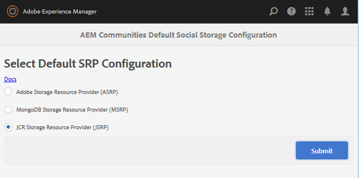

# Stockage  Configuration {#storage-configuration}

>[!CAUTION]
>
>AEM 6.4 a atteint la fin de la prise en charge étendue et cette documentation n’est plus mise à jour. Pour plus d’informations, voir notre [période de support technique](https://helpx.adobe.com/fr/support/programs/eol-matrix.html). Rechercher les versions prises en charge [here](https://experienceleague.adobe.com/docs/?lang=fr).

La configuration du stockage est le moyen d’identifier le stockage choisi pour le contenu de la communauté, également appelé contenu généré par l’utilisateur (UGC).

Ce paramètre informe le code AEM Communities sur l’implémentation du fournisseur de ressources de stockage (SRP) à utiliser lors de l’accès au contenu créé par l’utilisateur et doit refléter la topologie définie lors du déploiement d’AEM.

Pour une discussion sur les options de stockage et les topologies de déploiement, consultez

* [Community Content Store](working-with-srp.md)
* [Topologies recommandées](topologies.md)

## Console de configuration de stockage {#storage-configuration-console}

Dans l’environnement de création, pour accéder à la console de configuration du stockage

* À partir de la navigation globale : **[!UICONTROL Outils > Communautés > Configuration de stockage]**

Pour sélectionner une option de stockage autre que le JCR par défaut :

* sélectionner une option
* Configurer correctement

   * Voir les détails de [sélection de MSRP](msrp.md#select-msrp)
   * Voir les détails de [sélection de DSRP](dsrp.md#select-dsrp)
   * Voir les détails de [sélection de l’ASRP](asrp.md#select-asrp)

* Sélectionnez **[!UICONTROL Envoyer]**

### À propos du stockage JCR {#about-jcr-storage}

Notez que si aucune sélection n’est effectuée, la valeur par défaut est le référentiel AEM, JCR.

JCR est *not* un magasin commun partagé par les environnements de création et de publication. Le contenu de la communauté n’est visible que depuis l’environnement de création ou de publication dans lequel il a été créé.

Visite [Magasin JCR](jsrp.md) pour plus d’informations.

>[!NOTE]
>
>L’absence du noeud `srpc`under `/etc/socialconfig` indique la valeur par défaut [Magasin JCR](jsrp.md).
