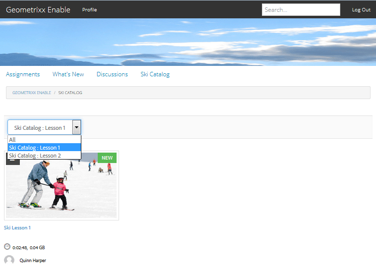

# Balisage des ressources d’activation  {#tagging-enablement-resources}

## Présentation {#overview}

Le balisage des ressources d’activation permet de filtrer les ressources et les parcours d’apprentissage lorsque les membres naviguent [catalogues](functions.md#catalog-function).

Essentiellement :

* [Création d’un espace de noms de balise](../../help/sites-administering/tags.md#creating-a-namespace) pour chaque catalogue

   * [Définition des autorisations de balises](../../help/sites-administering/tags.md#setting-tag-permissions)

      * Pour les membres de la communauté uniquement (communauté fermée)

         * Autoriser l’accès en lecture au [groupe de membres du site de la communauté](users.md#publish-group-roles)
      * Pour tout visiteur du site, qu’il soit connecté ou anonyme (communauté ouverte)

         * Autoriser l’accès en lecture au `Everyone`group
   * [Publication des balises](../../help/sites-administering/tags.md#publishing-tags)

* [Définition de la portée des balises pour un site de communauté](sites-console.md#tagging)

   * [Configuration des catalogues qui existent dans la structure du site](functions.md#catalog-function)

      * Peut ajouter des balises à l’instance de catalogue pour contrôler la liste des balises présentées dans les filtres de l’interface utilisateur.
      * Peut ajouter [pré-filtres](catalog-developer-essentials.md#pre-filters), pour restreindre les ressources incluses d’un catalogue

* [Publier le site de la communauté](sites-console.md#publishing-the-site)
* [Application de balises aux ressources d’activation](resources.md#create-a-resource) afin qu’elles puissent être filtrées de manière catégorique
* [Publier les ressources d&#39;activation](resources.md#publish)

## Balises de site de communauté {#community-site-tags}

Lors de la création ou de la modification d’un site communautaire, la variable [Paramètre de balisage](sites-console.md#tagging) définit la portée des balises disponibles pour les fonctionnalités du site en sélectionnant un sous-ensemble d’espaces de noms de balise existants.

Bien que des balises puissent être créées et ajoutées au site de la communauté à tout moment, il est recommandé de concevoir au préalable une taxonomie, comme pour la conception d’une base de données. Voir [Utilisation des balises](../../help/sites-authoring/tags.md).

Lors de l’ajout ultérieur de balises à un site de communauté existant, il est nécessaire d’enregistrer la modification avant de pouvoir ajouter la nouvelle balise à une fonction de catalogue dans la structure du site.

Pour un site de communauté, une fois le site publié et les balises publiées, il est nécessaire d’activer l’accès en lecture aux membres de la communauté. Voir [Définition des autorisations de balise](../../help/sites-administering/tags.md#setting-tag-permissions).

Voici comment il apparaît dans CRXDE lorsqu’un administrateur applique des autorisations de lecture à `/etc/tags/ski-catalog` pour le groupe `Community Enable Members`.

## Espaces de noms des balises du catalogue {#catalog-tag-namespaces}

La fonction Catalogue utilise des balises pour se définir. Lors de la configuration de la fonction de catalogue dans un site de la communauté, l’ensemble d’espaces de noms de balise parmi lesquels choisir est défini par la portée des espaces de noms de balise définis pour le site de la communauté.

La fonction Catalog comprend un paramètre de balise qui définit les balises répertoriées dans l’interface utilisateur de filtrage pour le catalogue. Le paramètre &quot;Tous les espaces de noms&quot; fait référence à la portée des espaces de noms de balise sélectionnés pour le site de la communauté.

## Application de balises aux ressources d’activation {#applying-tags-to-enablement-resources}

Les ressources d’activation et les parcours de formation s’affichent dans tous les catalogues lorsque `Show in Catalog` est cochée. L’ajout de balises aux ressources et aux cursus de formation permet de pré-filtrer des catalogues spécifiques, ainsi que de les filtrer dans l’interface utilisateur du catalogue.

Pour limiter les ressources d’activation et les parcours de formation à des catalogues spécifiques, créez des [pré-filtres](catalog-developer-essentials.md#pre-filters).

L’interface utilisateur du catalogue permet aux visiteurs d’appliquer un filtre de balises à la liste des ressources et des chemins d’apprentissage qui apparaissent dans ce catalogue.

L’administrateur qui applique les balises aux ressources d’activation doit connaître les espaces de noms de balise associés aux catalogues, ainsi que la taxonomie afin de sélectionner une sous-balise pour une catégorisation plus précise.

Par exemple, si une `ski-catalog` Un espace de noms a été créé et défini dans un catalogue nommé `Ski Catalog`, il peut avoir deux balises enfants : `lesson-1` et `lesson-2`.

Ainsi, toute ressource d’activation balisée avec l’une des ressources suivantes :

* ski-catalog:
* catalogue-skis:leçon-1
* catalogue-skis:leçon-2

apparaît dans `Ski Catalog` une fois la ressource d’activation publiée.

## Affichage du catalogue lors de la publication {#viewing-catalog-on-publish}

Une fois que tout a été configuré dans l’environnement de création et publié, l’expérience d’utilisation du catalogue pour rechercher des ressources d’activation peut être expérimentée dans l’environnement de publication.

Si aucun espace de noms de balise n’apparaît dans la liste déroulante, assurez-vous que les autorisations ont été correctement définies dans l’environnement de publication.

Si des espaces de noms de balise ont été ajoutés et sont manquants, vérifiez que les balises et le site ont été republiés.

Si aucune ressource d’activation n’apparaît après avoir sélectionné une balise lors de l’affichage du catalogue, assurez-vous qu’une balise de l’espace de noms du catalogue est appliquée à la ressource d’activation.

