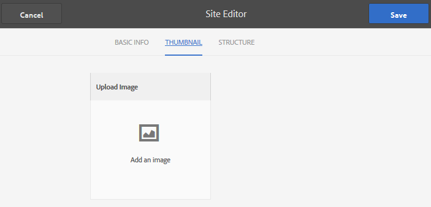

# Modèles de groupe {#group-templates}

La console Modèles de groupe est très similaire à la console Modèles [de](sites.md) site. Les deux sont des plans pour un ensemble de pages pré-câblées et de fonctionnalités qui forment un site communautaire. La différence est qu&#39;un modèle de site est destiné à la communauté principale et qu&#39;un modèle de groupe est destiné à un groupe communautaire, une sous-communauté imbriquée dans la communauté principale.

Un groupe de communauté est incorporé dans un modèle de site en incluant la fonction  Groupes (qui peut ne pas être la première ou la seule fonction dans le modèle).

Depuis le pack de [fonctionnalités Communautés](deploy-communities.md#latestfeaturepack), il est possible d’imbriquer des groupes en incluant la fonction Groupes dans un modèle de groupe.

Au moment où l&#39;action est entreprise pour créer un nouveau groupe communautaire, le modèle (structure) du groupe est sélectionné. La sélection dépend de la manière dont la fonction Groupes a été configurée lorsqu’elle a été ajoutée au modèle de site ou de groupe.

>[!NOTE]
>
>Les consoles pour la création de sites communautaires, de modèles [de sites](sites.md)communautaires, de modèles de groupes de [communautés et de fonctions de](tools-groups.md) [communauté ne sont utilisées que dans l&#39;environnement d&#39;auteur.](functions.md)

## Console Modèles de groupe {#group-templates-console}

Dans l’environnement d’auteur, pour accéder à la console des modèles de groupes

* A partir de la navigation globale : **[!UICONTROL Outils > Communautés > Modèles de groupe]**

Cette console affiche les modèles à partir desquels un site  communautaire peut être créé et permet de créer de nouveaux modèles de groupe.

## Créer un modèle de groupe {#create-goup-template}

Pour commencer à créer un modèle de groupe, sélectionnez **[!UICONTROL Créer.]**

Le panneau Editeur de site qui contient 3 sous-panneaux s’affiche alors :

### Informations de base {#basic-info}

Dans le panneau Informations de base, un nom, une description et si le modèle est activé ou désactivé sont configurés :

* **[!UICONTROL Nouveau nom]** du modèle de groupe ID du nom du modèle

* **[!UICONTROL Description]** Description du modèle

* **[!UICONTROL Désactivé/Activé]** Un commutateur à bascule contrôlant si le modèle est référencé

### Miniature  {#thumbnail}

(Facultatif) Sélectionnez l’icône Télécharger l’image pour afficher une miniature ainsi que le nom et la description aux créateurs de sites communautaires.

### Structure {#structure}

>[!CAUTION]
>
>Si vous travaillez avec AEM 6.1 Communautés FP4 ou version antérieure, n’ajoutez pas de fonction de groupes à un modèle de groupe.
>
>La fonction Groupes imbriqués est disponible à partir du [FP1](communities.md#latestfeaturepack)des communautés.
>
>Il n&#39;est toujours pas autorisé d&#39;ajouter une fonction Groupes en tant que première ou seule fonction dans un modèle.

Pour ajouter des fonctions de communauté, faites glisser le curseur de droite vers la gauche dans l&#39;ordre d&#39;affichage des liens du menu du site. Les styles seront appliqués au modèle lors de la création du site.

Par exemple, si vous souhaitez un forum, faites glisser la fonction de forum de la bibliothèque et déposez-la sous le créateur de modèles. La boîte de dialogue de configuration du forum s&#39;ouvre alors. Pour plus d&#39;informations sur les boîtes de dialogue de configuration, consultez la console  fonctions.

Continuez à faire glisser et à déposer toutes les autres fonctions de la communauté souhaitées pour un site (groupe) de sous-communauté en fonction de ce modèle.

Une fois que toutes les fonctions souhaitées ont été déposées dans la zone du créateur de modèles et configurées, sélectionnez **[!UICONTROL Enregistrer]** dans le coin supérieur droit.

## Modifier le modèle de groupe {#edit-group-template}

Lorsque vous consultez des groupes de la communauté dans la console [principale Modèles de](#group-templates-console)groupe, il est possible de sélectionner un modèle de groupe existant à modifier.

La modification d’un modèle de groupe n’affecte pas les sites de la communauté déjà créés à partir du modèle. Il est possible de [modifier directement la structure d&#39;un site](sites-console.md#modify-structure)communautaire à la place.

Ce processus fournit les mêmes panneaux que la [création d’un modèle](#create-goup-template)de groupe.
