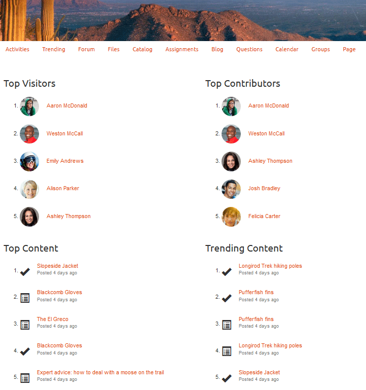

# Tendances d’activité {#activity-trends}

## Présentation {#introduction}

The `Community Activity List` component provides the ability to add trending information regarding posts and views by members as well as posts and views of content.

Cette section de la documentation décrit :

* Ajouter le `Community Activity List` composant à un site [communautaire](overview.md#community-sites)

* Configuration settings for the `Community Activity List` component

## Condition requise {#requirement}

Les données pour le site `Community Activity List` sont disponibles uniquement lorsque Adobe Analytics est sous licence et configuré pour le site communautaire.

Voir Configuration [d’Analytics pour les fonctionnalités](analytics.md)des communautés.

## Adding a Community Activity List to a Page {#adding-a-community-activity-list-to-a-page}

Pour ajouter un `Community Activity List` composant à une page en mode création, localisez le composant `Communities / Community Activity List` et faites-le glisser vers son emplacement sur une page.

For necessary information, visit [Communities Components Basics](basics.md).

Placé pour la première fois sur une page d’un site de communauté, voici à quoi ressemble le composant :

## Configuration de la Liste d’Activité de la communauté  {#configuring-community-activity-list}

Select the placed `Community Activity List` component to access and select the `Configure` icon which opens the edit dialog.

Dans l’onglet **[!UICONTROL Commentaires]**, indiquez si et comment les commentaires pour les fichiers transférés apparaissent :

* **[!UICONTROL Type]**

   Indiquez s’il faut afficher les données concernant les membres de la communauté ou le contenu généré par l’utilisateur.

   Sélectionner dans
   * `Members`
   * `Content`

   La valeur par défaut est `Members`.

* **[!UICONTROL Titre affiché]**

   Titre descriptif à afficher au-dessus des données, par exemple `Trending Content`.

   Par défaut, il n’existe aucun titre.

* **[!UICONTROL Nombre d’affichages]**

   Nombre d&#39;éléments à liste.

   La valeur par défaut est 10.

* **[!UICONTROL Type d’activité]**

   Sélectionnez l’un des
   * `Views`(visites de page)
   * `Posts`(création d’UGC)
   * `Follows`
   * `Likes`

   La valeur par défaut est Vues.

* **[!UICONTROL Période]**

   Sélectionnez l’un des
   * `Last 24 hours`
   * `Last 7 days`
   * `Last 30 days`
   * `Last 90 days`
   * `This year (since Jan 1st)`
   * `Total`

   La valeur par défaut est `Total`.

* **[!UICONTROL Chemin d’accès au contexte]**

   Permet d’étendre l’activité à un sous-ensemble du site, tel qu’un blog spécifique.

   La valeur par défaut est le site de la communauté entier.

* **[!UICONTROL Agrégation du nombre de membres]**

   Si cette option est désactivée, seules les publications de niveau supérieur sont comptabilisées. For example, if the context is the root page (the default), then an `Activity Type`of `Posts`will never show any activity as there is no ability to post content to the root page. Lorsque cette option est cochée, les nombres sur toutes les pages descendantes sont inclus.

   Cette option est cochée par défaut.

## Exemple de page avec 4 composants {#example-page-with-components}

**Principaux visiteurs** config : Type = Membres, Type d’activité = Vues

**Configuration des principaux contributeurs** : Type = Membres, type d’Activité = Publications

**Configuration du contenu** principal : Type = Contenu, type d&#39;Activité = Vues,

**Configuration du contenu** de tendance : Type = Contenu, type d’Activité = Publications

