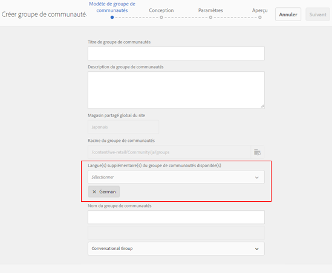

# What&#39;s New in AEM 6.4 Communities {#what-s-new-in-aem-communities}

AEM Communities offre un cadre de collaboration entre ses partenaires, ses clients et ses employés. Il confère des capacités sociales à la structure du site Web et aide les entreprises à mobiliser et à transmettre des connaissances à leurs parties prenantes, afin d’améliorer la valeur de leur marque à leur manière.

AEM 6.4 Les collectivités mettent en oeuvre des fonctionnalités pour améliorer les expériences des utilisateurs de la communauté et faciliter les tâches quotidiennes des administrateurs, des modérateurs et des gestionnaires de la communauté.

Lisez la suite pour découvrir rapidement les nouvelles fonctionnalités et améliorations. Also, see AEM 6.4 Communities [release notes](../release-notes/communities-release-notes.md). Pour obtenir la documentation sur AEM 6.4 Communautés, consultez [AEM 6.4 Guide](home.md)d&#39;utilisation des communautés.

## Gestion des sous-communautés ou des groupes communautaires {#managing-sub-communities-or-community-groups}

AEM Communities permet aux administrateurs de la communauté de créer des groupes et des sous-groupes dans le site des communautés, à l’aide de modèles prédéfinis, dans l’environnement d’auteur. Ces groupes servent de sous-communautés, qui peuvent hériter de nombreuses configurations, telles que les thèmes et le style du site parent. Cependant, ces groupes peuvent différer du site parent, par exemple s’ils disposent d’un ensemble différent de modérateurs de groupe ou peuvent varier en termes de niveau de sécurité. Ces groupes fonctionnent comme des mini-communautés indépendantes et à part entière qui sont renforcées par les améliorations suivantes.

### Création de groupes de différents paramètres régionaux en une seule étape {#create-multi-locale-groups-in-single-step}

Dans le cadre d’un site communautaire, les groupes multilingues peuvent être créés en une seule opération. **[!UICONTROL Le champ Langue(s)]** de groupe(s) **[!UICONTROL de communauté supplémentaire disponible dans la page Modèle]** de groupe de [communauté, disponible lors de la création d’un](groups.md) nouveau groupede communauté dans un site communautaire, le rend possible.

Pour créer de tels groupes, les utilisateurs peuvent simplement accéder à la collection de groupes du site de communautés souhaité à partir de la console Sites. Créez un groupe et spécifiez les langues de votre choix dans le champ Langue(s) **** de groupe(s) de communauté disponible(s) **[!UICONTROL supplémentaire(s) de la page Modèle]** de groupe decommunauté.

### Supprimer des groupes communautaires de la console Groupes {#delete-community-groups-from-groups-console}

AEM 6.4 Communautés fournit l&#39;icône Supprimer le groupe sur les groupes communautaires existants, dans la collection Groupes communautaires de la console Sites communautaires. Ceci permet la suppression [d’un](groups.md#deleting-the-group) groupe en un seul clic, ainsi que la suppression de tous les éléments associés au groupe (tels que le contenu et les abonnements utilisateur).

### Créer et affecter des ressources d&#39;activation dans des groupes {#create-and-assign-enablement-resources-within-groups}

Le contenu d’apprentissage peut désormais être créé, géré et publié pour un ensemble spécifique de membres ciblés de la communauté. En raison de la disponibilité des fonctions de catalogue et d&#39;affectation pour les groupes de la communauté (et pas seulement pour l&#39;ensemble du site de la communauté), les gestionnaires de l&#39;activation peuvent [affecter des ressources](resource.md) d&#39;activation et un chemin d&#39;apprentissage à un petit groupe de personnes également.

## Modération du contenu généré par l’utilisateur {#moderating-user-generated-content}

AEM 6.4 Collectivités offres peu d&#39;améliorations à la modération, qui sont essentielles pour faciliter la vie quotidienne des modérateurs communautaires.

### Détection automatique du contenu indésirable  {#automatic-spam-detection}

Le nouveau moteur de détection du spam permet de filtrer le contenu généré par les utilisateurs non désirés et non sollicités sur les sites ou groupes communautaires. Lorsqu’elle est activée, cette fonctionnalité peut marquer un élément de contenu généré par l’utilisateur comme indésirable ou Non indésirable en fonction d’un ensemble prédéfini de mots de spam. Les modérateurs peuvent agir sur le contenu pour le refuser ou l’autoriser à apparaître sur l’instance de publication. Ces actions de modération peuvent être exécutées en ligne ou via la console de modération en bloc.

[Le détecteur](moderate-ugc.md#spam-detection) de spam détecte et signale un élément donné de contenu généré par l&#39;utilisateur avec une précision de 90 %. Toutefois, cette fonctionnalité n’est pas activée par défaut. Pour l&#39;activer, les administrateurs de la communauté doivent accéder à configMgr sur le système/la console et ajouter Spam Process.

### Nouveaux filtres (réponses/sans réponse) pour QnA {#new-answered-unanswered-filters-for-qna}

AEM 6.4 ajoute deux [nouveaux filtres](moderation.md#filter-rail), nommés Répondu et Pas répondu pour les questions QnA, à la console de modération en bloc. Ces filtres sont disponibles sous Statut dans le rail de filtre.

Lors de la sélection de l’état Réponse, toutes les questions qui ont reçu une réponse sont visibles par le modérateur dans la zone de contenu. Alors que, si seul l’état Non répondu est sélectionné, le modérateur verra tout le contenu (pour tous les types de contenu) à l’exception des questions avec réponse, car la propriété responsable de la question avec réponse n’existe pas dans le cas des questions sans réponse et d’autres contenus tels que le sujet du forum, l’article de blog ou les commentaires.

### Marquage avec signet des filtres de modération {#bookmark-moderation-filters}

AEM Communities permet de [marquer d’un signet les filtres](moderation.md#filter-rail) de modération prédéfinis sur la console de modération. Ces signets enregistrés peuvent être réexaminés ultérieurement et partagés avec d’autres utilisateurs.

Les utilisateurs doivent simplement sélectionner les filtres de leur choix dans le rail de filtre de la console de modération, pour vue au contenu UGC filtré et mettre en signet les filtres sur leur navigateur. Ces filtres sont annexés à la fin de la chaîne d’URL et peuvent donc être partagés, réutilisés et révisés ultérieurement.

## Gestion des sites communautaires {#managing-community-sites}

AEM 6.4 Communautés apporte des améliorations à la gestion des sites, ce qui permet aux administrateurs du site de créer, gérer et supprimer facilement de nombreux sites communautaires dans une langue différente.

### Créez en une seule étape des sites communautaires multirégionaux. {#create-multi-locale-community-sites-in-one-step}

AEM Communities permet de créer des sites [communautaires](create-site.md) multilingues en une seule opération. Cela est possible en raison de la disponibilité de plusieurs langues dans lesquelles effectuer un choix dans le champ Langue **[!UICONTROL de base du site]** communautaire de la page Modèle **[!UICONTROL de]** site, tout en créant un nouveau site communautaire à partir de la console de sites.

Les utilisateurs peuvent sélectionner simultanément des dossiers de configuration, des marques et de nombreuses autres configurations pour tous ces sites.

### Supprimer des sites communautaires de la console des sites {#delete-community-sites-from-sites-console}

AEM 6.4 Communautés fournit l&#39;icône Supprimer le site sur les sites communautaires existants, dans la console Sites communautaires. Ceci permet la [suppression du site](create-site.md) et des éléments associés en un seul clic.

## Managing UGC and user profiles {#managing-ugc-and-user-profiles}

En maintenant la protection des données utilisateur au coeur de l’expérience des communautés, AEM Communities expose [les API prêtes à l’emploi](user-ugc-management-service.md) et [échantillonne la servlet](https://github.com/Adobe-Marketing-Cloud/aem-communities-ugc-migration/tree/master/bundles/communities-ugc-management-servlet). Ces API permettent de gérer en bloc (suppression en masse et exportation en bloc) le contenu généré par les utilisateurs et de supprimer les profils d’utilisateurs. Elles sont également essentielles pour gérer les demandes de conformité aux RGPD de l’UE.

## Nouveautés {#what-s-changed}

* La vérification de Captcha, tout en créant un nouveau site communautaire, n&#39;est plus disponible en standard dans AEM 6.4 communautés. Cependant, le site Communautés peut être personnalisé pour inclure le composant [Google reCAPTCHA](https://helpx.adobe.com/experience-manager/using/aem_recaptcha.html) pour une meilleure sécurité.
* L’option de téléchargement d’une page CSS personnalisée a été supprimée du thème des sites et groupes de la communauté.
* Les icônes Contenu seul et Rechercher ont été ajoutées dans le rail de filtre de l’interface de modération en bloc.
* Le filtre Chemin de contenu a été ajouté dans le rail de filtres dans l’interface de modération en bloc.
* Le passage au mode en vrac et la sortie du mode en vrac ont été supprimés de l’interface de modération en bloc. Pour passer en mode de sélection multiple, cliquez sur l’icône Sélectionner ( ) sur une publication, qui s’affiche lorsque vous la survolez avec la souris (bureau) ou lorsque vous appuyez et maintenez un doigt sur la publication (mobile).
