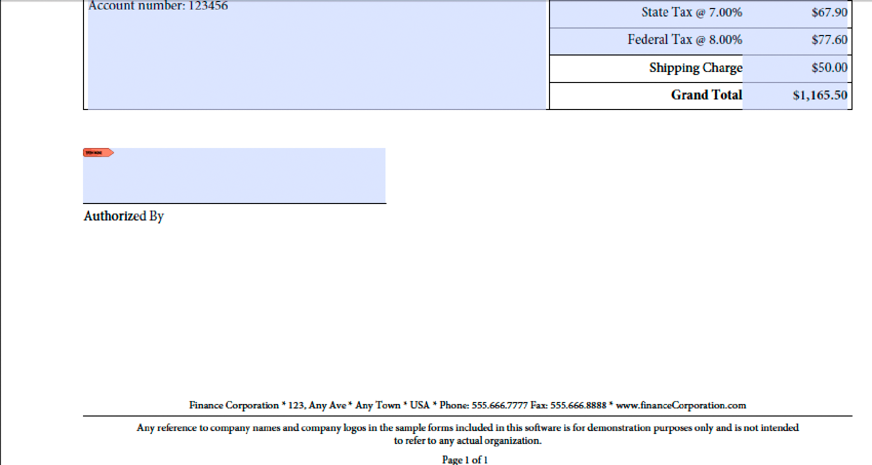

# Création d’applications web qui renvoient Forms {#creating-web-applications-thatrenders-forms}

## Création d’applications web qui renvoient Forms {#creating-web-applications-that-renders-forms}

Vous pouvez créer une application web qui utilise des servlets Java pour appeler le service Forms et générer des formulaires. L’utilisation d’une servlet Java™ présente l’avantage de permettre d’écrire la valeur renvoyée par le processus dans un navigateur Web client. En d’autres termes, un servlet Java peut être utilisé comme lien entre le service Forms qui renvoie un formulaire et un navigateur web client.

>[!NOTE]
>
>Cette section décrit comment créer une application web qui utilise une servlet Java qui appelle le service Forms et effectue le rendu des formulaires à partir de fragments. (Voir [Rendu de Forms basé sur des fragments](/help/forms/developing/rendering-forms-based-fragments.md).)

A l’aide d’un servlet Java, vous pouvez écrire un formulaire dans un navigateur Web client afin qu’un client puisse afficher et saisir des données dans le formulaire. Après avoir rempli le formulaire avec des données, l’utilisateur web clique sur un bouton d’envoi situé sur le formulaire pour renvoyer les informations au servlet Java, où les données peuvent être récupérées et traitées. Par exemple, les données peuvent être envoyées à un autre processus.

Cette section explique comment créer une application web qui permet à l’utilisateur de sélectionner soit des données de formulaire américaines, soit des données de formulaire canadiennes, comme illustré ci-dessous.


Le formulaire rendu est un formulaire basé sur des fragments. En d’autres termes, si l’utilisateur sélectionne des données américaines, le formulaire renvoyé utilise des fragments basés sur des données américaines. Par exemple, le pied de page du formulaire contient une adresse américaine, comme illustré ci-dessous.



De même, si l&#39;utilisateur sélectionne des données canadiennes, le formulaire renvoyé contient une adresse canadienne, comme le montre l&#39;illustration suivante.


>[!NOTE]
>
>Pour plus d’informations sur la création de conceptions de formulaire basées sur des fragments, voir [Forms Designer](https://www.adobe.com/go/learn_aemforms_designer_63).

**Exemples de fichiers**

Cette section utilise des fichiers d’exemple qui peuvent se trouver à l’emplacement suivant :

&lt;*Répertoire d’installation de Forms Designer*>/Exemples/Forms/Bon de commande/Fragments de formulaire

où &lt;*répertoire d’installation*> est le chemin d’installation. Pour les besoins de l’application cliente, le fichier Purchase Order Dynamic.xdp a été copié à partir de cet emplacement d’installation et déployé vers une application Forms nommée *Applications/FormsApplication*. Le fichier Purchase Order Dynamic.xdp est placé dans un dossier nommé FormsFolder. De même, les fragments sont placés dans un dossier nommé Fragments, comme illustré ci-dessous.


Pour accéder à la conception de formulaire Purchase Order Dynamic.xdp, spécifiez `Applications/FormsApplication/1.0/FormsFolder/Purchase Order Dynamic.xdp` comme nom du formulaire (premier paramètre transmis à la fonction `renderPDFForm` ) et `repository:///` comme valeur de l’URI racine du contenu.

Les fichiers de données XML utilisés par l’application web ont été déplacés du dossier Data vers `C:\Adobe`(système de fichiers appartenant au serveur d’applications J2EE hébergeant AEM Forms). Les noms de fichier sont Bon de commande *Canada.xml* et bon de commande *US.xml*.

>[!NOTE]
>
>Pour plus d’informations sur la création d’une application Forms à l’aide de Workbench, voir [Aide de workbench](https://www.adobe.com/go/learn_aemforms_workbench_63).

### Résumé des étapes {#summary-of-steps}

Pour créer des applications web qui génèrent des formulaires à partir de fragments, procédez comme suit :

1. Créez un projet web.
1. Créez une logique d’application Java qui représente le servlet Java.
1. Créez la page web de l&#39;application web.
1. Regroupez l’application web dans un fichier WAR.
1. Déployez le fichier WAR sur le serveur d’applications J2EE.
1. Testez votre application web.

>[!NOTE]
>
>Certaines de ces étapes dépendent de l’application J2EE sur laquelle AEM Forms est déployé. Par exemple, la méthode que vous utilisez pour déployer un fichier WAR dépend du serveur d’applications J2EE que vous utilisez. Cette section suppose qu’AEM Forms est déployé sur JBoss®.

### Création d’un projet web {#creating-a-web-project}

La première étape pour créer une application web contenant un servlet Java pouvant appeler le service Forms consiste à créer un projet web. L’IDE Java sur lequel repose ce document est Eclipse 3.3. À l’aide de l’IDE Eclipse, créez un projet web et ajoutez les fichiers JAR requis à votre projet. Enfin, ajoutez une page de HTML nommée *index.html* et un servlet Java pour votre projet.

La liste suivante indique les fichiers JAR que vous devez ajouter à votre projet web :

* adobe-forms-client.jar
* adobe-livecycle-client.jar
* adobe-usermanager-client.jar
* adobe-utilities.jar

Pour connaître l’emplacement de ces fichiers JAR, voir [Inclusion de fichiers de bibliothèque Java AEM Forms](/help/forms/developing/invoking-aem-forms-using-java.md#including-aem-forms-java-library-files).

**Pour créer un projet web :**

1. Démarrez Eclipse et cliquez sur **Fichier** >  **Nouveau projet**.
1. Dans le **Nouveau projet** boîte de dialogue, sélectionnez **Web** > **Projet web dynamique**.
1. Type `FragmentsWebApplication` pour le nom de votre projet, puis cliquez sur **Terminer**.

**Pour ajouter les fichiers JAR requis à votre projet :**

1. Dans la fenêtre Explorateur de projets, cliquez avec le bouton droit sur la `FragmentsWebApplication` projet et sélectionnez **Propriétés**.
1. Cliquez sur **Chemin de création Java** puis cliquez sur le bouton **Bibliothèques** .
1. Cliquez sur le bouton **Ajout de fichiers JAR externes** et accédez aux fichiers JAR à inclure.

**Pour ajouter une servlet Java au projet :**

1. Dans la fenêtre Explorateur de projets, cliquez avec le bouton droit sur la `FragmentsWebApplication` projet et sélectionnez **Nouveau** >  **Autre**.
1. Développez l’objet **Web** dossier, sélectionnez **Servlet**, puis cliquez sur **Suivant**.
1. Dans la boîte de dialogue Créer un servlet, saisissez `RenderFormFragment` pour le nom du servlet, puis cliquez sur **Terminer**.

**Pour ajouter une page de HTML à votre projet :**

1. Dans la fenêtre Explorateur de projets, cliquez avec le bouton droit sur la `FragmentsWebApplication` projet et sélectionnez **Nouveau** > **Autre**.
1. Développez l’objet **Web** dossier, sélectionnez **HTML**, puis cliquez sur **Suivant**.
1. Dans la boîte de dialogue Nouveau HTML, saisissez `index.html` pour le nom du fichier, puis cliquez sur **Terminer**.

>[!NOTE]
>
>Pour plus d’informations sur la création d’une page de HTML qui appelle la variable `RenderFormFragment` servlet Java, voir [Créer la page web](/help/forms/developing/rendering-forms.md#creating-the-web-page).

### Création d’une logique d’application Java pour le servlet {#creating-java-application-logic-for-the-servlet}

Vous créez une logique d’application Java qui appelle le service Forms depuis le servlet Java. Le code suivant affiche la syntaxe de la variable `RenderFormFragment` Servlet Java :

```as3
     public class RenderFormFragment extends HttpServlet implements Servlet { 
         public void doGet(HttpServletRequest req, HttpServletResponse resp 
         throws ServletException, IOException { 
         doPost(req,resp); 
          
         } 
         public void doPost(HttpServletRequest req, HttpServletResponse resp 
         throws ServletException, IOException { 
             //Add code here to invoke the Forms service 
             }
```

En règle générale, vous ne placez pas de code client dans le code d’une servlet Java. `doGet` ou `doPost` . Une meilleure pratique de programmation consiste à placer ce code dans une classe distincte, à instancier la classe depuis l’élément `doPost` (ou `doGet` ) et appelez les méthodes appropriées. Toutefois, pour des raisons de concision du code, les exemples de code de cette section sont conservés au minimum et les exemples de code sont placés dans la variable `doPost` .

Pour générer un formulaire basé sur des fragments à l’aide de l’API du service Forms, effectuez les tâches suivantes :

1. Incluez les fichiers JAR client, tels que adobe-forms-client.jar, dans le chemin de classe de votre projet Java. Pour plus d’informations sur l’emplacement de ces fichiers, voir [Inclusion des fichiers de bibliothèque Java AEM Forms](/help/forms/developing/invoking-aem-forms-using-java.md#including-aem-forms-java-library-files).
1. Récupérez la valeur du bouton radio qui est envoyé à partir du formulaire de HTML et indiquez s’il faut utiliser des données américaines ou canadiennes. Si American est envoyé, créez une `com.adobe.idp.Document` qui stocke les données situées dans la variable *Purchase Order US.xml*. De même, si la variable `com.adobe.idp.Document` qui stocke les données situées dans la variable *Purchase Order Canada.xml* fichier .
1. Créez un objet `ServiceClientFactory` qui contient des propriétés de connexion. (Voir [Réglage des propriétés de la connexion](/help/forms/developing/invoking-aem-forms-using-java.md#setting-connection-properties).)
1. Créez un `FormsServiceClient` en utilisant son constructeur et en transmettant l’objet `ServiceClientFactory` .
1. Créez un `URLSpec` qui stocke des valeurs URI en utilisant son constructeur.
1. Appeler la variable `URLSpec` de `setApplicationWebRoot` et transmettez une valeur string qui représente la racine web de l’application.
1. Appeler la variable `URLSpec` de `setContentRootURI` et transmettez une valeur string qui spécifie la valeur de l’URI racine du contenu. Assurez-vous que la conception de formulaire et les fragments se trouvent dans l’URI racine du contenu. Dans le cas contraire, le service Forms renvoie une exception. Pour référencer le référentiel AEM Forms, spécifiez `repository://`.
1. Appeler la variable `URLSpec` de `setTargetURL` et transmettez une valeur string qui spécifie la valeur de l’URL cible à l’endroit où les données de formulaire sont publiées. Si vous définissez l’URL cible dans la conception de formulaire, vous pouvez transmettre une chaîne vide. Vous pouvez également spécifier l’URL vers laquelle un formulaire est envoyé pour effectuer les calculs.
1. Appeler la variable `FormsServiceClient` de `renderPDFForm` et transmettez les valeurs suivantes :

   * Une valeur string qui spécifie le nom de la conception de formulaire, y compris l’extension du nom de fichier.
   * A `com.adobe.idp.Document` contenant les données à fusionner avec le formulaire (créé à l’étape 2).
   * A `PDFFormRenderSpec` qui stocke les options d’exécution. Pour plus d’informations, voir [Référence de l’API AEM Forms](https://www.adobe.com/go/learn_aemforms_javadocs_63_en).
   * A `URLSpec` qui contient des valeurs URI requises par le service Forms pour générer un formulaire basé sur des fragments.
   * A `java.util.HashMap` qui stocke les pièces jointes. Ce paramètre est facultatif et vous pouvez spécifier `null` si vous ne souhaitez pas joindre de fichiers au formulaire.

   Le `renderPDFForm` renvoie une `FormsResult` contenant un flux de données de formulaire qui doit être écrit dans le navigateur Web client.

1. Créez un `com.adobe.idp.Document` en appelant le `FormsResult` object ‘s `getOutputContent` .
1. Obtention du type de contenu de la variable `com.adobe.idp.Document` en appelant son objet `getContentType` .
1. Définissez la variable `javax.servlet.http.HttpServletResponse` type de contenu de l’objet en appelant sa propriété `setContentType` et transmettre le type de contenu de la méthode `com.adobe.idp.Document` .
1. Créez un `javax.servlet.ServletOutputStream` objet utilisé pour écrire le flux de données de formulaire dans le navigateur Web client en appelant la fonction `javax.servlet.http.HttpServletResponse` de `getOutputStream` .
1. Créez un `java.io.InputStream` en appelant le `com.adobe.idp.Document` de `getInputStream` .
1. Créez un tableau d’octets pour le remplir avec le flux de données de formulaire en appelant la fonction `InputStream` de `read`et transmission du tableau d’octets en tant qu’argument.
1. Appeler la variable `javax.servlet.ServletOutputStream` de `write` pour envoyer le flux de données de formulaire au navigateur web client. Transmettez le tableau d’octets au `write` .

L’exemple de code suivant représente le servlet Java qui appelle le service Forms et effectue le rendu d’un formulaire basé sur des fragments.

```as3
 /* 
     * This Java Quick Start uses the following JAR files 
     * 1. adobe-forms-client.jar 
     * 2. adobe-livecycle-client.jar 
     * 3. adobe-usermanager-client.jar 
     * 
     * (Because Forms quick starts are implemented as Java servlets, it is  
     * not necessary to include J2EE specific JAR files - the Java project 
     * that contains this quick start is exported as a WAR file which 
     * is deployed to the J2EE application server) 
     * 
     * These JAR files are located in the following path: 
     * <install directory>/sdk/client-libs 
     * 
     * For complete details about the location of these JAR files,  
     * see "Including AEM Forms library files" in Programming with AEM forms 
     */ 
 import java.io.File; 
 import java.io.FileInputStream; 
 import java.io.IOException; 
 import java.io.PrintWriter; 
  
 import javax.servlet.Servlet; 
 import javax.servlet.ServletException; 
 import javax.servlet.ServletOutputStream; 
 import javax.servlet.http.HttpServlet; 
 import javax.servlet.http.HttpServletRequest; 
 import javax.servlet.http.HttpServletResponse; 
 import com.adobe.livecycle.formsservice.client.*; 
 import java.util.*; 
 import java.io.InputStream; 
 import java.net.URL; 
  
 import com.adobe.idp.Document; 
 import com.adobe.idp.dsc.clientsdk.ServiceClientFactory; 
 import com.adobe.idp.dsc.clientsdk.ServiceClientFactoryProperties; 
  
 public class RenderFormFragment extends HttpServlet implements Servlet { 
      
     public void doGet(HttpServletRequest req, HttpServletResponse resp) 
         throws ServletException, IOException { 
             doPost(req,resp);  
  
     } 
     public void doPost(HttpServletRequest req, HttpServletResponse resp) 
     throws ServletException, IOException { 
          
          
              
         try{ 
             //Set connection properties required to invoke AEM Forms                                 
             Properties connectionProps = new Properties(); 
             connectionProps.setProperty(ServiceClientFactoryProperties.DSC_DEFAULT_SOAP_ENDPOINT, "https://[server]:[port]"); 
             connectionProps.setProperty(ServiceClientFactoryProperties.DSC_TRANSPORT_PROTOCOL,ServiceClientFactoryProperties.DSC_SOAP_PROTOCOL);           
             connectionProps.setProperty(ServiceClientFactoryProperties.DSC_SERVER_TYPE, "JBoss"); 
             connectionProps.setProperty(ServiceClientFactoryProperties.DSC_CREDENTIAL_USERNAME, "administrator"); 
             connectionProps.setProperty(ServiceClientFactoryProperties.DSC_CREDENTIAL_PASSWORD, "password"); 
              
             //Get the value of selected radio button 
             String radioValue = req.getParameter("radio"); 
              
             //Create an Document object to store form data 
             Document oInputData = null;  
              
             //The value of the radio button determines the form data to use 
             //which determines which fragments used in the form 
             if (radioValue.compareTo("AMERICAN") == 0)            { 
                 FileInputStream myData = new FileInputStream("C:\\Adobe\Purchase Order US.xml"); 
                 oInputData = new Document(myData);  
             } 
             else if (radioValue.compareTo("CANADIAN") == 0)            { 
                 FileInputStream myData = new FileInputStream("C:\\Adobe\Purchase Order Canada.xml"); 
                 oInputData = new Document(myData);  
             } 
                      
             //Create a ServiceClientFactory object 
             ServiceClientFactory myFactory = ServiceClientFactory.createInstance(connectionProps); 
                  
             //Create a FormsServiceClient object 
             FormsServiceClient formsClient = new FormsServiceClient(myFactory);  
          
             //Set the parameter values for the renderPDFForm method 
             String formName = "Applications/FormsApplication/1.0/FormsFolder/Purchase Order Dynamic.xdp";   
                                      
             //Cache the PDF form 
             PDFFormRenderSpec pdfFormRenderSpec = new PDFFormRenderSpec(); 
             pdfFormRenderSpec.setCacheEnabled(new Boolean(true)); 
          
             //Specify URI values that are required to render a form 
             //design based on fragments 
             URLSpec uriValues = new URLSpec();  
             uriValues.setApplicationWebRoot("https://[server]:[port]/RenderFormFragment"); 
             uriValues.setContentRootURI("repository:///"); 
             uriValues.setTargetURL("https://[server]:[port]/FormsServiceClientApp/HandleData"); 
                      
             //Invoke the renderPDFForm method and write the  
             //results to a client web browser 
             FormsResult formOut = formsClient.renderPDFForm( 
                         formName,               //formQuery 
                         oInputData,             //inDataDoc 
                         pdfFormRenderSpec,      //PDFFormRenderSpec 
                         uriValues,                //urlSpec 
                         null                    //attachments 
                         ); 
          
             //Create a Document object that stores form data 
             Document myData = formOut.getOutputContent(); 
          
             //Get the content type of the response and 
             //set the HttpServletResponse object’s content type 
             String contentType = myData.getContentType();  
             resp.setContentType(contentType); 
          
             //Create a ServletOutputStream object 
             ServletOutputStream oOutput = resp.getOutputStream(); 
          
             //Create an InputStream object 
             InputStream inputStream = myData.getInputStream(); 
          
             //Write the data stream to the web browser 
             byte[] data = new byte[4096]; 
             int bytesRead = 0; 
             while ((bytesRead = inputStream.read(data)) > 0) 
             { 
                 oOutput.write(data, 0, bytesRead); 
             } 
      
         }catch (Exception e) { 
              System.out.println("The following exception occurred: "+e.getMessage()); 
       } 
     } 
 }
```

### Créer la page web {#creating-the-web-page}

La page web index.html fournit un point d’entrée au servlet Java et appelle le service Forms. Cette page web est un formulaire de HTML de base qui contient deux boutons radio et un bouton d’envoi. Le nom des boutons radio est radio. Lorsque l’utilisateur clique sur le bouton d’envoi, les données de formulaire sont publiées sur la variable `RenderFormFragment` Servlet Java.

Le servlet Java capture les données publiées à partir de la page de HTML à l’aide du code Java suivant :

```as3
             Document oInputData = null;  
              
             //Get the value of selected radio button 
             String radioValue = req.getParameter("radio"); 
                          
             //The value of the radio button determines the form data to use 
             //which determines which fragments used in the form 
             if (radioValue.compareTo("AMERICAN") == 0)            { 
                 FileInputStream myData = new FileInputStream("C:\\Adobe\Purchase Order US.xml"); 
                 oInputData = new Document(myData);  
             } 
             else if (radioValue.compareTo("CANADIAN") == 0)            { 
                 FileInputStream myData = new FileInputStream("C:\\Adobe\Purchase Order Canada.xml"); 
                 oInputData = new Document(myData);  
             }
```

Le code de HTML suivant se trouve dans le fichier index.html qui a été créé lors de la configuration de l’environnement de développement. (Voir [Création d’un projet web](/help/forms/developing/rendering-forms.md#creating-a-web-project).)

```as3
 <!DOCTYPE html PUBLIC "-//W3C//DTD XHTML 1.0 Transitional//EN" "https://www.w3.org/TR/xhtml1/DTD/xhtml1-transitional.dtd"> 
 <html xmlns="https://www.w3.org/1999/xhtml"> 
 <head> 
 <meta http-equiv="Content-Type" content="text/html; charset=utf-8" /> 
 <title>Untitled Document</title> 
 </head> 
  
 <body> 
 <form name="myform" action="https://[server]:[port]/FragmentsWebApplication/RenderFormFragment" method="post"> 
      <table> 
      <tr> 
        <th>Forms Fragment Web Client</th> 
      </tr> 
      <tr> 
        <td> 
          <label> 
          <input type="radio" name="radio" id="radio_Data" value="CANADIAN" /> 
          Canadian data<br /> 
          </label> 
          <p> 
            <label> 
            <input type="radio" name="radio" id="radio_Data" value="AMERICAN" checked/> 
            American data</label> 
          </p> 
        </td> 
      </tr> 
      <tr> 
      <td> 
        <label> 
          <input type="submit" name="button_Submit" id="button_Submit" value="Submit" /> 
            </label> 
            </td> 
         </tr> 
        </table> 
      </form>     
 </body> 
 </html>
```

### Regroupement de l&#39;application web {#packaging-the-web-application}

Pour déployer le servlet Java qui appelle le service Forms, compressez votre application web dans un fichier WAR. Assurez-vous que les fichiers JAR externes dont dépend la logique métier du composant, tels que adobe-livecycle-client.jar et adobe-forms-client.jar, sont également inclus dans le fichier WAR.

**Pour compresser une application web dans un fichier WAR :**

1. Dans la **Explorateur de projets** , cliquez avec le bouton droit de la souris sur la fenêtre `FragmentsWebApplication` projet et sélectionnez **Exporter** > **Fichier WAR**.
1. Dans le **Module web** zone de texte, saisissez `FragmentsWebApplication` pour le nom du projet Java.
1. Dans le **Destination** zone de texte, saisissez `FragmentsWebApplication.war`**pour le** nom de fichier, indiquez l’emplacement de votre fichier WAR, puis cliquez sur Terminer.

### Déploiement du fichier WAR sur le serveur d’applications J2EE {#deploying-the-war-file-to-the-j2ee-application-server}

Vous pouvez déployer le fichier WAR sur le serveur d’applications J2EE sur lequel AEM Forms est déployé. Une fois le fichier WAR déployé, vous pouvez accéder à la page Web de HTML à l’aide d’un navigateur Web.

**Pour déployer le fichier WAR sur le serveur d’applications J2EE :**

* Copiez le fichier WAR du chemin d’exportation vers *[Installation de Forms]*\Adobe\Adobe Experience Manager Forms\jboss\server\all\deploy.

### Test de votre application web {#testing-your-web-application}

Une fois l’application web déployée, vous pouvez la tester à l’aide d’un navigateur web. En supposant que vous utilisiez le même ordinateur qui héberge AEM Forms, vous pouvez spécifier l’URL suivante :

* http://localhost:8080/FragmentsWebApplication/index.html

   Sélectionnez un bouton radio et cliquez sur le bouton Envoyer . Un formulaire basé sur des fragments apparaît dans le navigateur web. En cas de problème, consultez le fichier journal du serveur d’applications J2EE.
