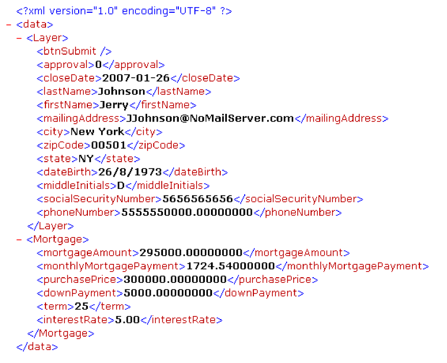

# Gestion des Forms envoyées {#handling-submitted-forms}

Les applications Web qui permettent à l’utilisateur de remplir des formulaires interactifs nécessitent que les données soient renvoyées au serveur. Le service Forms vous permet de récupérer les données que l’utilisateur a entrées dans un formulaire interactif. Une fois les données récupérées, vous pouvez les traiter pour répondre aux besoins de votre entreprise. Par exemple, vous pouvez stocker les données dans une base de données, envoyer les données à une autre application, envoyer les données à un autre service, fusionner les données dans une conception de formulaire, afficher les données dans un navigateur web, etc.

Les données de formulaire sont envoyées au service Forms au format XML ou PDF, une option définie dans Designer. Un formulaire envoyé au format XML permet d’extraire des valeurs de données de champ individuelles. En d’autres termes, vous pouvez extraire la valeur de chaque champ de formulaire que l’utilisateur a saisi dans le formulaire. Un formulaire envoyé en tant que données de PDF est une donnée binaire et non une donnée XML. Vous pouvez enregistrer le formulaire en tant que fichier de PDF ou l’envoyer à un autre service. Si vous souhaitez extraire les données d’un formulaire envoyé au format XML, puis utiliser les données du formulaire pour créer un document de PDF, appelez une autre opération AEM Forms. (Voir [Création de documents PDF avec des données XML envoyées](/help/forms/developing/creating-pdf-documents-submitted-xml.md))

Le diagramme suivant montre les données envoyées à une servlet Java nommée `HandleData` à partir d’un formulaire interactif affiché dans un navigateur web.

Le tableau suivant explique les étapes du diagramme.

<table>
 <thead>
  <tr>
   <th>
Étape
</th>
   <th>
Description
</th>
  </tr>
 </thead>
 <tbody>
  <tr>
   <td>
1
</td>
   <td>
Un utilisateur remplit un formulaire interactif et clique sur le bouton Envoyer du formulaire.
</td>
  </tr>
  <tr>
   <td>
2
</td>
   <td>
Les données sont envoyées à la variable <code>HandleData</code> Java Servlet sous forme de données XML.
</td>
  </tr>
  <tr>
   <td>
3
</td>
   <td>
Le <code>HandleData</code> Java Servlet contient la logique d’application pour récupérer les données.
</td>
  </tr>
 </tbody>
</table>

## Gestion des données XML envoyées {#handling-submitted-xml-data}

Lorsque les données de formulaire sont envoyées au format XML, vous pouvez récupérer les données XML qui représentent les données envoyées. Tous les champs de formulaire apparaissent sous la forme de noeuds dans un schéma XML. Les valeurs de noeud correspondent aux valeurs que l’utilisateur a renseignées. Prenons l’exemple d’un formulaire de prêt dans lequel chaque champ du formulaire apparaît comme un noeud dans les données XML. La valeur de chaque noeud correspond à la valeur qu’un utilisateur renseigne. Supposons qu’un utilisateur renseigne le formulaire de prêt avec les données affichées dans le formulaire suivant.

L’illustration suivante présente les données XML correspondantes récupérées à l’aide de l’API client du service Forms.

Les champs du formulaire de prêt. Ces valeurs peuvent être récupérées à l’aide des classes XML Java.

>[!NOTE]
>
>La conception de formulaire doit être configurée correctement dans Designer pour que les données soient envoyées sous forme de données XML. Pour configurer correctement la conception de formulaire de sorte qu’elle envoie des données XML, assurez-vous que le bouton Envoyer situé sur la conception de formulaire est défini pour envoyer des données XML. Pour plus d’informations sur la définition du bouton Envoyer pour envoyer des données XML, voir [AEM Forms Designer](https://www.adobe.com/go/learn_aemforms_designer_63).

## Gestion des données de PDF envoyées {#handling-submitted-pdf-data}

Prenons l’exemple d’une application web qui appelle le service Forms. Une fois que le service Forms a rendu un formulaire de PDF interactif dans un navigateur Web client, l’utilisateur l’a rempli et l’a renvoyé en tant que données de PDF. Lorsque le service Forms reçoit les données du PDF, il peut envoyer les données du PDF à un autre service ou les enregistrer en tant que fichier du PDF. Le diagramme suivant illustre le flux logique de l’application.

Le tableau suivant décrit les étapes de ce diagramme.

<table>
 <thead>
  <tr>
   <th>
Étape
</th>
   <th>
Description
</th>
  </tr>
 </thead>
 <tbody>
  <tr>
   <td>
1
</td>
   <td>
Une page web contient un lien qui accède à une servlet Java qui appelle le service Forms.
</td>
  </tr>
  <tr>
   <td>
2
</td>
   <td>
Le service Forms effectue le rendu d’un formulaire de PDF interactif dans le navigateur Web client.
</td>
  </tr>
  <tr>
   <td>
3
</td>
   <td>
L’utilisateur remplit un formulaire interactif et clique sur un bouton d’envoi. Le formulaire est renvoyé au service Forms en tant que données de PDF. Cette option est définie dans Designer.
</td>
  </tr>
  <tr>
   <td>
4
</td>
   <td>
Le service Forms enregistre les données du PDF sous la forme d’un fichier de PDF. 
</td>
  </tr>
 </tbody>
</table>

## Gestion des données UTF-16 de l’URL envoyée {#handling-submitted-url-utf-16-data}

Si les données de formulaire sont envoyées sous la forme de données UTF-16 d’URL, l’ordinateur client nécessite Adobe Reader ou Acrobat 8.1 ou une version ultérieure. En outre, si la conception de formulaire contient un bouton d’envoi contenant des données codées URL (HTTP Post) et que l’option de codage des données est UTF-16, la conception de formulaire doit être modifiée dans un éditeur de texte tel que le Bloc-notes. Vous pouvez définir l’option de codage sur : `UTF-16LE` ou `UTF-16BE` pour le bouton d’envoi. Designer ne fournit pas cette fonctionnalité.

>[!NOTE]
>
>Pour plus d’informations sur le service Forms, voir [Référence des services pour AEM Forms](https://www.adobe.com/go/learn_aemforms_services_63).

## Résumé des étapes {#summary-of-steps}

Pour gérer les formulaires envoyés, effectuez les tâches suivantes :

1. Inclure les fichiers de projet.
1. Créez un objet API client Forms.
1. Récupérez les données de formulaire.
1. Déterminez si l’envoi du formulaire contient des pièces jointes.
1. Traitez les données envoyées.

**Inclure les fichiers de projet**

Incluez les fichiers nécessaires dans votre projet de développement. Si vous créez une application cliente à l’aide de Java, incluez les fichiers JAR nécessaires. Si vous utilisez des services Web, veillez à inclure les fichiers proxy.

**Création d’un objet API client Forms**

Avant d’effectuer par programmation une opération d’API client de service Forms, vous devez créer un client de service Forms. Si vous utilisez l’API Java, créez une `FormsServiceClient` . Si vous utilisez l’API du service Web Forms, créez une `FormsService` .

**Récupération des données de formulaire**

Pour récupérer les données de formulaire envoyées, vous devez appeler la méthode `FormsServiceClient` de `processFormSubmission` . Lorsque vous appelez cette méthode, vous devez spécifier le type de contenu du formulaire envoyé. Lorsque des données sont envoyées d’un navigateur Web client au service Forms, elles peuvent être envoyées au format XML ou PDF. Pour récupérer les données saisies dans les champs du formulaire, les données peuvent être envoyées au format XML.

Vous pouvez également récupérer les champs de formulaire d’un formulaire envoyé en tant que données de PDF en définissant les options d’exécution suivantes :

* Transmettez la valeur suivante à la variable `processFormSubmission` en tant que paramètre de type de contenu : `CONTENT_TYPE=application/pdf`.
* Définissez la variable `RenderOptionsSpec` de `PDFToXDP` valeur à `true`
* Définissez la variable `RenderOptionsSpec` de `ExportDataFormat` valeur à `XMLData`

Vous spécifiez le type de contenu du formulaire envoyé lorsque vous appelez le `processFormSubmission` . La liste suivante spécifie les valeurs de type de contenu applicables :

* **text/xml**: Représente le type de contenu à utiliser lorsqu’un formulaire PDF envoie les données de formulaire au format XML.
* **application/x-www-form-urlencoded**: Représente le type de contenu à utiliser lorsqu’un formulaire de HTML envoie des données au format XML.
* **application/pdf**: Représente le type de contenu à utiliser lorsqu’un formulaire de PDF envoie des données en tant que PDF.

>[!NOTE]
>
>Vous remarquerez qu’il existe trois démarrages rapides correspondants associés à la section Gestion du Forms envoyé . Le guide de gestion des PDF forms envoyés en tant que PDF à l’aide du démarrage rapide de l’API Java explique comment gérer les données de PDF envoyées. Le type de contenu spécifié dans ce démarrage rapide est `application/pdf`. Le guide de gestion des PDF forms envoyés au format XML à l’aide du démarrage rapide de l’API Java explique comment gérer les données XML envoyées à partir d’un formulaire de PDF. Le type de contenu spécifié dans ce démarrage rapide est `text/xml`. De même, le guide de gestion des formulaires de HTML envoyés au format XML à l’aide du démarrage rapide de l’API Java montre comment gérer les données XML envoyées à partir d’un formulaire de HTML. Le type de contenu spécifié dans ce démarrage rapide est application/x-www-form-urlencoded.

Vous récupérez les données de formulaire qui ont été publiées sur le service Forms et déterminez leur état de traitement. En d’autres termes, lorsque les données sont envoyées au service Forms, cela ne signifie pas nécessairement que le service Forms a terminé le traitement des données et que les données sont prêtes à être traitées. Par exemple, les données peuvent être envoyées au service Forms afin qu’un calcul puisse être effectué. Une fois le calcul terminé, le formulaire est rendu à l’utilisateur avec les résultats du calcul affichés. Avant de traiter les données envoyées, il est recommandé de déterminer si le service Forms a terminé le traitement des données.

Le service Forms renvoie les valeurs suivantes pour indiquer s’il a terminé le traitement des données :

* **0 (Envoyer) :** Les données envoyées sont prêtes à être traitées.
* **1 (Calcul) :** Le service Forms a effectué une opération de calcul sur les données et les résultats doivent être rendus à l’utilisateur.
* **2 (Valider) :** Le service Forms a validé les données de formulaire et les résultats doivent être rendus à l’utilisateur.
* **3 (Suivant) :** La page en cours a été modifiée avec les résultats qui doivent être écrits dans l’application cliente.
* **4 (Précédent)**) : La page en cours a été modifiée avec les résultats qui doivent être écrits dans l’application cliente.

>[!NOTE]
>
>Les calculs et validations doivent être rendus à l’utilisateur. (Voir [Calcul des données de formulaire](/help/forms/developing/calculating-form-data.md#calculating-form-data).)

**Déterminer si l’envoi du formulaire contient des pièces jointes**

Forms envoyé au service Forms peut contenir des pièces jointes. Par exemple, à l’aide du volet de pièces jointes intégré d’Acrobat, un utilisateur peut sélectionner des pièces jointes à envoyer avec le formulaire. Un utilisateur peut également sélectionner des pièces jointes à l’aide d’une barre d’outils de HTML rendue avec un fichier de HTML.

Après avoir déterminé si un formulaire contient des pièces jointes, vous pouvez traiter les données. Par exemple, vous pouvez enregistrer la pièce jointe dans le système de fichiers local.

>[!NOTE]
>
>Le formulaire doit être envoyé en tant que données de PDF pour récupérer les pièces jointes. Si le formulaire est envoyé en tant que données XML, les pièces jointes ne sont pas envoyées.

**Traitement des données envoyées**

Selon le type de contenu des données envoyées, vous pouvez extraire des valeurs de champ de formulaire individuelles des données XML envoyées ou enregistrer les données de PDF envoyées sous forme de fichier de PDF (ou les envoyer à un autre service). Pour extraire des champs de formulaire individuels, convertissez les données XML envoyées en une source de données XML, puis récupérez les valeurs de source de données XML à l’aide de `org.w3c.dom` classes.

**Voir également**

[Inclusion des fichiers de bibliothèque Java d’AEM Forms](/help/forms/developing/invoking-aem-forms-using-java.md#including-aem-forms-java-library-files)

[Réglage des propriétés de la connexion](/help/forms/developing/invoking-aem-forms-using-java.md#setting-connection-properties)

[Démarrages rapides de l’API Forms Service](/help/forms/developing/forms-service-api-quick-starts.md#forms-service-api-quick-starts)

[Transmission de documents au service Forms](/help/forms/developing/passing-documents-forms-service.md)

[Création d’applications web qui renvoient Forms](/help/forms/developing/creating-web-applications-renders-forms.md)

## Gestion des formulaires envoyés à l’aide de l’API Java {#handle-submitted-forms-using-the-java-api}

Gérez un formulaire envoyé à l’aide de l’API Forms (Java) :

1. Inclure les fichiers de projet

   Incluez les fichiers JAR client, tels que adobe-forms-client.jar, dans le chemin de classe de votre projet Java.

1. Création d’un objet API client Forms

   * Créez un objet `ServiceClientFactory` qui contient des propriétés de connexion.
   * Créez un `FormsServiceClient` en utilisant son constructeur et en transmettant l’objet `ServiceClientFactory` .

1. Récupération des données de formulaire

   * Pour récupérer les données de formulaire publiées sur un servlet Java, créez une `com.adobe.idp.Document` en utilisant son constructeur et en appelant la propriété `javax.servlet.http.HttpServletResponse` de `getInputStream` à partir du constructeur.
   * Créez un objet `RenderOptionsSpec` en utilisant son constructeur. Définissez la valeur du paramètre régional en appelant la variable `RenderOptionsSpec` de `setLocale` et transmission d’une valeur string qui spécifie la valeur locale.

   >[!NOTE]
   >
   >Vous pouvez demander au service Forms de créer des données XDP ou XML à partir du contenu du PDF envoyé en appelant la variable `RenderOptionsSpec` de `setPDF2XDP` méthode et transmission `true` et également appeler `setXMLData` et transmission `true`. Vous pouvez ensuite appeler la fonction `FormsResult` de `getOutputXML` pour récupérer les données XML correspondant aux données XDP/XML. (La variable `FormsResult` est renvoyé par la fonction `processFormSubmission`*, qui est expliqué dans la sous-étape suivante.)*

   * Appeler la variable `FormsServiceClient` de `processFormSubmission` et transmettez les valeurs suivantes :

      * Le `com.adobe.idp.Document` contenant les données de formulaire.
      * Une valeur string qui spécifie les variables d’environnement, y compris tous les en-têtes HTTP pertinents. Indiquez le type de contenu à gérer. Pour gérer les données XML, spécifiez la valeur de chaîne suivante pour ce paramètre : `CONTENT_TYPE=text/xml`. Pour gérer les données du PDF, spécifiez la valeur de chaîne suivante pour ce paramètre : `CONTENT_TYPE=application/pdf`.
      * Une valeur string qui spécifie la variable `HTTP_USER_AGENT` valeur d’en-tête, par exemple . `Mozilla/4.0 (compatible; MSIE 6.0; Windows NT 5.1; SV1; .NET CLR 1.1.4322)`. Cette valeur de paramètre est facultative.
      * A `RenderOptionsSpec` qui stocke les options d’exécution.

      Le `processFormSubmission` renvoie une `FormsResult` contenant les résultats de l’envoi du formulaire.

   * Déterminez si le service Forms a terminé le traitement des données de formulaire en appelant la fonction `FormsResult` de `getAction` . Si cette méthode renvoie la valeur `0`, les données sont prêtes à être traitées.

1. Déterminer si l’envoi du formulaire contient des pièces jointes

   * Appeler la variable `FormsResult` de `getAttachments` . Cette méthode renvoie une `java.util.List` contenant les fichiers qui ont été envoyés avec le formulaire.
   * Effectuez une itération à l’aide du `java.util.List` pour déterminer s’il existe des pièces jointes. S’il existe des pièces jointes, chaque élément est un `com.adobe.idp.Document` instance. Vous pouvez enregistrer les pièces jointes en appelant le `com.adobe.idp.Document` de `copyToFile` et transmission d’une `java.io.File` .

   >[!NOTE]
   >
   >Cette étape ne s’applique que si le formulaire est envoyé en tant que PDF.

1. Traitement des données envoyées

   * Si le type de contenu des données est `application/vnd.adobe.xdp+xml` ou `text/xml`, créez une logique d’application pour récupérer les valeurs de données XML.

      * Créez un `com.adobe.idp.Document` en appelant le `FormsResult` de `getOutputContent` .
      * Créez un `java.io.InputStream` en appelant le `java.io.DataInputStream` constructeur et transmission de `com.adobe.idp.Document` .
      * Créez un `org.w3c.dom.DocumentBuilderFactory` en appelant le statique `org.w3c.dom.DocumentBuilderFactory` de `newInstance` .
      * Créez un `org.w3c.dom.DocumentBuilder` en appelant le `org.w3c.dom.DocumentBuilderFactory` de `newDocumentBuilder` .
      * Créez un `org.w3c.dom.Document` en appelant le `org.w3c.dom.DocumentBuilder` de `parse` et transmission de la méthode `java.io.InputStream` .
      * Récupérez la valeur de chaque noeud dans le document XML. Pour accomplir cette tâche, vous pouvez créer une méthode personnalisée qui accepte deux paramètres : la valeur `org.w3c.dom.Document` et le nom du noeud dont vous souhaitez récupérer la valeur. Cette méthode renvoie une valeur string représentant la valeur du noeud. Dans l’exemple de code qui suit ce processus, cette méthode personnalisée est appelée `getNodeText`. Le corps de cette méthode s’affiche.
   * Si le type de contenu des données est `application/pdf`, créez une logique d’application pour enregistrer les données de PDF envoyées en tant que fichier de PDF.

      * Créez un `com.adobe.idp.Document` en appelant le `FormsResult` de `getOutputContent` .
      * Créez un `java.io.File` en utilisant son constructeur public. Veillez à spécifier PDF comme extension de nom de fichier.
      * Renseignez le fichier du PDF en appelant la variable `com.adobe.idp.Document` de `copyToFile` et transmission de la méthode `java.io.File` .

**Voir également**

[Démarrage rapide (mode SOAP) : Gestion des PDF forms envoyés au format XML à l’aide de l’API Java](/help/forms/developing/forms-service-api-quick-starts.md#quick-start-soap-mode-handling-pdf-forms-submitted-as-xml-using-the-java-api)

[Démarrage rapide (mode SOAP) : Gestion des formulaires de HTML envoyés au format XML à l’aide de l’API Java](/help/forms/developing/forms-service-api-quick-starts.md#quick-start-soap-mode-handling-html-forms-submitted-as-xml-using-the-java-api)

[Démarrage rapide (mode SOAP) : Gestion des PDF forms envoyés en tant que PDF à l’aide de l’API Java](/help/forms/developing/forms-service-api-quick-starts.md#quick-start-soap-mode-handling-pdf-forms-submitted-as-pdf-using-the-java-api)

[Inclusion des fichiers de bibliothèque Java d’AEM Forms](/help/forms/developing/invoking-aem-forms-using-java.md#including-aem-forms-java-library-files)

[Réglage des propriétés de la connexion](/help/forms/developing/invoking-aem-forms-using-java.md#setting-connection-properties)

## Gestion des données de PDF envoyées à l’aide de l’API de service Web {#handle-submitted-pdf-data-using-the-web-service-api}

Gérer un formulaire envoyé à l’aide de l’API Forms (service Web) :

1. Inclure les fichiers de projet

   * Créez des classes proxy Java qui utilisent le WSDL du service Forms.
   * Incluez les classes proxy Java dans le chemin de classe.

1. Création d’un objet API client Forms

   Créez un `FormsService` et définissez les valeurs d’authentification.

1. Récupération des données de formulaire

   * Pour récupérer les données de formulaire publiées sur un servlet Java, créez une `BLOB` en utilisant son constructeur.
   * Créez un `java.io.InputStream` en appelant le `javax.servlet.http.HttpServletResponse` de `getInputStream` .
   * Créez un `java.io.ByteArrayOutputStream` en utilisant son constructeur et en transmettant la longueur de l’objet `java.io.InputStream` .
   * Copiez le contenu de la `java.io.InputStream` dans l’objet `java.io.ByteArrayOutputStream` .
   * Créez un tableau d’octets en appelant la méthode `java.io.ByteArrayOutputStream` de `toByteArray` .
   * Renseignez la variable `BLOB` en appelant son objet `setBinaryData` et transmission du tableau d’octets en tant qu’argument.
   * Créez un objet `RenderOptionsSpec` en utilisant son constructeur. Définissez la valeur du paramètre régional en appelant la variable `RenderOptionsSpec` de `setLocale` et transmission d’une valeur string qui spécifie la valeur locale.
   * Appeler la variable `FormsService` de `processFormSubmission` et transmettez les valeurs suivantes :

      * Le `BLOB` contenant les données de formulaire.
      * Une valeur string qui spécifie les variables d’environnement, y compris tous les en-têtes HTTP pertinents. Indiquez le type de contenu à gérer. Pour gérer les données XML, spécifiez la valeur de chaîne suivante pour ce paramètre : `CONTENT_TYPE=text/xml`. Pour gérer les données du PDF, spécifiez la valeur de chaîne suivante pour ce paramètre : `CONTENT_TYPE=application/pdf`.
      * Une valeur string qui spécifie la variable `HTTP_USER_AGENT` valeur d’en-tête ; par exemple, `Mozilla/4.0 (compatible; MSIE 6.0; Windows NT 5.1; SV1; .NET CLR 1.1.4322)`.
      * A `RenderOptionsSpec` qui stocke les options d’exécution.
      * Une valeur vide `BLOBHolder` qui est renseigné par la méthode .
      * Une valeur vide `javax.xml.rpc.holders.StringHolder` qui est renseigné par la méthode .
      * Une valeur vide `BLOBHolder` qui est renseigné par la méthode .
      * Une valeur vide `BLOBHolder` qui est renseigné par la méthode .
      * Une valeur vide `javax.xml.rpc.holders.ShortHolder` qui est renseigné par la méthode .
      * Une valeur vide `MyArrayOf_xsd_anyTypeHolder` qui est renseigné par la méthode . Ce paramètre est utilisé pour stocker les pièces jointes envoyées avec le formulaire.
      * Une valeur vide `FormsResultHolder` qui est renseigné par la méthode avec le formulaire envoyé.

      Le `processFormSubmission` renseigne la méthode `FormsResultHolder` avec les résultats de l’envoi du formulaire.

   * Déterminez si le service Forms a terminé le traitement des données de formulaire en appelant la fonction `FormsResult` de `getAction` . Si cette méthode renvoie la valeur `0`, les données de formulaire sont prêtes à être traitées. Vous pouvez obtenir un `FormsResult` en obtenant la valeur de la variable `FormsResultHolder` de `value` membre de données.

1. Déterminer si l’envoi du formulaire contient des pièces jointes

   Obtenez la valeur de la variable `MyArrayOf_xsd_anyTypeHolder` de `value` membre de données (le `MyArrayOf_xsd_anyTypeHolder` a été transmis à l’objet `processFormSubmission` ). Ce membre de données renvoie un tableau de `Objects`. Chaque élément dans la variable `Object` est un tableau `Object`qui correspond aux fichiers qui ont été envoyés avec le formulaire. Vous pouvez obtenir chaque élément du tableau et le transformer en un `BLOB` .

1. Traitement des données envoyées

   * Si le type de contenu des données est `application/vnd.adobe.xdp+xml` ou `text/xml`, créez une logique d’application pour récupérer les valeurs de données XML.

      * Créez un `BLOB` en appelant le `FormsResult` de `getOutputContent` .
      * Créez un tableau d’octets en appelant la méthode `BLOB` de `getBinaryData` .
      * Créez un `java.io.InputStream` en appelant le `java.io.ByteArrayInputStream` constructeur et transmission du tableau d’octets.
      * Créez un `org.w3c.dom.DocumentBuilderFactory` en appelant le statique `org.w3c.dom.DocumentBuilderFactory` de `newInstance` .
      * Créez un `org.w3c.dom.DocumentBuilder` en appelant le `org.w3c.dom.DocumentBuilderFactory` de `newDocumentBuilder` .
      * Créez un `org.w3c.dom.Document` en appelant le `org.w3c.dom.DocumentBuilder` de `parse` et transmission de la méthode `java.io.InputStream` .
      * Récupérez la valeur de chaque noeud dans le document XML. Pour accomplir cette tâche, vous pouvez créer une méthode personnalisée qui accepte deux paramètres : la valeur `org.w3c.dom.Document` et le nom du noeud dont vous souhaitez récupérer la valeur. Cette méthode renvoie une valeur string représentant la valeur du noeud. Dans l’exemple de code qui suit ce processus, cette méthode personnalisée est appelée `getNodeText`. Le corps de cette méthode s’affiche.
   * Si le type de contenu des données est `application/pdf`, créez une logique d’application pour enregistrer les données de PDF envoyées en tant que fichier de PDF.

      * Créez un `BLOB` en appelant le `FormsResult` de `getOutputContent` .
      * Créez un tableau d’octets en appelant la méthode `BLOB` de `getBinaryData` .
      * Créez un `java.io.File` en utilisant son constructeur public. Veillez à spécifier PDF comme extension de nom de fichier.
      * Créez un objet `java.io.FileOutputStream` en utilisant son constructeur et en transmettant l’objet `java.io.File`. 
      * Renseignez le fichier du PDF en appelant la variable `java.io.FileOutputStream` de `write` et transmission du tableau d’octets.

**Voir également**

[Appel d’AEM Forms à l’aide du codage Base64](/help/forms/developing/invoking-aem-forms-using-web.md#invoking-aem-forms-using-base64-encoding)
