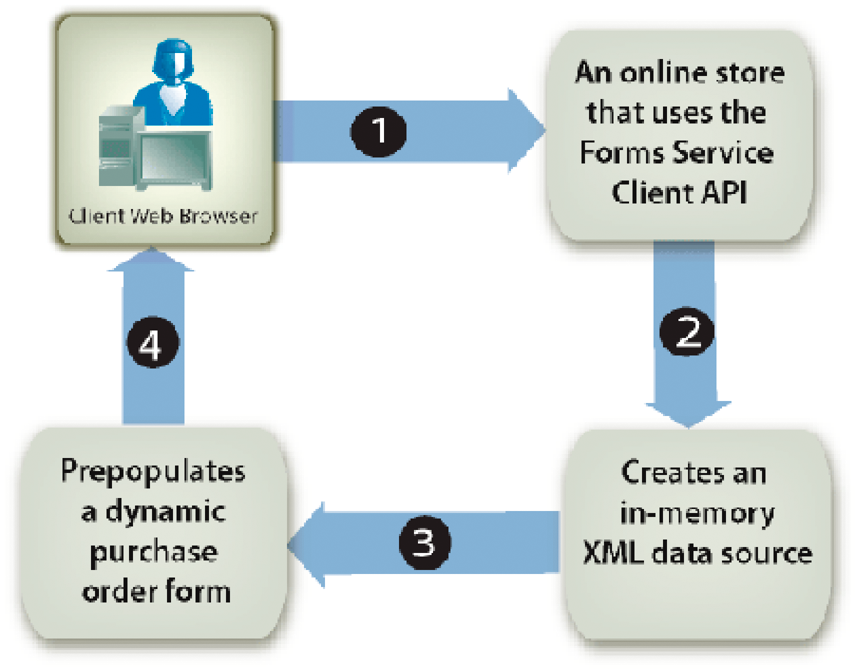

# Préremplissage de Forms avec des dispositions souple {#prepopulating-forms-with-flowable-layouts1}

## Préremplissage de Forms avec des dispositions souple {#prepopulating-forms-with-flowable-layouts2}

Le préremplissage de formulaires affiche des données aux utilisateurs dans un formulaire rendu. Supposons, par exemple, qu’un utilisateur se connecte à un site web avec un nom d’utilisateur et un mot de passe. Si l’authentification est réussie, l’application cliente interroge une base de données pour obtenir des informations sur l’utilisateur. Les données sont fusionnées dans le formulaire, puis le formulaire est rendu à l’utilisateur. Par conséquent, l’utilisateur peut afficher des données personnalisées dans le formulaire.

Le préremplissage d’un formulaire présente les avantages suivants :

* Elle permet à l’utilisateur d’afficher des données personnalisées dans un formulaire.
* Réduit la quantité de saisie que l’utilisateur fait pour remplir un formulaire.
* Elle assure l’intégrité des données grâce au contrôle du placement des données.

Les deux sources de données XML suivantes peuvent préremplir un formulaire :

* Une source de données XDP, qui est du code XML conforme à la syntaxe XFA (ou des données XFDF pour préremplir un formulaire créé à l’aide d’Acrobat).
* Une source de données XML arbitraire qui contient des paires nom/valeur correspondant aux noms de champ du formulaire (les exemples de cette section utilisent une source de données XML arbitraire).

Un élément XML doit exister pour chaque champ de formulaire que vous souhaitez préremplir. Le nom de l’élément XML doit correspondre au nom du champ. Un élément XML est ignoré s’il ne correspond pas à un champ de formulaire ou si le nom de l’élément XML ne correspond pas au nom du champ. Il n&#39;est pas nécessaire de correspondre à l&#39;ordre dans lequel les éléments XML sont affichés, tant que tous les éléments XML sont spécifiés.

Lorsque vous préremplissez un formulaire qui contient déjà des données, vous devez spécifier les données déjà affichées dans la source de données XML. Supposons qu’un formulaire contenant 10 champs comporte des données dans quatre champs. Supposons ensuite que vous souhaitiez préremplir les six champs restants. Dans ce cas, vous devez spécifier 10 éléments XML dans la source de données XML utilisée pour préremplir le formulaire. Si vous ne spécifiez que six éléments, les quatre champs d&#39;origine sont vides.

Vous pouvez, par exemple, préremplir un formulaire tel que l’exemple de formulaire de confirmation. (Voir &quot;Formulaire de confirmation&quot; dans [Rendu des PDF forms interactifs](/help/forms/developing/rendering-interactive-pdf-forms.md).)

Pour préremplir l’exemple de formulaire de confirmation, vous devez créer une source de données XML qui contient trois éléments XML correspondant aux trois champs du formulaire. Ce formulaire contient les trois champs suivants : `FirstName`, `LastName`, et `Amount`. La première étape consiste à créer une source de données XML contenant des éléments XML correspondant aux champs situés dans la conception de formulaire. L’étape suivante consiste à attribuer des valeurs de données aux éléments XML, comme illustré dans le code XML suivant.

```as3
     <Untitled> 
         <FirstName>Jerry</FirstName> 
         <LastName>Johnson</LastName> 
         <Amount>250000</Amount> 
     </Untitled>
```

Une fois que vous avez prérempli le formulaire de confirmation avec cette source de données XML, puis effectué le rendu du formulaire, les valeurs de données que vous avez attribuées aux éléments XML s’affichent, comme illustré dans le diagramme ci-dessous.


### Préremplissage des formulaires avec des dispositions à disposition souple {#prepopulating_forms_with_flowable_layouts-1}

Les Forms avec disposition souple sont utiles pour afficher une quantité indéterminée de données aux utilisateurs. Étant donné que la disposition du formulaire s’ajuste automatiquement à la quantité de données fusionnées, il n’est pas nécessaire de prédéfinir une disposition ou un nombre fixe de pages pour le formulaire, comme vous le devez pour un formulaire avec une disposition fixe.

Un formulaire est généralement rempli avec des données obtenues lors de l’exécution. Par conséquent, vous pouvez préremplir un formulaire en créant une source de données XML en mémoire et en plaçant les données directement dans la source de données XML en mémoire.

Prenons l’exemple d’une application web, telle qu’une boutique en ligne. Une fois qu’un acheteur en ligne a terminé son achat, tous les articles achetés sont placés dans une source de données XML en mémoire qui est utilisée pour préremplir un formulaire. Le diagramme suivant illustre ce processus, qui est expliqué dans le tableau suivant le diagramme.



Le tableau suivant décrit les étapes de ce diagramme.

<table> 
 <thead> 
  <tr> 
   <th><p>Étape</p></th> 
   <th><p>Description</p></th> 
  </tr> 
 </thead> 
 <tbody>
  <tr> 
   <td><p>1</p></td> 
   <td><p>Un utilisateur achète des articles dans une boutique en ligne basée sur le Web. </p></td> 
  </tr> 
  <tr> 
   <td><p>2</p></td> 
   <td><p>Une fois que l’utilisateur a terminé ses achats et cliqué sur le bouton Envoyer, une source de données XML en mémoire est créée. Les éléments achetés et les informations utilisateur sont placés dans la source de données XML en mémoire. </p></td> 
  </tr> 
  <tr> 
   <td><p>3</p></td> 
   <td><p>La source de données XML est utilisée pour préremplir un formulaire de bon de commande (un exemple de ce formulaire est illustré ci-dessous). </p></td> 
  </tr> 
  <tr> 
   <td><p>4</p></td> 
   <td><p>Le formulaire de bon de commande est rendu dans le navigateur Web client. </p></td> 
  </tr> 
 </tbody> 
</table>

Le diagramme suivant illustre un exemple de formulaire de bon de commande. Les informations du tableau peuvent s’adapter au nombre d’enregistrements dans les données XML.


>[!NOTE]
>
>Un formulaire peut être prérempli avec des données provenant d’autres sources, telles qu’une base de données d’entreprise ou des applications externes.

### Considérations relatives à la conception de formulaire {#form-design-considerations}

Les Forms avec disposition souple sont basées sur des conceptions de formulaire créées dans Designer. Une conception de formulaire spécifie un ensemble de règles de disposition, de présentation et de capture de données, y compris le calcul de valeurs en fonction des entrées de l’utilisateur. Les règles sont appliquées lorsque des données sont entrées dans un formulaire. Les champs ajoutés à un formulaire sont des sous-formulaires qui se trouvent dans la conception de formulaire. Par exemple, dans le formulaire de bon de commande illustré dans le diagramme précédent, chaque ligne est un sous-formulaire. Pour plus d’informations sur la création d’une conception de formulaire contenant des sous-formulaires, voir [Création d’un formulaire de bon de commande doté d’une disposition souple](https://www.adobe.com/go/learn_aemforms_qs_poformflowable_9).

### Présentation des sous-groupes de données {#understanding-data-subgroups}

Une source de données XML est utilisée pour préremplir les formulaires avec des mises en page fixes et des mises en page à disposition souple. Cependant, la différence réside dans le fait qu’une source de données XML qui préremplit un formulaire avec une disposition souple contient des éléments XML qui se répètent et sont utilisés pour préremplir les sous-formulaires qui sont répétés dans le formulaire. Ces éléments XML qui se répètent sont appelés sous-groupes de données.

Une source de données XML utilisée pour préremplir le formulaire de bon de commande illustré dans le diagramme précédent contient quatre sous-groupes de données qui se répètent. Chaque sous-groupe de données correspond à un article acheté. Les articles achetés sont un écran, une lampe de bureau, un téléphone et un carnet d’adresses.

La source de données XML suivante est utilisée pour préremplir le formulaire de bon de commande.

```as3
     <header>  
         <!-- XML elements used to prepopulate non-repeating fields such as address 
         <!and city  
         <txtPONum>8745236985</txtPONum>  
         <dtmDate>2004-02-08</dtmDate>  
         <txtOrderedByCompanyName>Any Company Name</txtOrderedByCompanyName>  
         <txtOrderedByAddress>555, Any Blvd.</txtOrderedByAddress>  
         <txtOrderedByCity>Any City</txtOrderedByCity>  
         <txtOrderedByStateProv>ST</txtOrderedByStateProv>  
         <txtOrderedByZipCode>12345</txtOrderedByZipCode>  
         <txtOrderedByCountry>Any Country</txtOrderedByCountry>  
         <txtOrderedByPhone>(123) 456-7890</txtOrderedByPhone>  
         <txtOrderedByFax>(123) 456-7899</txtOrderedByFax>  
         <txtOrderedByContactName>Contact Name</txtOrderedByContactName>  
         <txtDeliverToCompanyName>Any Company Name</txtDeliverToCompanyName>  
         <txtDeliverToAddress>7895, Any Street</txtDeliverToAddress>  
         <txtDeliverToCity>Any City</txtDeliverToCity>  
         <txtDeliverToStateProv>ST</txtDeliverToStateProv>  
         <txtDeliverToZipCode>12346</txtDeliverToZipCode>  
         <txtDeliverToCountry>Any Country</txtDeliverToCountry>  
         <txtDeliverToPhone>(123) 456-7891</txtDeliverToPhone>  
         <txtDeliverToFax>(123) 456-7899</txtDeliverToFax>  
         <txtDeliverToContactName>Contact Name</txtDeliverToContactName>  
     </header>  
     <detail>  
         <!-- A data subgroup that contains information about the monitor> 
         <txtPartNum>00010-100</txtPartNum>  
         <txtDescription>Monitor</txtDescription>  
         <numQty>1</numQty>  
         <numUnitPrice>350.00</numUnitPrice>  
     </detail>  
     <detail>  
         <!-- A data subgroup that contains information about the desk lamp> 
         <txtPartNum>00010-200</txtPartNum>  
         <txtDescription>Desk lamps</txtDescription>  
         <numQty>3</numQty>  
         <numUnitPrice>55.00</numUnitPrice>  
     </detail>  
     <detail> 
         <!-- A data subgroup that contains information about the Phone> 
             <txtPartNum>00025-275</txtPartNum>  
             <txtDescription>Phone</txtDescription>  
             <numQty>5</numQty>  
             <numUnitPrice>85.00</numUnitPrice>  
     </detail>  
     <detail> 
         <!-- A data subgroup that contains information about the address book> 
         <txtPartNum>00300-896</txtPartNum>  
         <txtDescription>Address book</txtDescription>  
         <numQty>2</numQty>  
         <numUnitPrice>15.00</numUnitPrice>  
     </detail>
```

Notez que chaque sous-groupe de données contient quatre éléments XML qui correspondent à ces informations :

* Numéro de pièce des éléments
* Description des éléments
* Quantité d’articles
* Prix unitaire

Le nom de l’élément XML parent d’un sous-groupe de données doit correspondre au nom du sous-formulaire situé dans la conception de formulaire. Par exemple, dans le diagramme précédent, notez que le nom de l’élément XML parent du sous-groupe de données est `detail`. Cela correspond au nom du sous-formulaire situé dans la conception de formulaire sur laquelle repose le formulaire de bon de commande. Si le nom de l’élément XML parent du sous-groupe de données et le sous-formulaire ne correspondent pas, aucun formulaire côté serveur n’est prérempli.

Chaque sous-groupe de données doit contenir des éléments XML correspondant aux noms des champs dans le sous-formulaire. Le `detail` Le sous-formulaire situé dans la conception de formulaire contient les champs suivants :

* txtPartNum
* txtDescription
* numQty
* numUnitPrice

>[!NOTE]
>
>Si vous tentez de préremplir un formulaire avec une source de données contenant des éléments XML qui se répètent, définissez la variable `RenderAtClient` option à `No`, seul le premier enregistrement de données est fusionné dans le formulaire. Pour vous assurer que tous les enregistrements de données sont fusionnés dans le formulaire, définissez la variable `RenderAtClient` to `Yes`. Pour plus d’informations sur la variable `RenderAtClient` , voir [Rendu de Forms sur le client](/help/forms/developing/rendering-forms-client.md).

>[!NOTE]
>
>Pour plus d’informations sur le service Forms, voir [Référence des services pour AEM Forms](https://www.adobe.com/go/learn_aemforms_services_63).

### Résumé des étapes {#summary-of-steps}

Pour préremplir un formulaire avec une disposition souple, procédez comme suit :

1. Inclure les fichiers de projet.
1. Créez une source de données XML en mémoire.
1. Convertir la source de données XML.
1. Générer un formulaire prérempli.

**Inclure les fichiers de projet**

Incluez les fichiers nécessaires dans votre projet de développement. Si vous créez une application cliente à l’aide de Java, incluez les fichiers JAR nécessaires. Si vous utilisez des services Web, veillez à inclure les fichiers proxy.

**Inclure les fichiers de projet**

Incluez les fichiers nécessaires dans votre projet de développement. Si vous créez une application cliente à l’aide de Java, incluez les fichiers JAR nécessaires. Si vous utilisez des services Web, veillez à inclure les fichiers proxy.

**Création d’une source de données XML en mémoire**

Vous pouvez utiliser `org.w3c.dom` pour créer une source de données XML en mémoire afin de préremplir un formulaire avec une disposition souple. Vous devez placer les données dans une source de données XML conforme au formulaire. Pour plus d’informations sur la relation entre un formulaire avec une disposition souple et la source de données XML, voir [Présentation des sous-groupes de données](#understanding-data-subgroups).

**Conversion de la source de données XML**

Une source de données XML en mémoire créée à l’aide de `org.w3c.dom` peuvent être converties en `com.adobe.idp.Document` avant de pouvoir être utilisé pour préremplir un formulaire. Une source de données XML en mémoire peut être convertie à l’aide de classes de transformation XML Java.

>[!NOTE]
>
>Si vous utilisez le fichier WSDL du service Forms pour préremplir un formulaire, vous devez convertir une `org.w3c.dom.Document` en objet `BLOB` .

**Rendu d’un formulaire prérempli**

Vous générez un formulaire prérempli comme tout autre formulaire. La seule différence réside dans le fait que vous utilisez la variable `com.adobe.idp.Document` contenant la source de données XML pour préremplir le formulaire.

**Voir également**

[Inclusion des fichiers de bibliothèque Java d’AEM Forms](/help/forms/developing/invoking-aem-forms-using-java.md#including-aem-forms-java-library-files)

[Réglage des propriétés de la connexion](/help/forms/developing/invoking-aem-forms-using-java.md#setting-connection-properties)

[Démarrages rapides de l’API Forms Service](/help/forms/developing/forms-service-api-quick-starts.md#forms-service-api-quick-starts)

[Rendu des PDF forms interactifs](/help/forms/developing/rendering-interactive-pdf-forms.md)

[Création d’applications web qui renvoient Forms](/help/forms/developing/creating-web-applications-renders-forms.md)

### Préremplissage des formulaires à l’aide de l’API Java {#prepopulating-forms-using-the-java-api}

Pour préremplir un formulaire avec une disposition souple à l’aide de l’API Forms (Java), procédez comme suit :

1. Inclure les fichiers de projet

   Incluez les fichiers JAR client, tels que adobe-forms-client.jar, dans le chemin de classe de votre projet Java. Pour plus d’informations sur l’emplacement de ces fichiers, voir [Inclusion des fichiers de bibliothèque Java AEM Forms](/help/forms/developing/invoking-aem-forms-using-java.md#including-aem-forms-java-library-files).

1. Création d’une source de données XML en mémoire

   * Création d’un Java `DocumentBuilderFactory` en appelant la fonction `DocumentBuilderFactory` class’ `newInstance` .
   * Création d’un Java `DocumentBuilder` en appelant la fonction `DocumentBuilderFactory` de `newDocumentBuilder` .
   * Appelez le `DocumentBuilder` de `newDocument` pour instancier une `org.w3c.dom.Document` .
   * Créez l’élément racine de la source de données XML en appelant la méthode `org.w3c.dom.Document` de `createElement` . Cela crée une `Element` qui représente l’élément racine. Transmettez une valeur string représentant le nom de l’élément au `createElement` . Convertissez la valeur de retour en `Element`. Ensuite, ajoutez l’élément racine au document en appelant la fonction `Document` de `appendChild` et transmettez l’objet d’élément racine en tant qu’argument. Les lignes de code suivantes présentent cette logique d’application :

      ` Element root = (Element)document.createElement("transaction");  document.appendChild(root);`

   * Créez l’élément d’en-tête de la source de données XML en appelant la fonction `Document` de `createElement` . Transmettez une valeur string représentant le nom de l’élément au `createElement` . Convertissez la valeur de retour en `Element`. Ensuite, ajoutez l’élément d’en-tête à l’élément racine en appelant la fonction `root` de `appendChild` et transmettez l’objet d’élément d’en-tête en tant qu’argument. Les éléments XML ajoutés à l’élément d’en-tête correspondent à la partie statique du formulaire. Les lignes de code suivantes présentent cette logique d’application :

      ` Element header = (Element)document.createElement("header");  root.appendChild(header);`

   * Créez un élément enfant qui appartient à l’élément d’en-tête en appelant la fonction `Document` de `createElement` et transmettez une valeur string qui représente le nom de l’élément. Convertissez la valeur de retour en `Element`. Ensuite, définissez une valeur pour l’élément enfant en appelant son `appendChild` et transmettez la variable `Document` de `createTextNode` comme argument. Spécifiez une valeur string qui apparaît comme valeur de l’élément enfant. Enfin, ajoutez l’élément enfant à l’élément d’en-tête en appelant le `appendChild` et transmettez l’objet d’élément enfant en tant qu’argument. Les lignes de code suivantes présentent cette logique d’application :

      ` Element poNum= (Element)document.createElement("txtPONum");  poNum.appendChild(document.createTextNode("8745236985"));  header.appendChild(LastName);`


   * Ajoutez tous les éléments restants à l’élément d’en-tête en répétant la dernière sous-étape pour chaque champ apparaissant dans la partie statique du formulaire (dans le diagramme de source de données XML, ces champs sont affichés dans la section A. (Voir [Présentation des sous-groupes de données](#understanding-data-subgroups).)
   * Créez l’élément de détail de la source de données XML en appelant la méthode `Document` de `createElement` . Transmettez une valeur string représentant le nom de l’élément au `createElement` . Convertissez la valeur de retour en `Element`. Ensuite, ajoutez l’élément de détail à l’élément racine en appelant le `root` de `appendChild` et transmettez l’objet d’élément de détail en tant qu’argument. Les éléments XML ajoutés à l’élément de détail correspondent à la partie dynamique du formulaire. Les lignes de code suivantes présentent cette logique d’application :

      ` Element detail = (Element)document.createElement("detail");  root.appendChild(detail);`

   * Créez un élément enfant qui appartient à l’élément de détail en appelant la fonction `Document` de `createElement` et transmettez une valeur string qui représente le nom de l’élément. Convertissez la valeur de retour en `Element`. Ensuite, définissez une valeur pour l’élément enfant en appelant son `appendChild` et transmettez la variable `Document` de `createTextNode` comme argument. Spécifiez une valeur string qui apparaît comme valeur de l’élément enfant. Enfin, ajoutez l’élément enfant à l’élément de détail en appelant le `appendChild` et transmettez l’objet d’élément enfant en tant qu’argument. Les lignes de code suivantes présentent cette logique d’application :

      ` Element txtPartNum = (Element)document.createElement("txtPartNum");  txtPartNum.appendChild(document.createTextNode("00010-100"));  detail.appendChild(txtPartNum);`

   * Répétez la dernière sous-étape pour tous les éléments XML à ajouter à l’élément de détail. Pour créer correctement la source de données XML utilisée pour remplir le formulaire de bon de commande, vous devez ajouter les éléments XML suivants à l’élément de détail : `txtDescription`, `numQty`, et `numUnitPrice`.
   * Répétez les deux dernières sous-étapes pour tous les éléments de données utilisés pour préremplir le formulaire.

1. Conversion de la source de données XML

   * Créez un `javax.xml.transform.Transformer` en appelant le `javax.xml.transform.Transformer` statique de l’objet `newInstance` .
   * Créez un `Transformer` en appelant le `TransformerFactory` de `newTransformer` .
   * Créez un objet `ByteArrayOutputStream` en utilisant son constructeur.
   * Créez un `javax.xml.transform.dom.DOMSource` en utilisant son constructeur et en transmettant l’objet `org.w3c.dom.Document` qui a été créé à l’étape 1.
   * Créez un objet `javax.xml.transform.dom.DOMSource` en utilisant son constructeur et en transmettant l’objet `ByteArrayOutputStream`. 
   * Renseignement du code Java `ByteArrayOutputStream` en appelant le `javax.xml.transform.Transformer` de `transform` et transmission de la méthode `javax.xml.transform.dom.DOMSource` et le `javax.xml.transform.stream.StreamResult` objets.
   * Créez un tableau d’octets et affectez la taille de la variable `ByteArrayOutputStream` vers le tableau d’octets.
   * Renseignez le tableau d’octets en appelant la variable `ByteArrayOutputStream` de `toByteArray` .
   * Créez un `com.adobe.idp.Document` en utilisant son constructeur et en transmettant le tableau d’octets.

1. Rendu d’un formulaire prérempli

   Appeler la variable `FormsServiceClient` de `renderPDFForm` et transmettez les valeurs suivantes :

   * Une valeur string qui spécifie le nom de la conception de formulaire, y compris l’extension du nom de fichier.
   * A `com.adobe.idp.Document` contenant les données à fusionner avec le formulaire. Veillez à utiliser la variable `com.adobe.idp.Document` créé aux étapes 1 et 2.
   * A `PDFFormRenderSpec` qui stocke les options d’exécution.
   * A `URLSpec` contenant des valeurs URI requises par le service Forms.
   * A `java.util.HashMap` qui stocke les pièces jointes. Ce paramètre est facultatif et vous pouvez spécifier `null` si vous ne souhaitez pas joindre de fichiers au formulaire.

   Le `renderPDFForm` renvoie une `FormsResult` contenant un flux de données de formulaire qui doit être écrit dans le navigateur Web client.

   * Créez un `javax.servlet.ServletOutputStream` utilisé pour envoyer un flux de données de formulaire au navigateur Web client.
   * Créez un `com.adobe.idp.Document` en appelant le `FormsResult` object ‘s `getOutputContent` .
   * Créez un `java.io.InputStream` en appelant le `com.adobe.idp.Document` de `getInputStream` .
   * Créez un tableau d’octets pour le remplir avec le flux de données de formulaire en appelant la fonction `InputStream` de `read` et transmission du tableau d’octets en tant qu’argument.
   * Appeler la variable `javax.servlet.ServletOutputStream` de `write` pour envoyer le flux de données de formulaire au navigateur web client. Transmettez le tableau d’octets au `write` .


**Voir également**

[Démarrage rapide (mode SOAP) : Préremplissage de Forms avec des mises en page souples à l’aide de l’API Java](/help/forms/developing/forms-service-api-quick-starts.md#quick-start-soap-mode-prepopulating-forms-with-flowable-layouts-using-the-java-api)

[Inclusion des fichiers de bibliothèque Java d’AEM Forms](/help/forms/developing/invoking-aem-forms-using-java.md#including-aem-forms-java-library-files)

[Réglage des propriétés de la connexion](/help/forms/developing/invoking-aem-forms-using-java.md#setting-connection-properties)

### Préremplissage des formulaires à l’aide de l’API de service Web {#prepopulating-forms-using-the-web-service-api}

Pour préremplir un formulaire avec une disposition souple à l’aide de l’API Forms (service Web), procédez comme suit :

1. Inclure les fichiers de projet

   * Créez des classes proxy Java qui utilisent le WSDL du service Forms. (Voir [Création de classes proxy Java à l’aide de l’axe Apache](/help/forms/developing/invoking-aem-forms-using-web.md#creating-java-proxy-classes-using-apache-axis).)
   * Incluez les classes proxy Java dans le chemin de classe.

1. Création d’une source de données XML en mémoire

   * Création d’un Java `DocumentBuilderFactory` en appelant la fonction `DocumentBuilderFactory` class’ `newInstance` .
   * Création d’un Java `DocumentBuilder` en appelant la fonction `DocumentBuilderFactory` de `newDocumentBuilder` .
   * Appelez le `DocumentBuilder` de `newDocument` pour instancier une `org.w3c.dom.Document` .
   * Créez l’élément racine de la source de données XML en appelant la méthode `org.w3c.dom.Document` de `createElement` . Cela crée une `Element` qui représente l’élément racine. Transmettez une valeur string représentant le nom de l’élément au `createElement` . Convertissez la valeur de retour en `Element`. Ensuite, ajoutez l’élément racine au document en appelant la fonction `Document` de `appendChild` et transmettez l’objet d’élément racine en tant qu’argument. Les lignes de code suivantes présentent cette logique d’application :

      ` Element root = (Element)document.createElement("transaction");  document.appendChild(root);`

   * Créez l’élément d’en-tête de la source de données XML en appelant la fonction `Document` de `createElement` . Transmettez une valeur string représentant le nom de l’élément au `createElement` . Convertissez la valeur de retour en `Element`. Ensuite, ajoutez l’élément d’en-tête à l’élément racine en appelant la fonction `root` de `appendChild` et transmettez l’objet d’élément d’en-tête en tant qu’argument. Les éléments XML ajoutés à l’élément d’en-tête correspondent à la partie statique du formulaire. Les lignes de code suivantes présentent cette logique d’application :

      ` Element header = (Element)document.createElement("header");  root.appendChild(header);`

   * Créez un élément enfant qui appartient à l’élément d’en-tête en appelant la fonction `Document` de `createElement` et transmettez une valeur string qui représente le nom de l’élément. Convertissez la valeur de retour en `Element`. Ensuite, définissez une valeur pour l’élément enfant en appelant son `appendChild` et transmettez la variable `Document` de `createTextNode` comme argument. Spécifiez une valeur string qui apparaît comme valeur de l’élément enfant. Enfin, ajoutez l’élément enfant à l’élément d’en-tête en appelant le `appendChild` et transmettez l’objet d’élément enfant en tant qu’argument. Les lignes de code suivantes présentent cette logique d’application :

      ` Element poNum= (Element)document.createElement("txtPONum");  poNum.appendChild(document.createTextNode("8745236985"));  header.appendChild(LastName);`

   * Ajoutez tous les éléments restants à l’élément d’en-tête en répétant la dernière sous-étape pour chaque champ apparaissant dans la partie statique du formulaire (dans le diagramme de source de données XML, ces champs sont affichés dans la section A. (Voir [Présentation des sous-groupes de données](#understanding-data-subgroups).)
   * Créez l’élément de détail de la source de données XML en appelant la méthode `Document` de `createElement` . Transmettez une valeur string représentant le nom de l’élément au `createElement` . Convertissez la valeur de retour en `Element`. Ensuite, ajoutez l’élément de détail à l’élément racine en appelant le `root` de `appendChild` et transmettez l’objet d’élément de détail en tant qu’argument. Les éléments XML ajoutés à l’élément de détail correspondent à la partie dynamique du formulaire. Les lignes de code suivantes présentent cette logique d’application :

      ` Element detail = (Element)document.createElement("detail");  root.appendChild(detail);`

   * Créez un élément enfant qui appartient à l’élément de détail en appelant la fonction `Document` de `createElement` et transmettez une valeur string qui représente le nom de l’élément. Convertissez la valeur de retour en `Element`. Ensuite, définissez une valeur pour l’élément enfant en appelant son `appendChild` et transmettez la variable `Document` de `createTextNode` comme argument. Spécifiez une valeur string qui apparaît comme valeur de l’élément enfant. Enfin, ajoutez l’élément enfant à l’élément de détail en appelant le `appendChild` et transmettez l’objet d’élément enfant en tant qu’argument. Les lignes de code suivantes présentent cette logique d’application :

      ` Element txtPartNum = (Element)document.createElement("txtPartNum");  txtPartNum.appendChild(document.createTextNode("00010-100"));  detail.appendChild(txtPartNum);`

   * Répétez la dernière sous-étape pour tous les éléments XML à ajouter à l’élément de détail. Pour créer correctement la source de données XML utilisée pour remplir le formulaire de bon de commande, vous devez ajouter les éléments XML suivants à l’élément de détail : `txtDescription`, `numQty`, et `numUnitPrice`.
   * Répétez les deux dernières sous-étapes pour tous les éléments de données utilisés pour préremplir le formulaire.

1. Conversion de la source de données XML

   * Créez un `javax.xml.transform.Transformer` en appelant le `javax.xml.transform.Transformer` statique de l’objet `newInstance` .
   * Créez un `Transformer` en appelant le `TransformerFactory` de `newTransformer` .
   * Créez un objet `ByteArrayOutputStream` en utilisant son constructeur.
   * Créez un `javax.xml.transform.dom.DOMSource` en utilisant son constructeur et en transmettant l’objet `org.w3c.dom.Document` qui a été créé à l’étape 1.
   * Créez un objet `javax.xml.transform.dom.DOMSource` en utilisant son constructeur et en transmettant l’objet `ByteArrayOutputStream`. 
   * Renseignement du code Java `ByteArrayOutputStream` en appelant le `javax.xml.transform.Transformer` de `transform` et transmission de la méthode `javax.xml.transform.dom.DOMSource` et le `javax.xml.transform.stream.StreamResult` objets.
   * Créez un tableau d’octets et affectez la taille de la variable `ByteArrayOutputStream` vers le tableau d’octets.
   * Renseignez le tableau d’octets en appelant la variable `ByteArrayOutputStream` de `toByteArray` .
   * Créez un `BLOB` en utilisant son constructeur et en appelant son objet `setBinaryData` et transmettez le tableau byte.

1. Rendu d’un formulaire prérempli

   Appeler la variable `FormsService` de `renderPDFForm` et transmettez les valeurs suivantes :

   * Une valeur string qui spécifie le nom de la conception de formulaire, y compris l’extension du nom de fichier.
   * A `BLOB` contenant les données à fusionner avec le formulaire. Veillez à utiliser la variable `BLOB` qui a été créé aux étapes 1 et 2.
   * A `PDFFormRenderSpecc` qui stocke les options d’exécution. Pour plus d’informations, voir [Référence de l’API AEM Forms](https://www.adobe.com/go/learn_aemforms_javadocs_63_en).
   * A `URLSpec` contenant des valeurs URI requises par le service Forms.
   * A `java.util.HashMap` qui stocke les pièces jointes. Ce paramètre est facultatif et vous pouvez spécifier `null` si vous ne souhaitez pas joindre de fichiers au formulaire.
   * Une valeur vide `com.adobe.idp.services.holders.BLOBHolder` qui est renseigné par la méthode . Il est utilisé pour stocker le formulaire de PDF rendu.
   * Une valeur vide `javax.xml.rpc.holders.LongHolder` qui est renseigné par la méthode . (Cet argument stocke le nombre de pages dans le formulaire).
   * Une valeur vide `javax.xml.rpc.holders.StringHolder` qui est renseigné par la méthode . (Cet argument stocke la valeur du paramètre régional).
   * Une valeur vide `com.adobe.idp.services.holders.FormsResultHolder` qui contiendra les résultats de cette opération.

   Le `renderPDFForm` renseigne la méthode `com.adobe.idp.services.holders.FormsResultHolder` qui est transmis en tant que dernière valeur d’argument avec un flux de données de formulaire qui doit être écrit dans le navigateur web client.

   * Créez un `FormResult` en obtenant la valeur de la variable `com.adobe.idp.services.holders.FormsResultHolder` de `value` membre de données.
   * Créez un `BLOB` qui contient des données de formulaire en appelant la méthode `FormsResult` de `getOutputContent` .
   * Obtention du type de contenu de la variable `BLOB` en appelant son objet `getContentType` .
   * Définissez la variable `javax.servlet.http.HttpServletResponse` type de contenu de l’objet en appelant sa propriété `setContentType` et transmettre le type de contenu de la méthode `BLOB` .
   * Créez un `javax.servlet.ServletOutputStream` objet utilisé pour écrire le flux de données de formulaire dans le navigateur Web client en appelant la fonction `javax.servlet.http.HttpServletResponse` de `getOutputStream` .
   * Créez un tableau d’octets et renseignez-le en appelant la variable `BLOB` de `getBinaryData` . Cette tâche affecte le contenu de la `FormsResult` vers le tableau d’octets.
   * Appeler la variable `javax.servlet.http.HttpServletResponse` de `write` pour envoyer le flux de données de formulaire au navigateur web client. Transmettez le tableau d’octets au `write` .

   >[!NOTE]
   >
   >Le `renderPDFForm` renseigne la méthode `com.adobe.idp.services.holders.FormsResultHolder` qui est transmis en tant que dernière valeur d’argument avec un flux de données de formulaire qui doit être écrit dans le navigateur web client.

**Voir également**

[Appel d’AEM Forms à l’aide du codage Base64](/help/forms/developing/invoking-aem-forms-using-web.md#invoking-aem-forms-using-base64-encoding)
