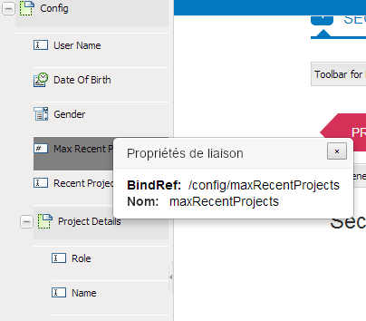

# Création de formulaires adaptatifs à l’aide d’un schéma XML {#creating-adaptive-forms-using-xml-schema}

>[!CAUTION]
>
>AEM 6.4 a atteint la fin de la prise en charge étendue et cette documentation n’est plus mise à jour. Pour plus d’informations, voir notre [période de support technique](https://helpx.adobe.com/fr/support/programs/eol-matrix.html). Rechercher les versions prises en charge [here](https://experienceleague.adobe.com/docs/?lang=fr).

## Prérequis {#prerequisites}

La création d’un formulaire adaptatif à l’aide d’un schéma XML en tant que modèle de formulaire nécessite une compréhension de base des schémas XML. Il est également recommandé de lire le contenu suivant avant cet article.

* [Création d’un formulaire adaptatif](/help/forms/using/creating-adaptive-form.md)
* [Schéma XML](https://www.w3.org/TR/xmlschema-2/)

## Utilisation d’un schéma XML en tant que modèle de formulaire {#using-an-xml-schema-as-form-model}

AEM Forms prend en charge la création d’un formulaire adaptatif en utilisant un schéma XML existant comme modèle de formulaire. Ce schéma XML représente la structure dans laquelle les données sont générées ou utilisées par le système principal de votre entreprise.

Les principales fonctionnalités de l&#39;utilisation d&#39;un schéma XML sont les suivantes :

* La structure du schéma XSD s’affiche sous forme d’arborescence dans l’onglet Outil de recherche de contenu en mode création pour un formulaire adaptatif. Vous pouvez faire glisser et ajouter un élément de la hiérarchie XSD dans le formulaire adaptatif.
* Vous pouvez préremplir le formulaire à l’aide d’un code XML conforme au schéma associé.
* Lors de l’envoi, les données saisies par l’utilisateur sont envoyées au format XML qui s’aligne sur le schéma associé.

Un schéma XML se compose de types d’éléments simples et complexes. Les éléments possèdent des attributs qui ajoutent des règles à ceux-ci. Lorsque ces éléments et attributs sont déplacés sur un formulaire adaptatif, ils sont automatiquement mappés au composant de formulaire adaptatif correspondant.

Ce mappage des éléments XML avec les composants de formulaire adaptatif est le suivant :

<table> 
 <tbody> 
  <tr> 
   <th><strong>Attribut ou élément XML </strong></th> 
   <th><strong>Composant de formulaire adaptatif</strong></th> 
  </tr> 
  <tr> 
   <td><code>xs:string</code></td> 
   <td>Zone de texte</td> 
  </tr> 
  <tr> 
   <td><code>xs:boolean</code></td> 
   <td>Case à cocher</td> 
  </tr> 
  <tr> 
   <td> 
    <ul> 
     <li><code>xs:unsignedInt</code></li> 
     <li><code>xs:xs:int</code></li> 
     <li><code class="code">xs:decimal 
        </code></li> 
     <li>Tous les types de valeurs numériques</li> 
    </ul> </td> 
   <td>Zone numérique</td> 
  </tr> 
  <tr> 
   <td><code>xs:date</code></td> 
   <td>Sélecteur de date</td> 
  </tr> 
  <tr> 
   <td><code class="code">xs:enumeration
      </code></td> 
   <td>Liste déroulante</td> 
  </tr> 
  <tr> 
   <td>Tout élément de type complexe</td> 
   <td>Panneau</td> 
  </tr> 
 </tbody> 
</table>

## Exemple de schéma XML {#sample-xml-schema}

Voici un exemple de schéma XML.

```xml
<?xml version="1.0" encoding="utf-8" ?> 
    <xs:schema targetNamespace="https://adobe.com/sample.xsd"
                    xmlns="https://adobe.com/sample.xsd"
                    xmlns:xs="https://www.w3.org/2001/XMLSchema"
                >

        <xs:element name="sample" type="SampleType"/>
        
        <xs:complexType name="SampleType">
            <xs:sequence>
                <xs:element name="leaderName" type="xs:string" default="Enter Name"/>
                <xs:element name="assignmentStartBirth" type="xs:date"/>
                <xs:element name="gender" type="GenderEnum"/>
                <xs:element name="noOfProjectsAssigned" type="IntType"/>
                <xs:element name="assignmentDetails" type="AssignmentDetails" 
                                            minOccurs="0" maxOccurs="10"/>
            </xs:sequence>
        </xs:complexType>

        <xs:complexType name="AssignmentDetails">
            <xs:attribute name="name" type="xs:string" use="required"/>
            <xs:attribute name="durationOfAssignment" type="xs:unsignedInt" use="required"/>
            <xs:attribute name="numberOfMentees" type="xs:unsignedInt" use="required"/>
             <xs:attribute name="descriptionOfAssignment" type="xs:string" use="required"/>
             <xs:attribute name="financeRelatedProject" type="xs:boolean"/>
       </xs:complexType>
  <xs:simpleType name="IntType">
            <xs:restriction base="xs:int">
            </xs:restriction>
        </xs:simpleType>
  <xs:simpleType name="GenderEnum">
            <xs:restriction base="xs:string">
                <xs:enumeration value="Female"/>
                <xs:enumeration value="Male"/>
            </xs:restriction>
        </xs:simpleType>
    </xs:schema>
```

>[!NOTE]
>
>Assurez-vous que votre schéma XML ne comporte qu’un seul élément racine. Un schéma XML comportant plusieurs éléments racine n’est pas pris en charge.

## Ajout de propriétés spéciales aux champs à l’aide d’un schéma XML {#adding-special-properties-to-fields-using-xml-schema}

Vous pouvez ajouter les attributs suivants aux éléments de schéma XML pour ajouter des propriétés spéciales aux champs du formulaire adaptatif associé.

<table> 
 <tbody> 
  <tr> 
   <th><strong>Propriété de schéma</strong></th> 
   <th><strong>Utilisation dans le formulaire adaptatif</strong></th> 
   <th><strong>Pris en charge dans </strong></th> 
  </tr> 
  <tr> 
   <td><code>use=required </code></td> 
   <td>Indique un champ obligatoire.<br /> </td> 
   <td>Attribut</td> 
  </tr> 
  <tr> 
   <td><code>default="default value"</code></td> 
   <td>Ajoute une valeur par défaut.</td> 
   <td>Élément et attribut</td> 
  </tr> 
  <tr> 
   <td><code>minOccurs="3"</code></td> 
   <td><p>Spécifie les occurrences minimales.</p> <p>(Pour les sous-formulaires répétables (types complexes))</p> </td> 
   <td>Élément (type complexe)</td> 
  </tr> 
  <tr> 
   <td><code class="code">maxOccurs="10"
      </code></td> 
   <td><p>Spécifie les occurrences maximales.</p> <p>(Pour les sous-formulaires répétables (types complexes))</p> </td> 
   <td>Élément (type complexe)</td> 
  </tr> 
 </tbody> 
</table>

>[!NOTE]
>
>Lorsque vous faites glisser un élément de schéma vers un formulaire adaptatif, une légende par défaut est générée par :
>
>* Capitalisation du premier caractère du nom de l’élément
>* Insertion d’espace blanc aux limites de la casse mixte.
>
>Par exemple, si vous ajoutez l’élément de schéma `userFirstName`, la légende générée dans le formulaire adaptatif est `User First Name`.

## Valeurs possibles de limite pour un composant de formulaire adaptatif {#limit-acceptable-values-for-an-adaptive-form-component}

Vous pouvez ajouter les restrictions suivantes aux éléments de schéma XML pour limiter les valeurs possibles pour un composant de formulaire adaptatif :

<table> 
 <tbody> 
  <tr> 
   <td><p><strong> Propriété de schéma</strong></p> </td> 
   <td><p><strong>Type de données</strong></p> </td> 
   <td><p><strong>Description</strong></p> </td> 
   <td><p><strong>Composant</strong></p> </td> 
  </tr> 
  <tr> 
   <td><p><code>totalDigits</code></p> </td> 
   <td><p>Chaîne</p> </td> 
   <td><p>Indique le nombre maximal de chiffres autorisés dans un composant. Le nombre de chiffres spécifié doit être supérieur à zéro.</p> </td> 
   <td> 
    <ul> 
     <li>Zone numérique</li> 
     <li>Procédure pas à pas numérique</li> 
    </ul> </td> 
  </tr> 
  <tr> 
   <td><p><code>maximum</code></p> </td> 
   <td><p>Chaîne</p> </td> 
   <td><p>Spécifie la limite supérieure pour les valeurs numériques et les dates. Par défaut, la valeur maximale est incluse.</p> </td> 
   <td> 
    <ul> 
     <li>Zone numérique</li> 
     <li>Procédure pas à pas numérique<br /> </li> 
     <li>Sélecteur de date</li> 
    </ul> </td> 
  </tr> 
  <tr> 
   <td><p><code>minimum</code></p> </td> 
   <td><p>Chaîne</p> </td> 
   <td><p>Indique la limite inférieure pour les valeurs numériques et les dates. Par défaut, la valeur minimale est incluse.</p> </td> 
   <td> 
    <ul> 
     <li>Zone numérique</li> 
     <li>Procédure pas à pas numérique</li> 
     <li>Sélecteur de date</li> 
    </ul> </td> 
  </tr> 
  <tr> 
   <td><p><code>exclusiveMaximum</code></p> </td> 
   <td><p>Booléen</p> </td> 
   <td><p>Si la valeur est true, la valeur numérique ou la date spécifiée dans le composant du formulaire doit être inférieure à la valeur numérique ou la date spécifiée pour la propriété maximum.</p> <p>Si la valeur est false, la valeur numérique ou la date spécifiée dans le composant du formulaire doit être inférieure ou égale à la valeur numérique ou à la date spécifiée pour la propriété maximum.</p> </td> 
   <td> 
    <ul> 
     <li>Zone numérique</li> 
     <li>Procédure pas à pas numérique</li> 
     <li>Sélecteur de date</li> 
    </ul> </td> 
  </tr> 
  <tr> 
   <td><p><code>exclusiveMinimum</code></p> </td> 
   <td><p>Booléen</p> </td> 
   <td><p>Si la valeur est true, la valeur numérique ou la date spécifiée dans le composant du formulaire doit être supérieure à la valeur numérique ou à la date spécifiée pour la propriété minimum.</p> <p>Si la valeur est false, la valeur numérique ou la date spécifiée dans le composant du formulaire doit être supérieure ou égale à la valeur numérique ou à la date spécifiée pour la propriété minimale.</p> </td> 
   <td> 
    <ul> 
     <li>Zone numérique</li> 
     <li>Procédure pas à pas numérique</li> 
     <li>Sélecteur de date</li> 
    </ul> </td> 
  </tr> 
  <tr> 
   <td><p><code>minLength</code></p> </td> 
   <td><p>Chaîne</p> </td> 
   <td><p>Indique le nombre minimum de caractères autorisés dans un composant. La longueur minimale doit être égale ou supérieure à zéro.</p> </td> 
   <td> 
    <ul> 
     <li>Zone de texte</li> 
    </ul> </td> 
  </tr> 
  <tr> 
   <td><p><code>maxLength</code></p> </td> 
   <td><p>Chaîne</p> </td> 
   <td><p>Indique le nombre maximal de caractères autorisés dans un composant. La longueur maximale doit être supérieure à zéro.</p> </td> 
   <td> 
    <ul> 
     <li>Zone de texte</li> 
    </ul> </td> 
  </tr> 
  <tr> 
   <td><p><code>length</code></p> </td> 
   <td><p>Chaîne</p> </td> 
   <td><p>Indique le nombre exact de caractères autorisés dans un composant. La longueur doit être égale ou supérieure à zéro.</p> </td> 
   <td> 
    <ul> 
     <li>Zone de texte</li> 
    </ul> </td> 
  </tr> 
  <tr> 
   <td><p><code>fractionDigits</code></p> </td> 
   <td><p>Chaîne</p> </td> 
   <td><p>Indique le nombre maximal de décimales autorisées dans un composant. La fractionDigits doit être égale ou supérieure à zéro.</p> </td> 
   <td> 
    <ul> 
     <li> Zone numérique avec type de données flottant ou décimal</li> 
    </ul> </td> 
  </tr> 
  <tr> 
   <td><p><code>pattern</code></p> </td> 
   <td><p>Chaîne</p> </td> 
   <td><p>Indique la séquence des caractères. Un composant accepte les caractères si les caractères sont conformes au modèle spécifié.</p> <p>La propriété pattern correspond au modèle de validation du composant de formulaire adaptatif correspondant.</p> </td> 
   <td> 
    <ul> 
     <li>Tous les composants de formulaires adaptatifs qui sont mappés vers un schéma XSD </li> 
    </ul> </td> 
  </tr> 
 </tbody> 
</table>

## Questions fréquemment posées  {#frequently-asked-questions}

**Comment savoir quel élément de l’arborescence est associé à quel élément XML ?**

Lorsque vous double-cliquez sur un élément dans l’outil de recherche de contenu, une fenêtre contextuelle affiche un nom de champ et une propriété appelée `bindRef`. Cette propriété met en correspondance l’élément de l’arborescence avec l’élément ou l’attribut du schéma.



Le champ bindRef</code> affiche l’association entre un élément de l’arborescence et un élément ou un attribut d’un schéma.

>[!NOTE]
>
>Les attributs sont dotés du symbole `@` dans la valeur `bindRef` pour les différencier des éléments. Par exemple, `/config/projectDetails/@duration`.

**Pourquoi est-ce que je ne parviens pas à faire glisser des éléments individuels d’un sous-formulaire (structure générée à partir de n’importe quel type complexe) pour les sous-formulaires répétables (les valeurs minOccurs ou maxOccurs sont supérieures à 1) ?**

Dans un sous-formulaire répétable, vous devez utiliser le sous-formulaire complet. Si vous souhaitez uniquement des champs sélectifs, utilisez la structure entière et supprimez les champs indésirables.

**J’ai une longue structure complexe dans l’outil de recherche de contenu. Comment puis-je trouver un élément spécifique ?**

Vous disposez de deux options :

* Parcourez la structure de l’arborescence.
* Utilisez la zone Rechercher pour rechercher un élément.

**Qu’est-ce qu’un bindRef ?**

Un `bindRef` est le lien entre un composant de formulaire adaptatif et un élément ou un attribut de schéma. Il détermine le `XPath` où la valeur capturée à partir de ce composant ou champ est disponible dans le code XML de sortie. Un `bindRef` sert également au préremplissage d’une valeur de champ d’un code XML prérempli.
