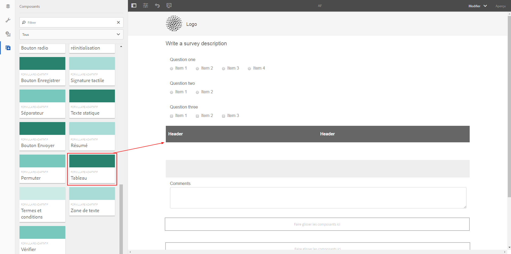
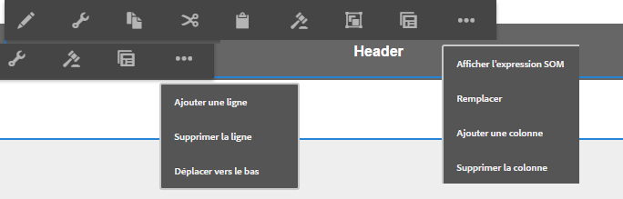
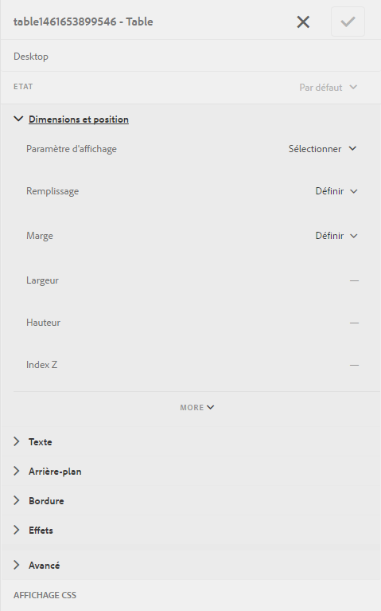
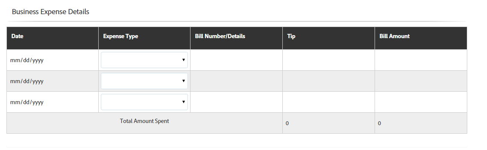
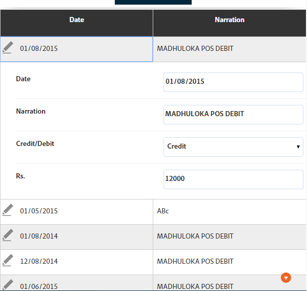
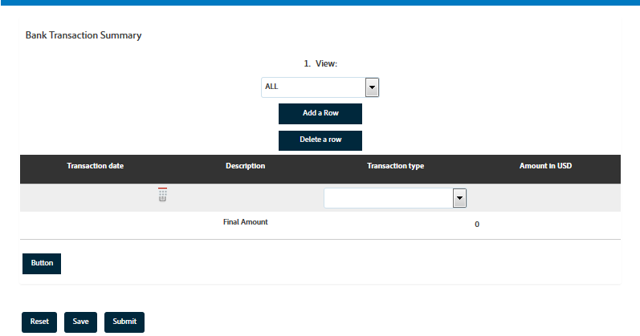

# Tableaux dans les formulaires adaptatifs {#tables-in-adaptive-forms}

>[!CAUTION]
>
>AEM 6.4 a atteint la fin de la prise en charge étendue et cette documentation n’est plus mise à jour. Pour plus d’informations, voir notre [période de support technique](https://helpx.adobe.com/fr/support/programs/eol-matrix.html). Rechercher les versions prises en charge [here](https://experienceleague.adobe.com/docs/?lang=fr).

L’utilisation de tableaux est un moyen efficace, simplifié et organisé de présenter des données complexes. Cela permet aux utilisateurs d’identifier facilement les informations et leur fournit des données organisées sous forme de lignes et de colonnes. La plupart des formulaires des services financiers et des organisations gouvernementales nécessitent des tableaux de données volumineux pour générer des chiffres et effectuer des calculs.

AEM Forms fournit un composant Tableau dans l’explorateur de composants de la barre latérale qui vous permet de créer des tableaux dans les formulaires adaptatifs. Voici quelques-unes des fonctionnalités clés qu’il propose :

* Disposition réactive sur les appareils mobiles
* Lignes et colonnes configurables
* Ajout et suppression dynamiques de lignes à l’exécution
* Combinaison ou fusion et fractionnement de cellules
* Accessibilité par les lecteurs d’écran
* Disposition personnalisée à l’aide de CSS
* Compatible et mappé avec le composant de tableau XDP
* Prise en charge de l’ajout de lignes ou de cellules à l’aide d’éléments complexes de type XSD
* Fusion des données à partir d’un fichier XML

## Création d’un tableau {#create-a-table}

Pour créer un tableau, faites glisser et déposez le composant Tableau à partir de l’explorateur de composants dans le sidekick du formulaire adaptatif. Par défaut, le tableau contient deux colonnes et trois lignes, dont la ligne d’en-tête.



### A propos de l’en-tête et des cellules du corps {#about-header-and-body-cells}

Les cellules d’en-tête sont des champs de texte. Pour modifier le libellé d’un en-tête, cliquez avec le bouton droit de la souris sur la cellule d’en-tête, puis cliquez sur **Modifier**. Dans la boîte de dialogue Modifier, mettez à jour le libellé dans le champ **Valeur** et appuyez sur **OK**.

Les cellules du corps sont par défaut des zones de texte. Vous pouvez remplacer une cellule de corps par tout autre composant de formulaire adaptatif disponible dans le sidekick, tel qu’une zone numérique, un sélecteur de date ou une liste déroulante.

Par exemple, la première rangée du corps du tableau ci-dessous inclut les composants Zone de texte, Sélecteur de dates et Liste déroulante comme cellules.


Vous pouvez fusionner deux cellules du corps ou plus en sélectionnant les cellules que vous souhaitez fusionner, puis en cliquant avec le bouton droit et en choisissant la commande **Fusionner**. Vous pouvez également fractionner une cellule fusionnée en cliquant dessus avec le bouton droit de la souris et en sélectionnant **Fractionner les cellules**.

### Ajout, suppression et déplacement de lignes et de colonnes {#add-delete-move-rows-and-columns}

Vous pouvez ajouter et supprimer une ligne ou une colonne, et déplacer une ligne vers le haut ou vers le bas dans un tableau.

Pour ajouter ou supprimer une ligne ou une colonne ou déplacer une ligne, cliquez sur une cellule dans une ligne ou une colonne. Un menu déroulant s’affiche en haut de la colonne et à gauche de la ligne. Le menu supérieur fournit des options pour ajouter ou supprimer la colonne, tandis que le menu de gauche permet d’ajouter, de supprimer ou de déplacer la ligne.

* L’opération Ajouter ajoute une ligne au-dessous ou une colonne à droite de la ligne ou de la colonne sélectionnée.
* L’opération Supprimer supprime la ligne ou la colonne sélectionnée.
* Les opérations Déplacer vers le haut et Déplacer vers le bas permettent de déplacer la ligne sélectionnée vers le haut et vers le bas.

Le menu déroulant de la ligne fournit également l’opération Modifier pour modifier les propriétés, les paramètres et les options de style de la ligne.



>[!NOTE]
>
>Bien que vous puissiez ajouter un nombre illimité de lignes dans un tableau, le nombre maximal de colonnes que vous pouvez ajouter est de six. En outre, vous ne pouvez pas supprimer la ligne d’en-tête du tableau.

### Définir la largeur d’une colonne pour un tableau {#set-column-width}

Pour définir la largeur des colonnes d’un tableau, procédez comme suit :

1. Dans l’onglet **[!UICONTROL Contenu]**, appuyez sur la touche **[!UICONTROL Tableau]** et appuyez sur l’icône Configure ().

1. Saisissez la liste des valeurs séparées par des virgules dans le champ **[!UICONTROL Largeur de colonne]** pour spécifier la largeur proportionnelle de chaque colonne du tableau. Par exemple, pour un tableau qui comprend 3 colonnes, en spécifiant 2, 4, 6 comme valeurs dans le champ **[!UICONTROL Largeur de colonne]**, la largeur des colonnes est définie sur 2/12 pour la première colonne, 4/12 pour la deuxième colonne et 6/12 pour la troisième. 2/12 comme largeur de la première colonne fait référence à un sixième de la largeur du tableau. De même, 4/12 définit la largeur de la deuxième colonne sur un tiers de celle du tableau et 6/12 définit la largeur de la troisième colonne sur la moitié de celle du tableau.

### Ajout d’une description de tableau {#add-table-description}

Vous pouvez ajouter une description du tableau pour expliquer l’organisation des informations que les lecteurs d’écran peuvent interpréter et lire. Pour ajouter la description :

1. Sélectionnez le tableau, puis appuyez sur  pour afficher ses propriétés dans la barre latérale.
1. Spécifiez le résumé dans l’onglet Accessibilité .
1. Cliquez sur **Terminé**.

## Configuration du style de tableau {#configure}

Vous pouvez définir le style d’un tableau à l’aide du mode Style de la barre d’outils de la page. Effectuez les étapes suivantes pour passer en mode Style et modifier le style du tableau.

1. Dans la barre d’outils de la page, avant l’aperçu, appuyez sur  > **Style**.

1. Dans la barre latérale, sélectionnez le tableau, puis appuyez sur le bouton Modifier .

   Vous pouvez afficher les propriétés de style dans la barre latérale.



>[!NOTE]
>
>Vous pouvez modifier le thème de couleur de l’en-tête et des lignes de corps en modifiant les valeurs des variables LESS. Pour plus d’informations, voir [Thèmes dans AEM Forms](/help/forms/using/themes.md).

## Ajout ou suppression dynamique d’une ligne {#add-or-delete-a-row-dynamically}

Les tableaux fournissent une assistance prête à l’emploi pour l’ajout ou la suppression dynamique de lignes au moment de l’exécution.

1. Sélectionnez une ligne de tableau et appuyez sur .
1. Dans l’onglet Paramètres de répétition , spécifiez les valeurs minimale et maximale pour limiter le nombre de lignes dans le tableau.
1. Cliquez sur **Terminé**.

Au moment de l’exécution, vous verrez **`+`** et *`-`* pour ajouter ou supprimer une rangée.


>[!NOTE]
>
>L’ajout ou la suppression dynamique d’une ligne n’est pas pris en charge dans les en-têtes à gauche de la disposition des tableaux mobiles.

## Expressions dans un tableau {#expressions-in-a-table}

Les tableaux des formulaires adaptatifs vous permettent d’écrire des expressions dans JavaScript pour induire des comportements, comme afficher ou masquer un tableau ou une ligne, additionner tous les nombres et afficher le total dans une cellule, activer ou désactiver une cellule, valider la saisie de l’utilisateur, etc. Ces expressions utilisent des API de modèle de script de formulaires adaptatifs.

Bien que les tableaux et les lignes ne prennent en charge que les expressions de visibilité pour contrôler leur visibilité en fonction de la valeur renvoyée par une expression, les cellules prennent en charge les expressions suivantes :

* **Script d’initialisation :** pour effectuer une action lors de l’initialisation d’un champ.
* **Script de validation de valeur** : pour modifier les composants d’un formulaire après modification de la valeur d’un champ.

>[!NOTE]
>
>Si le script XFA change/exit est également appliqué au même champ, le script XFA change/exit s’exécute avant le script de validation de valeur.

* **Expressions de calcul**: pour calculer automatiquement la valeur d’un champ.
* **Expressions de validation**: pour valider un champ.
* **Expressions d’accès**: pour activer/désactiver un champ.
* **Expression de visibilité** : pour contrôler la visibilité d’un champ et d’un panneau.

L’expression de visibilité d’un tableau ou d’une ligne peut être définie dans l’onglet Propriétés du panneau de la boîte de dialogue Modifier le composant correspondant. Les expressions d’une cellule peuvent être définies dans l’onglet Script de la boîte de dialogue Modifier le composant.

Pour obtenir la liste complète des classes de formulaires adaptatifs, des événements, des objets et des API publiques, voir [Référence de l’API de la bibliothèque JavaScript pour les formulaires adaptatifs](https://helpx.adobe.com/aem-forms/6/javascript-api/index.html).

## Dispositions pour appareils mobiles {#mobile-layouts}

Les tableaux des formulaires adaptatifs offrent une expérience inégalée sur les périphériques mobiles en raison de leurs dispositions fluides et réactives. AEM Forms offre deux types de dispositions de tableaux pour les appareils mobiles - En-têtes à gauche et Colonnes réductibles.

Vous pouvez configurer une disposition de tableau pour appareils mobiles depuis l’onglet Style de la boîte de dialogue Modifier le composant.

### Disposition En-têtes à gauche {#headers-on-left}

Dans la disposition En-têtes à gauche, l’en-tête du tableau est transposé à gauche ; une seule cellule apparaît sur un en-tête. Chaque ligne dans cette disposition s’affiche en tant que partie distincte. Les images suivantes comparent un tableau sur un ordinateur de bureau à celui sur un appareil mobile.


**Figure :** *Vue Bureau d’un tableau avec disposition En-tête à gauche*


**Figure :** *Vue mobile d’un tableau avec disposition En-tête à gauche*

### Disposition Colonnes réductibles {#collapsible-columns-layout}

Dans la mise en page Colonnes réductibles, les colonnes du tableau sont réduites afin d’afficher une ou deux colonnes, selon la taille de l’appareil, tandis que les autres colonnes sont réduites. Vous pouvez cliquer sur l’icône Réduire/Développer pour afficher d’autres colonnes du tableau.

>[!NOTE]
>
>Remarque : Alors que la disposition Colonne réductible est optimisée pour les appareils mobiles, elle fonctionne également sur le bureau, si la largeur disponible est insuffisante pour afficher toutes les colonnes d’un tableau.

Les images suivantes comparent l’aspect d’un tableau affiché sur un périphérique, l’un comportant des colonnes réduites, l’autre les affichant développées.


**Figure :** *Colonnes réduites d’un tableau ne comportant que deux colonnes et apparaissant sur un périphérique mobile*


**Figure :** *Colonne développée d’un tableau sur un périphérique mobile*

## Fusion de données dans un tableau {#merge-data-in-a-table}

Les tableaux des formulaires adaptatifs vous permettent de remplir le tableau au moment de l’exécution à l’aide des données d’un fichier XML. Le fichier XML de données peut se trouver dans le système de fichiers local de l’ordinateur sur lequel le serveur AEM Forms est exécuté ou dans le référentiel CRX.

Prenons l’exemple du tableau récapitulatif de transaction bancaire suivant, que nous voulons renseigner avec des données provenant d’un fichier XML.



Dans cet exemple, la propriété Nom de l’élément pour :

* la ligne est **Row1**
* la cellule de corps sous Date de transaction est **tableItem1**
* La cellule de corps sous Description est **tableItem2**
* la cellule de corps sous Type de transaction est **type**
* la cellule de corps sous Montant en USD est **tableItem3**

Le fichier XML contenant les données au format suivant :

```xml
<?xml version="1.0" encoding="UTF-8"?><afData>
  <afUnboundData>
    <data>
 <typeSelect>0</typeSelect>
 <Row1>
      <tableItem1>2015-01-08</tableItem1>
      <tableItem2>Purchase laptop</tableItem2>
      <type>0</type>
      <tableItem3>12000</tableItem3>
 </Row1>
 <Row1>
      <tableItem1>2015-01-05</tableItem1>
      <tableItem2>Transport expense</tableItem2>
      <type>0</type>
      <tableItem3>120</tableItem3>
 </Row1>
 <Row1>
      <tableItem1>2014-01-08</tableItem1>
      <tableItem2>Laser printer</tableItem2>
      <type>0</type>
      <tableItem3>500</tableItem3>
 </Row1>
 <Row1>
      <tableItem1>2014-12-08</tableItem1>
      <tableItem2>Credit card payment</tableItem2>
      <type>0</type>
      <tableItem3>300</tableItem3>
 </Row1>
 <Row1>
      <tableItem1>2015-01-06</tableItem1>
      <tableItem2>Interest earnings</tableItem2>
      <type>1</type>
      <tableItem3>12000</tableItem3>
 </Row1>
 <Row1>
      <tableItem1>2015-01-05</tableItem1>
      <tableItem2>Payment from a client</tableItem2>
      <type>1</type>
      <tableItem3>500</tableItem3>
 </Row1>
 <Row1>
      <tableItem1>2015-01-08</tableItem1>
      <tableItem2>Food expense</tableItem2>
      <type>0</type>
      <tableItem3>120</tableItem3>
 </Row1>
 </data>
  </afUnboundData>
  <afBoundData>
    <data/>
  </afBoundData>
  <afBoundData/>
</afData>
```

Dans l’exemple XML, les données d’une ligne sont définies par les balises `<Row1>`, qui sont le nom d’élément de la ligne du tableau. Dans la balise `<Row1>`, les données de chaque cellule sont définies dans la balise pour son nom d’élément, notamment `<tableItem1>`, `<tableItem2>`, `<tableItem3>` et `<type>`.

Pour les fusionner dans le tableau au moment de l’exécution, vous devez indiquer le formulaire adaptatif contenant le tableau à l’emplacement XML absolu avec le mode WCM désactivé. Par exemple, si le formulaire adaptatif se trouve à l’adresse *http://localhost:4502/myForms/bankTransaction.html* et le fichier XML de données est enregistré à l’emplacement *C:/myTransactions/bankSummary.xml*, vous pouvez afficher le tableau avec des données à l’adresse URL suivante :

*http://localhost:4502/myForms/bankTransaction.html?dataRef=file:/// C:/myTransactions/bankSummary.xml&amp;wcmmode=disabled*


## Utilisation des composants XDP et des types complexes de schéma XSD {#use-xdp-components-and-xsd-complex-types}

Si vous avez créé un formulaire adaptatif basé sur un modèle de formulaire XFA, les éléments XFA sont disponibles dans l’onglet Modèle de données de l’AEM Content Finder. Vous pouvez faire glisser et déposer ces éléments XFA, y compris les tableaux, dans le formulaire adaptatif.

L’élément de tableau XFA est mappé au composant Tableau et fonctionne de manière prête à l’emploi dans les formulaires adaptatifs. Toutes les propriétés et fonctionnalités du tableau XDP sont conservées lors du déplacement dans le formulaire adaptatif. Vous pouvez y effectuer n’importe quelle opération, comme vous le faites avec le tableau natif du formulaire adaptatif. Par exemple, si une ligne d’un tableau XDP est marquée comme pouvant être répétée, elle sera répétée lorsqu’elle est déposée dans des formulaires adaptatifs.

En outre, vous pouvez faire glisser et déposer le sous-formulaire XDP pour ajouter une nouvelle ligne au tableau. Notez toutefois que déposer un sous-formulaire imbriqué ne fonctionne pas.

>[!NOTE]
>
>Un tableau XDP sans ligne d’en-tête ne sera pas mappé au composant Tableau de formulaire adaptatif. Au lieu de cela, il sera mappé au composant Panneau de formulaire adaptatif avec disposition fluide. En outre, lorsque vous ajoutez un tableau imbriqué XDP à un formulaire adaptatif, le tableau externe est converti en panneau tout en conservant le tableau interne.

En outre, vous pouvez faire glisser et déposer un groupe d’éléments de type complexe XSD pour créer une ligne de tableau. Une nouvelle ligne est créée juste en dessous de la ligne sur laquelle vous avez déposé les éléments. Les cellules créées à l’aide d’éléments de type complexe XSD conservent une référence de liaison au fichier XSD. Vous pouvez également remplacer une cellule de corps par un élément de type complexe XSD en déposant l’élément sur la cellule.

>[!NOTE]
>
>Le nombre d’éléments dans un composant de tableau XDP, un sous-formulaire, ou un type complexe XSD ne peut pas dépasser le nombre de cellules dans une ligne. Par exemple, vous ne pouvez pas déposer quatre éléments sur une ligne qui ne comporte que trois cellules. Cela entraînera une erreur.
>
>Si le nombre d’éléments est inférieur au nombre de cellules d’une rangée, la nouvelle rangée ajoute d’abord les cellules en fonction des éléments, puis les cellules par défaut sont ajoutées pour remplir les cellules restantes de la rangée. Par exemple, si vous déposez un groupe de trois éléments dans une ligne qui comporte quatre cellules, les trois premières cellules sont basées sur les éléments que vous avez déposés et la cellule restante est la cellule de tableau par défaut.

## Considérations principales {#key-considerations}

* Si vous déplacez des lignes vers le haut et vers le bas lors de la création d’un tableau basé sur XSD, une perte de données des lignes du tableau s’affiche dans les données XML générées lors de l’envoi du formulaire.
* Un nom d’élément prédéfini est associé à chaque cellule de corps d’un tableau par défaut. Si vous ajoutez un autre tableau dans le formulaire adaptatif, les cellules de contenu par défaut du nouveau tableau auront le même nom d’élément que dans le premier tableau. Dans ce cas, les données générées lors de l’envoi du formulaire incluent des données dans les cellules de contenu par défaut de l’un des tableaux uniquement. Par conséquent, veillez à renommer les noms d’éléments pour les cellules de contenu par défaut afin de les rendre uniques dans tous les tableaux et d’éviter toute perte de données.

   Notez que cela s’applique uniquement aux cellules de contenu par défaut. Si vous ajoutez d’autres lignes ou colonnes à un tableau, des noms d’éléments uniques seront générés automatiquement pour les cellules de contenu non définies par défaut.
