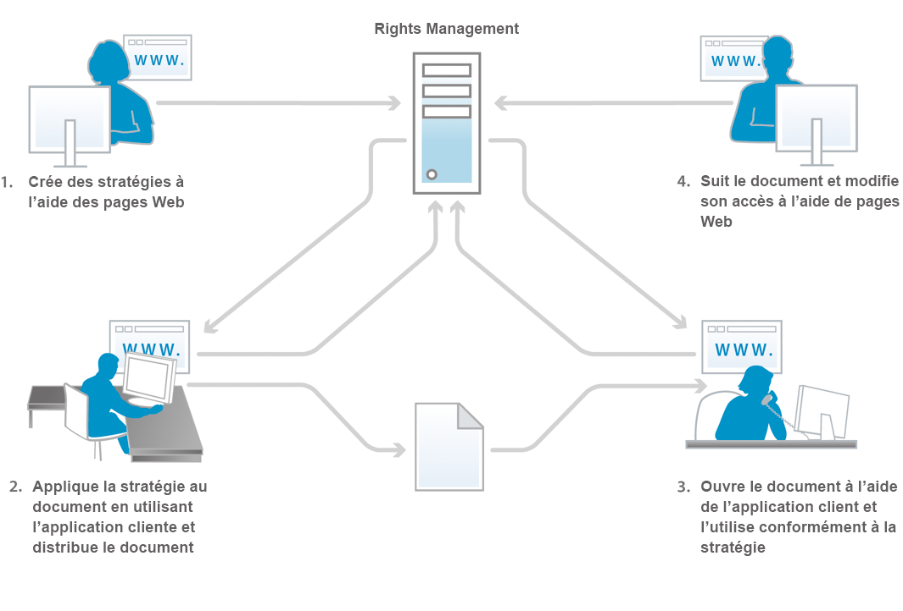
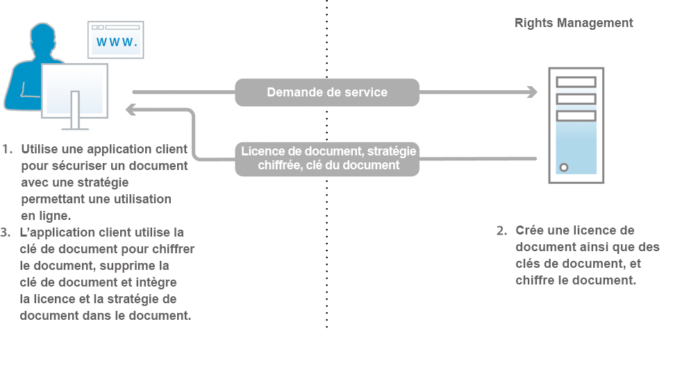
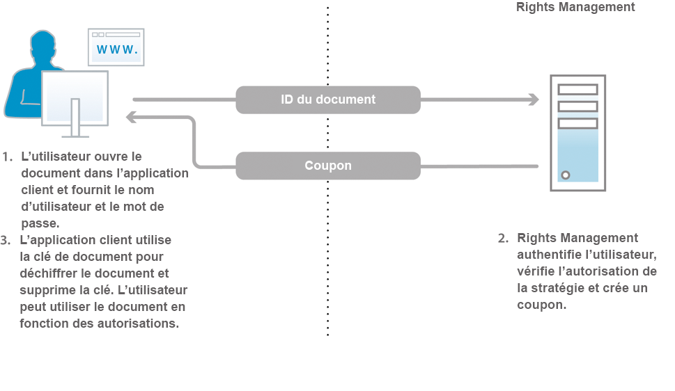

# À propos de Document Security {#about-document-security}

>[!CAUTION]
>
>AEM 6.4 a atteint la fin de la prise en charge étendue et cette documentation n’est plus mise à jour. Pour plus d’informations, voir notre [période de support technique](https://helpx.adobe.com/fr/support/programs/eol-matrix.html). Rechercher les versions prises en charge [here](https://experienceleague.adobe.com/docs/?lang=fr).

Document Security garantit que seuls les utilisateurs autorisés peuvent utiliser vos documents. Document Security vous permet de distribuer en toute sécurité toutes les informations enregistrées dans un format pris en charge. Les formats de fichiers pris en charge sont les suivants :

* Fichiers Adobe PDF
* Fichiers Microsoft® Word, Excel et PowerPoint

Pour plus d’informations sur la façon dont les stratégies protègent les types de fichiers pris en charge, voir [Informations supplémentaires sur Document Security](https://www.adobe.com/go/learn_aemforms_doc_security_63).

Document Security vous permet de créer, de stocker et d’appliquer facilement des paramètres de confidentialité prédéfinis à vos documents. Pour empêcher la diffusion de l&#39;information hors de votre portée, vous pouvez également surveiller et contrôler la manière dont les destinataires utilisent vos documents après leur diffusion.

Vous pouvez protéger des documents à l’aide de stratégies. A *policy* est un ensemble d’informations qui comprend des paramètres de confidentialité et une liste d’utilisateurs autorisés. Les paramètres de confidentialité que vous spécifiez dans une stratégie déterminent comment un destinataire peut utiliser un document auquel vous appliquez la stratégie. Par exemple, vous pouvez spécifier si les destinataires peuvent imprimer ou copier du texte, modifier du texte ou ajouter des signatures et des commentaires à des documents protégés.

Les utilisateurs de Document Security créent des stratégies par le biais des pages Web destinées aux utilisateurs finaux. Les administrateurs utilisent les pages Web de Document Security pour créer des jeux de stratégies contenant des stratégies partagées disponibles pour tous les utilisateurs autorisés.

Bien que les stratégies soient stockées dans Document Security, vous les appliquez aux documents par le biais de votre application cliente. La procédure d’application de stratégies à des documents PDF est présentée en détail dans la section *Aide d’Acrobat*. L’application de stratégies à l’aide d’autres applications, telles que Microsoft Office, est présentée dans la section *Aide sur les extensions d’Acrobat Reader DC* pour l’application.

Lorsque vous appliquez une stratégie à un document, les paramètres de confidentialité spécifiés dans la stratégie protègent les informations contenues dans le document. Les paramètres de confidentialité protègent également tous les fichiers (texte, audio ou vidéo) d’un document de PDF. Vous pouvez distribuer le document protégé par une stratégie aux destinataires autorisés par la stratégie.

**Contrôle d’accès aux documents et audit**

L’utilisation d’une stratégie pour protéger un document vous permet de contrôler en permanence ce document, même après sa distribution. Vous pouvez surveiller le document, apporter des modifications à la stratégie, empêcher les utilisateurs de continuer à accéder au document et changer la stratégie appliquée au document.

Grâce à Document Security, vous pouvez surveiller les documents protégés par une stratégie et effectuer le suivi des événements, par exemple lorsqu’un utilisateur autorisé ou non tente d’ouvrir le document.

**Composants**

Document Security se compose d’un serveur et d’une interface utilisateur :

**Serveur :** Composant central par l’intermédiaire duquel Document Security effectue des transactions telles que l’authentification des utilisateurs, la gestion en temps réel des stratégies et l’application de la confidentialité. Le serveur fournit également un référentiel central pour les stratégies, les enregistrements d’audit et d’autres informations connexes.

**Pages Web :** Interface dans laquelle vous créez des stratégies, gérez vos documents protégés par une stratégie et surveillez les événements associés aux documents protégés par une stratégie. Les administrateurs peuvent également configurer des options globales telles que l’authentification des utilisateurs, le contrôle et la messagerie pour les utilisateurs invités, ainsi que la gestion des comptes d’utilisateurs invités.

Les étapes de l’illustration sont les suivantes :

1. Le propriétaire du document crée des stratégies à l’aide des pages web. Les propriétaires de documents peuvent créer des stratégies personnelles qui ne sont accessibles qu’à eux. Les administrateurs et les coordinateurs de jeux de stratégies peuvent créer des stratégies partagées au sein de jeux de stratégies accessibles aux utilisateurs autorisés.
1. Le propriétaire du document applique la stratégie, puis enregistre et distribue le document. Le document peut être distribué par courrier électronique, via un dossier réseau ou sur un site web.
1. Le destinataire ouvre le document dans l’application cliente appropriée. Le destinataire peut utiliser le document en fonction de sa stratégie.
1. Le propriétaire du document, le coordinateur de jeux de stratégies ou l’administrateur peut effectuer le suivi des documents et modifier l’accès à ces documents à l’aide des pages web.

## À propos des utilisateurs de Document Security {#about-document-security-users}

Plusieurs types d’utilisateurs travaillent avec Document Security pour accomplir différentes tâches :

* L’administrateur système ou une personne d’autres systèmes d’information installe et configure Document Security. Il peut également être chargé de configurer les paramètres globaux pour le serveur, les pages web, les stratégies et les documents.

   Ces paramètres peuvent inclure, par exemple, une URL de base de Document Security, des notifications de contrôle et de confidentialité, des avis d’enregistrement des utilisateurs invités et des périodes d’ouverture hors connexion par défaut.

* Les administrateurs de Document Security créent des stratégies et des jeux de stratégies, et gèrent les documents protégés par une stratégie pour les utilisateurs selon les besoins. Ils créent également des comptes d’utilisateurs invités et surveillent les événements système, document, utilisateur, stratégie, jeu de stratégies et personnalisés. Il peut également être chargé de configurer le serveur global, les paramètres de page Web et de stratégie, conjointement avec un administrateur système.

   Les administrateurs peuvent affecter aux utilisateurs les rôles suivants dans la zone Gestion des utilisateurs d’Administration Console. Les utilisateurs auxquels ces rôles sont affectés effectuent leurs tâches dans la zone de l’interface utilisateur de Document Security d’Administration Console.

   **Super-administrateur de Document Security**

   Les utilisateurs disposant de ce rôle ont accès à tous les paramètres de Document Security dans la console d’administration. Ces autorisations sont associées au rôle :

   * Gestion de la configuration
   * Gestion des stratégies
   * Gestion des jeux de stratégies
   * Gestion des documents
   * Gestion des éditeurs
   * Gestion des utilisateurs invités et locaux
   * Affichage des événements
   * Déléguer
   * Invitation d’utilisateurs externes

   **Administrateur de Document Security**

   Les utilisateurs bénéficiant de ce rôle peuvent configurer le serveur Document Security à l’aide de la page Configuration de la section Document Security de la console d’administration. Cette autorisation est associée au rôle Gérer la configuration.

   >[!NOTE]
   >
   >Les utilisateurs disposant de ce rôle doivent également disposer du rôle Utilisateur dans la console d’administration pour pouvoir se connecter à la console d’administration et modifier les paramètres liés à la configuration.

   **Administrateur de jeu de stratégies Document Security**

   Les utilisateurs bénéficiant de ce rôle peuvent utiliser la section Document Security de la console d’administration pour modifier les stratégies d’autres utilisateurs et créer, modifier et supprimer des jeux de stratégies. Lorsqu’un administrateur de jeux de stratégies crée un jeu de stratégies, il peut y affecter un coordinateur. Ces autorisations sont associées au rôle :

   * Gestion des stratégies
   * Gestion des jeux de stratégies
   * Gestion des documents
   * Gestion des éditeurs
   * Affichage des événements
   * Déléguer

   >[!NOTE]
   >
   >Les utilisateurs disposant de ce rôle doivent également disposer du rôle Utilisateur dans la console d’administration pour pouvoir se connecter à la console d’administration et modifier les paramètres liés à la configuration.

   **Gestion des utilisateurs invités et locaux**

   Les utilisateurs bénéficiant de ce rôle peuvent exécuter les tâches requises pour gérer tous les utilisateurs invités et locaux sur les pages Web Document Security appropriées. Ces autorisations sont associées au rôle :

   * Gestion des utilisateurs invités et locaux
   * Invitation d’utilisateurs externes
   * Accès aux pages web destinées aux utilisateurs finaux

   >[!NOTE]
   >
   >Les utilisateurs disposant de ce rôle doivent également disposer du rôle Utilisateur dans la console d’administration pour pouvoir se connecter à la console d’administration et modifier les paramètres liés à la configuration.

   **Invitation d’un utilisateur de Document Security**

   Les utilisateurs disposant de ce rôle peuvent inviter des utilisateurs. Ces autorisations sont associées au rôle :

   * Invitation d’utilisateurs externes
   * Accès aux pages web destinées aux utilisateurs finaux

   **Utilisateur final de Document Security**

   Les utilisateurs bénéficiant de ce rôle peuvent accéder aux pages Web des utilisateurs finaux de Document Security. Ce rôle peut également être attribué aux administrateurs pour leur permettre de créer des stratégies à l’aide des pages destinées aux utilisateurs finaux. Cette autorisation est associée au rôle Accéder aux pages web des utilisateurs finaux.

* Les utilisateurs de l’entreprise qui disposent de comptes Document Security valides créent leurs propres stratégies, utilisent des stratégies pour protéger les documents, suivre et gérer leurs documents protégés par une stratégie et surveiller les événements liés à leurs documents.
* Les coordinateurs de jeux de stratégies gèrent les documents, affichent les événements et gèrent d’autres coordinateurs de jeux de stratégies (en fonction de leurs autorisations). Les administrateurs désignent des utilisateurs comme coordinateurs de jeux de stratégies pour des jeux de stratégies spécifiques.
* Les utilisateurs externes à votre entreprise (par exemple, un partenaire commercial) peuvent utiliser des documents protégés par une stratégie s’ils se trouvent dans l’annuaire Document Security, si l’administrateur crée un compte pour eux ou s’ils s’enregistrent auprès de Document Security par le biais d’un processus automatisé d’invitation par courrier électronique. Selon la manière dont l’administrateur active les paramètres d’accès, les utilisateurs invités peuvent également être autorisés à appliquer des stratégies à des documents, à créer, modifier et supprimer leurs stratégies et à inviter d’autres utilisateurs externes à utiliser leurs documents protégés par une stratégie.
* Les développeurs utilisent le SDK d’AEM forms pour intégrer des applications personnalisées à Document Security.

Les administrateurs de Document Security peuvent créer des rôles personnalisés à l’aide des autorisations suivantes dans User Management :

* Gestion de la configuration de Document Security
* Gestion des utilisateurs invités et locaux de Document Security
* Gestion des jeux de stratégies Document Security
* Gestion des jeux de stratégies Document Security
* Événements de serveur Document Security
* Modification du propriétaire de la stratégie Document Security

## Stratégies et documents protégés par une stratégie {#policies-and-policy-protected-documents}

A *policy* définit un ensemble de paramètres de confidentialité et d’utilisateurs qui peuvent accéder au document auquel la stratégie est appliquée. Une stratégie permet également de modifier dynamiquement les autorisations d’un document. Il autorise la personne qui sécurise le document à modifier les paramètres de confidentialité pour révoquer l’accès au document ou changer de stratégie.

La protection des stratégies peut être appliquée à un document PDF à l’aide d’Adobe Acrobat® Pro et d’Acrobat Standard. La protection des stratégies peut être appliquée à d’autres types de fichiers, tels que des fichiers Microsoft Word, Excel et PowerPoint, à l’aide de l’application client avec les extensions Acrobat Reader DC appropriées installées.

### Fonctionnement des stratégies {#how-policies-work}

Les stratégies contiennent des informations sur les utilisateurs autorisés et les paramètres de confidentialité à appliquer aux documents. Les utilisateurs peuvent appartenir à n’importe quelle personne de votre entreprise, ainsi qu’aux personnes externes à votre entreprise disposant d’un compte. Si l’administrateur active la fonction d’invitation d’utilisateur, il est même possible d’ajouter de nouveaux utilisateurs aux stratégies, lançant ainsi un processus de courrier électronique d’invitation à l’enregistrement.

Les paramètres de confidentialité d’une stratégie déterminent la manière dont les destinataires peuvent utiliser le document. Par exemple, vous pouvez spécifier si les destinataires peuvent imprimer ou copier du texte, apporter des modifications ou ajouter des signatures et des commentaires aux documents protégés. La même stratégie peut également spécifier différents paramètres de confidentialité pour des utilisateurs spécifiques.

>[!NOTE]
>
>Les paramètres de confidentialité appliqués par le biais d’une stratégie remplacent les paramètres qui peuvent avoir été appliqués à un document de PDF dans Acrobat à l’aide des options de mot de passe ou de certificat. (Voir l’aide d’Acrobat pour plus d’informations.)

Les utilisateurs et les administrateurs créent des stratégies par le biais des pages Web de Document Security. Une seule stratégie à la fois peut être appliquée à un document. Vous pouvez appliquer une stratégie à l’aide de l’une des méthodes suivantes :

* Ouvrez le document dans Acrobat ou dans une autre application cliente et sélectionnez une stratégie pour protéger le document.
* Envoyez un document en tant que pièce jointe d’un courrier électronique dans Microsoft Outlook. Dans ce cas, vous pouvez sélectionner une stratégie dans une liste de stratégies ou sélectionner une stratégie générée automatiquement et créée par Acrobat avec un ensemble de paramètres de confidentialité par défaut afin de ne protéger le document que pour les destinataires du courrier électronique.

Une stratégie peut être supprimée d’un document à l’aide de l’application cliente.

Les étapes du diagramme sont les suivantes :

1. Le propriétaire du document sécurise le document à partir d’une application cliente prise en charge avec une stratégie permettant une utilisation en ligne.
1. Document Security crée une licence de document et des clés de document, puis chiffre la stratégie. La licence de document, la stratégie chiffrée et la clé de document sont renvoyées à l’application cliente.
1. Le document est chiffré à l’aide de la clé de document et la clé de document est ignorée. Le document intègre désormais la licence et la stratégie. Ces tâches sont effectuées dans l’application cliente prise en charge.

Lorsque vous appliquez une stratégie à un document, les informations qu’il contient, y compris les fichiers contenus (texte, audio ou vidéo) dans les documents du PDF, sont protégées par les paramètres de confidentialité spécifiés dans la stratégie. Document Security génère une licence et des informations de chiffrement qui sont alors intégrées au document. Lorsque vous distribuez le document, Document Security peut authentifier les destinataires qui tentent d’ouvrir le document et autoriser l’accès en fonction des privilèges spécifiés dans la stratégie.

Si l’utilisation hors ligne est activée, les destinataires peuvent également utiliser hors ligne (sans connexion principale à Internet ou réseau) des documents protégés par une stratégie pendant la période spécifiée dans la stratégie.

### Fonctionnement des documents protégés par une stratégie {#how-policy-protected-documents-work}

Pour ouvrir et utiliser des documents protégés par une stratégie, celle-ci doit inclure votre nom en tant que destinataire et vous devez disposer d’un compte Document Security valide. Pour les documents PDF, vous avez besoin d’Acrobat ou d’Adobe Reader®. Pour les autres types de fichiers, vous avez besoin de l’application appropriée pour le fichier avec les extensions Acrobat Reader DC installées.

Lorsque vous tentez d’ouvrir un document protégé par une stratégie, Acrobat, Adobe Reader ou les extensions Acrobat Reader DC se connectent à Document Security pour vous authentifier. Vous pouvez ensuite vous connecter. Si l’utilisation du document fait l’objet d’un audit, un message de notification s’affiche. Une fois que Document Security a déterminé les autorisations à accorder, il gère le décryptage du document. Vous pouvez ensuite utiliser le document en fonction des paramètres de confidentialité de la stratégie.

Les étapes du diagramme sont les suivantes :

1. L’utilisateur du document ouvre le document dans une application cliente prise en charge et s’authentifie auprès du serveur. L’identifiant du document est envoyé au serveur Document Security.
1. Document Security authentifie les utilisateurs, vérifie les autorisations de la stratégie et crée un bon. Le bon (qui contient la clé de document et les autorisations) est renvoyé à l’application cliente.
1. Le document est déchiffré à l’aide de la clé de document et celle-ci est ignorée. Le document peut ensuite être utilisé conformément aux paramètres de confidentialité de la stratégie. Ces tâches sont effectuées dans l’application cliente prise en charge.

Vous pouvez continuer à utiliser un document dans les conditions suivantes :

* Indéfiniment ou pour la période de validité spécifiée dans la stratégie
* jusqu’à ce que l’administrateur ou la personne ayant appliqué la stratégie révoque l’accès au document ou modifie la stratégie.

Vous pouvez également utiliser hors connexion des documents protégés par une stratégie (sans connexion Internet ou réseau) si la stratégie autorise l’accès hors connexion. Vous devez d’abord vous connecter à Document Security pour synchroniser le document. Vous pouvez ensuite utiliser le document pour la durée de la période d’ouverture hors connexion spécifiée dans la stratégie.

Lorsque la période d’ouverture hors connexion se termine, vous devez resynchroniser le document avec Document Security, soit en le mettant en ligne et en ouvrant un document protégé par une stratégie, soit en utilisant une commande dans l’application cliente. (Voir *Aide d’Acrobat* ou le *Aide sur les extensions d’Acrobat Reader DC* pour plus d’informations.)

Si vous enregistrez une copie d’un document protégé par une stratégie à l’aide de la commande de menu Enregistrer ou Enregistrer sous , la stratégie est automatiquement appliquée au nouveau document. Les événements tels que les tentatives d’ouverture du nouveau document sont également contrôlés et enregistrés pour le document d’origine.

## Jeux de stratégies {#policy-sets}

*Jeux de stratégies* sont utilisées pour regrouper un ensemble de stratégies ayant un objectif commercial commun. Ces jeux de stratégies sont ensuite mis à la disposition d’un sous-ensemble d’utilisateurs du système.

Chaque jeu de stratégies peut être associé à un ou plusieurs coordinateurs de jeux de stratégies. Le coordinateur de jeux de stratégies est un administrateur ou un utilisateur disposant d’autorisations supplémentaires. Le *coordinateur de jeux de stratégies* est généralement un spécialiste de l’organisation qui peut créer au mieux les stratégies d’un jeu particulier de stratégies.

Les coordinateurs de jeux de stratégies peuvent effectuer les tâches suivantes :

* Création de stratégies
* Modifier et supprimer une stratégie dans le jeu de stratégies
* Modification des paramètres d’un jeu de stratégies
* Ajouter et supprimer des coordinateurs de jeux de stratégies
* Affichage des événements de stratégie et de document pour n’importe quel document ou stratégie du jeu de stratégies
* Révoquer l’accès aux documents
* Changement de stratégies pour le document.

Les jeux de stratégies sont créés et supprimés dans les pages Web d’administration de Document Security par les administrateurs et les coordinateurs de jeux de stratégies autorisés à le faire.

Les jeux de stratégies sont généralement mis à la disposition d’un nombre limité d’utilisateurs en spécifiant quels utilisateurs ou groupes d’un domaine peuvent utiliser les stratégies du jeu de stratégies pour protéger les documents.

Lorsque Document Security est installé, un jeu de stratégies par défaut est créé, appelé *Jeu de stratégies global*. L’administrateur qui a installé le logiciel gère ce jeu de stratégies.
