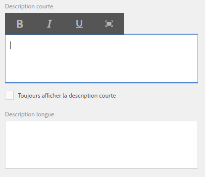
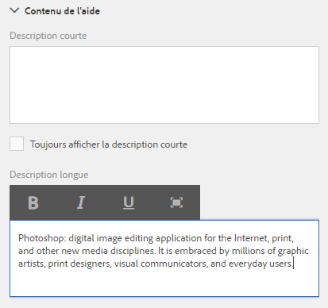
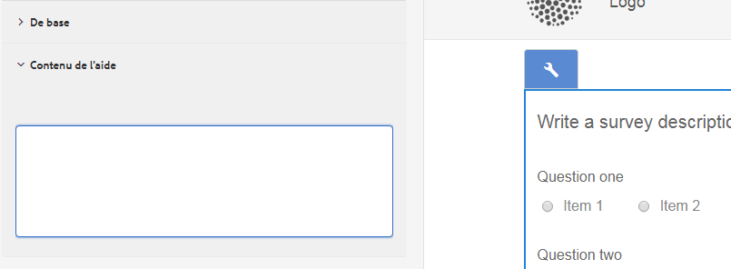
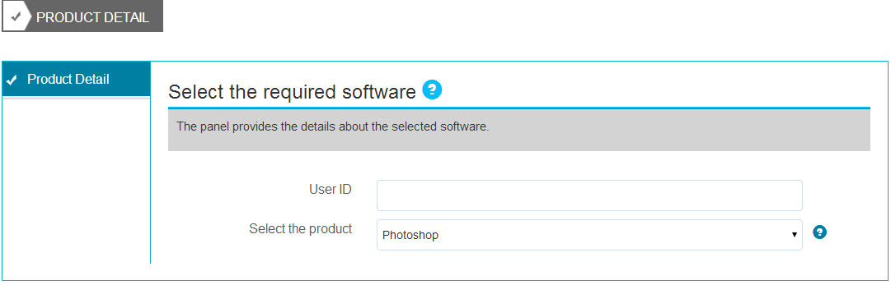

# Création d’une aide contextuelle pour les champs de formulaire {#authoring-in-context-help-for-form-fields}

>[!CAUTION]
>
>AEM 6.4 a atteint la fin de la prise en charge étendue et cette documentation n’est plus mise à jour. Pour plus d’informations, voir notre [période de support technique](https://helpx.adobe.com/fr/support/programs/eol-matrix.html). Rechercher les versions prises en charge [here](https://experienceleague.adobe.com/docs/?lang=fr).

## Présentation {#introduction}

Dans certains cas, les utilisateurs finaux qui remplissent un formulaire ne sont pas toujours sûrs des informations qu’ils doivent indiquer dans un champ spécifique. Pour résoudre ces problèmes, les formulaires adaptatifs prennent en charge l’ajout de texte ou d’une aide contextuelle enrichie à un champ de formulaire. Cela permet d’améliorer l’expérience de remplissage du formulaire et d’éviter toute ambiguïté pour les utilisateurs finaux.

Cet article explique comment les auteurs de formulaires peuvent ajouter une aide contextuelle lors de la création d’un Forms adaptatif.

## Ajout d’une aide contextuelle {#add-in-context-help}

Vous pouvez spécifier une aide contextuelle à l’aide des options suivantes dans la section Contenu de l’aide de l’onglet Propriétés de la barre latérale.

* [Description courte](/help/forms/using/authoring-in-field-help.md#p-short-description-p)
* [Description longue](/help/forms/using/authoring-in-field-help.md#p-long-description-p)

>[!NOTE]
>
>La description longue remplace la description courte. Si vous avez spécifié les deux, seule la description longue s’affiche.

### Description courte {#short-description}

Le champ Description courte permet de fournir des conseils rapides et courts sur le remplissage d’un champ de formulaire. Le texte spécifié dans le champ Description courte s’affiche sous forme d’info-bulle lorsque vous placez le pointeur de la souris sur le champ.

>[!NOTE]
>
>Sélectionnez **Toujours afficher la description courte** pour afficher en permanence le texte de l’aide sous le champ.

### Description longue {#long-description}

Vous pouvez utiliser le champ Description longue pour saisir un texte long ou incorporer du contenu multimédia enrichi, dont des vidéos, pour apporter une aide contextuelle. Par exemple, l’illustration ci-dessous montre comment incorporer une vidéo pour apporter une aide contextuelle.

L’ajout d’une description longue affiche une **?** en regard du champ. Cliquez sur l’icône pour afficher le contenu ajouté à la section Description longue.

### Aide au niveau d’un panneau {#panel-level-help}

Outre l’aide contextuelle pour les champs de formulaire, vous pouvez spécifier une aide au niveau d’un panneau sous l’onglet Contenu de l’aide du panneau Modifier.

L’ajout d’une aide pour le panneau affiche une **?** en regard de la description du panneau. Cliquez sur l’icône pour afficher le contenu ajouté à la section Contenu de l’aide de la boîte de dialogue de modification du panneau.

