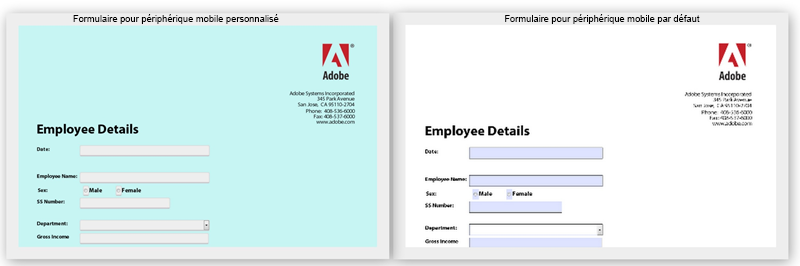

# Modification des styles par défaut des formulaires HTML5  {#changing-default-styles-of-html-forms}

Les formulaires HTML5 sont rendu utilisant des fonctionnalités HTML5 et le style du formulaire rendu est fait utilisant CSS. L’apparence par défaut des formulaires HTML5 est similaire à son rendu PDF. Les développeurs peuvent utiliser des CSS personnalisés pour modifier l’apparence par défaut des formulaires HTML5.

Cet article fournit des informations détaillées sur la modification du style d’un formulaire HTML5 et [Introduction aux styles](/help/forms/using/css-styles.md) l’article contient des informations détaillées sur divers aspects de style des formulaires HTML5. Assurez-vous de lire l’article Introduction aux styles avant d’exécuter les étapes mentionnées dans cet article.

Les deux images qui suivent montrent la différence entre les styles par défaut et les styles personnalisés.

## Donner du style à vos formulaires {#style-your-forms}

1. **Sélectionner un profil auquel ajouter des styles personnalisés**

   Accédez à l’interface CRX DE à l’adresse URL : **https://&lt;serveur>:&lt;port>/crx/de** et créez un profil ou choisissez un profil existant. Pour savoir comment créer un profil, voir [Création d’un nouveau Profil](/help/forms/using/custom-profile.md).

1. **Création d’une feuille de style CSS pour modifier le style des formulaires HTML5**

   Naviguez jusqu’au dossier dans lequel vous avez créé le rendu du profil et créez un fichier de feuille de style CSS. Les étapes à suivre sont :

   1. Cliquez avec le bouton droit sur le dossier et sélectionnez **Créer**-> **Créer un fichier** à partir du menu
   Pour savoir quelles classes CSS il convient de créer pour un composant particulier de vos formulaires HTML5, consultez [Introduction aux styles](/help/forms/using/css-styles.md).

1. **Inclusion de la feuille de style dans le rendu de profil**

   Ouvrez la page de rendu du profil (fichier jsp) dans CRX DE et ajoutez le fichier CSS à la page juste en dessous de la bibliothèque du client XFA. Effectuez les étapes suivantes pour inclure le fichier CSS dans le profil.

   1. Recherchez la ligne suivante dans la page du rendu :

      &lt;cq:includeClientLib categories=&quot;xfaforms.profile&quot; />

   1. Insérez les éléments suivants sous la ligne ci-dessus pour inclure la feuille de style :

      &lt;link href=&quot;/path/to/stylesheet&quot; rel=&quot;stylesheet&quot; type=&quot;text/css&quot;/>

   1. Enregistrez le fichier .

