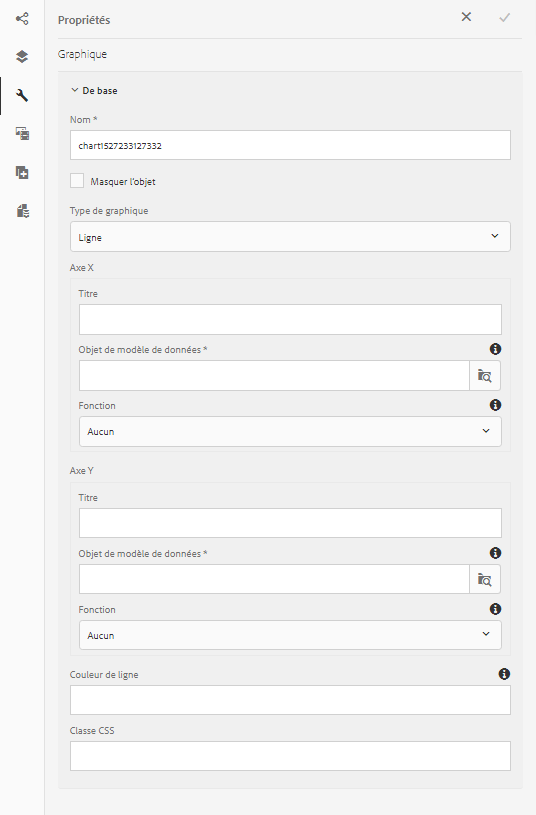
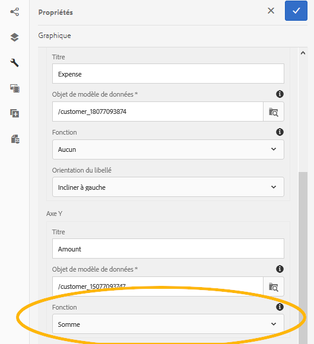

# Utilisation de graphiques dans les communications interactives {#using-charts-in-interactive-communications}

>[!CAUTION]
>
>AEM 6.4 a atteint la fin de la prise en charge étendue et cette documentation n’est plus mise à jour. Pour plus d’informations, voir notre [période de support technique](https://helpx.adobe.com/fr/support/programs/eol-matrix.html). Rechercher les versions prises en charge [here](https://experienceleague.adobe.com/docs/?lang=fr).

À l’aide de graphiques dans une communication interactive, vous pouvez condenser de grandes quantités d’informations dans un format visuel facile à analyser et à comprendre.

Un graphique ou un graphique est une représentation visuelle des données. Il condense de grandes quantités d’informations dans un format visuel facile à comprendre, ce qui permet aux destinataires de la communication interactive de mieux visualiser, interpréter et analyser les données complexes.

Lors de la création d’une communication interactive, vous pouvez ajouter des graphiques pour représenter visuellement des données bidimensionnelles à partir du modèle de données de formulaire de la communication interactive. Le composant Graphique vous permet d’ajouter et de configurer les types de graphiques suivants :

* Diagramme circulaire
* Colonnes
* Anneau
* Barre (canal web uniquement)
* Line
* Ligne et point
* Point
* Domaine

## Ajouter et configurer un graphique dans une communication interactive {#add-and-configure-chart-in-an-interactive-communication}

Effectuez les étapes suivantes pour ajouter un graphique à une communication interactive :

1. Dans la barre latérale Composants de l’AEM, faites glisser et déposez le composant Graphique dans l’un des canaux d’impression ou web suivants d’une communication interactive :

   * Canal d’impression : Zone cible et champ image
   * Canal web : Zone de panneau et cible

   Le composant Graphique déposé crée un espace réservé pour un graphique.

1. Appuyez sur le composant de graphique dans l’éditeur de communication interactive et, dans la barre d’outils Composant , sélectionnez **[!UICONTROL Configurer (]** ).

   La barre latérale Propriétés s’affiche avec les propriétés de base du graphique ciblées.

   
   **Figure :** *Propriétés de base d’un graphique de type ligne dans le canal d’impression*

   
   **Figure :** *Propriétés de base d’un graphique de type ligne dans un canal web*

1. Configurez les propriétés de base du graphique pour le canal d’impression et le canal web. Outre les propriétés communes, il existe des propriétés spécifiques au canal d’impression et web et au type de graphique.

   * **[!UICONTROL Nom]**: Nom de l’objet graphique. Le nom du graphique que vous indiquez ici n’apparaît pas dans la sortie du graphique, mais il est utilisé dans les règles pour faire référence au graphique.
   * **[!UICONTROL Type de graphique]**: Spécifiez le type de graphique : Circulaire, Colonne, Anneau, Ligne, Ligne et point, Point ou Zone.
   * **[!UICONTROL Masquer l’objet]**: Sélectionnez cette option pour masquer le graphique dans la sortie finale.
   * Spécifiez les éléments suivants pour **[!UICONTROL axe x]** et **[!UICONTROL axe y]**:

      * **[!UICONTROL Titre]**: Indiquez les titres des axes X et Y à afficher dans la communication interactive.
      * **[!UICONTROL Objet de modèle de données *]**: Recherchez et sélectionnez des objets de modèle de données pour les axes X et Y du graphique à partir du modèle de données de formulaire spécifié lors de la création de la communication interactive. Choisissez deux propriétés de type collection/tableau du même objet de modèle de données parent qui ont un sens l’une par rapport à l’autre pour tracer les axes X et Y d’un graphique.
      * **[!UICONTROL Fonction]**: Pour utiliser des fonctions statistiques afin de calculer les valeurs sur l’axe, sélectionnez la fonction pour l’axe X/Y. Pour plus d’informations sur les fonctions, voir [Utilisation des fonctions dans le graphique](#usefunction) et [Exemple 2 : Application des fonctions de somme et de moyenne dans un graphique en courbes](#applicationsumfrequency).

   >[!NOTE]
   >
   >Pour le canal d’impression, sur l’axe X, l’objet de modèle de données que vous liez doit être de type Nombre, Chaîne ou Date. Sur l’axe Y, l’objet de modèle de données que vous liez doit être de type Nombre. Il est recommandé d’utiliser la légende de droite dans le canal d’impression.

   Pour plus d’informations sur les propriétés de graphique, voir [Propriétés de base des graphiques](#basicpropertiescharts).

1. (Canal d’impression uniquement) Dans Paramètres de l’agent, indiquez s’il est obligatoire que l’agent utilise ce graphique. Si i **[!UICONTROL Il est obligatoire que l’agent utilise ce graphique]** n’est pas sélectionnée, l’agent peut appuyer sur l’icône représentant un oeil pour le graphique dans l’onglet Contenu de l’interface utilisateur de l’agent pour afficher/masquer le graphique.

   

1. Dans la barre latérale Propriétés, appuyez sur .

   Aperçu pour visualiser l’aspect et les données du graphique. Revenez à la configuration des propriétés du graphique, si nécessaire.

1. Revenez à la communication interactive pour apporter d’autres modifications.

## Exemple 1 : sortie du graphique sur papier et sur le web {#chartoutputprintweb}

Dans l’onglet De base, vous définissez le type de graphique, les propriétés du modèle de données de formulaire source qui contiennent des données, les libellés à tracer sur l’axe X et l’axe Y du graphique, et éventuellement la fonction statistique pour calculer les valeurs à mapper sur le graphique.

Examinons en détail les informations minimales requises dans les propriétés de base, à l’aide d’un relevé de carte de crédit généré à l’aide d’une communication interactive. Supposons que vous souhaitiez générer un graphique afin de représenter le montant des différentes dépenses dans le relevé. Vous souhaitez utiliser différents types de graphiques pour l’impression et la sortie web de la communication interactive.

Pour ce faire, vous devez indiquer les informations suivantes :

* **[!UICONTROL Type de graphique]** - dans cet exemple, Colonne pour le canal d’impression et Anneau pour le canal web
* **[!UICONTROL Objets de modèle de données]** comme source des axes X et Y du graphique : dans cet exemple, Montant de transaction pour l’axe X et Nom de dépense pour l’axe Y
* **[!UICONTROL Titre]** pour les axes X et Y (pour le graphique de type Colonne dans le canal d’impression uniquement dans cet exemple) : dans cet exemple, Montant ($) pour l’axe X et Dépenses pour l’axe Y.
* **[!UICONTROL Orientation du libellé]** (pour le graphique de type Colonne dans le canal d’impression uniquement dans cet exemple) - dans cet exemple `Tilt Left`

* **[!UICONTROL Info-bulle]** afficher au survol d’une dépense (canal web uniquement) - dans cet exemple `${x}: $ ${y}`, qui s’affiche sous la forme `[Expense Label: $ Amount]` (Exemple : Theme Park Visit : 315 $)


**Figure :** *Graphique à colonnes dans la sortie imprimée d’une communication interactive*

**A.** Axe Y : quantité récupérée à partir de la propriété de modèle de données de formulaire et propriété Titre définie sur Montant ($) **B.** Orientation du libellé de l’axe X définie sur Incliner à gauche **C.** Axe X : description des dépenses récupérée à partir de la propriété de modèle de données de formulaire et propriété Titre définie sur Dépense.


**Figure :** *Graphique en anneau dans la sortie web d’une communication interactive*

**A.** La propriété Rayon interne de l’anneau est définie. **B.** La propriété Afficher la légende est sélectionnée et la propriété Position de la légende est définie sur Droite. **C.** L’info-bulle affiche le détail de l’élément au survol. L’info-bulle est définie sur ${x} : $ $ ${y}

## Exemple 2 : application des fonctions Somme et Fréquence dans un graphique en ligne {#applicationsumfrequency}

L’application de fonctions dans un graphique vous permet de tracer des données qui ne sont pas directement fournies par le modèle de données de formulaire. Ici, nous utilisons un exemple de relevé de carte de crédit pour comprendre comment les fonctions Somme et Fréquence peuvent être appliquées au graphique.


**Figure :** *Graphique en courbes sans fonction avec trois transactions &quot;Bed and Breakfast&quot;*

### Sum, fonction {#sum-function}

Vous pouvez appliquer la fonction sum pour additionner les valeurs de plusieurs instances d’une même propriété de données et ne l’afficher qu’une seule fois. Par exemple, dans le graphique suivant, la fonction Somme est appliquée sur l’axe Y pour additionner le montant des trois transactions Bed and Breakfast (99,45 $, 78 $ et 12 $) et n’afficher qu’une seule transaction (189,45 $).

La fonction Somme peut rendre le graphique plus utile si vous souhaitez assembler et afficher la somme de plusieurs instances de la même propriété Data.


### Fonction Fréquence {#frequency-function}

La fonction Fréquence renvoie le nombre de valeurs sur l’axe X ou Y pour une même valeur sur l’autre axe. Avec l’application de la fonction Fréquence sur l’axe Y (Amount/TransAmount), le graphique affiche trois occurrences des transactions Bed and Breakfast et une occurrence du reste des types de transactions.


## Propriétés de base des graphiques {#basicpropertiescharts}

Dans l’onglet De base , vous pouvez configurer les propriétés suivantes :

**Nom** Identifiant de l’élément de graphique. Le nom n’est pas visible sur le graphique, mais il est utile lors de la référence à l’élément à partir d’autres composants, scripts et expressions SOM.

**Titre (canal d’impression uniquement)** Indique le titre du graphique.

**Type de graphique** Indique le type de graphique à générer. Les options disponibles sont Circulaire, Colonne, Anneau, Barre (canal web uniquement), Ligne, Ligne et point, Point et Zone. Pour plus d’informations, voir Exemple 1 : Sortie du graphique sur papier et sur le web.

**Axe X > Titre** Spécifie le titre de l’axe X.

**Axe X > Objet de modèle de données &amp;ast;** Indiquez le nom de l’élément de collecte de modèle de données de formulaire à tracer sur l’axe X.

**Axe X > Fonction** Spécifie la fonction statistique/personnalisée à utiliser pour calculer les valeurs sur l’axe X. Pour plus d’informations sur les fonctions, voir Utilisation des fonctions dans le graphique et Exemple 2 : Application des fonctions de somme et de moyenne dans un graphique en courbes.

**Axe X > Orientation du libellé** Orientation du libellé sur le graphique dans le canal d’impression. Si vous choisissez la direction du libellé comme Rotation personnalisée, le champ Angle de rotation personnalisée (degrés) s’affiche. Dans le champ Angle de rotation personnalisé (degrés) , vous pouvez choisir l’angle de rotation par étapes de 15 degrés.

**Axe Y > Titre** Spécifie le titre de l’axe Y.

**Axe Y > Objet de modèle de données &amp;ast;** Spécifie l’élément de collecte de modèle de données de formulaire à tracer sur l’axe Y. Dans le canal d’impression, l’objet de modèle de données de l’axe Y doit être de type Nombre.

**Axe Y > Fonction** Spécifie la fonction statistique/personnalisée à utiliser pour calculer les valeurs sur l’axe Y. Pour plus d’informations sur les fonctions, voir Utilisation des fonctions dans le graphique et Exemple 2 : Application des fonctions de somme et de moyenne dans un graphique en courbes.

**Afficher la légende** Affiche une légende pour le graphique circulaire ou en anneau lorsqu’il est activé.

**Position de la légende** Spécifie la position de la légende par rapport au graphique. Les options disponibles sont Droite, Gauche, Haut et Bas.

**Hauteur (canal d’impression uniquement)** Hauteur du graphique en pixels.

**Largeur (canal d’impression uniquement)** Largeur du graphique en pixels.

>[!NOTE]
>
>Vous pouvez contrôler la largeur du graphique dans le canal web à l’aide du calque de style ou en appliquant un thème.

**Info-bulle (canal web uniquement)** Indique le format dans lequel l’info-bulle s’affiche lorsque vous pointez sur un point de données dans le graphique du canal web. La valeur par défaut est \${x}(\${y}). Selon le type de graphique, lorsque vous pointez la souris sur un point, une barre ou une tranche dans le graphique, les variables \${x} et \${y} sont remplacées dynamiquement par les valeurs correspondantes sur l’axe X et l’axe Y et elles s’affichent dans l’info-bulle.

Pour désactiver l’info-bulle, laissez le champ Info-bulle vide. Cette option ne s’applique pas aux graphiques en ligne ni en points. Par exemple, consultez [Exemple 1 : sortie du graphique sur papier et sur le Web](#chartoutputprintweb).

**Classe CSS (canal web uniquement)** Indiquez le nom d’une classe CSS dans le champ de classe CSS pour appliquer un style personnalisé au graphique.

**Saut de page obligatoire avant (canal d’impression uniquement)** Sélectionnez cette option pour ajouter un saut de page obligatoire avant le graphique, puis placez le graphique en haut d’une nouvelle page.

**Saut de page obligatoire après (canal d’impression uniquement)** Sélectionnez cette option pour ajouter un saut de page obligatoire après le graphique, puis placez le contenu suivant le graphique en haut d’une nouvelle page.

**Retrait (canal d’impression uniquement)** Spécifiez la mise en retrait du graphique à gauche de la page.

**Configurations spécifiques au graphique** Outre les configurations courantes, la configuration spécifique au graphique suivante est disponible :

* **Rayon interne**: disponibles pour les graphiques en anneau pour spécifier le rayon (en pixels) du cercle intérieur du graphique.
* **Couleur de ligne**: disponibles pour les graphiques en courbes, en lignes et en points, ainsi que les diagrammes de surface, afin de spécifier la valeur hexadécimale de la couleur de la ligne dans le graphique.
* **Couleur du point**: disponibles pour les graphiques Point et Ligne et Point pour spécifier la valeur hexadécimale de la couleur pour les points du graphique.

* **Couleur de la zone**: disponible pour les graphiques à aires pour spécifier la valeur hexadécimale de la couleur pour la zone située sous la ligne du graphique.

## Utilisation des fonctions dans le graphique {#usefunction}

Vous pouvez configurer un graphique pour qu’il utilise des fonctions statistiques afin de calculer des valeurs à partir des données source pour un graphique sur le graphique. L’application de fonctions dans un graphique vous permet de tracer des données qui ne sont pas directement fournies par le modèle de données de formulaire.

Bien que le composant de graphique soit fourni avec certaines fonctions intégrées, vous pouvez créer vos propres fonctions et les rendre disponibles pour une utilisation dans la configuration de graphique dans le canal web.



>[!NOTE]
>
>Vous pouvez utiliser des fonctions pour calculer les valeurs de l’axe X ou de l’axe Y dans un graphique.

### Fonctions par défaut {#default-functions}

Les fonctions suivantes sont disponibles par défaut avec le composant de graphique :

**Moyenne** renvoie la moyenne des valeurs sur l’axe X ou Y pour une même valeur sur l’autre axe.

**Somme** renvoie la somme de toutes les valeurs sur l’axe X ou Y pour une même valeur sur l’autre axe.

**Maximum** renvoie le nombre maximal de valeurs sur l’axe X ou Y pour une même valeur sur l’autre axe.

**Fréquence** renvoie le nombre de valeurs sur l’axe X ou Y pour une même valeur sur l’autre axe.

**Plage** renvoie la différence entre le nombre maximal et minimal des valeurs sur l’axe X ou Y pour une même valeur sur l’autre axe.

**Médian** renvoie la valeur qui sépare les valeurs les plus élevées et les valeurs les plus basses de la moitié sur l’axe X ou Y pour une même valeur sur l’autre axe.

**Minimum** renvoie le nombre minimal de valeurs sur l’axe X ou Y pour une même valeur sur l’autre axe.

**Mode** renvoie la valeur avec le plus d’occurrences sur l’axe X ou Y pour une même valeur sur l’autre axe

### Fonctions personnalisées dans le canal web {#custom-functions-in-web-channel}

Outre l’utilisation des fonctions par défaut dans les graphiques, vous pouvez créer des fonctions personnalisées dans JavaScript™ et les rendre disponibles dans la liste des fonctions du composant de graphique pour le canal web.

Une fonction prend un tableau ou des valeurs et un nom de catégorie comme entrées et renvoie une valeur. Par exemple :

```
Multiply(valueArray, category) {
 var val = 1;
 _.each(valueArray, function(value) {
 val = val * value;
 });
 return val;
}
```

Une fois que vous avez rédigé une fonction personnalisée, procédez comme suit pour la rendre disponible pour une utilisation dans la configuration du graphique :

1. Ajoutez la fonction personnalisée dans la bibliothèque cliente associée à la communication interactive appropriée. Pour plus d’informations, consultez les sections [Configurer l’action d’envoi](/help/forms/using/configuring-submit-actions.md) et [Utiliser les bibliothèques côté client](/help/sites-developing/clientlibs.md).

1. Pour afficher la fonction personnalisée dans le menu déroulant Fonction dans CRXDe Lite, créez un nœud `nt:unstructured` dans le dossier d’applications avec les propriétés suivantes :

   * Ajoutez la propriété `guideComponentType` avec une valeur définie sur `fd/af/reducer`. (mandatory)
   * Ajoutez la propriété `value` à un nom complet de la fonction JavaScript™ personnalisée. (obligatoire) et définissez sa valeur sur le nom de la fonction personnalisée, telle que Multiplier.
   * Ajoutez la propriété `jcr:description` avec la valeur que vous souhaitez afficher comme nom de la fonction personnalisée apparaissant dans le menu déroulant Fonction. Par exemple, **Multiplier**. 
   * Ajoutez la propriété `qtip` avec une valeur représentant une brève description de la fonction personnalisée. Elle s’affiche sous forme d’info-bulle lorsque le curseur est placé sur le nom de la **fonction** dans la liste déroulante.

1. Cliquez sur **Enregistrer tout** pour enregistrer la configuration.

La fonction peut désormais être utilisée dans le graphique.
