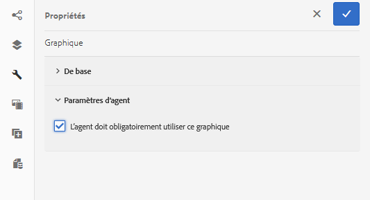

# Utilisation de graphiques dans les communications interactives {#using-charts-in-interactive-communications}

En utilisant des graphiques dans une communication interactive, vous pouvez condenser de grandes quantités d’informations dans un format visuel facile à analyser et à comprendre

Un diagramme ou un graphique est une représentation visuelle des données. Elle concentre une grande quantité d’informations dans un format visuel simple à interpréter et permet aux destinataires de la communication interactive de mieux visualiser, interpréter et analyser les données complexes.

Lors de la création d’une communication interactive, vous pouvez ajouter des graphiques pour représenter visuellement des données bidimensionnelles à partir du modèle de données de formulaire de la communication interactive. Le composant de graphique vous permet d’ajouter et de configurer les types de graphiques suivants :

* Diagramme circulaire
* Colonnes
* Anneau
* Barre (Canal web uniquement)
* Ligne
* Ligne et point
* Point
* Domaine

## Add and configure chart in an Interactive Communication {#add-and-configure-chart-in-an-interactive-communication}

Pour ajouter un graphique à une communication interactive, procédez comme suit :

1. À partir des composants de la barre latérale AEM, glissez-déposez le composant graphique dans l’un des canaux d’impression ou web d’une communication interactive :

   * canal d&#39;impression : Zone de Cible et champ d’image
   * Canal web : panneau et zone Cible

   Le composant Graphique déposé crée un espace réservé pour un graphique.

1. Tap the chart component in the Interactive Communication editor and from the Component toolbar select **[!UICONTROL Configure (]** ).

   La barre latérale Propriétés s’affiche avec les propriétés de base du graphique actives.

   
   **Figure :** *Propriétés de base d’un graphique de type graphique en courbes dans le canal d’impression*

   
   **Figure :** *Propriétés de base d’un graphique de type de ligne dans un canal Web*

1. Configurez les propriétés de base du graphique pour le canal d’impression et le canal web. Outre les propriétés communes, il existe des propriétés spécifiques au canal d’impression, au canal web et au type de graphique.

   * **[!UICONTROL Nom]**: Nom de l&#39;objet de graphique. Le nom du graphique que vous spécifiez ici n’apparaît pas dans la sortie graphique mais est utilisé dans les règles pour faire référence au graphique.
   * **[!UICONTROL Type de graphique]** : spécifiez le type de graphique : Circulaire, Colonne, Anneau, Ligne, Ligne et Point, Point, Aire.
   * **[!UICONTROL Masquer l’objet]** : sélectionnez cette option pour masquer le graphique dans la sortie finale.
   * Indiquez les éléments suivant pour **[!UICONTROL l’axe X]** et **[!UICONTROL l’axe Y]** :

      * **[!UICONTROL Titre]** : spécifiez les titres des axes X et Y à afficher dans la communication interactive.
      * **[!UICONTROL Objet de modèle de données*]** : recherchez et sélectionnez les objets de modèle de données des axes X et Y du graphique à partir du modèle de données de formulaire spécifié lors de la création de la communication interactive. Choisissez deux propriétés de type collection/tableau du même objet de modèle de données parent significatives l’une par rapport à l’autre pour tracer les axes X et Y d’un graphique.
      * **[!UICONTROL Fonction]**: Pour utiliser des fonctions statistiques pour calculer les valeurs sur l&#39;axe, sélectionnez la fonction pour l&#39;axe X / Y. For more information about functions, see [Use functions in chart](#usefunction) and [Example 2: Application of sum and mean functions in a line chart](#applicationsumfrequency).

   >[!NOTE]
   >
   >Pour le canal d’impression, sur l’axe X, l’objet de modèle de données que vous reliez doit être de type Nombre, Chaîne ou Date. Sur l’axe Y, l’objet de modèle de données que vous liez doit être de type Nombre. Il est recommandé d’utiliser la légende de droite dans le canal d’impression.

   Pour plus d’informations sur les propriétés de graphique, consultez la section [Propriétés de base dans les graphiques](#basicpropertiescharts).

1. (Canal d’impression uniquement) Dans les Paramètres de l’agent, indiquez si l’utilisation de ce graphique est obligatoire pour l’agent. If i **[!UICONTROL t Is Mandatory For the Agent To Use This Chart]** option is not selected, the agent can tap the eye icon for the chart in the Content tab of Agent UI to show/hide the chart.

   

1. Dans la barre latérale Propriétés, appuyez sur .

   Aperçu permettant de visualiser l’apparence et les données du graphique. Revenez à l’étape précédente pour reconfigurer les propriétés du graphique, si nécessaire.

1. Revenez à l’étape précédente pour apporter d’autres modifications à la communication interactive.

## Exemple 1 : sortie du graphique sur papier et sur le web {#chartoutputprintweb}

Dans l’onglet Réglages de base, vous définissez le type de graphique, les propriétés de modèle de données de formulaire contenant des données, les libellés à mapper sur l’axe X et l’axe Y du graphique, et éventuellement la fonction statistique pour calculer les valeurs à mapper sur le graphique.

Examinons en détail les informations minimales requises de ces propriétés de base à l’aide d’un relevé de carte de crédit généré via une communication interactive. Imaginons que vous souhaitez générer un graphique pour décrire le montant total des différentes dépenses dans le relevé. Vous souhaitez utiliser différents types de graphiques pour l’impression et la sortie web de la communication interactive.

Pour ce faire, vous devez spécifier :

* **[!UICONTROL Type de graphique]** - dans cet exemple, Colonne pour le canal d’impression et Anneau pour le canal web
* **[!UICONTROL Objets de modèle de données]** comme source des axes X et Y du graphique - dans cet exemple, montant de la transaction pour l’axe X et nom des dépenses pour l’axe Y
* **[!UICONTROL Titre]** pour les axes X et Y (pour le graphique de type Colonne dans le canal d’impression uniquement dans cet exemple) - dans cet exemple, Montant ($) pour l’axe X et Dépenses pour l’axe Y.
* **[!UICONTROL Direction]** des étiquettes (pour le graphique de type Colonne dans le canal d&#39;impression uniquement dans cet exemple) - dans cet exemple `Tilt Left`

* **[!UICONTROL Info-bulle]** à afficher au survol d&#39;une dépense (canal Web uniquement) - dans cet exemple `${x}: $ ${y}`, qui s&#39;affiche sous la forme Etiquette de [frais : Montant] $ (exemple : Theme Park Visit : 315 $)

**interactive Figure :** *Graphique à colonnes dans la sortie imprimée d&#39;une communication interactive*

**Axe A.** Y - Montant extrait de la propriété du modèle de données de formulaire et de la propriété Titre définie sur Montant ($) **B.** Direction du libellé de l&#39;axe X définie sur Incliner à gauche **C.** Axe X - Description des dépenses extraites de la propriété du modèle de données de formulaire et de la propriété Titre définie sur Frais

Figure de communication **interactive :** *Graphique en anneau dans la sortie Web d’une communication interactive*

**A.** La propriété Rayon interne du beignet est définie **B.** La propriété Afficher la légende est sélectionnée et la propriété Position de la légende est définie sur Droite **C.** L&#39;info-bulle affiche le détail de l&#39;élément sur le curseur - L&#39;info-bulle est définie sur ${x} : $ $ ${y}

## Exemple 2 : application des fonctions Somme et Fréquence dans un graphique en ligne {#applicationsumfrequency}

L’application de fonctions dans un graphique vous permet de tracer des données qui ne sont pas directement fournies par le modèle de données de formulaire. Ici, nous utilisons un exemple de relevé de carte de crédit pour comprendre comment les fonctions Somme et Fréquence peuvent être appliquées au graphique.

**&quot;Bed and Breakfast&quot; Figure :** *Diagramme linéaire sans fonction avec trois transactions &quot;Bed and Breakfast&quot;*

### Fonction Somme {#sum-function}

Vous pouvez appliquer la fonction Somme pour additionner des valeurs de plusieurs instances de la même propriété Data et ne l’afficher qu’une seule fois. Par exemple, dans le graphique suivant, la fonction Somme s’applique à l’axe Y et additionne le montant des trois transactions Bed and Breakfast (99,45 $, 78 $ et 12 $) pour afficher une seule transaction (189,45 $).

La fonction Somme peut rendre le graphique plus utile si vous souhaitez assembler et afficher la somme de plusieurs instances de la même propriété Data.


### Fonction Fréquence {#frequency-function}

La fonction Fréquence renvoie le nombre de valeurs sur l’axe X ou Y pour une même valeur sur l’autre axe. Grâce à l’utilisation de la fonction Fréquence sur l’axe Y (Montant/MontantTrans), le graphique affiche trois occurrences de transactions Bed and Breakfast et une occurrence du reste des types de transactions.


## Basic properties in charts {#basicpropertiescharts}

Dans l’onglet Réglages de base, vous pouvez configurer les propriétés suivantes :

**Nom** Identifiant de l’élément de graphique. Le nom n’est pas visible sur le graphique, mais il est utile lors de la référence à l’élément à partir d’autres composants, scripts et expressions SOM.

**Titre (canal d’impression uniquement)** Indique le titre du graphique.

**Type** de graphique Indique le type de graphique à générer. Les options disponibles sont Circulaire, Colonne, Anneau, Barre (canal web uniquement), Colonne, Ligne, Ligne et point, Point et Aire. Pour plus d’informations, voir Exemple 1 : Sortie de graphique en format papier et Web.

**Axe X > Titre** Indique le titre de l’axe X.

**Axe X > Objet de modèle de données &amp;ast;** Indiquez le nom de l’élément de collecte de modèle de données de formulaire à mapper sur l’axe x.

**Axe X > Fonction** Spécifie la fonction statistique/personnalisée à utiliser pour calculer les valeurs sur l’axe X. Pour plus d’informations sur les fonctions, voir Utilisation des fonctions dans le graphique et Exemple 2 : Application des fonctions de somme et de moyenne dans un graphique linéaire.

**Axe X > Direction** de l&#39;étiquette Direction de l&#39;étiquette sur le graphique dans le canal d&#39;impression. Si vous choisissez Rotation personnalisée comme orientation du libellé, le champ Angle de rotation personnalisé (degrés) apparaît. Dans le champ Angle de rotation personnalisée (degrés), vous pouvez choisir l’angle de rotation par étapes de 15 degrés.

**Axe Y > Titre** Indique le titre de l’axe Y.

**Axe Y > Objet de modèle de données &amp;ast;** Indique l’élément de collecte de modèle de données de formulaire à tracer sur l’axe des ordonnées. Dans le canal d’impression, l’objet de modèle de données pour l’axe Y doit être de type Nombre.

**Axe Y > Fonction** Spécifie la fonction statistique/personnalisée à utiliser pour calculer les valeurs sur l’axe y. Pour plus d’informations sur les fonctions, voir Utilisation des fonctions dans le graphique et Exemple 2 : Application des fonctions de somme et de moyenne dans un graphique linéaire.

**Afficher la légende** Affiche une légende pour le graphique circulaire ou en anneau lorsqu’il est activé.

**Position** de la légende Indique la position de la légende par rapport au graphique. Les options disponibles sont Droite, Gauche, Haut et Bas.

**Hauteur (canal d’impression uniquement)** Hauteur du graphique en pixels.

**Largeur (canal d’impression uniquement)** Largeur du graphique en pixels.

>[!NOTE]
>
>Vous pouvez contrôler la largeur du graphique dans le canal web à l’aide du calque de style ou en appliquant un thème.

**Info-bulle (canal Web uniquement)** Indique le format dans lequel l’info-bulle s’affiche lorsque vous placez le pointeur de la souris sur un point de données dans le graphique du canal Web. La valeur par défaut est \${x}(\${y}). En fonction du type de graphique, lorsque vous pointez la souris sur un point, une barre ou une tranche du graphique, les variables \${x} et \${y} sont remplacées dynamiquement par les valeurs correspondantes sur l&#39;axe x et l&#39;axe y et affichées dans l&#39;info-bulle.

Pour désactiver l’info-bulle, laissez son champ vide . Cette option ne s’applique pas aux graphiques en ligne ni en points. For example, see [Example 1: Chart output in print and web](#chartoutputprintweb).

**Classe CSS (canal Web uniquement)** Indiquez le nom d’une classe CSS dans le champ de classe CSS pour appliquer un style personnalisé au graphique.

**Saut de page obligatoire avant (canal d’impression uniquement)** Sélectionnez cette option pour ajouter un saut de page obligatoire avant le graphique et placez le graphique en haut d’une nouvelle page.

**Saut de page obligatoire après (canal d’impression uniquement)** Sélectionnez cette option pour ajouter un saut de page obligatoire après le graphique et placer le contenu suivant le graphique en haut d’une nouvelle page.

**Retrait (canal d’impression uniquement)** Indiquez le retrait du graphique à gauche de la page.

**Configurations** spécifiques au graphique Outre les configurations courantes, la configuration spécifique au graphique suivante est disponible :

* **Rayon interne** : disponible pour les graphiques en anneau pour indiquer le rayon (en pixels) du cercle intérieur dans le graphique.
* **Couleur de la ligne** : disponible pour les graphiques en courbes, en points, en lignes et en points, ou en aires pour spécifier la valeur hexadécimale de la couleur de la ligne dans le graphique.
* **Couleur** du point : disponible pour les graphiques en points, en lignes et en points afin de spécifier la valeur hexadécimale de la couleur pour les points du graphique.

* **Couleur** de la zone : disponible pour les graphiques à aires pour spécifier la valeur hexadécimale de la couleur pour la zone sous la ligne du graphique.

## Utilisation des fonctions dans le graphique {#usefunction}

Vous pouvez configurer un graphique de sorte qu’il utilise des fonctions statistiques pour calculer des valeurs à partir des données source pour un mappage sur le graphique. L’application de fonctions dans un graphique vous permet de tracer des données qui ne sont pas directement fournies par le modèle de données de formulaire.

Outre les fonctions intégrées du composant de graphique, vous pouvez rédiger vos propres fonctions et les rendre disponibles pour qu’elles soient utilisées dans la configuration du graphique dans le canal web.


>[!NOTE]
>
>Vous pouvez utiliser les fonctions pour calculer les valeurs pour l’axe X ou l’axe Y dans un graphique.

### Fonctions par défaut {#default-functions}

Les fonctions suivantes sont disponibles par défaut avec le composant de graphique :

**Moyenne (moyenne)** Renvoie la moyenne des valeurs sur l’axe X ou Y pour une valeur donnée sur l’autre axe.

**Somme** Renvoie la somme de toutes les valeurs sur l’axe X ou Y pour une valeur donnée sur l’autre axe.

**Maximum** Renvoie le maximum des valeurs sur l’axe X ou Y pour une valeur donnée sur l’autre axe.

**Fréquence** Renvoie le nombre de valeurs sur l&#39;axe X ou Y pour une valeur donnée sur l&#39;autre axe.

**Plage** Renvoie la différence entre le maximum et le minimum des valeurs sur l’axe X ou Y pour une valeur donnée sur l’autre axe.

**Médiane** Renvoie la valeur qui sépare les valeurs supérieures et inférieures en deux sur l’axe X ou Y pour une valeur donnée sur l’autre axe.

**Minimum** Renvoie le minimum des valeurs sur l’axe X ou Y pour une valeur donnée sur l’autre axe.

**Mode** Renvoie la valeur avec la plupart des occurrences sur l&#39;axe X ou Y pour une valeur donnée sur l&#39;autre axe

### Custom functions in web channel {#custom-functions-in-web-channel}

En plus d’utiliser les fonctions par défaut dans les graphiques, vous pouvez rédiger des fonctions personnalisées dans JavaScript™ et les rendre disponibles dans la liste des fonctions du composant de graphique du canal web.

Une fonction prend un tableau ou des valeurs et un nom de catégorie comme entrées et renvoie une valeur. Par exemple :

```
Multiply(valueArray, category) {
 var val = 1;
 _.each(valueArray, function(value) {
 val = val * value;
 });
 return val;
}
```

Une fois que vous avez rédigé une fonction personnalisée, procédez comme suit pour la rendre disponible pour une utilisation dans la configuration du graphique :

1. Ajoutez la fonction personnalisée à la bibliothèque client associée à la communication interactive concernée. For more information, see [Configuring the Submit action](/help/forms/using/configuring-submit-actions.md) and [Using Client-Side Libraries](/help/sites-developing/clientlibs.md).

1. To display the custom function in Function drop-down, in CRXDe Lite, create an `nt:unstructured` node in the apps folder with the following properties:

   * Add property `guideComponentType` with value as `fd/af/reducer`. (mandatory)
   * Add property `value` to a fully qualified name of the custom JavaScript™ function. (obligatoire) et définissez sa valeur sur le nom de la fonction personnalisée, telle que Multiplier.
   * Add property `jcr:description` with the value you want to display as the name of the custom function that appears in the Function drop-down. Par exemple, **Multiplier**. 
   * Add property `qtip` with value that will be short description of the custom function. Elle s’affiche sous forme d’info-bulle lorsque le curseur est placé sur le nom de la **fonction** dans la liste déroulante.

1. Cliquez sur **Enregistrer tout** pour enregistrer la configuration.

Cette fonctionnalité est désormais disponible dans le graphique.