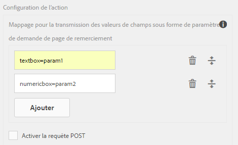
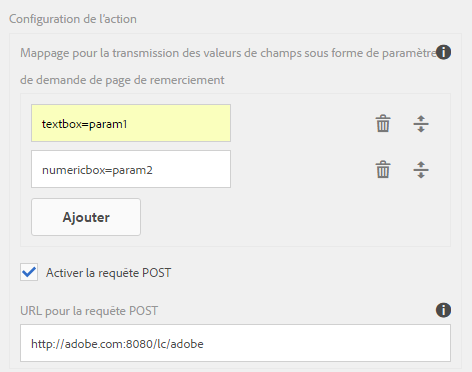
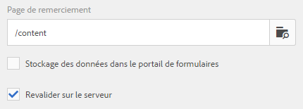
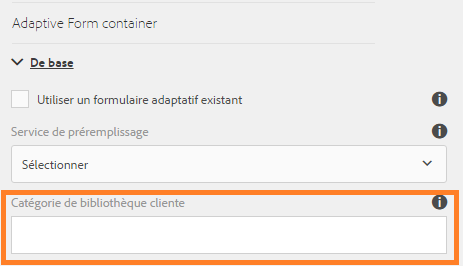

# Configurer l’action d’envoi {#configuring-the-submit-action}

>[!CAUTION]
>
>AEM 6.4 a atteint la fin de la prise en charge étendue et cette documentation n’est plus mise à jour. Pour plus d’informations, voir notre [période de support technique](https://helpx.adobe.com/fr/support/programs/eol-matrix.html). Rechercher les versions prises en charge [here](https://experienceleague.adobe.com/docs/?lang=fr).

## Présentation des actions d’envoi {#introduction-to-submit-actions}

Une action d’envoi est déclenchée lorsqu’un utilisateur clique sur le bouton Envoyer d’un formulaire adaptatif. Vous pouvez configurer l’action d’envoi sur le formulaire adaptatif. Les formulaires adaptatifs fournissent quelques actions d’envoi prêtes à l’emploi. Vous pouvez copier et étendre les actions d’envoi par défaut pour créer votre propre action d’envoi. Cependant, en fonction des exigences, vous pouvez rédiger et enregistrer votre propre action d’envoi afin de traiter les données du formulaire envoyé.

Lorsqu’un formulaire est prérempli ou envoyé, les données envoyées sont acheminées par AEM pour le traitement des données vers des formats intermédiaires. Les données ne sont pas enregistrées sur une instance d’AEM, sauf si le formulaire adaptatif utilise Acrobat Sign, vérifiez, le brouillon ou l’envoi du portail de formulaires ou AEM processus.

Vous pouvez configurer une action d’envoi dans la section **[!UICONTROL Envoi]** des propriétés du conteneur de formulaire adaptatif, dans la zone latérale.

**Figure :** *Configuration de l’action Envoyer*

Les actions d’envoi par défaut disponibles avec les formulaires adaptatifs sont les suivantes :

* Envoyer vers le point d’entrée REST
* Envoyer un e-mail
* Envoyer un PDF par courrier électronique
* Appeler un workflow de formulaires
* Envoyer à l’aide du modèle de données de formulaire
* Action d’envoi du Forms Portal
* Appeler un processus AEM

>[!NOTE]
>
>L’envoi d’un PDF via une action Envoyer un e-mail s’applique uniquement aux formulaires adaptatifs qui utilisent le modèle XFA comme modèle de formulaire.

>[!NOTE]
>
>Vérifiez que le dossier [AEM_Installation_Directory]\crx-quickstart\temp\datamanager\ASM pas. Le répertoire est nécessaire pour stocker temporairement des pièces jointes. Si le fichier n’existe pas, créez-le.

>[!CAUTION]
>
>Si vous [préremplissez](/help/forms/using/prepopulate-adaptive-form-fields.md) un modèle de formulaire, un modèle de données de formulaire ou un formulaire adaptatif basé sur un schéma avec des données XML ou JSON conformes à un schéma (schéma XML, schéma JSON, modèle de formulaire ou modèle de données de formulaire) présentant des données ne contenant pas les balises &lt;afData>, &lt;afBoundData> et &lt;/afUnboundData>, les données des champs illimités (les champs illimités sont les champs de formulaire adaptatif sans la propriété [bindref](/help/forms/using/prepopulate-adaptive-form-fields.md)) du formulaire adaptatif sont perdues.

Vous pouvez créer une action d’envoi personnalisée pour les formulaires adaptatifs afin de répondre à votre cas d’utilisation. Pour plus d’informations, voir [Création d’une action Envoyer personnalisée pour les formulaires adaptatifs](/help/forms/using/custom-submit-action-form.md).

## Envoyer vers le point d’entrée REST {#submit-to-rest-endpoint}

Le **[!UICONTROL Envoyer vers le point de fin REST]** l’option d’envoi transmet les données renseignées dans le formulaire à une page de confirmation configurée dans le cadre de la demande de GET HTTP. Vous pouvez ajouter le nom des champs à demander. Le format de la requête est le suivant :

`{fieldName}={request parameter name}`

Comme illustré ci-dessous, `param1` et `param2` sont transmis en tant que paramètres avec des valeurs copiées à partir des champs **[!UICONTROL textbox]** et **[!UICONTROL numericbox]** pour la prochaine action.

Vous pouvez également **[!UICONTROL Activer la requête POST]** et fournir une URL pour la publication de la requête. Pour envoyer des données au serveur AEM qui héberge le formulaire, utilisez un chemin d’accès relatif correspondant au chemin racine du serveur AEM. Par exemple, /content/forms/af/SampleForm.html. Pour envoyer des données vers un autre serveur, utilisez un chemin d’accès absolu.

Configuration de l’action Envoyer vers le point d’entrée REST

>[!NOTE]
Pour transmettre les champs en tant que paramètres dans une URL REST, tous les champs doivent avoir des noms d’éléments différents, même s’ils sont placés sur différents panneaux.

### Publier les données envoyées vers une ressource ou un point de fin REST externe  {#post-submitted-data-to-a-resource-or-external-rest-end-point-nbsp}

Utilisez l’action **[!UICONTROL Envoyer vers le point d’entrée REST]** pour transmettre les données envoyées à l’URL REST. L’URL peut être celle d’un serveur interne (le serveur sur lequel le formulaire est rendu) ou externe.

Pour publier des données sur un serveur interne, indiquez le chemin de la ressource. Les données sont publiées avec le chemin de la ressource. Par exemple, /content/restEndPoint. Pour ces requêtes de publication, les informations d’authentification de la requête d’envoi sont utilisées.

Pour publier des données sur un serveur externe, fournissez une URL. Le format de l’URL est le suivant : https://host:port/path_to_rest_end_point. Assurez-vous de configurer le chemin pour que la requête POST soit traitée anonymement.

Dans l’exemple ci-dessus, les informations saisies par l’utilisateur dans `textbox` sont capturées au moyen du paramètre `param1`. La syntaxe permettant de publier les données capturées au moyen de `param1` est :

`String data=request.getParameter("param1");`

De même, les paramètres que vous utilisez pour publier des données XML et des pièces jointes sont `dataXml` et `attachments`.

Par exemple, vous utilisez ces deux paramètres dans votre script pour analyser les données à un point d’entrée REST. Vous utilisez la syntaxe suivante pour stocker et analyser les données :

`String data=request.getParameter("dataXml");`\
`String att=request.getParameter("attachments");`

Dans cet exemple, `data` contient les données XML et `att` les données des pièces jointes.

## Envoyer un e-mail {#send-email}

L’action d’envoi **[!UICONTROL Envoyer un e-mail]** envoie un message électronique à un ou plusieurs destinataires lors d’un envoi réussi du formulaire. Le message généré peut contenir des données de formulaire dans un format prédéfini.

>[!NOTE]
Tous les champs de formulaire doivent avoir des noms d’éléments différents, même s’ils sont placés sur des panneaux différents), afin d’inclure des données de formulaire dans un email.

## Envoyer un PDF par courrier électronique {#send-pdf-via-email}

L’action d’envoi **[!UICONTROL Envoyer le PDF par courrier électronique]** envoie un message électronique avec un fichier PDF contenant des données de formulaire à un ou plusieurs destinataires lors d’un envoi réussi du formulaire.

**Remarque :** *Cette action d’envoi est disponible pour les formulaires adaptatifs XFA et les formulaires d’adaptation XSD ayant le modèle de document d’enregistrement.*

## Appeler un processus de formulaires {#invoke-a-forms-workflow}

Le **[!UICONTROL Processus Envoyer à Forms]** l’option d’envoi envoie un fichier XML de données et des pièces jointes (le cas échéant) à un LiveCycle d’Adobe ou à un processus AEM Forms on JEE existant.

Pour plus d’informations sur la configuration de l’action d’envoi Processus Envoyer aux formulaires, voir [Envoi et traitement de vos données de formulaire à l’aide des processus de formulaires](/help/forms/using/submit-form-data-livecycle-process.md).

## Envoyer à l’aide du modèle de données de formulaire {#submit-using-form-data-model}

L’action d’envoi **[!UICONTROL Envoyer à l’aide du modèle de données de formulaire]** écrit les données de formulaire adaptatif envoyés pour l’objet de modèle de données spécifié dans un modèle de données de formulaire vers sa source de données. Lors de la configuration de l’action d’envoi, vous pouvez choisir un objet de modèle de données dont vous souhaitez écrire les données envoyées dans sa source de données.

En outre, vous pouvez envoyer une pièce jointe de formulaire à l’aide d’un modèle de données de formulaire et d’un document d’enregistrement à la source de données.

Pour plus d’informations sur le modèle de données du formulaire, voir [Intégration de données AEM Forms](/help/forms/using/data-integration.md).

## Action d’envoi du portail Forms {#forms-portal-submit-action}

Le **[!UICONTROL Action d’envoi du portail Forms]** rend les données de formulaire disponibles via un portail AEM Forms.

Pour plus d’informations sur le portail Forms et l’action d’envoi, voir [Composant Drafts &amp; Submissions](/help/forms/using/draft-submission-component.md).

## Appeler un processus AEM {#invoke-an-aem-workflow}

Le **[!UICONTROL Appeler un workflow d’AEM]** l’action Envoyer associe un formulaire adaptatif à un processus AEM. Lorsqu’un formulaire est envoyé, le workflow associé démarre automatiquement sur le noeud de traitement. De plus, il place le fichier de données, les pièces jointes et le document d’enregistrement, le cas échéant, à l’emplacement de la charge utile du workflow.

Avant d’utiliser la variable **[!UICONTROL Appeler un workflow d’AEM]** action d’envoi, [configuration des paramètres AEM DS](/help/forms/using/configuring-the-processing-server-url-.md). Pour plus d’informations sur la création d’un processus AEM, voir [Processus basés sur l’utilisation de Forms sur OSGi](/help/forms/using/aem-forms-workflow.md).

## Revalidation côté serveur dans un formulaire adaptatif {#server-side-revalidation-in-adaptive-form}

En règle générale, dans n’importe quel système de capture de données en ligne, les développeurs placent certaines validations JavaScript côté client pour appliquer quelques règles métier. Mais dans les navigateurs modernes, les utilisateurs finaux peuvent contourner ces validations et effectuer les envois manuellement à l’aide de différentes méthodes, comme la console Web Browser DevTools. Ces techniques sont également valides pour les formulaires adaptatifs. Un développeur de formulaires peut créer différentes logiques de validation, mais techniquement, les utilisateurs finaux peuvent contourner ces logiques de validation et envoyer des données non valides au serveur. Les données non valides enfreindraient les règles de fonctionnement appliquées par un auteur de formulaires.

La fonction de revalidation côté serveur permet également d’exécuter les validations fournies par un auteur de formulaires adaptatifs lors de la conception d’un formulaire adaptatif sur le serveur. Elle empêche toute erreur lors des envois de données et toute violation des règles de fonctionnement représentées en termes de validations de formulaire.

### Quels éléments valider sur le serveur ?  {#what-to-validate-on-server-br}

Toutes les validations de champ prêtes à l’emploi d’un formulaire adaptatif qui sont réexécutées sur le serveur sont les suivantes :

* Requis
* Clause d’image de validation
* Expression de validation

### Activation de la validation côté serveur {#enabling-server-side-validation-br}

Utilisez **Revalider sur le serveur** sous le conteneur de formulaires adaptatifs dans la zone latérale pour activer ou désactiver la validation côté serveur pour le formulaire actif.

**Figure :** *Activation de la validation côté serveur*

Si l’utilisateur final contourne ces validations et envoie les formulaires, le serveur effectue à nouveau la validation. Si la validation échoue du côté du serveur, la transaction d’envoi est arrêtée. L’utilisateur final reçoit à nouveau le formulaire d’origine. Pour l’utilisateur, les données capturées et les données envoyées s’affichent en tant qu’erreurs.

### Prise en charge des fonctions personnalisées dans les expressions de validation {#supporting-custom-functions-in-validation-expressions-br}

Parfois, en cas de **règles de validation complexes**, le script de validation exact réside dans des fonctions personnalisées et l’auteur appelle ces fonctions personnalisées à partir de l’expression de validation de champ. Pour rendre cette bibliothèque de fonctions personnalisées visible et disponible lors des validations côté serveur, l’auteur de formulaires peut configurer le nom de la bibliothèque cliente AEM sous l’onglet **[!UICONTROL Réglages de base]** des propriétés de conteneur de formulaires adaptatifs comme illustré ci-dessous.

**Figure :** *Prise en charge des fonctions personnalisées dans les expressions de validation*

L’auteur peut configurer une bibliothèque JavaScript personnalisée par formulaire adaptatif. Dans la bibliothèque, conservez uniquement les fonctions réutilisables, qui dépendent des bibliothèques tierces jquery et underscore.js.

## Gestion d’erreurs sur l’action d’envoi {#error-handling-on-submit-action}

Dans le cadre des instructions de sécurité et de renforcement d’AEM, configurez les pages d’erreur personnalisées telles que 404.jsp et 500.jsp. Ces gestionnaires sont appelés lorsque, lors de l’envoi d’un formulaire, des erreurs 404 ou 500 s’affichent. Les gestionnaires sont également appelés lorsque ces codes d’erreur sont déclenchés sur le nœud de publication.

Pour plus d’informations, voir [Personnaliser les pages affichées par le gestionnaire d’erreurs](/help/sites-developing/customizing-errorhandler-pages.md).
