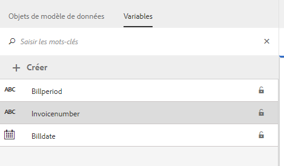
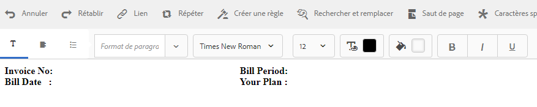
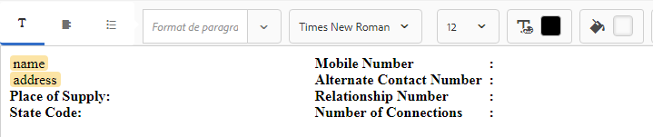

# Didacticiel : Créer des fragments de document {#tutorial-create-document-fragments}

Créer des fragments de document pour la communication interactive

Ce tutoriel est une étape dans la [Créer votre première communication interactive](/help/forms/using/create-your-first-interactive-communication.md) série. Il est recommandé de suivre la série dans l’ordre chronologique pour comprendre, exécuter et démontrer le cas d’utilisation complet du didacticiel.

Les fragments de document sont des composants réutilisables d’une correspondance utilisés pour composer une communication interactive. Les fragments de document sont composés des types suivants :

* Texte : un actif de texte est un élément de contenu constitué d’un ou de plusieurs paragraphes de texte. Un paragraphe peut être statique ou dynamique.
* Liste : la liste est un groupe de fragments de document, y compris du texte, des listes, des conditions et des images.
* Condition : les conditions vous permettent de définir le contenu à inclure dans la communication interactive en fonction des données reçues du modèle de données de formulaire.

Ce tutoriel vous guide tout au long des étapes à suivre pour créer plusieurs fragments de document texte en fonction de l’anatomie fournie dans [Planification de la communication interactive](/help/forms/using/planning-interactive-communications.md) . À la fin de ce didacticiel, vous serez capable de :

* Créer des fragments de document
* Créer des variables
* Créer et appliquer des règles

Voici la liste des fragments de document créés dans ce didacticiel :

* [Informations de facturation](/help/forms/using/create-document-fragments.md#step-create-bill-details-text-document-fragment)
* [Informations sur le client](/help/forms/using/create-document-fragments.md#step-create-customer-details-text-document-fragment)
* [Récapitulatif de facturation](/help/forms/using/create-document-fragments.md#step-create-bill-summary-text-document-fragment)
* [Récapitulatif des frais](/help/forms/using/create-document-fragments.md#step-create-summary-of-charges-text-document-fragment)

Chaque fragment de document comprend des champs avec du texte statique, des données reçues du modèle de données de formulaire et des données saisies à l’aide de l’interface utilisateur de l’agent. Tous ces champs ont été décrits dans la section [Planification de la communication interactive](/help/forms/using/planning-interactive-communications.md) .

Lors de la création de fragments de document dans ce didacticiel, des variables sont créées pour les champs recevant des données à l’aide de l’interface utilisateur de l’agent.

Utilisation **FDM_Create_First_IC**, comme décrit dans la section [Créer un modèle de données de formulaire](create-form-data-model-tutorial.md) , en tant que modèle de données de formulaire pour créer des fragments de document dans ce tutoriel.

## Étape 1 : Créer un fragment de document texte contenant des informations de facturation {#step-create-bill-details-text-document-fragment}

Le fragment de document contenant des informations de facturation comprend les champs suivants :

| Champ | Source de données |
|---|---|
| N° de facture | Interface utilisateur de l’agent |
| Période de facturation | Interface utilisateur de l’agent |
| Date de facturation | Interface utilisateur de l’agent |
| Votre planification | Modèle de données de formulaire |

Exécutez les étapes suivantes pour créer des variables pour les champs avec l’interface utilisateur de l’agent en tant que source de données, créer du texte statique et utiliser des éléments de modèle de données de formulaire dans le fragment de document :

1. Sélectionnez **[!UICONTROL Formulaires]** >**[!UICONTROL Fragments de document]**.

1. Sélectionnez **Créer** > **Texte**.
1. Saisissez les informations suivantes :

   1. Saisissez **bill_details_first_ic** comme nom dans le champ **Titre**. Le titre se génère automatiquement dans le champ **Nom**.
   1. Sélectionnez un **modèle de données de formulaire** dans la section **Modèle de données**.
   1. Sélectionnez **FDM_Create_First_IC** comme modèle de données de formulaire et appuyez sur **Sélectionner**.
   1. Appuyez sur **Suivant**.

1. Sélectionnez l’onglet **Variables** dans le volet gauche, puis appuyez sur **Créer**.
1. Dans la section **Créer une variable** :

   1. Saisissez **Invoicenumber** comme nom de la variable.
   1. Sélectionnez **Chaîne** comme type.
   1. Appuyez sur **Créer**.

   

   Répétez les étapes 4 et 5 pour créer les variables suivantes :

   * Billperiod : type de chaîne
   * BillDate : type de date

   

1. Créez du texte statique pour les champs suivants à l’aide du volet de droite :

   * N° de facture
   * Période de facturation
   * Date de facturation
   * Votre planification

   

1. Placez le curseur en regard du champ **N° de facture** et cliquez deux fois sur la variable **InvoiceNumber** de l’onglet **Variables** dans le volet de gauche.
1. Placez le curseur en regard de l’objet **Période de facturation** et double-cliquez sur le champ **Billperiod** .
1. Placez le curseur en regard de l’objet **Date de facturation** et double-cliquez sur le champ **Date de facturation** .
1. Sélectionnez l’onglet **Objets de modèle de données** dans le volet gauche.
1. Placez le curseur en regard de l’objet **Votre plan** et double-cliquez sur le champ **client** > **customerplan** .

   

1. Cliquez sur **Enregistrer** pour créer un fragment de document texte contenant des informations de facturation.

## Étape 2 : Créer un fragment de document texte contenant des informations personnalisées {#step-create-customer-details-text-document-fragment}

Le fragment de document contenant des informations personnalisées comprend les champs suivants :

| Champ | Source de données |
|---|---|
| Nom du client | Modèle de données de formulaire |
| Adresse | Modèle de données de formulaire |
| Lieu de livraison | Interface utilisateur de l’agent |
| Code du pays | Interface utilisateur de l’agent |
| Numéro de mobile | Modèle de données de formulaire |
| Autre numéro de téléphone | Modèle de données de formulaire |
| Numéro de relation | Modèle de données de formulaire |
| Nombre de connexions | Interface utilisateur de l’agent |

Exécutez les étapes suivantes pour créer des variables pour les champs avec l’interface utilisateur de l’agent en tant que source de données, créer du texte statique et utiliser des éléments de modèle de données de formulaire dans le fragment de document :

1. Sélectionnez **[!UICONTROL Formulaires]** >**[!UICONTROL Fragments de document]**.
1. Sélectionnez **Créer** > **Texte**.
1. Saisissez les informations suivantes :

   1. Entrée **customer_details_first_ic** comme nom dans la variable **Titre** champ . Le titre se génère automatiquement dans le champ **Nom**.
   1. Sélectionnez un **modèle de données de formulaire** dans la section **Modèle de données**.
   1. Sélectionnez **FDM_Create_First_IC** comme modèle de données de formulaire et appuyez sur **Sélectionner**.
   1. Appuyez sur **Suivant**.

1. Sélectionnez l’onglet **Variables** dans le volet gauche, puis appuyez sur **Créer**.
1. Dans la section **Créer une variable** :

   1. Entrée **Placesupply** comme nom de la variable.
   1. Sélectionnez **Chaîne** comme type.
   1. Appuyez sur **Créer**.

   Répétez les étapes 4 et 5 pour créer les variables suivantes :

   * Statecode : type de numéro
   * Numberconnections : type de numéro

1. Sélectionnez la **Objets de modèle de données** , placez le curseur dans le volet de droite, puis double-cliquez sur le **client** > **name** .
1. Appuyez sur Entrée pour déplacer le curseur sur la ligne suivante et double-cliquez sur le **client** > **address** .
1. Créez du texte statique pour les champs suivants à l’aide du volet de droite :

   * Numéro de mobile
   * Autre numéro de téléphone
   * Lieu de livraison
   * Numéro de relation
   * Code du pays
   * Nombre de connexions

   

1. Placez le curseur en regard de l’objet **Numéro de mobile** et double-cliquez sur le champ **client** > **mobilenum** .
1. Placez le curseur en regard de l’objet **Autre numéro de contact** et double-cliquez sur le champ **client** > **alternatemobilenumber** .
1. Placez le curseur en regard de l’objet **Numéro de relation** et double-cliquez sur le champ **client** > **Relationship number** .
1. Sélectionnez la **Variables** , placez le curseur en regard de l’onglet **Lieu de livraison** et double-cliquez sur le champ **Placesupply** .
1. Placez le curseur en regard de l’objet **Code d’état** et double-cliquez sur le champ **Statecode** .
1. Placez le curseur en regard de l’objet **Nombre de connexions** et double-cliquez sur le champ **Numberconnections** .

   

1. Cliquez sur **Enregistrer** pour créer le fragment de document texte Détails du client.

## Étape 3 : Créer le fragment de document texte de récapitulatif de facturation {#step-create-bill-summary-text-document-fragment}

Le fragment de document de résumé de facturation comprend les champs suivants :

| Champ | Source de données |
|---|---|
| Solde précédent | Interface utilisateur de l’agent |
| Paiements | Interface utilisateur de l’agent |
| Ajustements | Interface utilisateur de l’agent |
| Facturation de la période en cours | Modèle de données de formulaire |
| Montant dû | Interface utilisateur de l’agent |
| Échéance | Interface utilisateur de l’agent |

Exécutez les étapes suivantes pour créer des variables pour les champs avec l’interface utilisateur de l’agent en tant que source de données, créer du texte statique et utiliser des éléments de modèle de données de formulaire dans le fragment de document :

1. Sélectionnez **[!UICONTROL Formulaires]** >**[!UICONTROL Fragments de document]**.
1. Sélectionnez **Créer** > **Texte**.
1. Saisissez les informations suivantes :

   1. Entrée **bill_summary_first_ic** comme nom dans la variable **Titre** champ . Le titre se génère automatiquement dans le champ **Nom**.
   1. Sélectionnez un **modèle de données de formulaire** dans la section **Modèle de données**.
   1. Sélectionnez **FDM_Create_First_IC** comme modèle de données de formulaire et appuyez sur **Sélectionner**.
   1. Appuyez sur **Suivant**.

1. Sélectionnez l’onglet **Variables** dans le volet gauche, puis appuyez sur **Créer**.
1. Dans la section **Créer une variable** :

   1. Entrée **Balance précédente** comme nom de la variable.
   1. Sélectionner **Nombre** comme type.
   1. Appuyez sur **Créer**.

   Répétez les étapes 4 et 5 pour créer les variables suivantes :

   * Payments : type de numéro
   * Ajustements : type de numéro
   * Amountdue : type de numéro
   * Duedate : type de date

1. Créez du texte statique pour les champs suivants à l’aide du volet de droite :

   * Solde précédent
   * Paiements
   * Ajustements
   * Facturation de la période en cours
   * Montant dû
   * Échéance
   * Les frais de retard de paiement après l’échéance sont de 20 $.

   

1. Placez le curseur en regard de l’objet **Solde précédent** et double-cliquez sur le champ **Balance précédente** .
1. Placez le curseur en regard de l’objet **Paiements** et double-cliquez sur le champ **Paiements** .
1. Placez le curseur en regard de l’objet **Ajustements** et double-cliquez sur le champ **Ajustements** .
1. Placez le curseur en regard de l’objet **Montant dû** et double-cliquez sur le champ **Amountdue** .
1. Placez le curseur en regard de l’objet **Date d’échéance** et double-cliquez sur le champ **Duedate** .
1. Sélectionnez la **Objets de modèle de données** , placez le curseur en regard de l’onglet **Facturation de la période de facturation actuelle** dans le volet de droite, puis double-cliquez sur le **bills** > **usagecharges** .

   

1. Cliquez sur **Enregistrer** pour créer le fragment de document texte Détails du client.

## Étape 4 : Créer le fragment de document texte de récapitulatif des frais {#step-create-summary-of-charges-text-document-fragment}

Le fragment de document Summary of charges comprend les champs suivants :

| Champ | Source de données |
|---|---|
| Frais d’appel | Modèle de données de formulaire |
| Frais de conférence téléphonique | Modèle de données de formulaire |
| Frais de SMS | Modèle de données de formulaire |
| Frais d’Internet mobile | Modèle de données de formulaire |
| Frais d’itinérance nationale | Modèle de données de formulaire |
| Frais d’itinérance internationale | Modèle de données de formulaire |
| Frais de services à valeur ajoutée | Modèle de données de formulaire |
| Frais totaux | Modèle de données de formulaire |
| TOTAL À PAYER | Modèle de données de formulaire |

Exécutez les étapes suivantes pour créer du texte statique et utiliser des éléments de modèle de données de formulaire dans le fragment de document :

1. Sélectionnez **[!UICONTROL Formulaires]** >**[!UICONTROL Fragments de document]**.
1. Sélectionnez **Créer** > **Texte**.
1. Saisissez les informations suivantes :

   1. Entrée **summary_charges_first_ic** comme nom dans la variable **Titre** champ . Le titre se génère automatiquement dans le champ Nom.
   1. Sélectionnez un **modèle de données de formulaire** dans la section **Modèle de données**.
   1. Sélectionnez **FDM_Create_First_IC** comme modèle de données de formulaire et appuyez sur **Sélectionner**.
   1. Appuyez sur **Suivant**.

1. Créez du texte statique pour les champs suivants à l’aide du volet de droite :

   * Frais d’appel
   * Frais de conférence téléphonique
   * Frais de SMS
   * Frais d’Internet mobile
   * Frais d’itinérance nationale
   * Frais d’itinérance internationale
   * Frais de services à valeur ajoutée
   * Frais totaux
   * TOTAL À PAYER

   

1. Sélectionnez l’onglet **Objets de modèle de données**.
1. Placez le curseur en regard de l’objet **Frais d’appel** et double-cliquez sur le champ **bills** > **callcharges** .
1. Placez le curseur en regard de l’objet **Frais de conférence téléphonique** et double-cliquez sur le champ **bills** > **confcallcharges** .
1. Placez le curseur en regard de l’objet **Frais de SMS** et double-cliquez sur le champ **bills** > **smscharges** .
1. Placez le curseur en regard de l’objet **Frais Internet mobiles** et double-cliquez sur le champ **bills** > **internetcharges** .
1. Placez le curseur en regard de l’objet **Frais d’itinérance nationale** et double-cliquez sur le champ **bills** > **roamingnational** .
1. Placez le curseur en regard de l’objet **Frais d’itinérance internationale** et double-cliquez sur le champ **bills** > **roamingintnl** .
1. Placez le curseur en regard de l’objet **Frais de services à valeur ajoutée** et double-cliquez sur le champ **bills** > **zone** .
1. Placez le curseur en regard de l’objet **Frais totaux** et double-cliquez sur le champ **bills** > **usagecharges** .
1. Placez le curseur en regard de l’objet **TOTAL À PAYER** et double-cliquez sur le champ **bills** > **usagecharges** .

   

1. Sélectionnez le texte dans le **Frais de services à valeur ajoutée** ligne et appuyez sur **Créer une règle** pour créer une condition d’après laquelle la ligne est affichée dans la communication interactive :
1. La fenêtre contextuelle **Créer une règle** s’affiche :

   1. Sélectionnez **Modèles de données et variables** puis **bills** > **callcharges**.
   1. Sélectionnez **est inférieur à** comme opérateur.
   1. Sélectionnez **Nombre** et entrez la valeur **60**.

   En fonction de cette condition, la ligne Frais de services à valeur ajoutée ne s’affiche que si la valeur du champ Frais d’appel est inférieure à 60.

   

1. Cliquez sur **Enregistrer** pour créer le fragment de document texte Résumé des frais.
