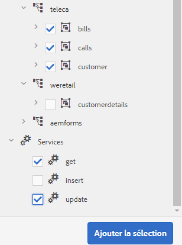
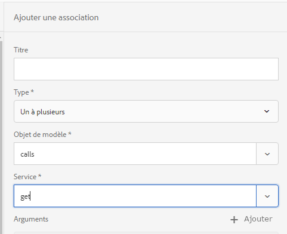
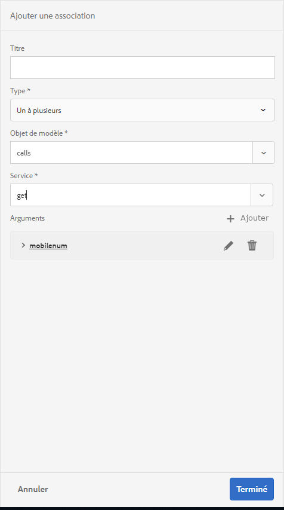
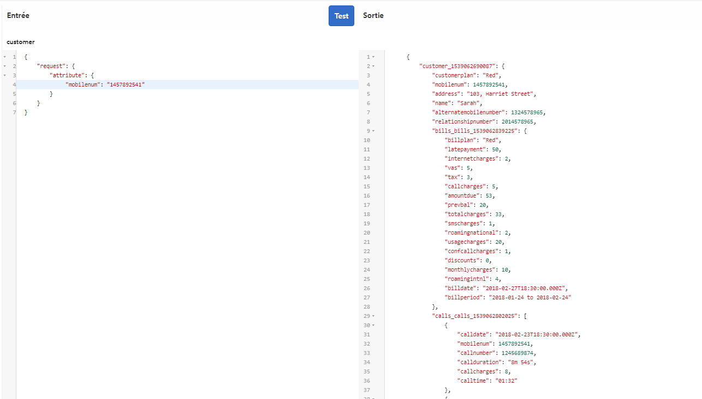
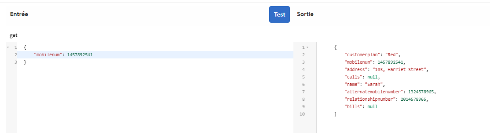
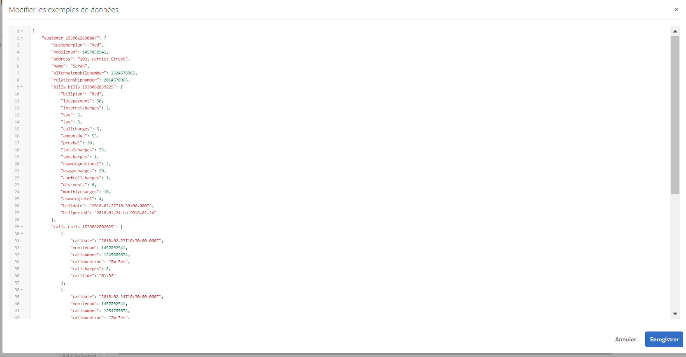

# Didacticiel : créer un modèle de données de formulaire {#tutorial-create-form-data-model}

Créer un modèle de données de formulaire pour la communication interactive


Ce tutoriel est une étape dans la [Créer votre première communication interactive](/help/forms/using/create-your-first-interactive-communication.md) série. Il est recommandé de suivre la série dans l’ordre chronologique pour comprendre, exécuter et démontrer le cas d’utilisation complet du didacticiel.

## À propos du didacticiel {#about-the-tutorial}

Le module d’intégration des données AEM Forms vous permet de créer un modèle de données de formulaire à partir de sources de données principales disparates, telles que le profil utilisateur AEM, les services Web RESTful, les services Web SOAP, les services OData et les bases de données relationnelles. Vous pouvez configurer des objets et des services de modèle de données dans un modèle de données de formulaire et les associer à un formulaire adaptatif. Les champs de formulaire adaptatif sont liés aux propriétés de l’objet du modèle de données. Les services vous permettent de préremplir le formulaire adaptatif et d’écrire les données de formulaire soumises dans l’objet de modèle de données.

Pour plus d’informations sur l’intégration des données de formulaire et sur le modèle de données du formulaire, voir [Intégration de données AEM Forms](data-integration.md).

Ce didacticiel vous décrit étape par étape le processus de préparation, création, configuration et association d’un modèle de données de formulaire avec une communication interactive. À la fin de ce didacticiel, vous serez capable de :

* [Configurer la base de données](#step-set-up-the-database)
* [Configurer la base de données MySQL comme source de données](#step-configure-mysql-database-as-data-source)
* [Création d’un modèle de données de formulaire](#step-create-form-data-model)
* [Configurer un modèle de données de formulaire](#step-configure-form-data-model)
* [Tester le modèle de données de formulaire](#step-test-form-data-model-and-services)

Le modèle de données de formulaire se présente comme ceci :


**A.** Sources de données configurées **B.** Schémas de source de données **C.** Services disponibles **D.** Objets de modèle de données **E.** Services configurés

## Prérequis {#prerequisites}

Avant de commencer, vérifiez que vous disposez des éléments suivants :

* Base de données MySQL avec des exemples de données comme indiqué dans la section [Configurer la base de données](#step-set-up-the-database).
* Groupe OSGi pour le pilote JDBC MySQL, comme expliqué dans la section [Regroupement du pilote de base de données JDBC](https://helpx.adobe.com/experience-manager/6-3/sites-developing/jdbc.html#bundling-the-jdbc-database-driver)

## Étape 1 : Configurer la base de données {#step-set-up-the-database}

Une base de données est essentielle pour créer une communication interactive. Ce didacticiel utilise une base de données pour afficher le modèle de données de formulaire et les fonctionnalités de persistance des communications interactives. Configurez une base de données comprenant les tableaux des clients, des factures et des appels.\
 L’image suivante présente des exemples de données pour le tableau des clients :


Utilisez l’instruction DDL suivante pour créer la variable **client** dans la base de données.

```sql
CREATE TABLE `customer` (
   `mobilenum` int(11) NOT NULL,
   `name` varchar(45) NOT NULL,
   `address` varchar(45) NOT NULL,
   `alternatemobilenumber` int(11) DEFAULT NULL,
   `relationshipnumber` int(11) DEFAULT NULL,
   `customerplan` varchar(45) DEFAULT NULL,
   PRIMARY KEY (`mobilenum`),
   UNIQUE KEY `mobilenum_UNIQUE` (`mobilenum`)
 ) ENGINE=InnoDB DEFAULT CHARSET=utf8
```

Utilisez l’instruction DDL suivante pour créer la variable **bills** dans la base de données.

```sql
CREATE TABLE `bills` (
   `billplan` varchar(45) NOT NULL,
   `latepayment` decimal(4,2) NOT NULL,
   `monthlycharges` decimal(4,2) NOT NULL,
   `billdate` date NOT NULL,
   `billperiod` varchar(45) NOT NULL,
   `prevbal` decimal(4,2) NOT NULL,
   `callcharges` decimal(4,2) NOT NULL,
   `confcallcharges` decimal(4,2) NOT NULL,
   `smscharges` decimal(4,2) NOT NULL,
   `internetcharges` decimal(4,2) NOT NULL,
   `roamingnational` decimal(4,2) NOT NULL,
   `roamingintnl` decimal(4,2) NOT NULL,
   `vas` decimal(4,2) NOT NULL,
   `discounts` decimal(4,2) NOT NULL,
   `tax` decimal(4,2) NOT NULL,
   PRIMARY KEY (`billplan`)
 ) ENGINE=InnoDB DEFAULT CHARSET=utf8
```

Utilisez l’instruction DDL suivante pour créer la variable **calls** dans la base de données.

```sql
CREATE TABLE `calls` (
   `mobilenum` int(11) DEFAULT NULL,
   `calldate` date DEFAULT NULL,
   `calltime` varchar(45) DEFAULT NULL,
   `callnumber` int(11) DEFAULT NULL,
   `callduration` varchar(45) DEFAULT NULL,
   `callcharges` decimal(4,2) DEFAULT NULL,
   `calltype` varchar(45) DEFAULT NULL
 ) ENGINE=InnoDB DEFAULT CHARSET=utf8
```

Le **calls** le tableau comprend les détails de l’appel, tels que la date, l’heure, le numéro d’appel, la durée de l’appel et les frais d’appel. Le **client** est liée à la table des appels à l&#39;aide du champ Numéro de mobile (mobilenum) . Pour chaque numéro de mobile répertorié dans la variable **client** table, il existe plusieurs enregistrements dans la variable **calls** table. Par exemple, vous pouvez récupérer les informations sur l’appel pour le numéro de téléphone mobile **1457892541** en vous reportant au tableau des appels.****

Le **bills** le tableau comprend les détails de la facture, tels que la date de facturation, la période de facturation, les frais mensuels et les frais d’appel. Le **client** est liée à la table **bills** à l’aide du champ Formule de facturation . Un plan est associé à chaque client dans la variable **client** table. Le **bills** comprend les détails des tarifs pour tous les forfaits existants. Par exemple, vous pouvez extraire les informations de plan de **Sarah** à partir du tableau des clients et utiliser ces informations pour extraire les informations de tarification à partir du tableau des factures.********

## Étape 2 : Configurer la base de données MySQL comme source de données {#step-configure-mysql-database-as-data-source}

Vous pouvez configurer différents types de sources de données pour créer un modèle de données de formulaire. Pour ce didacticiel, vous allez configurer la base de données MySQL qui est configurée et remplie avec des exemples de données. Pour plus d’informations sur les autres sources de données prises en charge et sur leur configuration, reportez-vous à la section [Intégration de données AEM Forms](data-integration.md).

Procédez comme suit pour configurer votre base de données MySQL :

1. Installez le pilote JDBC pour la base de données MySQL en tant que lot OSGi :

   1. Connectez-vous à l’instance d’auteur AEM Forms en tant qu’administrateur et accédez aux bundles de la console web d’AEM. L’URL par défaut est [http://localhost:4502/system/console/bundles](http://localhost:4502/system/console/bundles).
   1. Appuyer **Installer/Mettre à jour**. Une boîte de dialogue **Télécharger/installer les bundles** s’affiche.
   1. Appuyez sur **Choisir un fichier** pour rechercher et sélectionner le bundle OSGi du pilote JDBC MySQL. Sélectionner **Lot de démarrage** et **Actualisation des modules**, puis appuyez sur **Installer** ou **Mettre à jour**. Assurez-vous que le pilote JDBC d’Oracle Corporation pour MySQL est actif. Le pilote est installé.

1. Configurer la base de données MySQL comme source de données :

   1. Accédez à la console web d’AEM à l’adresse [http://localhost:4502/system/console/configMgr](http://localhost:4502/system/console/configMgr).
   1. Recherchez la configuration **Apache Sling Connection Pooled DataSource**. Appuyez pour ouvrir la configuration en mode édition.
   1. Dans la boîte de dialogue de configuration, indiquez ce qui suit :

      * **Nom de la source de données :** vous pouvez spécifier un nom. Par exemple, spécifiez **MySQL**.
      * **Nom de la propriété de service de source de données** : spécifiez le nom de la propriété de service contenant le nom de la source de données. Il est spécifié lors de l’enregistrement de l’instance de source de données en tant que service OSGi. Par exemple, **datasource.name**.
      * **Classe de pilote JDBC** : spécifiez le nom de la classe Java du pilote JDBC. Pour la base de données MySQL, spécifiez **com.mysql.jdbc.Driver**.
      * **URI de connexion JDBC** : spécifiez l’URL de connexion de la base de données. Pour la base de données MySQL s’exécutant sur le port 3306 et le schéma teleca, l’URL est la suivante : `jdbc:mysql://[server]:3306/teleca?autoReconnect=true&useUnicode=true&characterEncoding=utf-8`
      * **Nom d’utilisateur :** nom d’utilisateur de la base de données. Il est nécessaire d’activer le pilote JDBC pour établir une connexion avec la base de données.
      * **Mot de passe :** mot de passe de la base de données. Il est nécessaire d’activer le pilote JDBC pour établir une connexion avec la base de données.
      * **Test lors de l’emprunt :** activez l’option **Test lors de l’emprunt.**
      * **Test lors du renvoi :** activez l’option **Test lors du renvoi.**
      * **Requête de validation :** spécifiez une requête SQL SELECT pour valider les connexions du pool. La requête doit renvoyer au moins une ligne. Par exemple : **select &amp;ast; du client**.
      * **Isolation de transaction** : définissez la valeur sur **READ_COMMITTED**.

   Laissez les autres propriétés par défaut [values](https://tomcat.apache.org/tomcat-7.0-doc/jdbc-pool.html) et appuyez sur **Enregistrer**.

   Une configuration similaire à la suivante est créée.

   

## Étape 3 : Créer un modèle de données de formulaire {#step-create-form-data-model}

AEM Forms fournit une interface utilisateur intuitive à [création d’un mode de données de formulaire](data-integration.md)l à partir de sources de données configurées. Vous pouvez utiliser plusieurs sources de données dans un modèle de données de formulaire. Pour le cas d’utilisation de ce didacticiel, vous utiliserez MySQL comme source de données.

Procédez comme suit pour créer un modèle de données de formulaire :

1. Dans l’instance d’auteur AEM, accédez à **Forms** (Formulaires) > **Data Integrations** (Intégrations de données).
1. Appuyez sur **Create** (Créer) > **Form Data Model** (Modèle de données de formulaire).
1. Dans l’assistant Créer un modèle de données de formulaire, spécifiez une **name** pour le modèle de données de formulaire. Par exemple : **FDM_Create_First_IC**. Appuyez sur **Suivant**.
1. L’écran Sélectionner la source de données répertorie toutes les sources de données configurées. Sélectionner **MySQL** source de données et appuyez sur **Créer**.

   

1. Cliquez sur **Terminé**. Le **FDM_Create_First_IC** le modèle de données de formulaire est créé.

## Étape 4 : Configurer un modèle de données de formulaire {#step-configure-form-data-model}

La configuration d’un modèle de données de formulaire inclut :

* [l’ajout d’objets et de services de modèle de données](#add-data-model-objects-and-services)
* [la création de propriétés enfants calculées pour un objet de modèle de données](#create-computed-child-properties-for-data-model-object)
* [l’ajout d’associations entre les objets de modèle de données](#add-associations-between-data-model-objects)
* [la modification des propriétés d’objet du modèle de données](#edit-data-model-object-properties)
* [la configuration des services pour les objets de modèle de données](#configure-services)

### Ajout d’objets et de services de modèle de données {#add-data-model-objects-and-services}

1. Sur AEM instance d’auteur, accédez à **Forms** > **Intégrations de données**. L’URL par défaut est [http://localhost:4502/aem/forms.html/content/dam/formsanddocuments-fdm](http://localhost:4502/aem/forms.html/content/dam/formsanddocuments-fdm).
1. Le **FDM_Create_First_IC** Le modèle de données de formulaire que vous avez créé précédemment est répertorié ici. Sélectionnez-le, puis appuyez sur **Modifier**.

   La source de données sélectionnée **MySQL** s’affiche dans la variable **Sources de données** volet.

   

1. Développez l’arborescence de la source de données **MySQL**. Sélectionnez les objets et services de modèle de données suivants dans **teleca** schema :

   * **Objets de modèle de données**:

      * bills
      * calls
      * customer
   * **Services :**

      * get
      * mise à jour

   Appuyez sur **Ajouter la sélection** pour ajouter des objets et des services de modèle de données sélectionnés au modèle de données de formulaire.

   

   Les factures, les appels et les objets du modèle de données client sont affichés dans le volet de droite de l’onglet **Modèle**. Les services get et update sont affichés dans l’onglet **Services**.

   

### Créer des propriétés enfants calculées pour un objet de modèle de données {#create-computed-child-properties-for-data-model-object}

Une propriété calculée est celle dont la valeur est calculée sur la base d’une règle ou d’une expression. À l’aide d’une règle, vous pouvez définir la valeur d’une propriété calculée sur une chaîne littérale, un nombre, le résultat d’une expression mathématique ou la valeur d’une autre propriété dans le modèle de données de formulaire.

En fonction du cas d’utilisation, créez la propriété enfant calculée **usagecharges** dans l’objet de modèle de données **bills** à l’aide de l’expression mathématique suivante :

* frais d’utilisation = frais d’appel + frais de conférence téléphonique + frais SMS + frais d’Internet mobile + itinérance nationale + itinérance internationale + VAS (toutes ces propriétés existent dans l’objet de modèle de données bills)

   Pour plus d’informations sur la variable **usagecharges** propriété calculée enfant, voir [Planification de la communication interactive](/help/forms/using/planning-interactive-communications.md).

Exécutez les étapes suivantes pour créer des propriétés enfant calculées pour un objet de modèle de données bills :

1. Cochez la case en haut de la page **bills** objet de modèle de données pour le sélectionner et appuyer sur **Créer une propriété enfant**.
1. Dans le panneau **Créer une propriété enfant** :

   1. Saisissez **usagecharges** comme nom de propriété enfant.
   1. Activez **Calculé**.
   1. Sélectionner **Flottant** comme type et appuyez sur **Terminé** pour ajouter la propriété enfant à la propriété **bills** objet de modèle de données.

   

1. Appuyer **Modifier la règle** pour ouvrir l’éditeur de règles.
1. Appuyez sur **Créer**. Le **Définir la valeur** s’ouvre.
1. Dans la liste déroulante Sélectionner une option, sélectionnez **Expression mathématique**.

   

1. Dans l’expression mathématique, sélectionnez **callcharges** et **confcallcharges** comme premier et deuxième objets, respectivement. Sélectionnez **plus** en tant qu’opérateur. Appuyez sur l’expression mathématique puis sur **Etendre l’expression** pour ajouter les objets **smscharges**, **internetcharges**, **roamingnational**, **roamingintnl** et **vas** à l’expression.

   L’image suivante décrit l’expression mathématique dans l’éditeur de règles :

   

1. Appuyez sur **Terminé**. La règle est créée dans l’éditeur de règles.
1. Appuyer **Fermer** pour fermer la fenêtre de l’éditeur de règles.

### Ajouter des associations entre les objets de modèle de données {#add-associations-between-data-model-objects}

Une fois les objets de modèle de données définis, vous pouvez créer des associations entre eux. L’association peut lier un objet à un autre ou à plusieurs objets. Par exemple, plusieurs personnes à charge peuvent être associées à un employé. Il s’agit d’une association d’un objet à plusieurs objets, désignée par 1:n sur la ligne reliant les objets de modèle de données associés. Toutefois, si une association renvoie un nom d’employé unique pour un ID d’employé donné, elle est appelée association un-à-un.

Lorsque vous ajoutez des objets de modèle de données associés d’une source de données à un modèle de données de formulaire, leurs associations sont conservées et affichées comme étant liées par des lignes fléchées.

En fonction du cas d’utilisation, créez les associations suivantes entre les objets de modèle de données :

| Association | Objets de modèle de données |
|---|---|
| 1:n | client:appels (plusieurs appels peuvent être associés à un client dans une facture mensuelle) |
| 1:1 | client:factures (une facture est associée à un client pour un mois donné) |

Procédez comme suit pour créer des associations entre objets de modèle de données :

1. Cochez la case en haut de la page **client** objet de modèle de données pour le sélectionner et appuyer sur **Ajouter une association**. Le **Ajouter une association** s’ouvre dans le volet de propriétés.
1. Dans le panneau **Ajouter une association** :

   * Spécifiez un titre pour l’association. Ce champ est facultatif.
   * Sélectionnez **Un à plusieurs** dans la liste déroulante **Type**.
   * Sélectionnez **calls** dans la liste déroulante **Objet de modèle**.
   * Sélectionnez **get** dans la liste déroulante **Service**.
   * Appuyer **Ajouter** pour lier la variable **client** objet de modèle de données vers **calls** objet de modèle de données à l’aide d’une propriété . En fonction du cas d’utilisation, l’objet de modèle de données calls doit être lié à la propriété de numéro de mobile dans l’objet de modèle de données customer. Le **Ajouter un argument** s’ouvre.

   

1. Dans la boîte de dialogue **Ajouter un argument** :

   * Sélectionnez **mobilenum** dans la liste déroulante **Nom**. La propriété Numéro mobile est une propriété commune disponible dans les objets de modèle de données customer et calls. Par conséquent, elle est utilisée pour créer une association entre les objets de modèle de données customer et calls.

      Plusieurs enregistrements d’appels sont disponibles dans le tableau des appels pour chaque numéro de téléphone disponible dans l’objet de modèle customer.

   * Spécifiez un titre et une description facultatifs pour l’argument.
   * Sélectionnez **customer** dans la liste déroulante **Liaison à**.
   * Sélectionnez **mobilenum** dans la liste déroulante **Valeur de liaison**.
   * Appuyez sur **Ajouter**.

   

   La propriété mobilenum s’affiche dans la section **Arguments**.

   

1. Appuyer **Terminé** pour créer une association 1:n entre les objets de modèle de données customer et calls.

   Une fois que vous avez créé une association entre les objets de modèle de données customer et calls, créez une association 1:1 entre les objets de modèle de données customer et bills.

1. Cochez la case en haut de la page **client** objet de modèle de données pour le sélectionner et appuyer sur **Ajouter une association**. Le **Ajouter une association** s’ouvre dans le volet de propriétés.
1. Dans le panneau **Ajouter une association** :

   * Spécifiez un titre pour l’association. Ce champ est facultatif.
   * Sélectionner **Un à un** de la **Type** liste déroulante.
   * Sélectionner **bills** de la **Objet modèle** liste déroulante.
   * Sélectionnez **get** dans la liste déroulante **Service.** Le **billplan** , qui est la clé Principale de la table bills , est déjà disponible dans la propriété **Arguments** .

       Les objets de modèle de données bills et customer sont respectivement liés à l’aide des propriétés billplan (factures) et customerplan (client). Créez une liaison entre ces propriétés pour récupérer les détails du plan pour tout client disponible dans la base de données MySQL.

   * Sélectionnez **customer** dans la liste déroulante **Liaison à**.
   * Sélectionnez **customerplan** dans la liste déroulante **Valeur de liaison**.
   * Appuyer **Terminé** pour créer une liaison entre les propriétés billplan et customerplan.

   

   L’image suivante décrit les associations entre les objets de modèle de données et les propriétés utilisées pour créer des associations entre eux :

   

### Modifier les propriétés de l’objet de modèle de données {#edit-data-model-object-properties}

Après avoir créé des associations entre l’objet customer et d’autres objets de modèle de données, modifiez les propriétés du client pour définir la propriété en fonction de laquelle les données sont extraites de l’objet de modèle de données. En fonction du cas d’utilisation, le numéro de mobile est utilisé comme propriété pour extraire des données de l’objet de modèle de données customer.

1. Cochez la case en haut de la page **client** objet de modèle de données pour le sélectionner et appuyer sur **Modifier les propriétés**. Le panneau **Modifier les propriétés** s’ouvre.
1. Spécifiez **customer** comme **objet de modèle de niveau supérieur**.
1. Sélectionnez **get** dans la liste déroulante **Service de lecture**.
1. Dans la section **Arguments** :

   * Sélectionnez **Attribut de requête** dans la liste déroulante **Liaison à**.
   * Spécifiez **mobilenum** comme valeur de liaison.

1. Sélectionnez **update** dans la liste déroulante **Service d’écriture**.
1. Dans la section **Arguments** :

   * Pour la propriété **mobilenum**, sélectionnez **customer** dans la liste déroulante **Liaison à**.
   * Sélectionnez **mobilenum** dans la liste déroulante **Valeur de liaison**.

1. Appuyer **Terminé** pour enregistrer les propriétés.

   

1. Cochez la case en haut de la page **calls** objet de modèle de données pour le sélectionner et appuyer sur **Modifier les propriétés**. Le panneau **Modifier les propriétés** s’ouvre.
1. Désactiver l’**Objet de niveau supérieur** pour l’objet de modèle de données **calls**.
1. Appuyez sur **Terminé**.

   Répétez les étapes 8 à 10 pour configurer les propriétés pour l’objet de modèle de données **bills**.

### Configuration des services {#configure-services}

1. Accédez à l’onglet **Services**.
1. Sélectionnez la **get** service et appuyez sur **Modifier les propriétés**. Le panneau **Modifier les propriétés** s’ouvre.
1. Dans le panneau **Modifier les propriétés** :

   * Saisissez un titre et une description facultatifs.
   * Sélectionnez **customer** depuis la liste déroulante **Objet de modèle de sortie**.
   * Appuyer **Terminé** pour enregistrer les propriétés.

   

1. Sélectionnez la **update** service et appuyez sur **Modifier les propriétés**. Le panneau **Modifier les propriétés** s’ouvre.
1. Dans le panneau **Modifier les propriétés** :

   * Saisissez un titre et une description facultatifs.
   * Sélectionner **client** de la **Objet de modèle d’entrée** liste déroulante.
   * Appuyez sur **Terminé**.
   * Appuyez sur **Enregistrer** pour enregistrer le modèle de données de formulaire.

   

## Étape 5 : Tester le modèle de données de formulaire et les services {#step-test-form-data-model-and-services}

Vous pouvez tester l’objet et les services du modèle de données pour vérifier que le modèle de données de formulaire est correctement configuré.

Procédez comme suit pour effectuer le test :

1. Accédez au **Modèle** , sélectionnez la variable **client** objet de modèle de données, puis appuyez sur **Objet de modèle de test**.
1. Dans le **Tester le modèle de données de formulaire** fenêtre, sélectionnez **Objet de modèle de lecture** de la **Sélectionner un modèle/service** liste déroulante.
1. Dans le **Entrée** , indiquez une valeur pour la variable **mobilenum** qui existe dans la base de données MySQL configurée et appuyez sur **Test**.

   Les détails du client associés à la propriété mobilenum spécifiée sont récupérés et affichés dans la section Sortie, comme illustré ci-dessous. Fermez la boîte de dialogue.

   

1. Accédez à l’onglet **Services**.
1. Sélectionnez la **get** service et appuyez sur **Service de test.**
1. Dans le **Entrée** , indiquez une valeur pour la variable **mobilenum** qui existe dans la base de données MySQL configurée et appuyez sur **Test**.

   Les détails du client associés à la propriété mobilenum spécifiée sont récupérés et affichés dans la section Sortie, comme illustré ci-dessous. Fermez la boîte de dialogue.

   

### Modifier et enregistrer des exemples de données {#edit-and-save-sample-data}

L’éditeur de modèle de données de formulaire vous permet de générer des exemples de données pour toutes les propriétés d’objet de modèle de données, y compris les propriétés calculées, dans un modèle de données de formulaire. Il s’agit d’un ensemble de valeurs aléatoires conformes au type de données configuré pour chaque propriété. Vous pouvez également modifier et enregistrer des données qui sont conservées même si vous régénérez les exemples de données.

Procédez comme suit pour générer, modifier et enregistrer des exemples de données :

1. Sur la page de modèle de données de formulaire, appuyez sur **Modifier des exemples de données**. Cela génère et affiche les exemples de données dans la fenêtre Modifier les exemples de données.

   

1. Dans la fenêtre **Modifier les exemples de données**, modifiez les données selon les besoins puis appuyez sur **Enregistrer**. Fermez la fenêtre.
