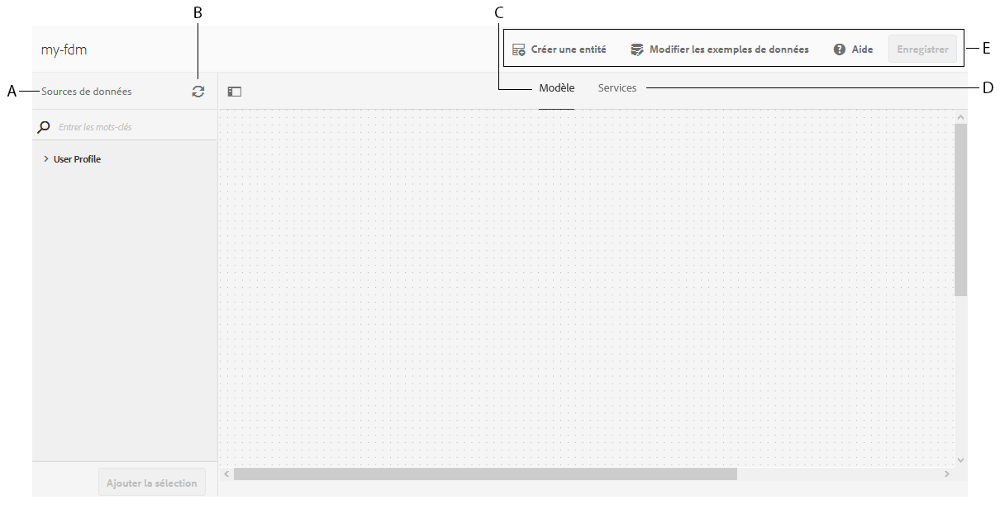
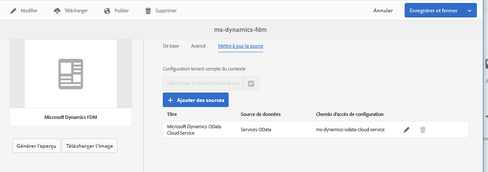

# Création d’un modèle de données de formulaire {#create-form-data-model}

>[!CAUTION]
>
>AEM 6.4 a atteint la fin de la prise en charge étendue et cette documentation n’est plus mise à jour. Pour plus d’informations, voir notre [période de support technique](https://helpx.adobe.com/fr/support/programs/eol-matrix.html). Rechercher les versions prises en charge [here](https://experienceleague.adobe.com/docs/?lang=fr).

Découvrez comment créer des modèles de données de formulaire avec ou sans sources de données configurées.

L’intégration des données AEM Forms offre une interface utilisateur intuitive pour créer et utiliser des modèles de données de formulaire. Un modèle de données de formulaire repose sur des sources de données pour l’échange de données ; vous pouvez toutefois créer un modèle de données de formulaire avec ou sans source de données. Il existe deux approches de création d’un modèle de données de formulaire, selon que vous avez ou non configuré les sources de données :

* **Utilisation de sources de données préconfigurées** : si vous avez configuré les sources de données comme décrit dans [Configurer les sources de données](/help/forms/using/configure-data-sources.md), vous pouvez les sélectionner lors de la création d’un modèle de données de formulaire. Elle apporte tous les objets, propriétés et services de modèle de données des sources de données sélectionnées, disponibles dans le modèle de données de formulaire.

* **Sans sources de données**: Si vous n’avez pas configuré de sources de données pour votre modèle de données de formulaire, vous pouvez tout de même le créer sans sources de données. Vous pouvez utiliser le modèle de données de formulaire pour créer des formulaires adaptatifs et une communication interactive et les tester à l’aide de données d’exemple. Lorsque des sources de données sont disponibles, vous pouvez lier le modèle de données de formulaire à des sources de données, qui se répercuteront automatiquement dans les formulaires adaptatifs et les communications interactives associés.

>[!NOTE]
>
>Vous devez être membre des deux groupes **fdm-author** et **forms-user** pour pouvoir créer et utiliser le modèle de données de formulaire. Contactez votre administrateur AEM pour devenir membre des groupes.

## Création d’un modèle de données de formulaire {#data-sources}

Assurez-vous d’avoir configuré les sources de données que vous avez l’intention d’utiliser dans le modèle de formulaire de données, comme décrit dans la section [Configurer les sources de données](/help/forms/using/configure-data-sources.md). Pour créer un modèle de données de formulaire basé sur des sources de données configurées, procédez comme suit :

1. Dans l’instance d’auteur AEM, accédez à **[!UICONTROL Forms (Formulaires) > Data Integrations]** (Intégrations de données).
1. Appuyez sur **[!UICONTROL Créer > Modèle de données de formulaire]**.
1. Dans la boîte de dialogue Créer un modèle de données de formulaire :

   * Spécifiez un nom pour le modèle de données de formulaire.
   * (**Facultatif**) Spécifiez le titre, la description et les balises du modèle de données de formulaire.
   * (**Facultatif et applicable uniquement si les sources de données sont configurées**) Appuyez sur l’icône en forme de coche en regard de l’option **[!UICONTROL Configuration des sources de données]** et sélectionnez le noeud de configuration où résident les services cloud pour les sources de données que vous souhaitez utiliser. Elle limite la liste des sources de données disponibles pour sélection sur la page suivante à celles disponibles dans le noeud de configuration sélectionné. Cependant, toute base de données JDBC et les sources de données de profil utilisateur AEM sont répertoriées par défaut. Si vous ne sélectionnez pas de noeud de configuration, les sources de données de tous les noeuds de configuration sont répertoriées.

   Appuyez sur **[!UICONTROL Suivant]**.

1. (**Applicable uniquement si les sources de données sont configurées**) **[!UICONTROL Sélectionner la source de données]** répertorie les sources de données disponibles, le cas échéant ; Sélectionnez les sources de données à utiliser dans le modèle de données de formulaire.
1. Cliquez sur **[!UICONTROL Créer]**, puis dans la boîte de dialogue de confirmation, sélectionnez **[!UICONTROL Ouvrir]** pour lancer l’éditeur de modèles de données de formulaire.

Passons en revue les différents composants de l’interface utilisateur de l’éditeur de modèles de données de formulaire.

**A. Sources de données** Répertorie les sources de données dans un modèle de données de formulaire. Développez une source de données pour afficher ses objets et services de modèle de données.

**B. Actualiser les définitions de sources de données** : récupère tous les changements dans les définitions de sources de données à partir des sources de données configurées et les met à jour dans l’onglet Sources de données de l’éditeur de modèles de données de formulaire.

**C. Modèle** Zone de contenu dans laquelle les objets de modèle de données ajoutés apparaissent.

**D. Services** Zone de contenu dans laquelle les opérations ou services de source de données ajoutés s’affichent.

**E. Barre d’outils** Outils pour l’utilisation d’un modèle de données de formulaire. La barre d’outils affiche plus d’options en fonction de l’objet sélectionné dans le modèle de données de formulaire.

**F. Ajouter la sélection** Ajoute les objets et les services de modèle de données sélectionnés au modèle de données de formulaire.

Pour plus d’informations sur l’éditeur de modèles de données de formulaire et sur son utilisation en vue de la modification et de la configuration du modèle de données de formulaire, consultez la section [Utiliser un modèle de données de formulaire](/help/forms/using/work-with-form-data-model.md).

## Mise à jour des sources de données {#update}

Pour ajouter ou mettre à jour des sources de données dans un modèle de données de formulaire existant, procédez comme suit.

1. Accédez à **[!UICONTROL Formulaires > Intégrations de données]**, sélectionnez le modèle de données de formulaire dans lequel vous souhaitez ajouter ou mettre à jour des sources de données, puis cliquez sur **[!UICONTROL Propriétés]**.
1. Dans les propriétés du modèle de données de formulaire, accédez à l’onglet **[!UICONTROL Mettre à jour la source]**.

   Dans l’onglet Mettre à jour la source :

   * Appuyez sur l’icône de navigation dans le champ **[!UICONTROL Configuration tenant compte du contexte]** et sélectionnez un nœud de configuration où se trouve la configuration cloud de la source de données que vous voulez utiliser. Si vous ne sélectionnez pas de nœud, les configurations cloud qui se trouvent uniquement dans le nœud `global` sont répertoriées lorsque vous appuyez sur **[!UICONTROL Ajouter des sources]**.
   * Pour ajouter une nouvelle source de données, appuyez sur **[!UICONTROL Ajouter des sources]** et sélectionnez les sources de données à ajouter au modèle de données de formulaire. Toutes les sources de données configurées en `global` et le nœud de configuration sélectionné, le cas échéant, s’affichent.
   * Pour remplacer une source de données existante par une autre source de données du même type, appuyez sur l’icône **[!UICONTROL Modifier]** de la source de données et sélectionnez-en une dans la liste des sources de données disponibles.
   * Pour supprimer une source de données existante, appuyez sur l’icône **[!UICONTROL Supprimer]** de la source de données. L’icône Supprimer est désactivée si un objet de modèle de données dans la source de données est ajouté au modèle de données de formulaire.

   

1. Appuyez sur **[!UICONTROL Enregistrer et fermer]** pour enregistrer les mises à jour.

>[!NOTE]
>
>Une fois que vous avez ajouté de nouvelles sources de données ou mis à jour des sources de données existantes dans un modèle de données de formulaire, veillez à mettre à jour les références de liaison, le cas échéant, dans les formulaires adaptatifs et les communications interactives qui utilisent le modèle de données de formulaire mis à jour.

## Étapes suivantes {#next-steps}

Vous disposez désormais d’un modèle de données de formulaire auquel sont ajoutées des sources de données. Vous pouvez ensuite modifier le modèle de données de formulaire pour ajouter et configurer des objets et des services de modèle de données, ajouter des associations entre les objets de modèle de données, modifier des propriétés, ajouter des objets et des propriétés de modèle de données personnalisés, générer des exemples de données, etc.

Pour plus d’informations, reportez-vous à la section [Utilisation d’un modèle de données de formulaire](/help/forms/using/work-with-form-data-model.md).
