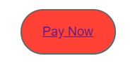

# Didacticiel : Créer une communication interactive {#tutorial-create-interactive-communication}

>[!CAUTION]
>
>AEM 6.4 a atteint la fin de la prise en charge étendue et cette documentation n’est plus mise à jour. Pour plus d’informations, voir notre [période de support technique](https://helpx.adobe.com/fr/support/programs/eol-matrix.html). Rechercher les versions prises en charge [here](https://experienceleague.adobe.com/docs/?lang=fr).

Créer une communication interactive en utilisant tous les blocs de construction

Ce tutoriel fait partie de la série [Création de votre première communication interactive](/help/forms/using/create-your-first-interactive-communication.md). Il est recommandé de suivre la série dans un ordre chronologique pour comprendre, exécuter et démontrer le cas d’utilisation complet du tutoriel.

Une fois que vous avez créé tous les blocs de création, tels que le modèle de données de formulaire, les fragments de document, les modèles et les thèmes pour la version web, vous pouvez commencer à créer une communication interactive.

Les communications interactives peuvent être fournies par deux canaux : impression et web. Vous pouvez également créer une communication interactive avec le canal d’impression comme gabarit. L’impression en tant qu’option principale pour le canal web garantit que le contenu, l’héritage et la liaison des données du canal web sont dérivés du canal d’impression. Elle garantit également que les modifications apportées au canal d’impression sont synchronisées dans le canal web. Les auteurs de communication interactive sont toutefois autorisés à interrompre l’héritage pour des composants spécifiques du canal web.

Ce tutoriel vous guide tout au long des étapes de création de communications interactives pour les canaux d’impression et web. À la fin de ce didacticiel, vous serez capable de :

* Créer une communication interactive pour le canal d’impression
* Créer une communication interactive pour le canal web
* Créer des communications interactives d’impression et web avec l’impression comme Principal

## Créer des communications interactives pour l’impression et le web sans synchronisation {#create-interactive-communications-for-print-and-web-with-no-synchronization}

### Créer une communication interactive pour le canal d’impression {#create-interactive-communication-for-print-channel}

Voici la liste des ressources qui ont déjà été créées dans ce tutoriel et qui sont nécessaires lors de la création de la communication interactive pour le canal d’impression :

**Modèle d’impression :** [create_first_ic_print_template](/help/forms/using/create-templates-print-web.md)

**Modèle de données de formulaire :** [FDM_Create_First_IC](create-form-data-model-tutorial.md)

**Fragments de document :** [bill_details_first_ic, customer_details_first_ic, bill_summary_first_ic, summary_charges_first_ic](/help/forms/using/create-document-fragments.md)

**Fragments de mise en page :** [table_lf](/help/forms/using/create-templates-print-web.md)

**Images :** PayNow et ValueAddedServices

1. Connectez-vous à l’instance d’auteur AEM et accédez à **[!UICONTROL Adobe Experience Manager]** > **[!UICONTROL Formulaires]** > **[!UICONTROL Formulaires et documents]**.
1. Appuyez sur **Créer** et sélectionnez **Communication interactive**. L’assistant **Créer une communication interactive** s’affiche.
1. Spécifiez **create_first_ic** dans les champs **Titre** et **Nom**. Sélectionnez **FDM_Create_First_IC** comme modèle de données de formulaire et appuyez sur **Suivant**.
1. Dans l’assistant **Canaux** :

   1. Spécifiez **create_first_ic_print_template** comme modèle d’impression et appuyez sur **Sélectionner**. Assurez-vous que la case **Utiliser l’impression en tant que page principale pour le canal web** n’est pas cochée.
   1. Spécifiez le dossier **Create_First_IC_templates** > **Create_First_IC_Web_Template** en tant que modèle web et appuyez sur **Sélectionner**.
   1. Appuyez sur **Créer**.

   Un message de confirmation s’affiche pour confirmer que la communication interactive a bien été créée.

1. Appuyer **Modifier** pour ouvrir la communication interactive dans le volet de droite.
1. Accédez à l’onglet **Ressources** et appliquez le filtre pour afficher uniquement les fragments de document dans le volet gauche.
1. Faites glisser les fragments de document suivants vers leurs zones cibles dans la communication interactive :

   | Fragment de document | Zone cible |
   |---|---|
   | bill_details_first_ic | BillDetails |
   | customer_details_first_ic | CustomerDetails |
   | bill_summary_first_ic | BillSummary |
   | summary_charges_first_interactive_communication | Frais |

   

1. Appuyez sur **Graphiques** dans la zone cible et appuyez sur **+** pour ajouter un composant **Graphique.**
1. Appuyez sur le composant Graphique et sélectionnez  (Configurer). Les propriétés du graphique s’affichent dans le volet de gauche :

   1. Attribuez un nom au graphique.
   1. Sélectionnez **Diagramme circulaire** dans la liste déroulante **Type de graphique**.
   1. Sélectionnez la propriété **calltype** à partir du type d’objet du modèle de données **Calls** dans la section **Axe X**. Appuyez sur .
   1. Sélectionnez **Fréquence** dans la liste déroulante **Fonctions**.
   1. Sélectionnez la propriété **calltype** à partir du type d’objet du modèle de données **Appels** dans la section **Axe Y**. Appuyez sur .
   1. Appuyez sur  pour enregistrer les propriétés du graphique.

1. Accédez à l’onglet **Actifs** et appliquez le filtre pour afficher uniquement les fragments de mise en page dans le volet gauche. Faites glisser le fragment de mise en page **table_lf** dans la zone cible **Appels détaillés**.
1. Sélectionnez le champ de texte dans la colonne **Date** et appuyez sur  (Configurer).
1. Sélectionnez **Objet du modèle de données** dans la liste déroulante **Type de liaison** et sélectionnez **calls** > **calldate**. Appuyez deux fois sur  pour enregistrer les propriétés.

   De même, créez une liaison avec **calltime**, **callnumber**, **callduration** et **callcharges** pour les champs texte dans les colonnes **Heure**, **Numéro**, **Durée** et **Frais**.

1. Appuyez sur la zone cible **PayNow** et appuyez sur **+** pour ajouter un composant **Image**.
1. Appuyez sur le composant Image et sélectionnez  (Configurer). Les propriétés de l’image s’affichent dans le volet de gauche :

   1. Spécifier **PayNow** comme nom de l’image dans la variable **Nom** champ .
   1. Appuyez sur **Télécharger**, sélectionnez l’image enregistrée sur le système de fichiers local puis appuyez sur **Ouvrir**.
   1. Appuyez sur  pour enregistrer les propriétés de l’image.

1. Répétez les étapes 13 et 14 pour ajouter l’image **ValueAddedServices** à la zone cible **ValueAddedServices**.

### Créer une communication interactive pour canal web {#create-interactive-communication-for-web-channel}

Voici la liste des ressources qui ont déjà été créées dans ce tutoriel et qui sont nécessaires lors de la création de la communication interactive pour le canal web :

**Modèle web :** [Create_First_IC_Web_Template](/help/forms/using/create-templates-print-web.md)

**Modèle de données de formulaire :** [FDM_Create_First_IC](create-form-data-model-tutorial.md)

**Fragments de document :** [bill_details_first_ic, customer_details_first_ic, bill_summary_first_ic, summary_charges_first_ic](/help/forms/using/create-document-fragments.md)

**Images :** PayNowWeb et ValueAddedServicesWeb

1. Connectez-vous à l’instance d’auteur AEM et accédez à **[!UICONTROL Adobe Experience Manager]** > **[!UICONTROL Formulaires]** > **[!UICONTROL Formulaires et documents]**.
1. Appuyez sur **Créer** et sélectionnez **Communication interactive**. L’assistant **Créer une communication interactive** s’affiche.
1. Spécifiez **create_first_ic** dans les champs **Titre** et **Nom**. Sélectionnez **FDM_Create_First_IC** comme modèle de données de formulaire et appuyez sur **Suivant**.
1. Dans l’assistant **Canaux** :

   1. Spécifiez **create_first_ic_print_template** comme modèle d’impression et appuyez sur **Sélectionner**. Assurez-vous que la case **Utiliser l’impression en tant que page principale pour le canal web** n’est pas cochée.
   1. Spécifiez le dossier **Create_First_IC_templates** > **Create_First_IC_Web_Template** en tant que modèle web et appuyez sur **Sélectionner**.
   1. Appuyez sur **Créer**.

   Un message de confirmation s’affiche pour confirmer que la communication interactive a bien été créée.

1. Appuyer **Modifier** pour ouvrir la communication interactive dans le volet de droite.
1. Appuyez sur l’onglet **Canaux** dans le volet gauche et appuyez sur **Web**.
1. Accédez à l’onglet **Ressources** et appliquez le filtre pour afficher uniquement les fragments de document dans le volet gauche.
1. Faites glisser les fragments de document suivants vers leurs zones cibles dans la communication interactive :

   | Fragment de document | Zone cible |
   |---|---|
   | bill_details_first_ic | BillDetails |
   | customer_details_first_ic | CustomerDetails |
   | bill_summary_first_ic | BillSummary |
   | summary_charges_first_interactive_communication | Frais |

1. Appuyez sur **Résumé des frais** dans la zone cible et appuyez sur **+** pour ajouter un composant **Graphique**.
1. Appuyez sur le composant Graphique et sélectionnez  (Configurer). Les propriétés du graphique s’affichent dans le volet de gauche :

   1. Attribuez un nom au graphique.
   1. Sélectionnez **Diagramme circulaire** dans la liste déroulante **Type de graphique**.
   1. Sélectionnez la propriété **calltype** à partir du type d’objet du modèle de données **Calls** dans la section **Axe X**. Appuyez sur .
   1. Sélectionnez **Fréquence** dans la liste déroulante **Fonctions**.
   1. Sélectionnez la propriété **calltype** à partir du type d’objet du modèle de données **Appels** dans la section **Axe Y**. Appuyez sur .
   1. Appuyez sur  pour enregistrer les propriétés du graphique.

1. Sélectionnez l’onglet **Sources de données** dans le volet gauche et faites glisser l’objet de modèle de données **calls** vers la zone cible **Appels détaillés**. Toutes les propriétés de l’objet de modèle de données **calls** sont affichées sous forme de colonnes de tableau dans la zone cible **Appels détaillés** dans le volet droit.

   Selon le cas d’utilisation, vous avez besoin des colonnes Date d’appel, Heure d’appel, Numéro d’appel, Durée d’appel et Frais d’appel dans le tableau.

   

1. Sélectionnez l’en-tête de colonne du tableau **Mobilenum** et sélectionnez **Plus d’options** > **Supprimer colonne**. De même, supprimez la colonne **calltype**.
1. Sélectionnez l’en-tête de la colonne **Calldate** du tableau et appuyez sur  pour remplacer le texte par **Date de l’appel**. De même, renommez les autres en-têtes de colonne du tableau.
1. En fonction du cas d’utilisation, insérez une **Payer maintenant** dans la communication interactive qui permet à l’utilisateur d’effectuer le paiement en cliquant sur le bouton . Pour insérer le bouton, procédez comme suit :

   1. Appuyez sur **Payer maintenant** dans la zone cible et appuyez sur **+** pour ajouter un composant **Texte**.
   1. Appuyez sur le composant texte et appuyez sur .
   1. Renommez le texte en **Payer maintenant**.
   1. Sélectionnez le texte et appuyez sur l’icône Lien hypertexte.
   1. Spécifiez l’URL de paiement dans la variable **Chemin** champ .
   1. Sélectionner **Nouvel onglet** de **Cible** liste déroulante.
   1. Appuyez sur  pour enregistrer les propriétés hyperlien.

1. Sélectionnez **Style** dans la liste déroulante en regard de l’option **Aperçu**.

   

1. Personnalisez le texte de l’hyperlien pour l’afficher en tant que bouton dans la communication interactive en suivant les étapes suivantes :

   1. Appuyez sur le composant texte et sélectionnez  (Modifier).
   1. Dans le **Bordure** , spécifiez **1,5 px** as **Largeur de la bordure**, sélectionnez **Plein** as **Style de bordure** et spécifiez **46 px** as **Rayon de bordure**.
   1. Sélectionnez Rouge comme couleur d’arrière-plan pour le bouton dans le **Contexte** .
   1. Dans le champ **Marge** de la section **Dimensions et position**, appuyez sur l’icône **Modifier simultanément** et définissez la marge de **droite** à **450 px**. Les zones Haut, Bas et Gauche sont définies comme vides.

   

1. Appuyez sur **Payer maintenant** dans la zone cible, puis appuyez sur **+** pour ajouter un composant **Image**.
1. Appuyez sur le composant Image et sélectionnez  (Configurer). Les propriétés de l’image s’affichent dans le volet de gauche :

   1. Spécifier **PayNow** comme nom de l’image dans la variable **Nom** champ .
   1. Appuyez sur **Télécharger**, sélectionnez l’image **PayNowWeb** enregistrée sur le système de fichiers local puis appuyez sur **Ouvrir**.
   1. Appuyez sur  pour enregistrer les propriétés de l’image.

1. Selon le cas d’utilisation, insérez un bouton **S’abonner** dans la communication interactive qui permet à l’utilisateur de s’abonner aux services à valeur ajoutée en cliquant sur le bouton.

   Répétez les étapes 13 à 17 pour ajouter un bouton **S’abonner** à la zone cible des **services à valeur ajoutée** et ajouter l’image **ValueAddedServicesWeb**.

## Création de communications interactives pour l’impression et le web avec synchronisation automatique {#create-interactive-communications-for-print-and-web-with-auto-synchronization}

Vous pouvez également créer une communication interactive en activant la synchronisation automatique entre les canaux d’impression et web. Pour activer la synchronisation automatique, sélectionnez l’option Imprimer en tant que gabarit lors de la création de la communication interactive. La sélection de l’option Imprimer comme option principale garantit que le contenu, l’héritage et la liaison des données du canal web sont dérivés du canal d’impression. Elle garantit également que les modifications apportées au canal d’impression sont répercutées dans le canal web.

Pour dériver le contenu du canal web à l’aide du canal d’impression, procédez comme suit :

1. Connectez-vous à l’instance d’auteur AEM et accédez à **[!UICONTROL Adobe Experience Manager]** > **[!UICONTROL Formulaires]** > **[!UICONTROL Formulaires et documents]**.
1. Appuyez sur **Créer** et sélectionnez **Communication interactive**. L’assistant **Créer une communication interactive** s’affiche.
1. Spécifiez **create_first_ic** dans les champs **Titre** et **Nom**. Sélectionnez **FDM_Create_First_IC** comme modèle de données de formulaire et appuyez sur **Suivant**.
1. Dans l’assistant **Canaux** :

   1. Spécifiez **create_first_ic_print_template** comme modèle d’impression et appuyez sur **Sélectionner**.
   1. Cochez la case **Utiliser l’impression en tant que page principale pour le canal web**.
   1. Spécifiez le dossier **Create_First_IC_templates** > **Create_First_IC_Web_Template** en tant que modèle web et appuyez sur **Sélectionner**.
   1. Appuyez sur **Créer**.

   Un message de confirmation s’affiche pour confirmer que la communication interactive a bien été créée.

1. Appuyer **Modifier** pour ouvrir la communication interactive dans le volet de droite.
1. Exécutez les étapes 6 à 15 de la section [Créer une communication interactive pour le canal d’impression](#create-interactive-communication-for-print-channel).
1. Appuyez sur l’onglet **Canaux** dans le volet gauche et appuyez sur **Web** pour générer automatiquement du contenu pour le canal web à partir du canal d’impression.
1. Comme la case **Utiliser l’impression en tant que page principale pour le canal web** est cochée à l’étape 4, le contenu et les liaisons sont générés automatiquement pour le canal web à partir du canal d’impression.

   Le contenu du canal d’impression est inséré sous le contenu du modèle de canal web. Pour modifier le contenu du canal web généré automatiquement à partir du canal d’impression, vous pouvez annuler l’héritage pour n’importe quelle zone cible.

   Passez le curseur sur la zone cible correspondante dans le canal web et sélectionnez  (Annuler l’héritage) puis, dans la boîte de dialogue **Annuler l’héritage**, appuyez sur **Oui**.

   

   Si vous avez annulé l’héritage d’un composant, vous pouvez le réactiver. Pour réactiver l’héritage, passez le curseur au-dessus de la limite de la zone cible pertinente incluant le composant et appuyez sur .

1. Sélectionnez la **Contenu** dans le volet de gauche.
1. Faites glisser le contenu du canal web généré automatiquement vers les panneaux existants du modèle web à l’aide de l’arborescence de contenu. Voici la liste des composants qui doivent être réorganisés :

   * Composant Informations de facturation dans le panneau Informations de facturation
   * Composant Détails client du panneau Détails client
   * Composant Résumé de facturation dans le panneau Résumé de facturation
   * Composant Résumé des frais dans le panneau Résumé des frais
   * Fragment de mise en page (tableau) dans le panneau Appels détaillés

   

1. Répétez les étapes 13 à 18 de la section [Créer une communication interactive pour canal web](#create-interactive-communication-for-web-channel) pour insérer les hyperliens **Payer maintenant** et **S’abonner** dans le canal web de la communication interactive.
