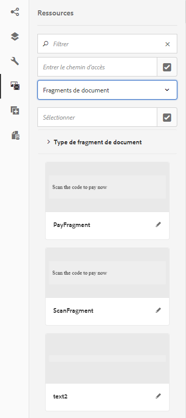
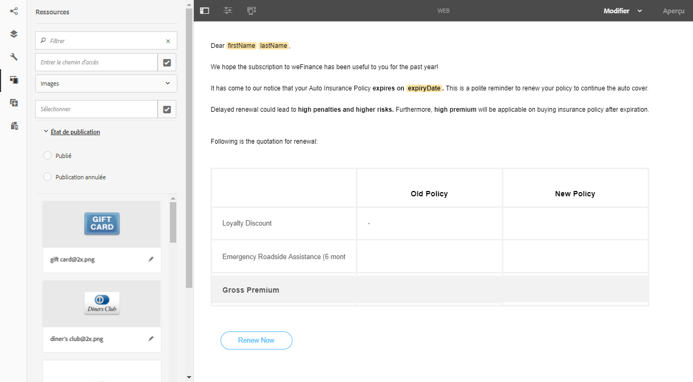
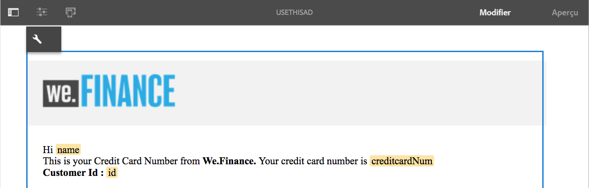
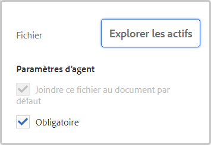

# Créer une communication interactive  {#create-an-interactive-communication}

Créez une communication interactive à l’aide de l’éditeur de communication interactive. Utilisez la fonctionnalité glisser-déposer pour créer la communication interactive et prévisualisez les sorties d’impression et web sur différents types d’appareils.

## Présentation {#overview}

Les communications interactives centralisent et gèrent la création, l’assemblage et la livraison de correspondances sécurisées, personnalisées et interactives. Utilisez l’impression en tant que canal principal pour le Web. Vous pouvez minimiser les efforts fournis lors de la création de la sortie web de la communication interactive.

### Prérequis {#prerequisites}

Les conditions préalables à la création d’une communication interactive sont les suivantes :

* Configurez un [modèle de données de formulaire](/help/forms/using/data-integration.md) contenant des données de test ou une source de données réelle, telle qu’une instance de Microsoft® Dynamics.
* Assurez-vous de disposer des [fragments de document](/help/forms/using/document-fragments.md).
* Assurez-vous de disposer de [modèles de canal d’impression et de canal web](/help/forms/using/web-channel-print-channel.md).
* Assurez-vous de disposer du [thème](/help/forms/using/themes.md) requis pour le canal web.

## Créer une communication interactive {#createic}

1. Connectez-vous à l’instance d’auteur AEM et accédez à **[!UICONTROL Adobe Experience Manager]** > **[!UICONTROL Formulaires]** > **[!UICONTROL Formulaires et documents]**.
1. Appuyez sur **[!UICONTROL Créer]** et sélectionnez **[!UICONTROL Communication interactive]**. La page Créer une communication interactive s’affiche.

   

1. Saisissez les informations suivantes :  :

   * **[!UICONTROL Titre]** : entrez le titre de la communication interactive.
   * **[!UICONTROL Nom*]**: Le nom de la communication interactive est dérivé du titre que vous saisissez. Modifiez-le, si nécessaire.
   * **[!UICONTROL Description]** : entrez une description de la communication interactive.
   * **[!UICONTROL Modèle de données de formulaire*]** : recherchez et sélectionnez le modèle de données de formulaire. Pour plus d’informations sur le modèle de données de formulaire, consultez [Intégration de données AEM Forms](/help/forms/using/data-integration.md).
   * **[!UICONTROL Service de préremplissage]** : sélectionnez le service de préremplissage pour récupérer les données et préremplissez la communication interactive.
   * **[!UICONTROL Type de post-traitement]** : sélectionnez le workflow AEM ou Forms à déclencher lors de l’envoi de la communication interactive. Sélectionnez le type de processus à déclencher.
   * **[!UICONTROL Post-traitement]** : sélectionnez le nom du processus à déclencher. Lorsque vous sélectionnez le workflow AEM, fournissez le chemin d’accès de la pièce jointe, le chemin d’accès à la mise en forme, le chemin d’accès au fichier PDF, le chemin d’accès aux données d’impression et le chemin de données web.
   * **[!UICONTROL Balises]** : sélectionnez les balises à appliquer à la communication interactive. Vous pouvez également saisir un nom de balise nouveau ou personnalisé et appuyer sur Entrée pour créer la balise.
   * **[!UICONTROL Auteur]** : le nom de l’auteur est automatiquement extrait du nom de l’utilisateur connecté.
   * **[!UICONTROL Date de publication :]** entrez la date de publication de la communication interactive.
   * **[!UICONTROL Date d’annulation de la publication]** : entrez la date de l’annulation de la publication de la communication interactive.

1. Appuyez sur **[!UICONTROL Suivant]**. L’écran de spécification des informations relatives aux canaux web et d’impression s’affiche.
1. Entrez la commande suivante :

   * **[!UICONTROL Imprimer]** : sélectionnez cette option pour générer le canal d’impression de la communication interactive.
   * **[!UICONTROL Modèle d’impression* :]** Recherchez et sélectionnez un fichier XDP comme modèle d’impression.
   * **[!UICONTROL Utiliser l’impression comme Principal pour le canal web :]** Sélectionnez cette option pour créer le canal web en synchronisation avec le canal d’impression. L’utilisation du canal d’impression comme page principale du canal web garantit que le contenu et la liaison des données du canal web sont dérivés du canal d’impression et que les modifications apportées au canal d’impression sont répercutées sur le canal web lorsque vous appuyez sur Synchroniser. Les auteurs sont toutefois autorisés à interrompre l’héritage pour des composants spécifiques dans le canal web, selon les besoins. Pour plus d’informations, consultez [Synchroniser le canal web avec le canal d’impression](/help/forms/using/create-interactive-communication.md#synchronize).
   * **[!UICONTROL Web :]** Sélectionnez cette option pour générer le canal web ou la sortie réactive de la communication interactive.
   * **[!UICONTROL Modèle Web de communication interactive* :]** recherchez et sélectionnez le modèle Web.
   * **[!UICONTROL Thème]** et **[!UICONTROL Sélectionner un thème*]**: Recherchez et sélectionnez le thème pour mettre en forme le canal web de la communication interactive. Pour plus d’informations, voir [Thèmes dans AEM Forms](/help/forms/using/themes.md).
   Pour plus d’informations sur le canal d’impression et le canal web, consultez [Canal d’impression et canal web](/help/forms/using/web-channel-print-channel.md).

1. Appuyez sur **[!UICONTROL Créer]**. La communication interactive est créée et un message d’alerte s’affiche. Appuyez sur **[!UICONTROL Modifier]** pour commencer à créer le contenu de la communication interactive, comme expliqué dans [Ajouter du contenu à l’aide de l’interface utilisateur de création de communication interactive](#step2). Vous pouvez également appuyer sur **[!UICONTROL Terminé]** et choisir de modifier ultérieurement la communication interactive.

## Ajouter du contenu à la communication interactive {#step2}

Après avoir créé une communication interactive, vous pouvez utiliser l’interface de création de la communication interactive pour développer son contenu.

Pour en savoir plus sur l’interface de création de la communication interactive, consultez [Introduction à la création d’une communication interactive](/help/forms/using/introduction-interactive-communication-authoring.md).

1. L’interface de création de la communication interactive se lance lorsque vous appuyez sur Modifier comme indiqué dans [Créer une communication interactive](#createic). Vous pouvez également accéder à une ressource de communication interactive existante sur AEM, la sélectionner, puis appuyer sur **[!UICONTROL Modifier]** pour lancer l’interface de création de la communication interactive.

   Par défaut, le canal d’impression de la communication interactive s’affiche, sauf si la communication interactive se trouve uniquement sur le canal web. Le canal d’impression de la communication interactive affiche les zones cibles, disponibles dans le modèle de canal d’impression/XDP sélectionné. Vous pouvez ajouter des composants ou des ressources dans ces zones et champs cibles.

1. Lorsque le canal d’impression est sélectionné, sélectionnez l’onglet **[!UICONTROL Composants]**. Les composants suivants sont disponibles dans le canal d’impression :

   | **Composant** | **Fonctionnalité** |
   |---|---|
   | Graphique | Ajoute un graphique que vous pouvez utiliser dans une communication interactive pour la représentation visuelle des données bidimensionnelles extraites d’une collection de modèle de données de formulaire. Pour en savoir plus, consultez la rubrique [Utiliser des graphiques dans les communications interactives](/help/forms/using/chart-component-interactive-communications.md). |
   | Fragment de document | Vous permet d’ajouter un composant réutilisable, comme du texte, une liste ou une condition, à une communication interactive. Le composant ajouté peut être basé sur un modèle de données de formulaire ou sans modèle de données de formulaire. |
   | Image | Permet d’insérer une image. |

   Faites glisser et déposez les composants dans votre communication interactive et configurez-les selon vos besoins.

1. Lorsque le canal d’impression est sélectionné, accédez à l’onglet **[!UICONTROL Ressources]** et appliquez le filtre pour afficher uniquement les ressources souhaitées.

   L’explorateur de ressources vous permet également de faire glisser-déposer directement des ressources dans les zones cibles de la communication interactive.

   

1. Glissez-déposez les fragments de document dans la communication interactive. Vous trouverez ci-dessous les types de fragments de document que vous pouvez utiliser dans le canal d’impression de la communication interactive.

<table> 
 <tbody> 
  <tr> 
   <td><strong>Type de fragment de document</strong></td> 
   <td><strong>Exemple d’objectif</strong></td> 
  </tr> 
  <tr> 
   <td><a href="/help/forms/using/texts-interactive-communications.md" target="_blank">Texte</a></td> 
   <td>Texte d’ajout de l’adresse électronique du destinataire, et du corps du texte de la lettre </td> 
  </tr> 
  <tr> 
   <td><a href="/help/forms/using/conditions-interactive-communications.md" target="_blank">Condition</a></td> 
   <td>Condition pour l’ajout de l’image d’en-tête adaptée à la communication en fonction du type de stratégie : standard ou premium.   </td> 
  </tr> 
  <tr> 
   <td>Liste</td> 
   <td>Groupe de fragments du document, notamment le texte, les conditions, les autres listes et les images.   </td> 
  </tr> 
 </tbody> 
</table>

Pour plus d’informations sur les fragments de document, reportez-vous à la section [Fragments de document](/help/forms/using/document-fragments.md).

1. Pour configurer la liaison des variables, appuyez sur une variable et sélectionnez  (Configurer), puis configurez les propriétés de liaison dans le panneau Propriétés de la barre latérale.

   * **[!UICONTROL Aucun]** : l’agent remplira la valeur de la variable.
   * **[!UICONTROL Fragment de texte]** : si cette option est sélectionnée, vous pouvez rechercher et sélectionner un fragment de document texte dont le contenu est rendu dans le champ. Seuls ces fragments de document texte peuvent être liés à des variables qui ne contiennent aucune variable.
   * **[!UICONTROL Objet de modèle de données]** : sélectionnez une propriété de modèle de données de formulaire dont la valeur est renseignée dans le champ.
   Vous pouvez également choisir de configurer le fragment de document texte approprié. Le panneau Propriétés affiche la liste des variables dans le fragment de document texte. Vous pouvez appuyer sur  (Modifier) en regard d’un nom de variable pour afficher les paramètres de cette variable en vue de la modifier.

1. Pour l’ajout d’un tableau, lorsque le canal d’impression est sélectionné, appliquez le filtre pour afficher uniquement les fragments de mise en page dans l’onglet **[!UICONTROL Ressources]**. Glissez-déposez le fragment de mise en page requis dans la communication interactive. Un fragment de mise en page est basé sur un XDP et peut être utilisé pour créer des mises en page graphiques ou des tableaux statiques et dynamiques dans la communication interactive qui sont ensuite remplis de données dynamiques.

   Exemple : un tableau de mise en page pour l’affichage de la prime brute, du pourcentage de remise fidélité et de la disponibilité de l’assistance routière d’urgence pour les anciennes et les nouvelles stratégies.

   Pour plus d’informations sur les fragments de mise en page, reportez-vous à la section [Fragments de document](/help/forms/using/document-fragments.md).

1. Lorsque le canal d’impression est sélectionné, appliquez le filtre d’affichage des images dans l’onglet **[!UICONTROL Ressources]**. Glissez et déposez les images requises dans la communication interactive, par exemple pour le logo de l’entreprise.

   Ensuite, gérez les éléments suivants dans la communication interactive :

   * [Ajout et configuration de graphiques](/help/forms/using/chart-component-interactive-communications.md)
   * [Synchronisation du canal web avec le canal d’impression](/help/forms/using/create-interactive-communication.md#synchronize)

      * Synchronisation automatique
      * Annuler l’héritage
      * Réactiver l’héritage
      * Synchroniser
   * [Pièces jointes et accès à la bibliothèque](/help/forms/using/create-interactive-communication.md#attachmentslibrary)
   * [Propriétés du champ XDP/mise en page](/help/forms/using/create-interactive-communication.md#xdplayoutfieldproperties)
   * [Ajouter des règles aux composants](/help/forms/using/create-interactive-communication.md#rules)

1. Basculez vers **[!UICONTROL Canal web]**. Le canal web s’affiche dans l’éditeur de communication interactive. Lorsque vous passez du canal d’impression au canal web pour la première fois, la synchronisation automatique a lieu. Pour plus d’informations, consultez la section [Synchroniser le canal web depuis le canal d’impression](/help/forms/using/create-interactive-communication.md#synchronize).

   Comme nous utilisons le canal d’impression comme base pour le canal web dans cet exemple, les espaces réservés, le contenu et la liaison de données du canal d’impression sont synchronisés avec le canal web. Toutefois, vous pouvez modifier et personnaliser le contenu spécifique dans le canal web selon vos besoins.

   

1. Pour ajouter des composants supplémentaires dans le canal web, lorsque le canal web est sélectionné, appuyez sur **[!UICONTROL Composants]**. Faites glisser et déposez les composants dans le canal web de votre communication interactive selon vos besoins et continuez à les configurer.

   | Composants | Fonctionnalité |
   |---|---|
   | Graphique | Ajoute un graphique que vous pouvez utiliser dans une communication interactive pour la représentation visuelle des données bidimensionnelles extraites d’une collection de modèles de données de formulaire. Pour en savoir plus, voir [Utiliser le composant de graphique](/help/forms/using/chart-component-interactive-communications.md). |
   | Fragment de document | Vous permet d’ajouter un composant réutilisable, du texte, une liste ou une condition à une communication interactive. Le composant réutilisable que vous ajoutez à une communication interactive peut être basé sur modèle de données de formulaire ou sans modèle de données de formulaire. |
   | Image | Permet d’insérer une image. |
   | Panneau | Le composant Panneau est un espace réservé pour regrouper d’autres composants et contrôle la disposition d’un groupe de composants (accordéons et onglets) dans la communication interactive. Un composant de panneau vous permet également de permettre la répétition d’un groupe de composants pour l’utilisateur final, par exemple dans plusieurs entrées requises pour remplir les informations d’identification. |
   | Tableau | Ajoute un tableau qui permet de classer les données par lignes et par colonnes. |
   | Zone cible | Insère une zone cible dans un canal web pour organiser les composants spécifiques au canal web. La zone cible est un conteneur standard permettant de regrouper des composants spécifiques au canal web. |
   | Texte | Ajoute le texte enrichi au canal web d’une communication interactive. Le texte peut également utiliser des objets de modèle de données de formulaire pour rendre le contenu dynamique. |

1. Au besoin, insérez des ressources dans votre canal web.

   Vous pouvez [prévisualiser votre communication interactive](#previewic) pour voir à quoi ressemblent les impressions et sorties web de la communication interactive et continuer à apporter des modifications, si nécessaire.

## Prévisualiser la communication interactive {#previewic}

Vous pouvez utiliser la variable **[!UICONTROL Aperçu]** pour évaluer l’aspect de la communication interactive. Le canal web de la communication interactive fournit également une option permettant d’émuler l’expérience d’une communication interactive pour différents appareils. Par exemple, iPhone, iPad et appareils de bureau. Vous pouvez utiliser les options **[!UICONTROL Aperçu]** et  d’**[!UICONTROL émulateur]** conjointement pour visualiser un aperçu des sorties web pour les appareils dotés de tailles d’écran différentes. Les exemples de données dans l’aperçu sont renseignés à partir du modèle de données de formulaires spécifié.

1. Sélectionnez le canal (d’impression ou web) à prévisualiser et appuyez sur Aperçu. La communication interactive s’affiche.

   >[!NOTE]
   >
   >L’aperçu est rempli avec les exemples de données du modèle de données de formulaire spécifié. Pour plus d’informations sur la prévisualisation de la communication interactive avec d’autres données ou l’utilisation du service de préremplissage, consultez les sections [Utiliser un modèle de données de formulaire](/help/forms/using/using-form-data-model.md) et [Travailler avec un modèle de données de formulaire](/help/forms/using/work-with-form-data-model.md).

1. Pour le canal web, utilisez  pour visualiser l’apparence de la communication interactive sur différents appareils.

   

Vous pouvez en outre [préparer et envoyer la communication interactive via l’interface utilisateur de l’agent](/help/forms/using/prepare-send-interactive-communication.md).

## Configuration des propriétés dans la communication interactive  {#configuring-properties-in-interactive-communication}

### Pièces jointes et accès à la bibliothèque {#attachmentslibrary}

Dans le canal d’impression, vous pouvez configurer les pièces jointes et l’accès à la bibliothèque pour permettre à l’agent de gérer les pièces jointes dans l’interface utilisateur de l’agent pour la communication interactive :

1. Dans le canal d’impression, mettez en surbrillance le conteneur de documents et appuyez sur **[!UICONTROL Propriétés]**.

   

   Le panneau Propriétés s’affiche dans la barre latérale.

   

1. Développez les **[!UICONTROL pièces jointes]** et spécifiez les propriétés suivantes :

   * **[!UICONTROL Autoriser l’accès à la bibliothèque]** : sélectionnez cette option pour permettre à l’agent d’accéder à la bibliothèque dans l’interface utilisateur de l’agent. Si cette option est activée, l’agent peut ajouter des fichiers depuis la bibliothèque tout en préparant la communication interactive.
   * **[!UICONTROL Autoriser la réorganisation des pièces jointes]** : sélectionnez cette option pour permettre à l’agent de réorganiser les pièces jointes avec la communication interactive.
   * **[!UICONTROL Nombre max de pièces jointes autorisé]** : spécifiez le nombre maximum de pièces jointes autorisées avec la communication interactive.
   * **[!UICONTROL Fichiers à joindre]** : appuyez sur **[!UICONTROL Ajouter]** puis recherchez et sélectionnez les fichiers à joindre et spécifiez les éléments suivants :

      * **[!UICONTROL Joindre ce fichier au document par défaut]** : vous pouvez modifier cette option si seule la pièce jointe n’est pas obligatoire.
      * **[!UICONTROL Obligatoire :]** l’agent ne pourra pas supprimer la pièce jointe dans l’interface utilisateur de l’agent.
   

1. Appuyez sur **[!UICONTROL Terminé]**.

### Propriétés du champ XDP/mise en page {#xdplayoutfieldproperties}

1. Lors de la modification du canal d’impression d’une communication interactive, passez le curseur sur un champ intégré dans le modèle de canal d’impression et sélectionnez  (Configurer).

   La boîte de dialogue Propriétés s’affiche dans la barre latérale.

   

1. Indiquez les informations suivantes :

   * **[!UICONTROL Nom]** : nom du nœud JCR.
   * **[!UICONTROL Titre]** : entrez un titre qui sera visible pour l’agent dans l’interface utilisateur de l’agent et dans l’arborescence du conteneur de documents.
   * **[!UICONTROL Type de liaison]** : sélectionnez l’un des types de liaison suivants pour le champ.

      * Aucun : l’agent remplira la valeur de la propriété.
      * Fragment de texte : si cette option est sélectionnée, vous pouvez rechercher et sélectionner un fragment de document texte dont le contenu est rendu dans le champ.
      * Objet de modèle de données : sélectionnez une propriété de modèle de données de formulaire dont la valeur est renseignée dans le champ.
   * **[!UICONTROL Valeurs par défaut]** : la valeur par défaut veille à ce que le champ ne soit pas vide lorsqu’aucune valeur n’est fournie par l’objet de modèle de données ou le fragment de texte spécifié. Si aucun type de liaison de données n’est défini, la valeur par défaut est préremplie dans la zone.
   * **[!UICONTROL Modifiable par l’agent]** : sélectionnez cette option pour permettre à l’agent de modifier la valeur du champ de l’interface utilisateur de l’agent. Ce paramètre n’est pas applicable si le type de liaison est Fragment de texte.
   * **[!UICONTROL Libellé]** : spécifiez une chaîne de texte affichée avec le champ dans l’interface utilisateur de l’agent. Ce paramètre n’est pas applicable si le type de liaison est Fragment de texte.
   * **[!UICONTROL Info-bulle]** : entrez une chaîne de texte qui sera visible au passage de la souris sur l’agent dans l’interface utilisateur de l’agent. Ce paramètre n’est pas applicable si le type de liaison est Fragment de texte.
   * **[!UICONTROL Obligatoire]** : sélectionnez cette option pour que le champ soit obligatoire pour l’agent. Ce paramètre n’est pas applicable si le type de liaison est Fragment de texte.
   * **[!UICONTROL Permettre des lignes multiples]** : sélectionnez ce champ pour activer les lignes de texte multiples comme entrée dans le champ. Ce paramètre n’est pas applicable si le type de liaison est Fragment de texte.

1. Appuyez sur .

## Appliquer des règles à des composants de communication interactive {#rules}

Pour conditionner les composants ou le contenu dans la communication interactive, appuyez sur le composant/l’élément de contenu et sélectionnez  (Créer une règle) pour lancer l’éditeur de règles.

Pour en savoir plus, voir:

* [Éditeur de règles](/help/forms/using/rule-editor.md)
* [Introduction à la création d’une communication interactive](/help/forms/using/introduction-interactive-communication-authoring.md)

## Utilisation des tableaux {#tables}

### Tableaux dynamiques dans la communication interactive {#dynamic-tables-in-interactive-communication}

Vous pouvez ajouter des tableaux dynamiques dans une communication interactive en utilisant des fragments de disposition. Les étapes suivantes utilisent un exemple de relevé de carte de crédit pour illustrer l’utilisation d’un fragment de mise en page dans le but de créer un tableau dynamique dans une communication interactive.

1. Assurez-vous que le fragment de mise en page nécessaire à la création du tableau est disponible dans AEM.
1. Dans le canal d’impression de votre communication interactive, faites un glisser-déposer d’un fragment de disposition (avec un tableau à plusieurs colonnes) dans une zone cible à partir de l’explorateur des ressources.

   

   Un tableau s’affiche dans la zone Communication interactive.

   

1. Spécifiez la liaison de données pour chacune des cellules du tableau. Pour créer une ligne répétable, insérez les propriétés du modèle de données de formulaire dans la ligne appartenant à une propriété de collection commune.

   1. Appuyez sur une cellule du tableau, puis sélectionnez  (Configurer).

      La boîte de dialogue Propriétés s’affiche dans la barre latérale.

      

   1. Configurez les propriétés :

      * **[!UICONTROL Nom]** : nom du nœud JCR.
      * **[!UICONTROL Titre]** : entrez un titre qui sera visible dans l’éditeur de la communication interactive.
      * **[!UICONTROL Type de liaison]**&amp;ast; : Sélectionnez l’un des types de liaison suivants pour le champ.

         * **[!UICONTROL Aucune]**
         * **[!UICONTROL Objet de modèle de données]** : une valeur de propriété de modèle de données de formulaire est renseignée dans le champ.
      * **[!UICONTROL Objet de modèle de données]** : la propriété de modèle de données de formulaire dont la valeur est renseignée dans le champ.
      * **[!UICONTROL Valeur par défaut]** : la valeur par défaut veille à ce que le champ ne soit pas vide lorsqu’aucune valeur n’est fournie par l’objet de modèle de données spécifié. La valeur par défaut est prérenseignée dans le champ.
      * **[!UICONTROL Modifiable par l’agent]** : sélectionnez cette option pour permettre à l’agent de modifier la valeur du champ de l’interface utilisateur de l’agent.
   1. Appuyez sur .

1. Prévisualisez la communication interactive pour afficher le tableau rendu avec les données.

   

### Tableaux de canal web uniquement {#web-channel-only-tables}

Vous pouvez créer un tableau dynamique de canal web uniquement dans une communication interactive à l’aide d’une propriété de modèle de données de type collection. Ce type de tableau est une représentation des propriétés enfant d’une propriété de collection. Vous ne pouvez modifier que les propriétés de formatage des différentes cellules du tableau.

1. Passez au canal web, puis choisissez d’afficher l’explorateur des sources de données.
1. Glissez-déposez une propriété de collection dans un sous-formulaire.

   Un tableau est créé dans le sous-formulaire.

1. Prévisualisez le tableau dans l’aperçu web de la communication interactive.

## Synchronisation du canal web avec canal d’impression {#synchronize}

Lorsque vous sélectionnez le canal d’impression comme page principale du canal web lors de la création d’une communication interactive, le canal web est créé en synchronisation avec le canal d’impression et le contenu et la liaison des données du canal web sont dérivés du canal d’impression. Les modifications apportées au canal d’impression sont répercutées sur le canal web lorsque vous appuyez sur Synchroniser.

Les auteurs sont toutefois autorisés à interrompre l’héritage pour des composants dans le canal web, selon les besoins.

[Cliquez pour agrandir](assets/printweb_2-3.png)

### Synchronisation automatique {#auto-sync}

Si vous utilisez le canal d’impression comme canal principal pour le canal web et que vous passez du canal d’impression au canal web, la synchronisation automatique a lieu. La synchronisation automatique reflète les espaces réservés, le contenu et la liaison de données du canal d’impression dans le canal web. Selon la complexité et le contenu de votre communication interactive, la synchronisation automatique peut prendre un peu de temps.

>[!NOTE]
>
>La synchronisation des canaux synchronise uniquement les fragments de document, les images, les conditions, les listes et les fragments de disposition du canal d’impression au canal web. Les sous-formulaires ou les nœuds parents de ces éléments ne sont pas synchronisés.

### Annuler l’héritage {#cancel-inheritance}

Dans le canal web, les composants sont inclus dans les zones cible.

Passez le curseur sur la zone cible correspondante dans le canal web et sélectionnez  (Annuler l’héritage) puis, dans la boîte de dialogue Annuler l’héritage, appuyez sur **[!UICONTROL Oui]**.

L’héritage des composants dans la zone cible est annulé et vous pouvez désormais les modifier selon vos besoins.

### Réactiver l’héritage {#re-enable-inheritance}

Dans le canal web, vous pouvez réactiver l’héritage d’un composant si vous l’avez annulé. Pour réactiver l’héritage, passez le curseur au-dessus de la limite de la zone cible pertinente incluant le composant et appuyez sur .

La boîte de dialogue Inverser l’héritage s’affiche.

Si nécessaire, sélectionnez **[!UICONTROL Synchroniser la page après avoir inversé l’héritage]**. Sélectionnez cette option pour synchroniser l’ensemble de la communication interactive. Si vous ne sélectionnez pas cette option, seule la zone cible concernée est synchronisée lors du rétablissement de l’héritage.

Appuyez sur **[!UICONTROL Oui]**.

### Synchroniser {#synchronize-1}

Si vous utilisez le canal d’impression comme base pour le canal web et si vous modifiez le canal d’impression, vous pouvez appliquer les modifications au canal web en appuyant sur Synchroniser.

1. Pour synchroniser le canal web avec le canal d’impression, appuyez sur **[!UICONTROL Synchroniser]**.

   La boîte de dialogue Synchroniser le contenu à partir du canal de Principal s’affiche.

   

1. Utilisez l’une des méthodes suivantes :

   * **[!UICONTROL Ignorer les modifications]** : ignore toutes les modifications apportées au canal web, quelles qu’elles soient.
   * **[!UICONTROL Conserver les modifications]** : synchronise le contenu uniquement pour les zones cible dans lesquelles l’héritage n’est pas annulé.
