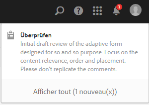
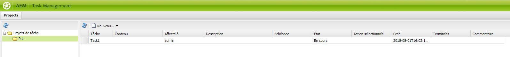
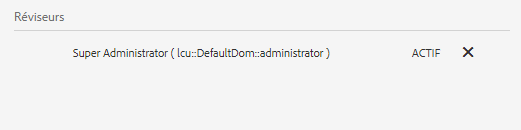
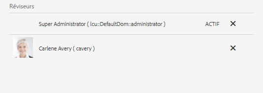

# Création et gestion de révisions des actifs d’un formulaire {#creating-and-managing-reviews-for-assets-in-forms}

>[!CAUTION]
>
>AEM 6.4 a atteint la fin de la prise en charge étendue et cette documentation n’est plus mise à jour. Pour plus d’informations, voir notre [période de support technique](https://helpx.adobe.com/fr/support/programs/eol-matrix.html). Rechercher les versions prises en charge [here](https://experienceleague.adobe.com/docs/?lang=fr).

## Révision {#review}

Une révision est un mécanisme permettant à un ou plusieurs réviseurs d’ajouter des commentaires sur un élément disponible dans un formulaire.

## Configuration d’une révision {#setting-up-a-review}

1. Accédez à l’onglet Formulaires et sélectionnez un formulaire.
1. Si aucune révision de ressource n’est en cours, l’icône de démarrage d’une révision  s’affiche dans la barre Action. Cliquez sur l’icône de démarrage d’une révision .
1. Saisissez les informations suivantes :

   * Nom de la révision : Obligatoire, peut contenir des caractères alphanumériques, des tirets ou des traits de soulignement.
   * Description de la révision : Description facultative de l’objectif/du contenu à réviser.
   * Date limite de révision : (Facultatif) la date de fin de la révision. Une fois l’échéance passée, la tâche est indiquée comme étant « En retard ».
   * Réviseurs : au moins un réviseur doit être indiqué. Utilisez la liste déroulante pour ajouter des réviseurs. Saisissez un nom pour répertorier tous les noms correspondants ; sélectionnez un nom, puis cliquez sur Ajouter.

1. Renseignez tous les détails restants, puis cliquez sur Démarrer.

### Actions survenant lorsqu’une révision est configurée {#actions-that-occur-when-a-review-is-set-up}

Cette section décrit ce qui se produit lorsqu’une révision est créée ou configurée.

1. Une tâche de révision est créée et affectée au responsable du lancement (initiateur) de la révision.
1. Une tâche de révision est affectée à tous les réviseurs. La tâche apparaît dans la section Notifications. Un réviseur peut cliquer sur une notification ou accéder à la boîte de réception pour afficher la tâche. Le réviseur peut cliquer pour ouvrir la tâche de révision, afficher le formulaire et commencer à ajouter des commentaires.

   
   **Figure :** *Alerte de notification du réviseur*

1. La zone de commentaire est accessible à l’initiateur et aux réviseurs de la ressource. Les autres utilisateurs et utilisatrices peuvent voir les commentaires, mais ne sont pas habilités à en rédiger.

## Gestion d’une révision {#managing-a-review}

>[!NOTE]
>
>Seules les révisions en cours peuvent être modifiées. Les révisions terminées ne peuvent pas être modifiées.

1. Accédez à l’onglet Formulaires et sélectionnez un formulaire.

1. Si une révision de ressource est en cours et que vous en êtes l’initiateur, l’icône Gérer la révision  s’affiche dans la barre Action. Seul l’initiateur de la révision peut gérer (mettre à jour/terminer) la révision.

   Cliquez sur l’icône Gérer la révision .

   Cette icône est désactivée pour les utilisateurs autres que l’initiateur.

1. Un écran affiche alors les informations suivantes :

   * **Nom de la révision** : ce champ ne peut pas être modifié.
   * **Description de la révision** : ce champ peut être modifié.
   * **Échéance** : ce champ peut être modifié. Vous pouvez modifier l’échéance selon n’importe quelle date et heure au-delà de la date et de l’heure actuelles.
   * **Réviseurs**: Disponible pour modification. Vous pouvez ajouter ou supprimer des réviseurs. Si une tâche est en retard, vous ne pouvez ajouter des réviseurs qu&#39;après avoir prolongé l&#39;échéance au-delà de la date actuelle.

1. Editez les champs nécessaires, puis cliquez sur Mettre à jour.

   
   **Figure :** *État de révision mis à jour dans Task Manager*

1. Pour mettre fin à la révision, cliquez sur Terminer.

### Action survenant lorsqu’une révision est modifiée {#actions-that-occur-when-a-review-is-modified}

Cette section décrit ce qui se passe à la fin ou à la modification de la révision :

1. Si la description de la révision est modifiée, la tâche correspondante des réviseurs/réviseuses et de la personne ayant lancé la révision est mise à jour.
1. Si l’échéance de la révision est modifiée, la nouvelle date est appliquée à la tâche correspondante pour les réviseurs.

1. Si un réviseur est supprimé :

   
   **Figure :** *Suppression d’un réviseur*

   1. Si elle est incomplète, la tâche affectée est arrêtée.
   1. Le réviseur ne peut plus commenter l’actif.

1. Si un réviseur est ajouté :

   
   **Figure :** *Ajouter un validant*

   1. Une tâche de révision est créée et affectée au réviseur qui vient d’être ajouté.
   1. Le réviseur nouvellement ajouté peut ajouter des commentaires pour la ressource.

1. Lorsqu’une révision est terminée :

   1. **Réviseurs**: Pour chaque validant, la tâche incomplète associée à la révision est terminée. La tâche n’apparaît plus comme &quot;En attente&quot; dans la section Notifications du réviseur.
   1. **Initiateur**: La tâche affectée à l’initiateur de la révision est marquée comme étant terminée. La tâche est supprimée de la section Notification de l’initiateur de la révision.
   1. **Tous**: La révision s’affiche dans la section Révisions précédentes . Aucun autre commentaire ne peut être ajouté.
