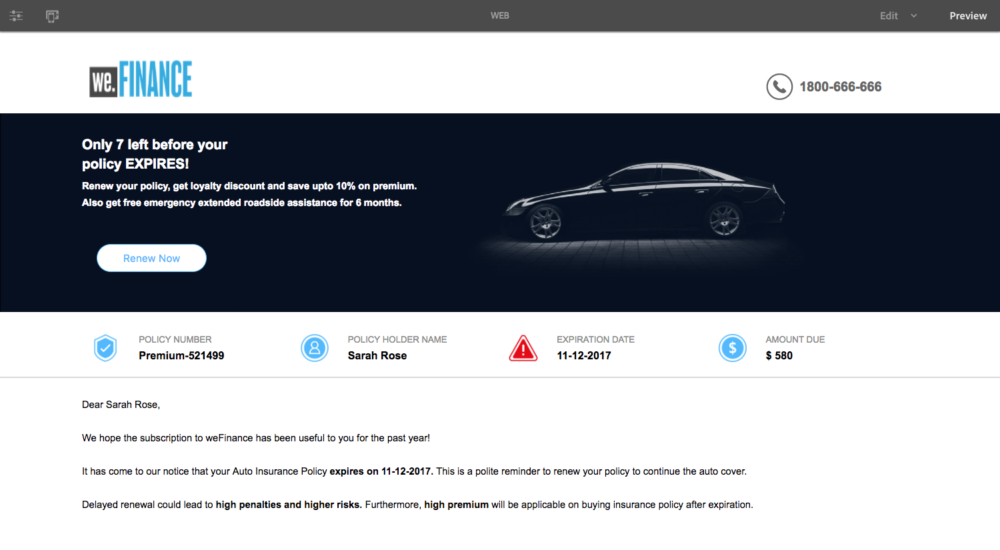

# NE PAS PUBLIER Créez votre premier document adaptatif {#do-not-publish-create-your-first-adaptive-document}

## Exemple d’utilisation   {#use-case}

Nous Finance est une organisation leader dans le domaine des services financiers qui offre des solutions financières complètes et personnalisées pour répondre aux besoins de divers profils clients.

L&#39;une des polices d&#39;assurance automobile de leurs clients arrive à expiration et ils lui envoient un rappel interactif, incluant un PDF, avec la soumission de renouvellement. La communication comprend également d&#39;autres informations, telles que des récompenses de fidélité et des offres de rabais.

Le portail s’exécute sur l’Adobe AEM. La sortie du canal de bienvenue sur le Web et l&#39;impression est créée à l&#39;aide des fonctionnalités multi-canaux du Document adaptatif.

Vous aurez un document adaptatif semblable à ce qui suit à la fin du didacticiel :
    La création de votre premier didacticiel de document adaptatif est classée en étapes. Chaque étape est un article complet en soi.

<table> 
 <tbody>
  <tr>
   <th>Vous apprendrez</th> 
   <th>
    <ul> 
     <li>Création d’un document adaptatif et d’un modèle de données de formulaire.</li> 
     <li>Création de modèles et de thèmes pour les documents adaptatifs.</li> 
     <li>Utilisation de l’éditeur de règles pour créer des règles de fonctionnement.  </li> 
     <li>Publication d’un document adaptatif.   </li> 
    </ul> </th> 
  </tr>
  <tr>
   <td>Condition requise</td> 
   <td>
    <ul> 
     <li>Configurez AEM instance d’auteur. </li> 
     <li>Installation du module complémentaire AEM Forms. Pour obtenir des informations détaillées, voir <a href="/help/forms/using/installing-configuring-aem-forms-osgi.md" target="_blank">Installer et configurer AEM Forms</a>.</li> 
     <li>Obtenez le pilote de base de données JDBC (fichier JAR) auprès du fournisseur de base de données. Les exemples du didacticiel sont basés sur la base de données MySQL et utilisent le pilote de base de données MySQL JDBC d’Oracle. </li> 
     <li>Configurez une base de données contenant les données client. Une base de données est essentielle pour créer un document adaptatif. Ce didacticiel utilise une base de données pour afficher les fonctionnalités de modèle de données de formulaire et de persistance d’AEM Forms. </li> 
     <li>Créez/importez et activez <a href="/help/forms/using/web-channel-print-channel.md">Modèles pour l'impression et le canal Web</a>.</li> 
     <li>Vérifiez que vous disposez des <a href="/help/forms/using/document-fragments.md">fragments de Document basés sur FDM</a>.</li> 
    </ul> </td> 
  </tr>
 </tbody>
</table>

## Étape 1 : création d’un modèle de données de formulaire {#step-create-form-data-model}

Un modèle de données de formulaire permet de connecter un document adaptatif à des sources de données disparates. par exemple, le profil utilisateur AEM, les services Web RESTful, les services Web basés sur SOAP, les services OData et les bases de données relationnelles. Un modèle de données de formulaire est un schéma de représentation de données unifié des entités et services d’entreprise disponibles dans des sources de données connectées. Vous pouvez utiliser le modèle de données de formulaire avec un document adaptatif pour récupérer les données des sources de données connectées. Pour plus d’informations sur le modèle de données de formulaire, voir [Intégration de données AEM Forms](/help/forms/using/data-integration.md).

Goals:

* Configurer l&#39;instance de base de données (Microsoft Dynamics) en tant que source de données
* Création du modèle de données de formulaire à l’aide de Microsoft Dynamics en tant que source de données
* Ajouter des objets de modèle de données pour former un modèle de données
* Configurer les services de lecture et d’écriture pour le modèle de données de formulaire
* Tester le modèle de données de formulaire et les services configurés avec des données de test

## Étape 2 : Créer un document adaptatif {#step-create-an-adaptive-document}

Customer Communications centralise et gère la création, l’assemblage et la diffusion de correspondances sécurisées, personnalisées et interactives telles que la correspondance d’affaires, les lettres, les documents, les déclarations, les avis de prestations, les prospectus de gestion de patrimoine, les courriels marketing, les factures et les kits de bienvenue.

Grâce aux documents adaptatifs, vous pouvez créer des communications client attrayantes, réactives, dynamiques et adaptatives par nature. AEM Forms fournit un éditeur WYSIWYG par glisser-déposer pour créer des documents adaptatifs.

<!--`For more information about adaptive documents, see [Introduction to authoring adaptive documents](/forms/using/introduction-ad-authoring.md).`-->

Objectifs :

* Créez l’impression et la sortie Web d’un document adaptatif en fonction du modèle de données de formulaire.
* Champs de disposition d’un formulaire adaptatif pour afficher des informations au client
* Créez des règles pour récupérer et afficher des informations du modèle de données de formulaire au document adaptatif.

<!---->

## Étape 3 : Appliquer des règles aux champs de document adaptatif (canal Web uniquement) {#step-apply-rules-to-adaptive-document-fields-web-channel-only}

Le document adaptatif fournit un éditeur pour la création de règles sur les objets de document adaptatif. Ces règles définissent les actions à déclencher sur les objets de document en fonction des conditions prédéfinies et des actions de l’utilisateur sur le document. Il permet d’assurer la précision et d’accélérer l’expérience des utilisateurs dans la version Web du document adaptatif. Pour plus d’informations sur l’éditeur de règles et de règles de document adaptatif, voir [éditeur de règles](/help/forms/using/rule-editor.md).

Objectifs :

* Création et application de règles aux champs de canal Web du document adaptatif
* Utiliser des règles pour déclencher des services de modèles de données de document dans le canal Web

## Étape 4 : Style du document adaptatif (canal Web uniquement) {#step-style-the-adaptive-document-web-channel-only}

Les documents adaptatifs fournissent un éditeur pour créer des thèmes pour les documents adaptatifs et la mise en forme en ligne. Un thème contient des détails de style pour les composants et les panneaux et vous pouvez réutiliser un thème sur des canaux Web de différents documents. Ces styles incluent les propriétés telles que les couleurs d’arrière-plan, les couleurs d’état, la transparence, l’alignement et la taille. Lorsque vous appliquez le thème à votre document, le style spécifié se reflète sur les composants correspondants de votre document. Pour plus d’informations, voir [Thèmes](/help/forms/using/themes.md).

Objectifs :

* Créer un thème pour le canal Web de document adaptatif
* Appliquer le thème au canal Web du document adaptatif
* Valider l’apparence du canal Web du document adaptatif sur les périphériques mobiles et sur le bureau

## Étape 5 : Publier le document adaptatif {#step-publish-the-adaptive-document}

Une fois que vous avez créé votre document adaptatif, vous devez le publier pour qu’il soit disponible sur votre instance de publication où les agents peuvent utiliser le document adaptatif pour créer les instances de communication en fonction de celui-ci.

Pour publier le document adaptatif, les auteurs de document doivent disposer des autorisations requises.
