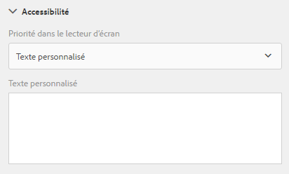
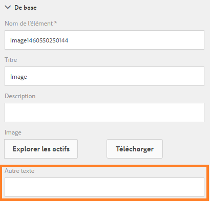

# Création de formulaires adaptatifs accessibles  {#creating-accessible-adaptive-forms}

## Présentation {#introduction}

Un formulaire accessible est un formulaire utilisable par tout le monde, y compris par les utilisateurs souffrant de handicaps. Adobe Experience Manager (AEM) s’accompagne de nombreuses fonctions et fonctionnalités qui simplifient l’utilisation des formulaires adaptatifs pour cette catégorie d’utilisateurs. Cette solution aide également les auteurs à créer des formulaires adaptatifs accessibles.

L’intégration d’options d’accessibilité dans des formulaires adaptatifs ne permet pas seulement d’élargir l’audience. Il s’agit en effet d’une exigence lors de la diffusion de documents dans des régions où le respect des normes d’accessibilité constitue une obligation. AEM Forms aide les développeurs à se conformer à ces normes d’accessibilité.

Lors de la création d’un formulaire adaptatif, l’auteur doit tenir compte des points suivants pour créer un formulaire adaptatif accessible :

* Fournir des libellés appropriés pour les commandes de formulaire
* Fournir des équivalents textuels pour les images
* Fournir un contraste de couleur suffisant
* S’assurer que les commandes de formulaire sont accessibles à l’aide du clavier

## Fournir des libellés appropriés pour les commandes de formulaire  {#provide-proper-labels-for-form-controls}

Le libellé ou le titre d’un composant de formulaire identifie ce qu’il représente. Par exemple, le texte « Prénom » indique à l’utilisateur qu’il doit saisir son prénom dans une zone de texte. Pour être accessible sur des lecteurs d’écran, le libellé est associé, par programmation, à un composant de formulaire. La commande de formulaire peut également être assortie d’informations d’accessibilité supplémentaires.

Le libellé perçu par les lecteurs d’écran ne doit pas nécessairement être identique à la légende visuelle. Dans certains cas, vous pouvez être plus précis quant au rôle exact de la commande. Pour chaque objet de champ d’un formulaire, les options d’accessibilité permettent de spécifier ce que le lecteur d’écran annonce pour identifier le champ de formulaire.

Pour utiliser l’option d’accessibilité, procédez comme suit :

1. Sélectionnez un composant et appuyez sur .
1. Cliquez sur **Accessibilité** dans la barre latérale pour sélectionner l’option d’accessibilité de votre choix.

### Options d’accessibilité dans des composants de formulaire {#accessibility-options-in-form-components}

**Les auteurs de** formulaires texte personnalisés fournissent le contenu dans l’option d’accessibilité Champ de texte personnalisé. La technologie d’assistance, telle que les lecteurs d’écran, utilise ce texte personnalisé. L’utilisation du paramètre Titre constitue la meilleure option dans la majorité des cas. N’envisagez la création d’un texte personnalisé pour lecteur d’écran que lorsque l’utilisation du titre ou d’une brève description s’avère impossible.

**Brève** descriptionPour la majorité des composants, la brève description s’affiche au moment de l’exécution lorsque l’utilisateur place le pointeur de la souris sur le composant. Vous pouvez définir cette option dans le champ approprié, sous l’option du contenu d’aide.

**** TitreUtilisez cette option pour permettre à l’AEM Forms d’utiliser le libellé visuel associé au champ de formulaire comme texte de lecteur d’écran.

**** NomVous pouvez spécifier une valeur dans le champ Nom de l’onglet Liaison. Le nom ne peut pas contenir d’espaces.

**** AucunSi vous sélectionnez Aucun, l’objet de formulaire n’a pas de nom dans le formulaire publié. Aucun n’est pas un paramètre recommandé pour les contrôles de formulaire.

>[!NOTE]
>
>Dans le cas de la case d’option et de la case à cocher, deux options seulement sont possibles dans le cadre de l’accessibilité à savoir : Texte personnalisé et Titre.

>[!NOTE]
>
>Pour les formulaires adaptatifs basés sur XFA, l’option d’accessibilité est héritée des options d’accessibilité définies dans le fichier XDP. Les info-bulles du fichier XDP sont associées au champ Brève description et Légende correspond à Titre. Les autres options fonctionnent normalement.

## Fournir des équivalents textuels pour les images  {#provide-text-equivalents-for-images}

Pour certains utilisateurs, les images permettent une compréhension plus facile. Cependant, lorsqu’un lecteur d’écran est utilisé, les images réduisent l’accessibilité du formulaire. Si vous optez pour l’utilisation d’images, veuillez fournir des descriptions textuelles pour l’ensemble des images.

Assurez-vous que le texte décrit l’objet et son rôle dans le formulaire. Un lecteur d’écran lit ce texte alternatif lorsqu’il rencontre une image. Un texte alternatif doit toujours être spécifié pour une image.

Sélectionnez un composant d’image et appuyez sur . Dans la barre latérale, sous Propriétés, indiquez le texte alternatif d’une image.

## Fournir un contraste de couleur suffisant {#provide-sufficient-color-contrast}

Dans le cadre des fonctions d’accessibilité, il convient de tenir compte de quelques points supplémentaires concernant l’utilisation des couleurs. Les auteurs de formulaires peuvent utiliser des couleurs pour améliorer l’apparence des formulaires, en mettant en surbrillance différents composants. Cependant, une utilisation inappropriée des couleurs peut rendre le formulaire difficile à lire, voire totalement illisible, pour des personnes souffrant de certains handicaps.

Les utilisateurs ayant une déficience visuelle s’appuient sur le contraste prononcé entre le texte et l’arrière-plan pour lire du contenu numérique. En l’absence de contraste suffisant, la lecture d’un formulaire peut s’avérer difficile, voire impossible, pour certains utilisateurs.

Il est conseillé d’utiliser la police et les couleurs d’arrière-plan par défaut, à savoir : contenu noir sur fond blanc. Si vous modifiez les couleurs par défaut, optez pour une couleur de premier plan foncée sur un arrière-plan clair, ou inversement.

Pour plus d’informations sur la modification du contraste de couleur et du thème des formulaires adaptatifs, reportez-vous à [Création de thèmes personnalisés pour les formulaires adaptatifs](/help/forms/using/creating-custom-adaptive-form-themes.md).

## S’assurer que les commandes de formulaire sont accessibles à l’aide du clavier  {#ensure-that-form-controls-are-keyboard-accessible}

Un formulaire accessible peut être rempli complètement en utilisant uniquement le clavier ou un périphérique de saisie équivalent. Certains utilisateurs ayant une mobilité réduite ou une déficience visuelle sont parfois contraints de n’utiliser que le clavier. De plus, de nombreux utilisateurs préfèrent saisir leurs données au moyen du clavier plutôt que de la souris. En proposant différents modes de saisie des données, vous créez également des formulaires qui répondent aux préférences de l’ensemble des utilisateurs.

Les raccourcis clavier suivants sont disponibles dans AEM Forms.

| Action | Raccourci clavier |
|---|---|
| Déplacer le curseur vers l’avant dans un formulaire | Onglet |
| Déplacer le curseur vers l’arrière dans un formulaire | Maj+Touche de tabulation |
| Accéder au panneau suivant | Alt+Flèche Droite |
| Revenir au panneau précédent | Alt+Flèche Gauche |
| Réinitialiser les données saisies dans un formulaire | Alt+R |
| Envoyer un formulaire | Alt+S | configuring-watched-folder-endpoints.md |