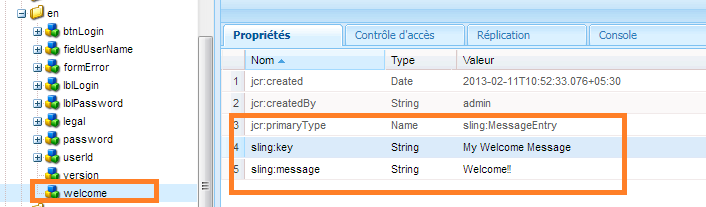

# Création d’un écran de connexion {#creating-a-new-login-screen}

Vous pouvez modifier l’écran de connexion de tous les modules AEM Forms qui utilisent l’écran de connexion AEM Forms. Par exemple, les modifications affectent à la fois l’écran de connexion de Forms Manager et de l’espace de travail AEM Forms.

## Prérequis {#prerequisite}

1. Connectez-vous à `/lc/crx/de` avec les autorisations Administrateur.
1. Procédez comme suit :

   1. Répliquez la structure hiérarchique : de `/libs/livecycle/core/content` at `/apps/livecycle/core/content`. Conservez les mêmes propriétés (nœud/dossier) et contrôle d’accès.
   1. Copiez le dossier de contenu : de `/libs/livecycle/core` to `/apps/livecycle/core`.
   1. Supprimer le contenu de `/apps/livecycle/core` dossier.

1. Procédez comme suit :

   1. Répliquez la structure hiérarchique : de `/libs/livecycle/core/components/login` at `/apps/livecycle/core/components/login`. Conservez les mêmes propriétés (nœud/dossier) et contrôle d’accès.
   1. Copiez le dossier de composants : de `/libs/livecycle/core` to `/apps/livecycle/core`.
   1. Supprimez le contenu du dossier : `/apps/livecycle/core/components/login`.

## Ajout d’un nouveau paramètre régional {#adding-a-new-locale}

1. Copiez le `i18n` folder:

   * de `/libs/livecycle/core/components/login`
   * vers `/apps/livecycle/core/components/login`

1. Supprimer tous les dossiers à l’intérieur `i18n` sauf un, par exemple `en`.
1. Sur le dossier `en`, procédez comme suit :

   1. Donnez au dossier le nom du paramètre régional que vous souhaitez prendre en charge. Par exemple, `ar`.
   1. Modification de la propriété `jcr:language` valeur à `ar`(pour la variable `ar` ).

   >[!NOTE]
   >
   >Si le paramètre régional est une combinaison de code langue-pays, tel que `ar-DZ`, modifiez le nom du dossier et la valeur de la propriété en `ar-DZ`.

1. Copier `login.jsp`:

   * de `/libs/livecycle/core/components/login`
   * vers `/apps/livecycle/core/components/login`

1. Modifiez le fragment de code suivant pour `/apps/livecycle/core/components/login/login.jsp`:

   ***Le paramètre régional est un code de langue***

   ```
   String browserLocale = "en";
       for(int i=0; i<locales.length; i++)
       {
           String prioperty = locales[i];
           if(prioperty.trim().startsWith("en")) {
               browserLocale = "en";
               break;
           }
           if(prioperty.trim().startsWith("de")){
               browserLocale = "de";
               break;
           }
           if(prioperty.trim().startsWith("ja")){
               browserLocale = "ja";
               break;
           }
           if(prioperty.trim().startsWith("fr")){
               browserLocale = "fr";
               break;
           }
       }
   
   To
   
   String browserLocale = "en";
       for(int i=0; i<locales.length; i++)
       {
           String prioperty = locales[i];
           if(prioperty.trim().startsWith("ar")) {
               browserLocale = "ar";
               break;
           }
           if(prioperty.trim().startsWith("en")) {
               browserLocale = "en";
               break;
           }
           if(prioperty.trim().startsWith("de")){
               browserLocale = "de";
               break;
           }
           if(prioperty.trim().startsWith("ja")){
               browserLocale = "ja";
               break;
           }
           if(prioperty.trim().startsWith("fr")){
               browserLocale = "fr";
               break;
           }
       }
   ```

   ***Le paramètre régional est un code langue-pays***

   ```
   String browserLocale = "en";
       for(int i=0; i<locales.length; i++)
       {
           String prioperty = locales[i];
           if(prioperty.trim().startsWith("en")) {
               browserLocale = "en";
               break;
           }
           if(prioperty.trim().startsWith("de")){
               browserLocale = "de";
               break;
           }
           if(prioperty.trim().startsWith("ja")){
               browserLocale = "ja";
               break;
           }
           if(prioperty.trim().startsWith("fr")){
               browserLocale = "fr";
               break;
           }
       }
   
   To
   
   String browserLocale = "en";
       for(int i=0; i<locales.length; i++)
       {
           String prioperty = locales[i];
           if(prioperty.trim().equalsIgnoreCase("ar-DZ")) {
               browserLocale = "ar-DZ";
               break;
           }
           if(prioperty.trim().startsWith("en")) {
               browserLocale = "en";
               break;
           }
           if(prioperty.trim().startsWith("de")){
               browserLocale = "de";
               break;
           }
           if(prioperty.trim().startsWith("ja")){
               browserLocale = "ja";
               break;
           }
           if(prioperty.trim().startsWith("fr")){
               browserLocale = "fr";
               break;
           }
       }
   ```

   ***Pour modifier le paramètre régional par défaut***

   ```
   String browserLocale = "en";
   for(int i=0; i<locales.length; i++)
   
   To
   
   String browserLocale = "ar";
   for(int i=0; i<locales.length; i++)
   ```

## Ajout de nouveau texte ou modification du texte existant {#adding-new-text-or-modifying-existing-text}

1. Copier `i18n` folder:

   * de `/libs/livecycle/core/components/login`
   * vers `/apps/livecycle/core/components/login`

1. Modifiez la valeur de la propriété `sling:message` du nœud (sous le dossier du code du paramètre régional souhaité) pour laquelle vous souhaitez modifier le texte. La traduction est effectuée via la clé mentionnée dans la valeur de la propriété `sling:key` du nœud.
1. Pour ajouter une nouvelle paire clé-valeur, effectuez les opérations suivantes : Vérifiez un exemple dans la capture d’écran qui suit.

   1. Créez un nœud de type `sling:MessageEntry` ou copiez un nœud existant et renommez-le, sous tous les dossiers de paramètres régionaux.
   1. Copier `login.jsp` :

      * de `/libs/livecycle/core/components/login`
      * vers `/apps/livecycle/core/components/login`
   1. Modifier `/apps/livecycle/core/components/login/login.jsp` pour incorporer le texte nouvellement ajouté.

   

   ```
   div class="loginContent">
                       <span class="loginFlow"></span>
                       <span class="loginVersion"><%= i18n.get("Version: 11.0.0") %></span>
                       <span class="loginTitle"><%= i18n.get("Login") %></span>
                       <% if (loginFailed) {%>
   
   To
   
   div class="loginContent">
                       <span class="loginFlow"></span>
                       <span class="loginVersion"><%= i18n.get("My Welcome Message") %></span>
                       <span class="loginVersion"><%= i18n.get("Version: 11.0.0") %></span>
                       <span class="loginTitle"><%= i18n.get("Login") %></span>
                       <% if (loginFailed) {%>
   ```

## Ajout d’un nouveau style ou modification d’un style existant {#adding-new-style-or-modifying-existing-style}

1. Copier `login` node:

   * de `/libs/livecycle/core/content`
   * vers `/apps/livecycle/core/content`

1. Suppression de fichiers `login.js` et `jquery-1.8.0.min.js`, à partir du noeud `/apps/livecycle/core/content/login.`
1. Modifiez les styles définis dans le fichier CSS.
1. Pour ajouter de nouveaux styles :

   1. Ajouter de nouveaux styles à `/apps/livecycle/core/content/login/login.css`
   1. Copier `login.jsp`

      * de `/libs/livecycle/core/components/login`
      * vers `/apps/livecycle/core/components/login`
   1. Modifier `/apps/livecycle/core/components/login/login.jsp` pour incorporer les styles nouvellement ajoutés.


1. Par exemple :

   * Ajoutez le code suivant à `/apps/livecycle/core/content/login/login.css`.

   ```css
   .newLoginContentArea {
    width: 700px;
    padding: 100px 0px 0px 100px;
   }
   ```

   * Modifiez l’élément suivant dans /apps/livecycle/core/components/login.jsp.

   ```
   <div class="loginContentArea">
   
   To
   
   <div class="newLoginContentArea">
   ```

>[!NOTE]
>
>Si les images existantes dans `/apps/livecycle/core/content/login` (copié depuis `/libs/livecycle/core/content/login`) sont supprimés, puis supprimez les références correspondantes dans CSS.

## Ajoutez de nouvelles images {#add-new-images}

1. Suivez les étapes de la section Ajout d’un nouveau style ou modification d’un style existant (décrites ci-dessus).
1. Ajouter de nouvelles images dans `/apps/livecycle/core/content/login`. Pour ajouter une image :

   1. Installez le client WebDAV.
   1. Accédez à `/apps/livecycle/core/content/login` à l’aide du client webDAV. Pour plus d’informations, voir : [https://dev.day.com/docs/en/crx/current/how_to/webdav_access.html](https://docs.adobe.com/docs/en/crx/current/how_to/webdav_access.html).
   1. Ajoutez de nouvelles images.

1. Ajout de styles dans `/apps/livecycle/core/content/login/login.css,` correspondant aux nouvelles images ajoutées dans `/apps/livecycle/core/content/login`.
1. Utilisation des nouveaux styles dans `login.jsp` at `/apps/livecycle/core/components`.
1. Par exemple :

   * Ajoutez le code suivant à `/apps/livecycle/core/content/login/login.css`

   ```css
   .newLoginContainerBkg {
    background-image: url(my_Bg.gif);
    background-repeat: no-repeat;
    background-position: left top;
    width: 727px;
   }
   ```

   * Modifiez l’élément suivant dans /apps/livecycle/core/components/login.jsp.

   ```
   <div class="loginContainerBkg">
   
   To
   
   <div class="newLginContainerBkg">
   ```
