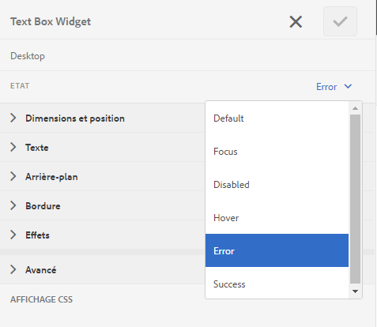

# Personnalisation de la disposition et de la position des messages d’erreur d’un formulaire adaptatif {#customize-layout-and-positioning-of-error-messages-of-an-adaptive-form}

>[!CAUTION]
>
>AEM 6.4 a atteint la fin de la prise en charge étendue et cette documentation n’est plus mise à jour. Pour plus d’informations, voir notre [période de support technique](https://helpx.adobe.com/fr/support/programs/eol-matrix.html). Rechercher les versions prises en charge [here](https://experienceleague.adobe.com/docs/?lang=fr).

Vous pouvez personnaliser la disposition et la position des messages d’erreur d’un formulaire adaptatif. Vous pouvez effectuer les personnalisations suivantes :

* Personnaliser l’emplacement et la disposition de la légende d’un champ sans apporter de modifications aux propriétés CSS correspondantes
* Personnalisation de la position des messages d’erreur intégrés
* Personnalisation du contenu de l’indicateur d’aide dynamique
* Personnaliser la position des composants de champ (légende, widget, brève description, description longue et composants d’indicateur d’aide) sans apporter de modifications aux propriétés CSS correspondantes

## Personnalisation de la disposition des champs {#customize-layout-of-fields}

Vous pouvez personnaliser la mise en page d’un seul champ ou de tous les champs pour modifier la position de la légende et des messages d’erreur. Pour appliquer une disposition personnalisée à un champ, procédez comme suit :

### Personnalisation de la mise en page d’un seul champ {#customize-layout-of-a-single-field}

Effectuez les étapes suivantes pour appliquer une disposition personnalisée à un seul champ :

1. Ouvrez le formulaire dans **Style** mode . Pour ouvrir le formulaire en mode Style, écrivez dans la barre d’outils de la page  > **Style**.
1. Dans la barre latérale, sous **Objets de formulaire**, sélectionnez le champ, puis cliquez sur le bouton de modification .
1. Sélectionnez l’état du champ que vous souhaitez personnaliser, puis spécifiez le style de cet état.

   

### Personnalisation de la mise en page de tous les champs d’un formulaire {#customize-layout-of-all-the-fields-of-a-form}

Avec AEM Forms, vous pouvez maintenant créer un thème et l’appliquer à votre formulaire. L’éditeur de thème vous permet de définir le style des composants de formulaire à un seul emplacement. Lorsque vous créez un thème, vous spécifiez la mise en forme au niveau du composant. Pour plus d’informations sur les thèmes, voir [Thèmes dans AEM Forms](/help/forms/using/themes.md).

Créez un thème à l’aide de l’éditeur de thème pour personnaliser la disposition de tous les champs de votre formulaire. Après avoir créé un thème, procédez comme suit pour l’appliquer à un formulaire :

1. Ouvrez votre formulaire en mode d’édition.
1. En mode d’édition, sélectionnez un composant, puis appuyez sur  > **Conteneur de formulaires adaptatifs**, puis appuyez sur .
1. Dans la barre latérale, sous Thème de formulaire adaptatif, sélectionnez le thème que vous avez créé à l’aide de l’éditeur de thème.

## Création d’une disposition de champ personnalisée {#create-a-custom-field-layout}

1. Ouvrez CRXDE Lite. L’URL par défaut est `https://[Server]:[Port]/crx/de`.
1. Copiez une disposition de champ du noeud /libs/fd/af/layouts/field (par exemple, defaultFieldLayout) vers le noeud /apps (par exemple, /apps/af-field-layout).
1. Renommez le noeud copié et le fichier defaultFieldLayout.jsp . Par exemple, errorOnRight.jsp.

1. Modifiez la valeur des propriétés qtip et jcr:description du nœud copié. Par exemple, redéfinissez la valeur des propriétés sur Erreur sur la droite

1. Pour ajouter de nouveaux styles et un nouveau comportement, créez une bibliothèque cliente dans le noeud /etc .

   Par exemple, à l’emplacement /etc/af-field-layout-clientlib, créez le noeud client-library. Ajoutez la propriété de catégories avec la valeur af.field.errorOnRight et le fichier style.less avec le code suivant :

   ```css
   .widgetErrorWrapper {
   
    height: 38px;
    margin: 5px;
   
    .guideFieldWidget{
    width: 60%;
    float: left; 
    }
   
    .guideFieldError{
    overflow:hidden;
    width:40%; 
    }
   
   }
   ```

1. Pour améliorer l’apparence et le comportement, incluez la bibliothèque client créée dans le fichier de dispositiion (errorOnRight.jsp).
1. Ouvrez la boîte de dialogue de modification et sélectionnez l’onglet **Style**. Dans le **Configuration de la disposition du champ** , sélectionnez la mise en page qui vient d’être créée, puis cliquez sur **OK**.

Le package ErrorOnRight.zip contient le code permettant d’afficher les messages d’erreur sur le côté droit des champs.

[Obtenir le fichier](assets/erroronright.zip)
