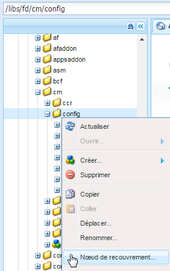
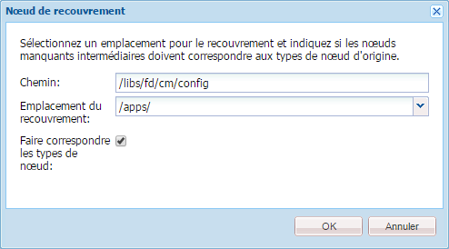
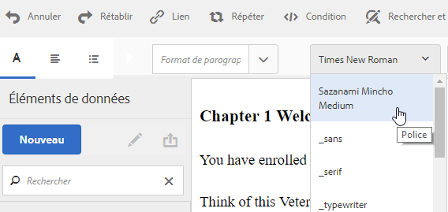

# Personnalisation de l’éditeur de texte {#customize-text-editor}

## Présentation {#overview}

Vous pouvez personnaliser l’éditeur de texte dans Gestion des actifs et Interface utilisateur de création de correspondance pour ajouter d’autres polices et tailles de police. Ces polices incluent des polices françaises ainsi que d’autres langues, telles que le japonais.

Vous pouvez personnaliser les éléments suivants dans les paramètres de police :

* Famille et taille de police
* Propriétés telles que la hauteur et l’interlettrage
* Valeurs par défaut des familles et des tailles de police, de la hauteur, de l’interlettrage et du format de date
* Retraits de puces

Pour ce faire, vous devez :

1. [Personnaliser des polices en modifiant le fichier tbxeditor-config.xml dans CRX](#customizefonts)
1. [Ajouter des polices personnalisées sur l’ordinateur client](#addcustomfonts)

## Personnaliser des polices en modifiant le fichier tbxeditor-config.xml dans CRX {#customizefonts}

Pour personnaliser des polices en modifiant le fichier tbxeditor-config.xml, procédez comme suit :

1. Accédez à `https://[server]:[port]/[ContextPath]/crx/de` et connectez-vous en tant qu’administrateur.
1. Dans le dossier d’applications, créez un dossier nommé config dont le chemin d’accès/la structure est similaire au dossier de configuration, qui se trouve dans libs/fd/cm/config, en procédant comme suit :

   1. Cliquez avec le bouton droit sur le dossier éléments à l’emplacement suivant et sélectionnez **Noeud d’incrustation** :

      `/libs/fd/cm/config`

      

   1. Assurez-vous que la boîte de dialogue du nœud de recouvrement possède les valeurs suivantes :

      **Chemin d’accès :** /libs/fd/cm/config

      **Emplacement:** /applications/

      **Faire correspondre les types de noeud:** Sélectionné

      

   1. Cliquez sur **OK**. La structure du dossier est créée dans le dossier des applications.

   1. Cliquez sur **Enregistrer tout**.

1. Créez une copie du fichier tbxeditor-config.xml dans le dossier de configuration que vous venez de créer en procédant comme suit :

   1. Cliquez avec le bouton droit de la souris sur le fichier tbxeditor-config.xml dans libs/fd/cm/config et sélectionnez **Copier**.
   1. Cliquez avec le bouton droit de la souris sur le dossier suivant, puis sélectionnez **Coller :**

      `apps/fd/cm/config`

   1. Par défaut, le nom du fichier collé est `copy of tbxeditor-config.xml.` Renommez le fichier en `tbxeditor-config.xml` et cliquez sur **Enregistrer tout**.

1. Ouvrez le fichier tbxeditor-config.xml dans apps/fd/cm/config, puis effectuez les modifications requises.

   1. Cliquez avec le doublon sur le fichier tbxeditor-config.xml dans apps/fd/cm/config. Le fichier s’ouvre.

      ```xml
      <editorConfig>
         <bulletIndent>0.25in</bulletIndent>
      
         <defaultDateFormat>DD-MM-YYYY</defaultDateFormat>
      
         <fonts>
            <default>Times New Roman</default>
            <font>_sans</font>
            <font>_serif</font>
            <font>_typewriter</font>
            <font>Arial</font>
            <font>Courier</font>
            <font>Courier New</font>
            <font>Geneva</font>
            <font>Georgia</font>
            <font>Helvetica</font>
            <font>Tahoma</font>
            <font>Times New Roman</font>
            <font>Times</font>
            <font>Verdana</font>
         </fonts>
      
         <fontSizes>
            <default>12</default>
            <fontSize>8</fontSize>
            <fontSize>9</fontSize>
            <fontSize>10</fontSize>
            <fontSize>11</fontSize>
            <fontSize>12</fontSize>
            <fontSize>14</fontSize>
            <fontSize>16</fontSize>
            <fontSize>18</fontSize>
            <fontSize>20</fontSize>
            <fontSize>22</fontSize>
            <fontSize>24</fontSize>
            <fontSize>26</fontSize>
            <fontSize>28</fontSize>
            <fontSize>36</fontSize>
            <fontSize>48</fontSize>
            <fontSize>72</fontSize>
         </fontSizes>
      
         <lineHeights>
            <default>2</default>     
            <lineHeight>2</lineHeight>
            <lineHeight>3</lineHeight>
            <lineHeight>4</lineHeight>
            <lineHeight>5</lineHeight>
            <lineHeight>6</lineHeight>
            <lineHeight>7</lineHeight>
            <lineHeight>8</lineHeight>
            <lineHeight>9</lineHeight>
            <lineHeight>10</lineHeight>
            <lineHeight>11</lineHeight>
            <lineHeight>12</lineHeight>
            <lineHeight>13</lineHeight>
            <lineHeight>14</lineHeight>
            <lineHeight>15</lineHeight>
            <lineHeight>16</lineHeight>
         </lineHeights>
      
         <letterSpacings>
            <default>0</default>
            <letterSpacing>0</letterSpacing>
            <letterSpacing>1</letterSpacing>
            <letterSpacing>2</letterSpacing>
            <letterSpacing>3</letterSpacing>
            <letterSpacing>4</letterSpacing>
            <letterSpacing>5</letterSpacing>
            <letterSpacing>6</letterSpacing>
            <letterSpacing>7</letterSpacing>
            <letterSpacing>8</letterSpacing>
            <letterSpacing>9</letterSpacing>
            <letterSpacing>10</letterSpacing>
            <letterSpacing>11</letterSpacing>
            <letterSpacing>12</letterSpacing>
            <letterSpacing>13</letterSpacing>
            <letterSpacing>14</letterSpacing>
            <letterSpacing>15</letterSpacing>
            <letterSpacing>16</letterSpacing>
         </letterSpacings>
      </editorConfig>
      ```

   1. Effectuez les modifications requises dans le fichier pour modifier les éléments suivants dans les paramètres de police :

      * Ajouter ou supprimer des familles et des tailles de police
      * Propriétés telles que la hauteur et l’interlettrage
      * Valeurs par défaut des familles et des tailles de police, de la hauteur, de l’interlettrage et du format de date
      * Retraits de puces

      Par exemple, pour ajouter une police japonaise appelée Sazanami Mincho Medium, vous devez effectuer l’entrée suivante dans Fichier XML : `<font>Sazanami Mincho Medium</font>`. Vous devez également installer cette police sur l’ordinateur client utilisé pour accéder à la personnalisation de la police et l’utiliser. Pour plus d’informations, reportez-vous à la section [Ajouter des polices personnalisées sur l’ordinateur client](#addcustomfonts).

      Vous pouvez également modifier les valeurs par défaut de divers aspects du texte et, en supprimant les entrées, supprimer les polices de l’éditeur de texte.

   1. Cliquez sur **Enregistrer tout**.


## Ajouter des polices personnalisées sur l’ordinateur client  {#addcustomfonts}

Lorsque vous accédez à une police dans l’éditeur de texte de Correspondence Management, elle doit se trouver sur l’ordinateur client que vous utilisez pour accéder à Correspondence Management. Pour pouvoir utiliser une police personnalisée dans l’éditeur de texte, vous devez d’abord l’installer sur l’ordinateur client.

Pour plus d’informations sur l’installation des polices, consultez les articles suivants :

* [Installation et désinstallation de polices sous Windows](https://windows.microsoft.com/en-us/windows-vista/install-or-uninstall-fonts)
* [Principes de base sur Mac : livre des polices](https://support.apple.com/fr-fr/HT201749)

## Accéder à la personnalisation des polices {#access-font-customizations}

Après avoir apporté des modifications aux polices dans le fichier tbxeditor-config.xml dans CRX et installé les polices requises sur l’ordinateur client utilisé pour accéder à AEM Forms, les modifications apparaissent dans l’éditeur de texte.

Par exemple, la police Sazanami Mincho Medium ajoutée dans la procédure [Personnaliser les polices en modifiant le fichier tbxeditor-config.xml dans CRX](#customizefonts) apparaît dans l’interface utilisateur de l’éditeur de texte comme suit :



>[!NOTE]
>
>Pour voir le texte en japonais, vous devez au préalable saisir du texte en caractères japonais. L’application d’une police japonaise personnalisée ne formate le texte que d’une certaine manière. Elle ne transforme pas le français ou les autres caractères en caractères japonais.

