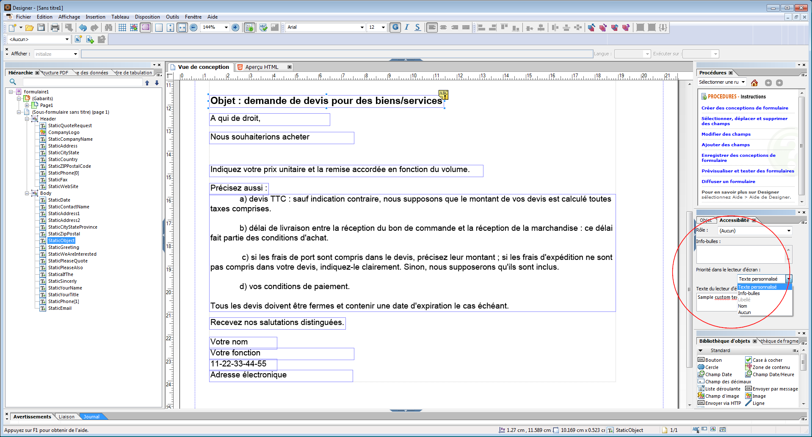

# Concevoir des formulaires HTML5 accessibles {#designing-accessible-html-forms}

>[!CAUTION]
>
>AEM 6.4 a atteint la fin de la prise en charge étendue et cette documentation n’est plus mise à jour. Pour plus d’informations, voir notre [période de support technique](https://helpx.adobe.com/fr/support/programs/eol-matrix.html). Rechercher les versions prises en charge [here](https://experienceleague.adobe.com/docs/?lang=fr).

Les formulaires HTML5 utilisent la norme d’accessibilité ARIA HTML5 pour générer des formulaires HTML accessibles. Ces formulaires prennent en charge la navigation par onglets (sauf Mozilla Firefox) et sont certifiés compatibles avec les lecteurs d’écran les plus courants. Pour générer un formulaire HTML5 avec de bonnes fonctions d’accessibilité, concevez le modèle de formulaire XFA en fonction de certains [directives de conception de base](/help/forms/using/best-practices-for-html5-forms.md). Les directives de conception comprennent la configuration des onglets dans l’ordre approprié et fournissent le contenu du texte vocal pour chaque commande du formulaire. AEM Forms Designer prend en charge le paramètre de ces attributs de commande du formulaire pour générer un formulaire en version PDF et HTML5 accessible.

*Remarque : la navigation par onglets ne couvre pas les champs protégés tels que les champs de calcul affichant la somme des valeurs. Pour que le lecteur d’écran lise la valeur d’un champ protégé, placez un champ Lecture seule vide au-dessus ou en regard du champ protégé. Attribuez la valeur du champ protégé au nouveau champ en lecture seule. Le lecteur d’écran ou la navigation par onglets peut sélectionner ce champ en lecture seule et le définir comme la valeur du champ protégé.*

AEM Forms Designer comprend plusieurs options de texte vocal qui peuvent être transmises aux lecteurs d’écran. Pour chaque objet d’un formulaire, l’utilisateur peut spécifier l’un des paramètres suivants pour le texte du lecteur d’écran :

* Texte du lecteur d’écran personnalisé qui peut être défini à l’aide de la palette Accessibilité. Les auteurs peuvent annoter les noms des boutons et des champs, ainsi que leur rôle.
* Info-bulles, qui peuvent être définies dans la palette Accessibilité.
* Légendes des champs du formulaire.
* Noms des objets, tels que spécifiés dans l’option Nom de l’onglet Liaison.

Lorsque plusieurs options telles que l’info-bulle, le texte de Reader d’écran et la légende sont disponibles sur un contrôle de formulaire, le Reader d’écran n’utilise qu’une seule de ces propriétés. L’ordre par défaut est Texte de Reader d’écran personnalisé, info-bulle, Légende et Nom. Vous pouvez remplacer cet ordre par défaut à l’aide de l’option **Précédence** du lecteur d’écran dans la palette Accessibilité.
