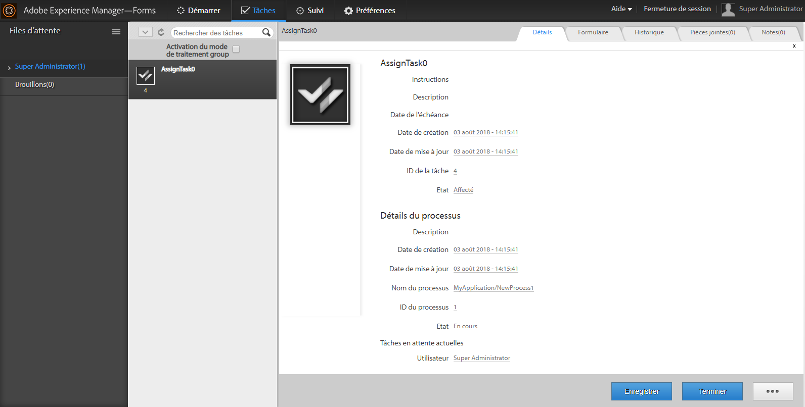

# Affichage des données supplémentaires dans la liste de tâches {#displaying-additional-data-in-todo-list}

>[!CAUTION]
>
>AEM 6.4 a atteint la fin de la prise en charge étendue et cette documentation n’est plus mise à jour. Pour plus d’informations, voir notre [période de support technique](https://helpx.adobe.com/fr/support/programs/eol-matrix.html). Rechercher les versions prises en charge [here](https://experienceleague.adobe.com/docs/?lang=fr).

Par défaut, la liste des tâches de l’espace de travail AEM Forms affiche le nom d’affichage et la description des tâches. Cependant, vous pouvez ajouter d’autres informations, telles que la date de création, la date d’échéance. Vous pouvez également ajouter des icônes et modifier le style de l’affichage.



Cet article décrit les étapes à suivre pour ajouter des informations à afficher pour chaque tâche dans la liste Tâches.

## Éléments pouvant être ajoutés {#what-can-be-added}

Vous pouvez ajouter les informations disponibles dans `task.json` envoyées par le serveur. Les informations peuvent être ajoutées en texte brut ou vous pouvez utiliser des styles pour formater les informations.

Pour plus d’informations sur la description de l’objet JSON, voir [this](/help/forms/using/html-workspace-json-object-description.md) article.

## Affichage des informations sur une tâche {#displaying-information-on-a-task}

1. Suivez la [Procédure générique de personnalisation de l’espace de travail AEM Forms](/help/forms/using/generic-steps-html-workspace-customization.md).
1. Pour afficher des informations supplémentaires pour une tâche, les paires clé-valeur correspondantes doivent être ajoutées dans le bloc de tâche de `translation.json`.

   Par exemple, modifiez le fichier `/apps/ws/locales/en-US/translation.json` pour l’anglais :

   ```
   "task" : {
           "reminder" : {
               "value" : "Reminder",
               "tooltip" : "This is reminder __reminderCount__, for this task."
           },
           "deadlined" : {
               "value" : "Deadlined",
               "tooltip" : "This task has deadlined"
           },
           "save" : {
               "message" : "Task has been saved successfully"
           },
           "status" : {
               "deadlined" : "Deadlined",
               "created" : "Created",
               "assignedsaved" : "Draft from assigned task",
               "terminated" : "Terminated",
               "assigned" : "Assigned",
               "unknown" : "Unknown",
               "createdsaved" : "Draft from created task",
               "completed" : "Completed"
           },
           "draft" : {
               "value" : "Saved",
               "tooltip" : "This task is marked as a draft"
           },
           "escalated" : {
               "value" : "Escalated",
               "tooltip" : "This task has been escalated"
           },
           "forward" : {
               "value" : "Forwarded",
               "tooltip" : "This task was forwarded"
           },
           "priority" : {
               "highest" : "Highest priority",
               "normal" : "Normal priority",
               "high" : "High priority",
               "low" : "Low priority",
               "lowest" : "Lowest priority"
           },
           "claimed" : {
               "value" : "Claimed",
               "tooltip" : "This task has been claimed"
           },
           "locked" : {
               "value" : "Locked",
               "tooltip" : "This task is locked"
           },
           "consulted" : {
               "value" : "Consulted",
               "tooltip" : "This task has been consulted"
           },
           "returned" : {
               "value" : "Returned",
               "tooltip" : "This task was returned back"
           },
           "multiplesubmitbuttons" : {
               "message" : "The form associated with this task has multiple submit buttons so the Workspace Complete button will be disabled. Click the appropriate button on the form to submit it."
           },
           "nosubmitbutton" : {
               "message" : "The form associated with this task does not appear to have submit buttons. You may need to upgrade your Adobe Reader version to 9.1 or greater and enable the Reader Submit option in your process."
           },
           "icon" : {
               "tooltip" : "open the task __taskName__"
           }
       }
   ```

   >[!NOTE]
   >
   >Ajoutez les paires clé-valeur correspondantes pour toutes les langues prises en charge.

1. Par exemple, ajoutez des informations dans le bloc de tâche :

   ```
   "stepname" : {
               "value" : "Step Name",
               "tooltip" : "This task belongs to __stepName__ step"
   }
   ```

## Définition de CSS pour la nouvelle propriété {#defining-css-for-the-new-property}

1. Vous pouvez appliquer un style aux informations (propriété) ajoutées à une tâche. Pour ce faire, vous devez ajouter des informations de style pour la nouvelle propriété ajoutée à `/apps/ws/css/newStyle.css`.

   Par exemple, ajoutez :

   ```css
   .task .taskProperties .stepname{
       width: 25px;
       background: url(../images/stepname.png) no-repeat; /*-------- Or just reuse background image / image-sprite defined .task .taskProperties span of style.css---------------------*/
       background-position: 0px 0px; /*-------- Dummy values, need to be configured as per user background image / image-sprite ---------------------*/
   }
   ```

## Ajout d’une entrée dans le modèle de HTML {#adding-entry-in-the-html-template}

Enfin, vous devez inclure une entrée dans le package de développement pour chaque propriété que vous souhaitez ajouter à la tâche. Pour en créer un, reportez-vous à la section Création du code de l’espace de travail AEM Forms .

1. Copier :`task.html`

   * de: `/libs/ws/js/runtime/templates/`
   * vers: `/apps/ws/js/runtime/templates/`

1. Ajoutez les nouvelles informations au fichier `/apps/ws/js/runtime/templates/task.html`.

   Par exemple, ajoutez sous `div class="taskProperties"` :

   ```
   <span class="stepname" alt="<%= $.t('task.stepname.value')%>" title = '<%= $.t("task.stepname.tooltip",{stepName:stepName})%>'/>
   ```
