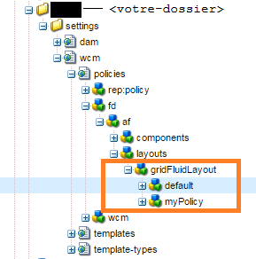
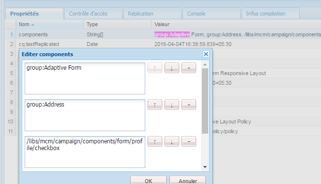

# Affichage des composants en fonction du modèle utilisé {#displaying-components-based-on-the-template-used}

Lorsqu’un auteur de formulaire crée un formulaire adaptatif à l’aide d’un [modèle](/help/forms/using/template-editor.md), il peut consulter et utiliser des composants spécifiques en fonction de la stratégie de modèle. Vous pouvez spécifier une stratégie de contenu de modèle qui vous permet de sélectionner un groupe de composants visible par l’auteur de formulaire lors de la création de formulaires.

## Modification de la stratégie de contenu d’un modèle {#changing-the-content-policy-of-a-template}

When you create a template, it is created under `/conf` in the content repository. En fonction des dossiers que vous avez créés dans le `/conf` répertoire, le chemin d’accès à votre modèle est le suivant : `/conf/<your-folder>/settings/wcm/templates/<your-template>`.

Effectuez les étapes suivantes pour afficher les composants dans la barre latérale en fonction de la stratégie de contenu d’un modèle :

1. Ouvrez CRXDE Lite.

   URL: `https://<server>:<port>/crx/de/index.jsp`

1. Dans CRXDE, accédez au dossier dans lequel le modèle est créé.

   Par exemple : `/conf/<your-folder>/`

1. In CRXDE, navigate to: `/conf/<your-folder>/settings/wcm/policies/fd/af/layouts/gridFluidLayout/`

   Pour sélectionner un groupe de composants, une nouvelle stratégie de contenu est requise. Pour créer une nouvelle stratégie, copiez-collez la stratégie par défaut et renommez-la.

   Le chemin d’accès à la stratégie de contenu par défaut est : `/conf/<your-folder>/settings/wcm/policies/fd/af/layouts/gridFluidLayout/default`

   Dans le dossier `gridFluidLayout`, copiez-collez la stratégie par défaut et renommez-la. Par exemple, `myPolicy`.

   

1. Select the new policy you create, and select the **components** property in the right-side panel with type `string[]`.

   Lorsque vous sélectionnez et ouvrez la propriété de composants, la boîte de dialogue Modifier les composants s’affiche. Elle vous permet d’ajouter ou de supprimer les groupes de composants en utilisant les boutons **+** et **-**. Vous pouvez ajouter le groupe de composants qui comprend des composants du formulaire que vous souhaitez que les auteurs utilisent.

   

   Après avoir ajouté un groupe de composants, cliquez sur **OK** pour mettre à jour la liste, puis cliquez sur **Enregistrer tout** au-dessus de la barre d’adresse de CRXDE et actualisez.

1. Dans le modèle, remplacez la stratégie de contenu par défaut par la nouvelle stratégie que vous avez créée. ( `myPolicy` dans cet exemple).

   Pour modifier la stratégie, dans CRXDE, accédez à `/conf/<your-folder>/settings/wcm/templates/<your-template>/policies/jcr:content/guideContainer/rootPanel/items`.

   In the `cq:policy` property, change `default` to the new policy name ( `myPolicy`).

   

   Lorsque vous créez un formulaire à l’aide du modèle, vous pouvez voir les composants supplémentaires dans la barre latérale.

