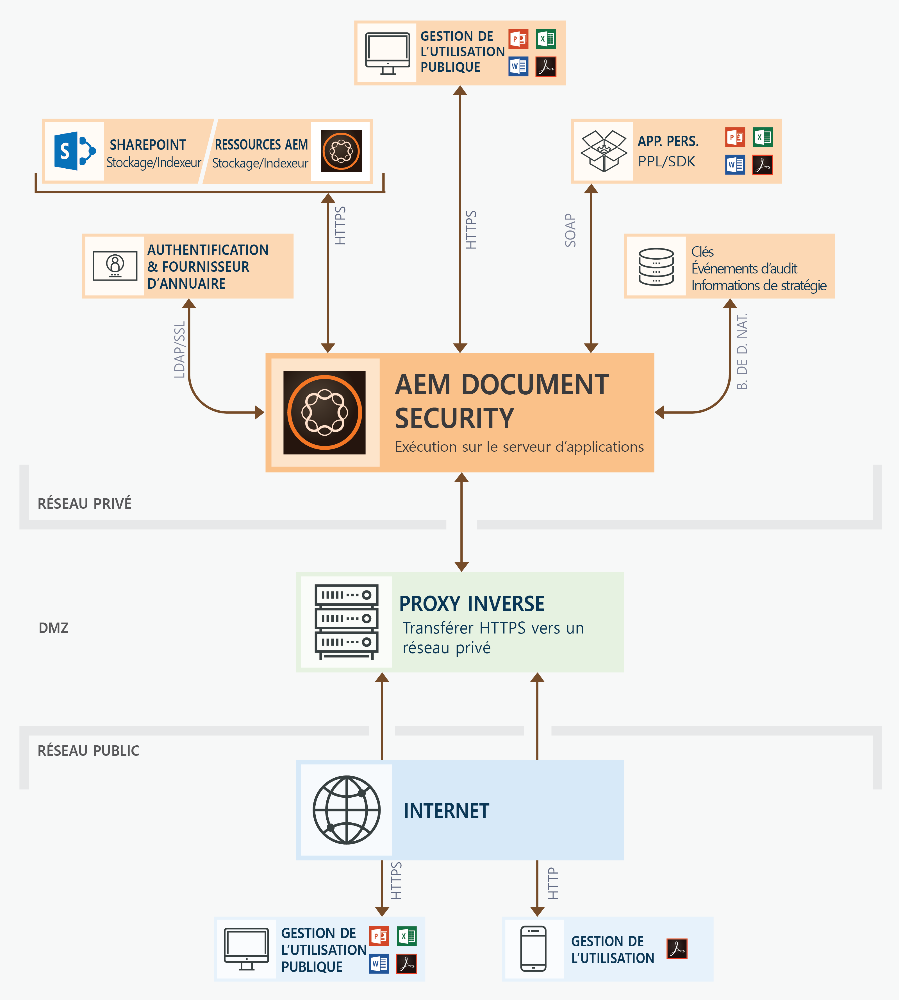

# Offres Document Security {#document-security-offerings}

>[!CAUTION]
>
>AEM 6.4 a atteint la fin de la prise en charge étendue et cette documentation n’est plus mise à jour. Pour plus d’informations, voir notre [période de support technique](https://helpx.adobe.com/fr/support/programs/eol-matrix.html). Rechercher les versions prises en charge [here](https://experienceleague.adobe.com/docs/?lang=fr).

Adobe Experience Manager Forms Document Security garantit que seuls les utilisateurs autorisés peuvent utiliser vos documents. Document Security vous permet de distribuer en toute sécurité toutes les informations enregistrées dans un format pris en charge. Les formats de fichiers pris en charge sont Adobe Portable Document Format (PDF) et Microsoft Word, Excel et PowerPoint.

Vous pouvez protéger des documents à l’aide de stratégies. Les paramètres de confidentialité que vous spécifiez dans une stratégie déterminent comment un destinataire peut utiliser un document auquel vous appliquez la stratégie. Par exemple, vous pouvez spécifier si les destinataires peuvent imprimer ou copier du texte, modifier du texte ou ajouter des signatures et des commentaires à des documents protégés.

Les stratégies sont stockées sur le serveur Document Security ; vous appliquez les stratégies aux documents par le biais de votre application cliente. Lorsque vous appliquez une stratégie à un document, les paramètres de confidentialité spécifiés dans la stratégie protègent les informations contenues dans le document. Vous pouvez distribuer le document protégé par une stratégie aux destinataires autorisés par la stratégie.

Le diagramme suivant illustre l’architecture standard pour AEM Forms Document Security :

## Clients Document Security {#document-security-clients}

Document Security fournit divers clients pour protéger les documents, afficher et modifier les documents protégés et les indexeurs afin d’activer la recherche de texte intégral sur les documents protégés. Vous pouvez choisir un client en fonction de vos besoins et des fonctionnalités du client.

Le serveur Document Security est le composant central par l’intermédiaire duquel Document Security effectue des transactions telles que l’authentification des utilisateurs, la gestion en temps réel des stratégies et l’application de la confidentialité. Le serveur fournit également un référentiel central pour les stratégies, les enregistrements d’audit et d’autres informations connexes.

Le serveur Document Security fournit une interface Web (page Web) pour créer des stratégies, gérer des documents protégés par une stratégie et contrôler les événements associés aux documents protégés par une stratégie. Les administrateurs peuvent également configurer des options globales telles que l’authentification des utilisateurs, le contrôle et la messagerie pour les utilisateurs invités, ainsi que la gestion des comptes d’utilisateurs invités.

Le serveur est inclus dans l’offre de module complémentaire Document Security d’AEM Forms. Vous pouvez contacter AEM Forms [équipe commerciale](https://www.adobe.com/fr/products/request-consultation/marketing-cloud.html?s_osc=70114000002JNwKAAW&amp;s_iid=70114000002JHs3AAG) pour acheter le module complémentaire Document Security.

### Documents Protect {#protect-documents}

AEM Forms Document Security fournit divers outils pour appliquer des stratégies de sécurité. Vous pouvez choisir un outil en fonction de vos besoins et de vos spécifications.

Vous pouvez utiliser SDK Document Security, Adobe Acrobat, Document Security Extension for Microsoft Office ou la bibliothèque portable de protection pour appliquer et suivre les stratégies de sécurité :

* **SDK Document Security :** Le SDK est un client riche en fonctionnalités. Vous pouvez utiliser SDK Document Security pour accéder aux fonctionnalités du serveur Document server, ouvrir des documents protégés par une stratégie et développer des extensions personnalisées, des modules externes ou des applications. Par exemple, vous pouvez développer des extensions pour protéger les formats de fichiers personnalisés ou intégrer le SDK aux solutions de prévention de perte de données (DLP). Les extensions, applications et modules externes développés à l’aide du SDK Document Security envoient des documents à un serveur AEM Forms désigné et les stratégies sont appliquées sur le serveur. Notez également que le SDK client Document Security AEM Forms (CSDK) ne peut pas annuler la protection des documents protégés à l’aide de la bibliothèque portable de protection (PPL) et vice versa.

    Le SDK Document Security est disponible pour Java et C++. Le SDK Java est inclus dans l’offre Document Security d’AEM Forms et il est installé sur le déploiement d’AEM forms on JEE. Vous pouvez contacter [AEM équipe d’assistance](https://helpx.adobe.com/fr/marketing-cloud/contact-support.html) pour obtenir le SDK C++. Le SDK C++ peut être compilé avec Microsoft Visual Studio 2013. Vous pouvez consulter le site de [documentation d’API de Document Security](https://help.adobe.com/fr_FR/livecycle/11.0/Services/WS92d06802c76abadb76c48dfe12dbeb3e281-7ff0.2.html) pour apprendre à utiliser les fonctions du SDK.

* **Adobe Acrobat :** Vous pouvez utiliser Adobe Acrobat pour appliquer la stratégie de sécurité à des documents PDF créés à l’aide d’applications de bureau courantes, telles que Microsoft Office, des navigateurs Web ou toute application prenant en charge l’impression au format PDF.

   Vous pouvez acheter et télécharger Adobe Acrobat sur le [site Web d’Adobe](https://acrobat.adobe.com/us/en/free-trial-download.html). L’article Adobe Acrobat concernant la [configuration des stratégies de sécurité pour les fichiers PDF](https://helpx.adobe.com/acrobat/using/setting-security-policies-pdfs.html) contient des informations détaillées sur la création et l’application de stratégies dans Adobe Acrobat.

* **Extension Document Security pour Microsoft Office**: Vous pouvez utiliser Document Security Extension for Microsoft Office pour appliquer des stratégies prédéfinies à vos fichiers Microsoft Office à partir des programmes Microsoft Office. L’extension garantit que seules les personnes autorisées peuvent utiliser des fichiers Microsoft Word, Excel et PowerPoint protégés par une stratégie. Seuls les utilisateurs autorisés disposant du module externe peuvent utiliser les fichiers protégés par une stratégie.

   L’extension Document Security est disponible sous forme de module externe Microsoft Office. Vous pouvez télécharger l’extension à partir de [Adobe web](https://helpx.adobe.com/fr/aem-forms/aem-document-security/download-installer.html). Ultérieurement, vous pouvez consulter [Document Security Extension for Microsoft Office](https://helpx.adobe.com/aem-forms/aem-document-security/aem-document-security-extension-help.html) pour découvrir comment installer, configurer et utiliser l’extension.

* **Bibliothèque portable de protection :** La bibliothèque portable de protection (PPL) protège un document localement sans l’envoyer au serveur AEM Forms. Seules les informations d’identification de sécurité et les détails des stratégies transitent sur le réseau. PPL vous permet également de limiter l’accès à la récupération de la stratégie aux seuls utilisateurs connectés. Vous pouvez récupérer des stratégies avec le contexte de l’utilisateur connecté à l’utilisateur AEM.

   En plus des tâches mentionnées ci-dessus, la bibliothèque portable de protection possède toutes les fonctionnalités du SDK Document Security. Vous pouvez utiliser SDK Document Security pour accéder aux fonctionnalités du serveur Document server, ouvrir des documents protégés par une stratégie et développer des extensions personnalisées, des modules externes ou des applications. Notez également que la bibliothèque de protection portable (PPL) ne peut pas annuler la protection du SDK client Document Security AEM Forms (CSDK) et inversement.

   La bibliothèque portable de protection est disponible pour les langues de Java et C++ dans les versions 32 bits et 64 bits. Elle est également disponible en tant que bundle OSGi pour AEM Forms on OSGi. La PPL C++ peut être compilée avec Microsoft Visual Studio 2013. Si vous possédez un module complémentaire AEM Forms Document Security sous licence, vous pouvez contacter [AEM Forms Document Security](https://helpx.adobe.com/fr/marketing-cloud/contact-support.html) équipe d’assistance pour obtenir la bibliothèque portable de protection. Plus tard, vous pouvez utiliser l’ aide de la bibliothèque portable de protection (fournie avec la bibliothèque) pour configurer et utiliser la bibliothèque portable de protection.

### Affichage ou modification de documents protégés {#view-or-edit-protected-documents}

* Pour **Documents PDF**, vous pouvez utiliser Adobe Acrobat DC, Acrobat Reader et Acrobat Reader Mobile pour afficher des documents PDF protégés. La plupart des utilisateurs disposent déjà d’Acrobat Reader sur leurs périphériques. Ils n’ont donc pas besoin d’obtenir ou d’apprendre un logiciel supplémentaire pour afficher les documents protégés. Vous pouvez également télécharger Acrobat Reader à partir de [Site web de téléchargement Acrobat Reader](https://get.adobe.com/fr/reader/).

* Pour **Documents Microsoft Office**, vous avez besoin de Microsoft Office et de l’extension AEM Forms Document Security pour Microsoft Office. L’extension Document Security est disponible sous forme de module externe Microsoft Office. Vous pouvez télécharger l’extension à partir du site web d’Adobe.

### Index des documents protégés {#index-protected-documents}

Les moteurs de recherche de texte intégral de Microsoft Windows (serveur d’index SharePoint) et Adobe Experience Manager (AEM) peuvent effectuer une recherche de texte intégral dans les formats de document couramment utilisés, tels que les fichiers texte brut, les documents Microsoft Office et les documents de PDF. Vous pouvez utiliser les indexeurs Document Security pour permettre aux moteurs de recherche de texte intégral de rechercher des documents de PDF protégés :

* **Indexeur iFilter :** Vous pouvez utiliser l’indexeur iFilter pour indexer des documents PDF protégés et permettre aux moteurs de recherche de texte intégral de Microsoft Windows (service d’indexation de bureau et serveur SharePoint Index) de rechercher les documents PDF protégés. Pour plus d’informations, reportez-vous à [AEM SharePoint IFilter pour documents protégés](assets/sharepoint-ifilter-doc-security.pdf).

* **Indexeur de Document Security AEM Forms :** Vous pouvez utiliser l’indexeur de Document Security AEM Forms pour indexer des documents PDF protégés et permettre à Adobe Experience Manager de rechercher les documents PDF protégés. Les indexeurs font partie de l’offre de Document Security AEM Forms. Ils sont inclus dans les programmes d’installation AEM Forms sur JEE.
