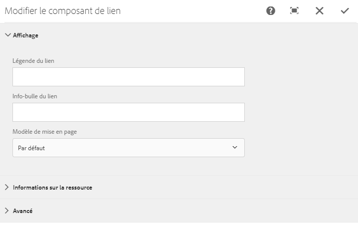

# Intégrer le composant Link dans une page{#embedding-link-component-in-a-page}

>[!CAUTION]
>
>AEM 6.4 a atteint la fin de la prise en charge étendue et cette documentation n’est plus mise à jour. Pour plus d’informations, voir notre [période de support technique](https://helpx.adobe.com/fr/support/programs/eol-matrix.html). Rechercher les versions prises en charge [here](https://experienceleague.adobe.com/docs/?lang=fr).

## Prérequis {#prerequisites}

Le composant Link est membre de la catégorie Document Services. Assurez-vous que la catégorie Document Services est visible dans le navigateur de composants d’AEM. Si la catégorie n’est pas répertoriée, procédez comme indiqué à la section [Activation des composants de Forms Portal](/help/forms/using/enabling-forms-portal-components.md).

## Composant Link {#link-component}

Le composant Link permet aux auteurs de portail de formulaires de créer un lien vers un formulaire adaptatif à partir de n’importe quel emplacement d’une page. Le composant Link est disponible dans la section Document Services de l’explorateur de composants.

Pour ajouter un composant Link à la page, procédez comme suit :

1. Faites glisser le composant **Link** sur la page. Sélectionnez un composant et appuyez sur . La boîte de dialogue Modifier le composant de lien s’ouvre.

   

1. Dans l’onglet **Affichage**, spécifiez ce qui suit :

   * **Légende du lien**: Texte ou légende du lien.
   * **Link Tooltip**: Info-bulle du lien.
   * **Modèle de mise en page**: Modèle pour la mise en page du composant Link.

1. Ouvrez le **Informations sur les ressources** et indiquez le type de la ressource. Une ressource peut être un **formulaire**. Selon le type de fichier sélectionné, les options ci-dessous s’affichent : 

   * **Chemin d’accès à l’actif** : chemin d’accès au référentiel de stockage de l’actif.
   * **Type de rendu** : le format de rendu : PDF, HTML ou Auto. Le type de rendu Auto détecte l’environnement utilisateur et effectue le rendu du formulaire en conséquence en tant que HTML ou PDF. Par exemple, si l’accès au formulaire se fait à partir d’un périphérique mobile, le type de rendu Auto est effectué par HTML.
   * **URL d’envoi :** URL du serveur vers lequel sont envoyées les données du formulaire.
   * **Profil HTML**: Profil pour le rendu du formulaire en tant que HTML.
   * **Profil PDF**: Profil pour le rendu du formulaire en tant que document de PDF.

1. Ouvrez l’onglet **Avancé**. Vous pouvez spécifier des paramètres supplémentaires au format de paire clé-valeur. Lorsqu’un clic est effectué sur le lien, ces paramètres supplémentaires sont transmis avec le formulaire.

   Appuyez sur **Terminé** pour enregistrer la règle.

## Méthodes recommandées pour l’utilisation du composant Link {#best-practices-for-using-link-component-br}

* Veillez à sélectionner PDF comme type de rendu si le chemin spécifié dans Form Path pointe vers un document dont le format de rendu autorisé est PDF.
* L’URL d’envoi d’un formulaire peut être spécifiée à plusieurs endroits et son ordre de priorité est le suivant :

   1. La valeur Submit URL intégrée dans le formulaire (dans le bouton d’envoi) a la priorité la plus élevée.
   1. La valeur Submit URL mentionnée dans Forms Manager a la priorité moyenne.
   1. La valeur Submit URL mentionnée dans Forms Portal a la priorité la plus faible.
