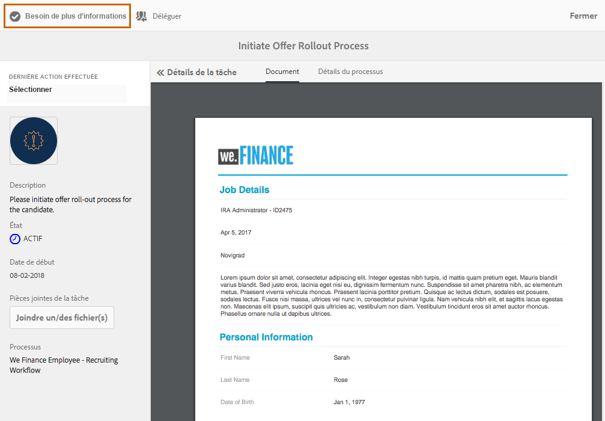
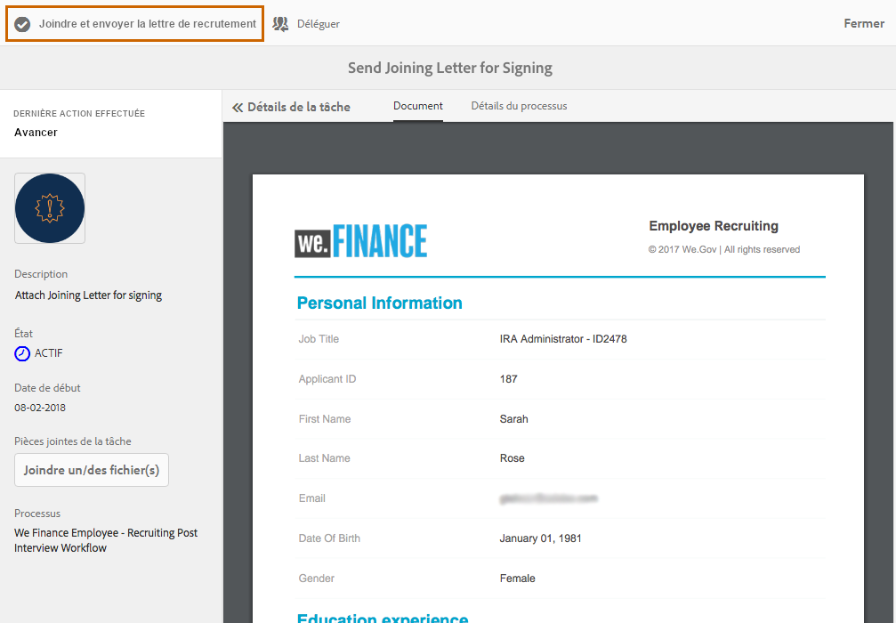

# Recrutement des employés reference site walkthrough {#employee-recruitment-reference-site-walkthrough}

## Condition requise {#prerequisite}

Installez les sites de référence comme décrit dans [Installation et configuration des sites de référence d’AEM Forms](/help/forms/using/setup-reference-sites.md).

## Présentation {#overview}

We.Finance est une entreprise qui permet à des candidats de postuler à des offres d’emploi via le portail du site de référence. L&#39;organisation utilise également le portail pour gérer le calendrier des entretiens des candidats, les listes abrégées et la communication interne. Le site gère les éléments suivants :

* Recherche d’emploi des candidats et présentation de candidature
* Sélection et affichage des candidats
* Processus d’entretien
* Informations sur les groupes de candidats
* Vérification des parcours des candidats
* Proposition d’offres aux candidats sélectionnés

>[!NOTE]
>
>Les cas d’utilisation de recrutement des employés sont disponibles sur les sites de référence de We.Finance et de We.Gov. Les images, descriptions et exemples utilisés dans les présentations se basent sur le site de référence We.Finance. Cependant, vous pouvez exécuter ces cas d’utilisation et consulter les artefacts également via We.Gov. Pour ce faire, remplacez **we-finance** par **we-gov** dans les adresses URL mentionnées.

### Modèles de processus impliqués {#workflow-models-involved}

Le cas d’utilisation du recrutement des employés implique deux processus :

* Avant l&#39;entrevue - Processus de recrutement des employés du secteur financier
* Après l&#39;entrevue - Nous finançons le processus de recrutement des employés après l&#39;entrevue

Ces entretiens sont créés dans AEM et sont disponibles à l’adresse :

`https://[authorHost]:[authorPort]/libs/cq/workflow/admin/console/content/models.html/etc/workflow/models/`

#### Processus de recrutement des employés We Finance {#we-finance-employee-recruiting-workflow}

Voici le modèle du processus de recrutement des employés de We Finance suivi dans ce document.

#### Processus après l’entretien de recrutement des employés We Finance {#we-finance-employee-recruiting-post-interview-workflow}

Voici le modèle de processus de recrutement après l’entretien des employés de We Finance suivi dans ce document.

### Personnages {#personas}

Le scénario implique les personnages suivants :

* Sarah Rose, la candidate, postulant pour un emploi dans l’entreprise
* John Jacobs, le recruteur
* Gloria Rios, la responsable des recrutements
* John Doe, le responsable des ressources humaines

## Sarah dépose sa candidature pour un emploi {#sarah-applies-for-a-job}

Sarah Rose recherche un emploi dans l’entreprise. Elle visite le portail web de l’entreprise et parcourt les offres d’emploi répertoriées sur la page Carrières. Elle trouve un emploi qui lui convient et postule.

Page d’accueil de We.Finance

Page Carrières de We.Finance

Sarah clique sur Postuler à une offre d’emploi. Le formulaire de candidature s’ouvre. Elle renseigne tous les détails de la demande et les envoie.

### Fonctionnement {#how-it-works}

La page d’accueil et la page Carrières de We.Finance sont des pages de sites AEM. La page Carrières comprend un formulaire adaptatif, qui utilise un panneau répétable pour récupérer les offres d’emploi à l’aide d’un service et les répertorier sur la page. Vous pouvez consulter le formulaire adaptatif à l’adresse `https://[authorHost]:[authorPort]/editor.html/content/forms/af/we-finance/employee/recruitment/jobs.html`.

### Démonstration {#see-it-yourself}

Accédez à `https://[publishHost]:[publishPort]/content/we-finance/global/en.html` et cliquez sur **[!UICONTROL Carrière]**. Cliquez sur **[!UICONTROL Rechercher]** pour renseigner la liste professionnelle puis cliquez sur **[!UICONTROL Postuler]** pour un emploi. Renseignez les détails du formulaire et envoyer la demande.

Assurez-vous de spécifier un ID de courrier électronique valide dans la demande, car toute communication par le biais de cette procédure pas à pas sera envoyée à l’ID de courrier électronique spécifié.

## John Jacobs présélectionne le profil de Sarah Rose pour la sélection de la responsable des recrutements {#john-jacobs-shortlists-sarah-rose-s-profile-for-the-hiring-manager-s-screening}

L’entreprise reçoit la candidature envoyée par Sarah. John Jacobs, un recruteur, se voit attribuer la tâche de consultation du profil de Sarah. Il consulte la candidature dans sa boîte de réception AEM, trouve que le profil correspond aux besoins du poste et clique sur Présélectionner. Le profil de Sarah est envoyé à Gloria Rios, la responsable des ressources humaines, pour approbation.

Boîte de réception AEM de John

John Jacobs présélectionne le profil de Sarah Rose pour la sélection de la responsable des recrutements

**Fonctionnement**

L’action d’envoi dans le formulaire de candidature déclenche un processus qui crée une tâche de sélection de demande dans la boîte de réception de John Jacob. Lorsque John examine et présélectionne la demande, le processus crée une tâche dans la boîte de réception de la responsable des recrutements, Gloria.

### Démonstration {#see-it-yourself-1}

Accédez à `https://[publishHost]:[publishPort]/content/we-finance/global/en/login.html?resource=/aem/inbox.html`et connectez-vous en utilisant jjacobs/password comme nom d’utilisateur/mot de passe pour John Jacobs. Ouvrez la tâche de consultation du profil du candidat et sélectionnez le candidat.

## Gloria consulte la demande et approuve la candidate pour un entretien {#gloria-reviews-the-application-and-approves-the-applicant-for-an-interview}

Gloria, la responsable des recrutements, reçoit le profil présélectionné comme tâche dans sa boîte de réception AEM. Elle la consulte et approuve la candidate Sarah Rose pour un entretien.

Boîte de réception AEM de Gloria

Gloria approuve Sarah Rose pour un entretien

**Fonctionnement**

Lorsque Gloria approuve la candidate pour un entretien, le processus crée une tâche dans la boîte de réception AEM de John Doe, qui est un recruteur de We.Finance.

### Démonstration {#see-it-yourself-2}

Accédez à `https://[publishHost]:[publishPort]/content/we-finance/global/en/login.html?resource=/aem/inbox.html` et connectez-vous en utilisant jjacobs/password comme nom d’utilisateur/mot de passe pour John Jacobs. Ouvrez la tâche de consultation du profil du candidat et sélectionnez le candidat.

Go to `https://[publishHost]:[publishPort]/content/we-finance/global/en/login.html?resource=/aem/inbox.html` and log in using grios/password as username/password for Gloria Rios. Ouvrez la tâche de consultation du profil de la candidate et cliquez sur Planifier l’entretien.

## John Doe planifie un entretien {#john-doe-schedules-an-interview}

John Doe reçoit la tâche de planification d’un entretien dans sa boîte de réception. John Doe sélectionne et ouvre la tâche et définit la date et l’heure de l’entretien, le lieu et la personne des ressources humaines responsable de l’entretien : John Jacob. John Doe clique sur Envoyer un courrier électronique d’invitation. Un courrier électronique est envoyé à Sarah et une tâche est affectée à Gloria, la responsable des recrutements, pour l’entretien avec Sarah.

Boîte de réception AEM de John Doe

John Doe planifie l’entretien et envoie les détails à Sarah Rose

## Sarah Rose reçoit le courrier électronique avec la planification de l’entretien {#sarah-rose-receives-the-email-with-interview-schedule}

Sarah Rose reçoit le courrier électronique avec la planification de l’entretien, le lieu et d’autres détails. Elle clique sur Accepter pour signifier qu’elle est d’accord avec l’horaire et le lieu de l’entretien. Guidée par ces informations précises, Sarah se rend à l’entretien.

Sarah Rose reçoit la planification de l’entretien

## Après les entretiens, le responsable des recrutements présélectionne Sarah Rose {#after-the-interviews-the-hiring-manager-shortlists-sarah-rose}

Une fois que Sarah Rose a passé et terminé les entretiens, Gloria Rios, la responsable des recrutements, ouvre la tâche de sélection de candidat depuis sa boîte de réception et clique sur Sélectionner. La décision de Gloria Rios est transférée à la personne des ressources humaines, John Doe, pour être traitée ultérieurement.

Boîte de réception AEM de Gloria

Gloria Rios sélectionne Sarah Rose après les entretiens

## John Doe demande plus d’informations {#john-doe-requests-more-information}

Avant de demander à un candidat de rejoindre l’entreprise, son parcours doit être vérifié. John Doe ouvre et consulte les informations du demandeur sélectionné et découvre que certaines informations relatives à ses études et son parcours professionnel ne sont pour le moment pas renseignées. John Doe clique sur Besoin de plus d’informations.

 

John Doe demande plus d’informations à Sarah Rose sur ses études et son expérience professionnelle

## Sarah Rose reçoit un courrier électronique lui demandant des informations supplémentaires {#sarah-rose-receives-an-email-requesting-further-information}

Sarah Rose reçoit un courrier électronique l’informant que des informations supplémentaires sont requises pour traiter sa candidature. Ce courrier inclut un lien vers le formulaire pour renseigner les informations requises.

Sarah Rose reçoit un courrier électronique lui indiquant que des informations supplémentaires sont requises pour traiter sa candidature

Sarah clique sur le lien Fournir des détails dans le courrier électronique. Un formulaire s’affiche. Sarah renseigne les informations requises relatives à ses études et son parcours professionnel comme demandé par John Doe et clique sur Envoyer.

Sarah ouvre le formulaire d’informations supplémentaires en cliquant sur le lien dans le courrier électronique

Sarah renseigne les informations supplémentaires comme demandé par John Doe et clique sur Envoyer

## John Doe accède au profil de la candidate sélectionnée pour consulter les informations supplémentaires fournies {#john-doe-reviews-the-selected-candidate-profile-for-the-additional-information-provided}

John Doe sélectionne la demande de consultation de la candidate et l’ouvre. John Doe estime que Sarah a renseigné toutes les informations nécessaires. Après avoir consulté la demande, John Doe clique sur Approuver. Sur approbation de John Doe, la demande de vérification du parcours de Sarah Rose est transférée à John Jacobs.

Boîte de réception AEM de John Doe

John Doe consulte les informations supplémentaires fournies par Sarah et les approuve

## John Jacobs reçoit une demande de vérification de parcours {#john-jacobs-receives-a-background-check-request}

John Jacobs voit la demande de vérification de parcours dans la boîte de réception. John Jacobs ouvre la tâche et consulte les informations fournies par Sarah Rose. Après avoir vérifié le parcours, John Jacobs clique sur Avancer pour indiquer que la vérification du parcours est concluante.

Boîte de réception AEM de John Jacobs

Après avoir vérifié le parcours, John Jacobs clique sur Avancer

## John Doe envoie la lettre de recrutement à Sarah Rose {#john-doe-sends-out-the-joining-letter-to-sarah-rose}

John Doe reçoit une demande dans sa boîte de réception AEM pour l’envoi de la lettre de recrutement. John ouvre la demande et affiche les détails. John Doe ajoute le fichier PDF de lettre de recrutement et clique sur Joindre et envoyer la lettre de recrutement.

Boîte de réception AEM de John Doe

John Doe envoie la lettre de recrutement pour signature

## Sarah Rose reçoit et signe la lettre de recrutement {#sarah-rose-receives-and-signs-the-joining-letter}

Sarah Rose reçoit la lettre de recrutement pour signature. Sarah clique sur Cliquez ici pour consulter et signer la lettre de recrutement. Le fichier PDF de lettre de recrutement s’ouvre avec un champ pour signer le document.

Sarah Rose reçoit la lettre de recrutement pour signature

Sarah peut choisir entre la saisie, la fonction d’écriture à la main, l’insertion d’une image de signature ou l’utilisation de l’écran tactile de son appareil mobile pour dessiner sa signature. Sarah saisit son nom, clique sur Cliquer pour signer et télécharge la copie signée de la lettre de jonction.

Sarah saisit son nom pour signer la lettre de recrutement

Sarah clique sur Cliquer pour signer pour terminer la procédure de signature de la lettre de recrutement

