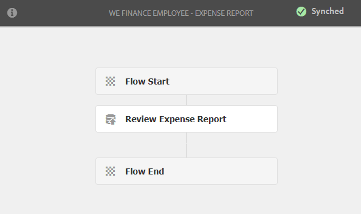

# Présentation du site de référence en libre-service des employés {#employee-self-service-reference-site-walkthrough}

>[!CAUTION]
>
>AEM 6.4 a atteint la fin de la prise en charge étendue et cette documentation n’est plus mise à jour. Pour plus d’informations, voir notre [période de support technique](https://helpx.adobe.com/fr/support/programs/eol-matrix.html). Rechercher les versions prises en charge [here](https://experienceleague.adobe.com/docs/?lang=fr).

## Prérequis {#prerequisite}

Configurez les sites de référence comme décrit dans la section [Installation et configuration des sites de référence AEM Forms](/help/forms/using/setup-reference-sites.md).

## Présentation {#overview}

Les systèmes de libre-service des employés, généralement hébergés sur l’Intranet de l’entreprise, permettent aux employés d’accéder à une foule d’informations et de services qu’ils peuvent utiliser depuis leur bureau. Il permet aux employés d’effectuer des actions, comme accéder aux détails de leur emploi, demander un congé et envoyer des rapports de dépenses, et leur donne le contrôle total. D’un autre côté, il aide les entreprises à améliorer l’efficacité des processus et à réduire les coûts tout en informant les employés et en les incitant à s’engager.

Le site de référence de libre-service dédié aux employés explique comment tirer parti d’AEM Forms pour mettre en oeuvre le système de libre-service des employés dans votre entreprise.

>[!NOTE]
>
>Les cas d’utilisation du libre-service des employés sont disponibles dans les sites de référence We.Finance et We.Gov. Les exemples, images et descriptions utilisés dans les présentations WebFix utilisent le site de référence We.Finance. Cependant, vous pouvez également exécuter ces cas d’utilisation et examiner les artefacts à l’aide de We.Gov. Pour ce faire, vous devez remplacer **we-finance** avec **we-gov** dans les URL mentionnées.

## Présentation du questionnaire sur les conflits d’intérêt {#conflict-of-interest-questionnaire-walkthrough}

De temps à autre, les organisations demandent à leurs employés de soumettre un questionnaire sur les conflits d’intérêt afin d’identifier les activités extérieures ou les relations personnelles de leurs employés qui peuvent potentiellement entrer en conflit avec leur organisation.

Le service Conformité de l’organisation de Sarah a demandé aux employés de soumettre le questionnaire sur les conflits d’intérêt.

### Sarah envoie le questionnaire sur les conflits d’intérêt {#sarah-submits-the-conflict-of-interest-questionnaire}

Sarah se rend sur le portail de son entreprise, se connecte et clique sur Employé pour accéder au tableau de bord de l’employé. Elle trouve le questionnaire sur les conflits d’intérêt dans le tableau de bord de l’employé et clique sur **[!UICONTROL Appliquer]**.

**Figure :** *Portail d’organisation*

**Figure :** *Tableau de bord des employés*

Sarah navigue dans le formulaire à l’aide du bouton Suivant et lit les sections Introduction et Définition . Elle répond aux questions de la section Questions . Enfin, elle signe et envoie le questionnaire.

Le portail de l’organisation et le questionnaire sont réactifs et compatibles avec les appareils mobiles. Le processus suivant montre comment Sarah navigue dans le questionnaire et l’envoie sur son appareil mobile.

**Fonctionnement**

Le portail de l’organisation et le tableau de bord des employés sont des pages AEM Sites. Le tableau de bord répertorie plusieurs options en libre-service, telles que le questionnaire sur les conflits d’intérêt. Le bouton Demander est lié à un formulaire adaptatif.

Le formulaire adaptatif utilise des règles pour afficher et masquer les informations en fonction de la réponse fournie dans l’onglet Questions . En outre, le formulaire utilise le composant Griffonnage pour la signature dans l’onglet Déclaration . Consultez le formulaire adaptatif à l’adresse `https://[authorHost]:[authorPort]/editor.html/content/forms/af/we-finance/employee/self-service/conflict-of-interest.html`.

**Démonstration**

Accédez à `https://[publishHost]:[publishPort]/content/we-finance/global/en/self-service-forms.html` et se connecter à l’aide de `srose/srose` comme nom d’utilisateur/mot de passe pour Sarah. Cliquez sur **[!UICONTROL Employé]** pour accéder au tableau de bord, puis cliquez sur **[!UICONTROL Appliquer]** sur le questionnaire sur les conflits d’intérêt. Examinez et envoyez le questionnaire.

### Gloria examine et approuve l’envoi du questionnaire sur les conflits d’intérêt {#gloria-reviews-and-approves-the-conflict-of-interest-questionnaire-submission}

Le questionnaire sur les conflits d’intérêt envoyé par Sarah est assigné à Gloria Rios pour examen. Gloria travaille comme agente de conformité dans l’organisation. Gloria se connecte à sa boîte de réception d’AEM et passe en revue les tâches qui lui sont affectées. Elle approuve le questionnaire envoyé par Sarah et termine la tâche.

**Figure :** *Boîte de réception de Gloria*

**Figure :** *Ouvrir la tâche*

**Fonctionnement**

L’action d’envoi dans le questionnaire sur les conflits d’intérêt déclenche un processus qui crée une tâche dans la boîte de réception de Gloria pour approbation. Vérifiez le Forms Workflow à l’adresse `https://[authorHost]:[authorPort]/editor.html/conf/global/settings/workflow/models/we-finance/employee/self-service/we-finance-employee-conflict-of-interest.html`

**Démonstration**

Accédez à sur `https://[publishHost]:[publishPort]/content/we-finance/global/en/login.html?resource=/aem/inbox.html` et connectez-vous en utilisant comme nom d’utilisateur/mot de passe pour Gloria Rios. `grios/password` Ouvrez la tâche créée pour le questionnaire sur les conflits d’intérêt et approuvez-la.

## Présentation de la demande de carte d’entreprise {#corporate-card-application-walkthrough}

Sarah voyage beaucoup pour les affaires et a besoin d’une carte de crédit d’entreprise pour payer ses factures en déplacement. Elle demande une carte d’entreprise via le portail des employés de son entreprise.

### Sarah envoie la demande de carte d’entreprise {#sarah-submits-the-corporate-card-application}

Sarah se rend sur le portail de son entreprise, se connecte et clique **[!UICONTROL Employé]** pour accéder au tableau de bord des employés. Elle trouve la demande de carte d’entreprise dans le tableau de bord de l’employé et clique sur **[!UICONTROL Appliquer]**.

**Figure :** *Portail d’organisation*

**Figure :** *Tableau de bord des employés*

Elle clique **[!UICONTROL Appliquer]** sur la demande Carte d’entreprise. Une application d’une seule page s’ouvre. Elle remplit tous les détails et clique **[!UICONTROL Appliquer]** pour envoyer la demande.

**Fonctionnement**

Le portail de l’organisation et le tableau de bord des employés sont des pages AEM Sites. Le tableau de bord répertorie plusieurs options en libre-service, telles que la demande de carte d’entreprise. Le bouton Appliquer de la demande est lié à un formulaire adaptatif.

Le formulaire adaptatif pour la demande de carte d’entreprise est un formulaire adaptatif simple, d’une page et réactif. Il utilise des composants de base de formulaires adaptatifs tels que le texte, le téléphone, la zone numérique et l’exécution pas à pas numérique. Consultez le formulaire adaptatif à l’adresse suivante :\
`https://[authorHost]:[authorPort]/editor.html/content/forms/af/we-finance/employee/self-service/corporate-card.html`.

**Démonstration**

Accédez à `https://[publishHost]:[publishPort]/content/we-finance/global/en/self-service-forms.html` et se connecter à l’aide de `srose/srose` comme nom d’utilisateur/mot de passe pour Sarah. Cliquez sur **[!UICONTROL Employé]** pour accéder au tableau de bord, puis cliquez sur **[!UICONTROL Appliquer]** sur la demande Carte d’entreprise. Renseignez les détails et envoyez la demande.

### Gloria examine et approuve la demande de carte d’entreprise {#gloria-reviews-and-approves-the-corporate-card-application}

La demande de carte d’entreprise envoyée par Sarah est affectée à Gloria Rios pour examen. Gloria se connecte à sa boîte de réception d’AEM et passe en revue les tâches qui lui sont affectées. Elle approuve la demande envoyée par Sarah et termine la tâche.

**Figure :** *Boîte de réception de Gloria*

**Figure :** *Ouvrir la tâche*

**Fonctionnement**

Le processus d’envoi dans la demande de carte d’entreprise déclenche un processus Forms qui crée une tâche dans la boîte de réception de Gloria pour approbation. Vérifiez le Forms Workflow à l’adresse `https://[authorHost]:[authorPort]/editor.html/conf/global/settings/workflow/models/we-finance/employee/self-service/we-finance-employee-corporate-card.html`

**Démonstration**

Accédez à sur `https://[publishHost]:[publishPort]/content/we-finance/global/en/login.html?resource=/aem/inbox.html` et connectez-vous en utilisant comme nom d’utilisateur/mot de passe pour Gloria Rios. `grios/password` Ouvrez la tâche créée pour la demande de carte d’entreprise et approuvez-la.

## Présentation de l’envoi du rapport de dépenses {#expense-report-submission-walkthrough}

Comme Sarah dépense pendant ses voyages d’affaires, elle doit envoyer des rapports de dépenses pour approbation. L&#39;option libre-service de son entreprise lui permet d&#39;envoyer le rapport de dépenses en ligne.

### Sarah envoie la demande de rapport de dépenses {#sarah-submits-the-expense-report-application}

Sarah se rend sur le portail de son entreprise, se connecte et clique **[!UICONTROL Employé]** pour accéder au tableau de bord des employés. Elle trouve la demande de rapport de dépenses dans le tableau de bord de l’employé et clique sur **[!UICONTROL Appliquer]**.

**Figure :** *Portail d’organisation*

**Figure :** *Tableau de bord des employés*

Elle clique **[!UICONTROL Appliquer]** sur la demande Rapport de dépenses . Un formulaire de demande s’ouvre, qui comporte deux onglets : Nom du rapport et Détails du rapport. Le **+** dans l’onglet Détails du rapport , elle peut ajouter plus de dépenses dans un rapport.

Le portail et les applications de l’entreprise sont réactifs et compatibles avec les appareils mobiles. Le workflow suivant montre comment Sarah navigue et envoie le rapport de dépenses sur son appareil mobile.

**Fonctionnement**

Le portail de l’organisation et le tableau de bord des employés sont des pages AEM Sites. Le tableau de bord répertorie plusieurs options en libre-service, telles que la demande de rapport de dépenses. Le bouton Demander est lié à un formulaire adaptatif.

Les onglets Nom du rapport et Détails du rapport du formulaire adaptatif sont des composants Panneau. Le panneau Détails du rapport contient le panneau Dépenses. Il s’agit d’un panneau répétable qui permet d’ajouter plusieurs dépenses dans le rapport. Passez en revue le formulaire adaptatif et ses configurations à l’adresse `https://[authorHost]:[authorPort]/editor.html/content/forms/af/we-finance/employee/expense-report.html`.

**Démonstration**

Accédez à `https://[publishHost]:[publishPort]/content/we-finance/global/en/self-service-forms.html` et se connecter à l’aide de `srose/srose` comme nom d’utilisateur/mot de passe pour Sarah. Cliquez sur **[!UICONTROL Employé]** pour accéder au tableau de bord, puis cliquez sur **[!UICONTROL Appliquer]** sur la demande Rapport de dépenses . Renseignez les détails et envoyez la demande.

### Gloria examine et approuve le rapport de dépenses {#gloria-reviews-and-approves-the-expense-report}

Le rapport de dépenses envoyé par Sarah est affecté à Gloria Rios pour révision. Gloria se connecte à sa boîte de réception d’AEM et passe en revue les tâches qui lui sont affectées. Elle approuve la demande envoyée par Sarah et termine la tâche.

**Figure :** *Boîte de réception de Gloria*

**Figure :** *Ouvrir la tâche*

**Fonctionnement**

Le processus d’envoi dans la demande de rapport de dépenses déclenche un processus Forms qui crée une tâche dans la boîte de réception de Gloria pour approbation. Vérifiez le Forms Workflow à l’adresse `https://[authorHost]:[authorPort]/editor.html/conf/global/settings/workflow/models/we-finance/employee/self-service/we-finance-employee-expense-report-workflow.html`

**Démonstration**

Accédez à sur `https://[publishHost]:[publishPort]/content/we-finance/global/en/login.html?resource=/aem/inbox.html` et connectez-vous en utilisant comme nom d’utilisateur/mot de passe pour Gloria Rios. `grios/password` Ouvrez la tâche créée pour la demande de rapport de dépenses et approuvez-la.

## Quitter la présentation de la demande {#leave-application-walkthrough}

Sarah prévoit des vacances en famille le mois prochain et veut demander un congé hebdomadaire.

### Sarah envoie la demande de congés {#sarah-submits-the-leave-application}

Sarah se rend sur le portail de son entreprise, se connecte et clique **[!UICONTROL Employé]** pour accéder au tableau de bord des employés. Elle trouve la demande de congés dans le tableau de bord de l’employé et clique sur **[!UICONTROL Appliquer]**.

**Figure :** *Portail d’organisation*

**Figure :** *Tableau de bord des employés*

La demande de congés s’ouvre avec le nom et l’ID d’employé de Sarah préremplis dans le formulaire. Elle affiche également son solde et son historique de congés. Elle remplit les détails de la permission et envoie la demande pour approbation.

Le portail et les applications de l’entreprise sont réactifs et compatibles avec les appareils mobiles. Le processus suivant montre comment Sarah navigue dans la demande et l’envoie sur son appareil mobile.

**Fonctionnement**

Le portail de l’organisation et le tableau de bord des employés sont des pages AEM Sites. Le tableau de bord répertorie plusieurs options en libre-service, telles que la demande de congés. Le bouton Demander est lié à un formulaire adaptatif.

Le formulaire adaptatif pour la demande de congés est basé sur le modèle de données de formulaire de congés des employés. Dans la section Solde des congés , le tableau du solde des congés est renseigné à l’aide de la variable `getLeavesOf` Service de modèle de données de formulaire. Les champs Dates de début et de fin utilisent des règles pour valider que les valeurs de date sont égales ou supérieures à la date actuelle. La durée du congé est calculée à l’aide de la variable `calcBusinessDays` fonction .

Vous pouvez consulter le formulaire adaptatif et le modèle de données de formulaire aux emplacements suivants :

`https://[authorHost]:[authorPort]/editor.html/content/forms/af/we-finance/employee/self-service/leave-application.html`

`https://[authorHost]:[authorPort]/aem/fdm/editor.html/content/dam/formsanddocuments-fdm/db`

**Démonstration**

Accédez à `https://[publishHost]:[publishPort]/content/we-finance/global/en/self-service-forms.html` et se connecter à l’aide de `srose/srose` comme nom d’utilisateur/mot de passe pour Sarah. Cliquez sur **[!UICONTROL Employé]** pour accéder au tableau de bord, puis cliquez sur **[!UICONTROL Appliquer]** sur la demande de congés. Renseignez les détails et envoyez la demande.

### Gloria examine et approuve la demande de congés {#gloria-reviews-and-approves-the-leave-application}

La demande de congés envoyée par Sarah est affectée à Gloria Rios pour examen. Gloria se connecte à sa boîte de réception d’AEM et passe en revue les tâches qui lui sont affectées. Elle approuve la demande envoyée par Sarah et termine la tâche.

**Figure :** *Boîte de réception de Gloria*

**Figure :** *Ouvrir la tâche*

**Fonctionnement**

Le processus d’envoi dans la demande de congés déclenche un processus Forms qui crée une tâche dans la boîte de réception de Gloria pour approbation. Vérifiez le Forms Workflow à l’adresse `https://[authorHost]:[authorPort]/editor.html/conf/global/settings/workflow/models/we-finance/employee/self-service/we-finance-employee-leave-application.html`

**Démonstration**

Accédez à sur `https://[publishHost]:[publishPort]/content/we-finance/global/en/login.html?resource=/aem/inbox.html` et connectez-vous en utilisant comme nom d’utilisateur/mot de passe pour Gloria Rios. `grios/password` Ouvrez la tâche créée pour la demande de congés et approuvez-la.
