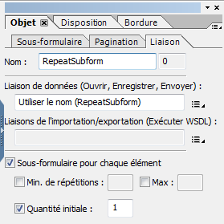

# Questions fréquentes (FAQ) des formulaires HTML5 {#frequently-asked-questions-faq-for-html-forms}

>[!CAUTION]
>
>AEM 6.4 a atteint la fin de la prise en charge étendue et cette documentation n’est plus mise à jour. Pour plus d’informations, voir notre [période de support technique](https://helpx.adobe.com/fr/support/programs/eol-matrix.html). Rechercher les versions prises en charge [here](https://experienceleague.adobe.com/docs/?lang=fr).

Questions fréquentes (FAQ) sur la mise en page, la prise en charge des scripts et la portée des formulaires HTML5.

## Mise en page {#layout}

1. Pourquoi les champs des codes à barres et de signature ne figurent-ils dans pas dans mon formulaire ?

   Réponse : les champs de codes à barres et de signatures ne sont pas adaptés aux cas de figures impliquant du HTML ou des périphériques mobiles. Ces champs apparaissent comme des zones non interactives. Cependant, AEM Forms Designer propose un nouveau champ de saisie tactile de signature qui peut être utilisé à la place du champ de signature. Vous pouvez également ajouter un [widget personnalisé](/help/forms/using/custom-widgets.md) pour les codes à barres et l’intégrer.

1. Le texte enrichi est-il pris en charge pour le champ de texte XFA ?

   Réponse : le champ XFA, qui supporte le contenu enrichi dans AEM Forms Designer, n’est pas pris en charge ; il est généré sous forme de texte normal sans prise en charge du style du texte à partir de l’interface utilisateur. En outre, les champs XFA avec la propriété comb s’affichent comme un champ normal, bien qu’il existe toujours des restrictions sur le nombre de caractères autorisés en fonction de la valeur des chiffres comb.

1. Existe-t-il des restrictions concernant l’utilisation de sous-formulaires répétables ?

   Réponse : Les sous-formulaires répétables doivent avoir un nombre initial de 1 ou plus. Les sous-formulaires répétables avec un nombre initial de zéro ne sont pas pris en charge. Vous pouvez également choisir d’utiliser un sous-formulaire répétable et de ne pas l’afficher au chargement du formulaire. Pour réaliser le cas d’utilisation : 

   1. Définissez le nombre initial de sous-formulaire répétable sur 1.

      

   1. Utilisez l’événement initialize du formulaire pour masquer la Principale instance du sous-formulaire. Par exemple, le code ci-dessous masque la Principale instance du sous-formulaire lors de l’initialisation du formulaire. Il vérifie également le type d’application pour s’assurer que le script est exécuté uniquement du côté client : 

      ```
      if ((xfa.host.appType == "HTML 5" || xfa.host.appType == "Exchange-Pro" || xfa.host.appType == "Reader")&&(_RepeatSubform.count == 1)&&(form1.Page1.Subform1.RepeatSubform.Key.rawValue == null)) {
      RepeatSubform.presence = "hidden";
      }  
      ```

   1. Ouvrez le script permettant d’ajouter une instance du sous-formulaire à des fins de modification. Ajoutez le code comme ci-dessous pour ajouter une instance du script de sous-formulaire.

      Le code ci-dessous vérifie l’instance masquée du sous-formulaire. Si l’instance masquée du sous-formulaire est trouvée, supprimez l’instance masquée du sous-formulaire et insérez une nouvelle instance du sous-formulaire. Si l’instance masquée du sous-formulaire est introuvable, insérez simplement une nouvelle instance du sous-formulaire.

      ```
      if (RepeatSubform.presence == "hidden")
      { 
      RepeatSubform.instanceManager.insertInstance(0);
      RepeatSubform.instanceManager.removeInstance(1);
      }
      else
      {
      RepeatSubform.instanceManager.addInstance(1);
      }
      ```

   1. Ouvrez le script pour enlever une instance du sous-formulaire pour modification. Ajoutez le code comme suit pour supprimer une instance du script du sous-formulaire.

      Le code vérifie le nombre de sous-formulaires. Si le nombre de sous-formulaires atteint 1, le code masque le sous-formulaire au lieu de le supprimer.

      ```
      if (RepeatSubform.instanceManager.count == 1) {
      RepeatSubform.presence = "hidden";
      } else {
      RepeatSubform.instanceManager.removeInstance(RepeatSubform.instanceManager.count - 1);
      }
      ```

   1. Ouvrez l’événement presubmit du formulaire pour le modifier. Ajoutez le script suivant à l’événement pour supprimer l’instance masquée du script avant de le modifier. Elle empêche l’envoi des données du sous-formulaire masqué lors de l’envoi.

      ```
      if(RepeatSubform.instanceManager.count == 1 && RepeatSubform.presence == "hidden") {
      RepeatSubform.instanceManager.removeInstance(0);
      }
      ```

1. Existe-t-il des restrictions concernant l’utilisation de sous-formulaires masqués ?

   Réponse : un sous-formulaire masqué avec une hiérarchie complexe fractionnée sur plusieurs pages génère des problèmes de mise en page. Une façon de contourner ce problème consiste à marquer le sous-formulaire visible au début, puis de le masquer dans un script d’initialisation basé sur une logique ou des données.

1. Pourquoi certains texte sont-ils tronqués ou ne s’affichent-ils pas correctement en HTML5 ?

   Réponse : lorsque l’espace attribué à un champ de texte constitué d’une illustration ou d’une légende est insuffisant et ne lui permet pas d’afficher le contenu, le texte apparaît tronqué dans le formulaire pour périphériques mobiles généré. Cette troncature est également visible dans la vue de conception d’AEM Forms Designer. Bien que cette troncature puisse être prise en charge dans les fichiers PDF, ce n’est pas le cas dans les formulaires HTML5. Pour éviter ce problème, assurez-vous de prévoir un espace suffisant pour qu’un champ de texte constitué d’une illustration ou d’une légende puisse s’afficher sans être tronqué dans le mode de conception d’AEM Forms Designer.

1. Je constate des problèmes de mise en page liés à du contenu manquant ou à des chevauchements. Quelle en est la raison ?

   Réponse : si un élément de texte ou d’image constitué d’une illustration est chevauché par un autre élément (un rectangle par exemple), le contenu du champ de texte constitué de l’illustration n’est pas visible s’il apparaît plus loin dans le document (dans la vue hiérarchique d’AEM Forms Designer). Le format PDF prend en charge la mise en calque transparente mais ce n’est pas le cas du HTML et des navigateurs.

1. Pourquoi certaines polices affichées dans le formulaire HTML sont-elles différentes de celles utilisées lors de la conception du formulaire ?

   Réponse : les formulaires HTML5 n’intègrent pas de polices (contrairement aux formulaires PDF où les polices sont intégrées au formulaire). Pour que la version par HTML du formulaire s’affiche comme prévu, assurez-vous que les polices spécifiées dans le fichier XDP sont disponibles sur le serveur et sur l’ordinateur client. Si les polices requises ne sont pas disponibles sur le serveur, les polices de secours sont utilisées. De plus, si vous utilisez des polices dans le modèle de formulaire qui ne sont pas disponibles sur le périphérique client, les polices par défaut du navigateur sont utilisées pour le rendu du texte.

1. Les attributs d’alignement vertical et horizontal sont-ils pris en charge dans les formulaires HTML ? 

   Oui, ils le sont. L’attribut vAlign n’est pas pris en charge dans Internet Explorer et dans le champ multiligne.

1. Les formulaires HTML5 prennent-ils en charge les caractères de l’hébreu ?

   Les formulaires HTML5 prennent en charge les caractères de l’hébreu tous les navigateurs, à l’exception de Microsoft Internet Explorer.

1. Existe-t-il des limites de caractères dans les champs numériques des formulaires HTML5 ?

   Réponse : oui, les formulaires HTML5 sont soumis à certaines limitations. Si le nombre de chiffres dépasse celui indiqué dans la clause d’image, les numéros ne sont pas traduits et s’affichent dans les paramètres régionaux anglais.

1. Pourquoi les formulaires HTML sont-ils plus volumineux que les formulaires PDF ?

   De nombreuses structures et objets de données intermédiaires tels que les DOM du formulaire, les DOM de données, les DOM de disposition sont requis pour rendre un XDP sur un formulaire HTML.

   Pour les PDF forms, Adobe Acrobat dispose d’un moteur XTG intégré pour créer des structures de données intermédiaires, ainsi que des objets. Acrobat prend également en charge la mise en page et les scripts.

   Pour les formulaires HTML5, les navigateurs ne disposent pas d’un moteur XTG intégré pour créer des structures de données intermédiaires et des objets à partir d’octets XDP bruts. Ainsi, pour les formulaires HTML5, des structures intermédiaires sont générées sur le serveur et envoyées au client. Sur le client, les scripts basés sur JavaScript et le moteur de mise en page utilisent ces structures intermédiaires.

   La taille de la structure intermédiaire dépend de la taille du XDP original et des données fusionnées avec XDP.

1. Existe-t-il des restrictions concernant l’utilisation des tableaux dans mon xdp ?

   Réponse : les tableaux complexes génèrent des problèmes de rendu.

   * La section (SubformSet) à l’intérieur d’un tableau n’est pas prise en charge.
   * Les rangées d’en-tête ou de pied de page de certains tableaux sont marquées pour répétition. La division de ces tableaux sur plusieurs pages peut entraîner des problèmes.

1. Les tableaux accessibles sont-ils soumis à des restrictions ?

   Réponse : oui, les tableaux accessibles sont soumis aux restrictions suivantes :

   * Les tableaux imbriqués et les sous-formulaires à l’intérieur d’un tableau ne sont pas pris en charge.
   * Les en-têtes sont uniquement pris en charge pour la ligne supérieure ou les colonnes gauche du tableau. Les en-têtes ne sont pas pris en charge pour les éléments de tableau intermédiaire. Vous pouvez appliquer des en-têtes à plusieurs lignes et les en-têtes de colonne sont pris en charge si toutes les lignes et colonnes sont associées à la ligne la plus élevée ou la colonne la plus à gauche du tableau.
   * `Rowspan` et `colspan` ne sont pas pris en charge depuis un emplacement aléatoire du tableau.
   * Vous ne pouvez pas dynamiquement ajouter ou supprimer l’occurrence des lignes contenant des éléments possédant une valeur rowspan supérieure à 1.

1. Quel est l’ordre de lecture de l’info-bulle et de la légende pour les lecteurs d’écran ?

   * Lorsque la légende et l’info-bulle sont présentes, la seule légende est lue. Si la légende n’est pas disponible, l’info-bulle est lue. Vous pouvez également spécifier la priorité de lecture dans un fichier XDP à l’aide du concepteur de formulaires.
   * Lorsque vous survolez un élément, une info-bulle s’affiche. Si l’info-bulle n’est pas disponible, le texte vocal s’affiche. Si le texte vocal n’est pas disponible, le nom du champ s’affiche.

1. Lorsque vous survolez un champ, une info-bulle s’affiche. Comment la désactiver ?

   Pour désactiver l’info-bulle au survol, sélectionnez none dans le panneau d’accessibilité de Designer.

1. Dans Designer, un utilisateur peut configurer les propriétés personnalisées d’aspect des boutons radio et des cases à cocher. Lors du rendu des formulaires, les formulaires HTML5 prennent-ils en compte ces propriétés personnalisées d’aspect ?

   Réponse : Les formulaires HTML5 ignorent les propriétés personnalisées d’aspect des boutons radio et des cases à cocher. Les boutons radio et les cases à cocher s’affichent selon les spécifications du navigateur sous-jacent.

1. Lorsqu’un formulaire HTML5 est ouvert dans un navigateur pris en charge, la bordure des champs placés de manière adjacente n’est pas alignée correctement ou les sous-formulaires apparaissent recouverts. Lorsque le même HTML5 Form est prévisualisé dans Forms Designer, les champs et la mise en page n’apparaissent pas mal alignés et les sous-formulaires apparaissent à la bonne position. Comment résoudre le problème ?

   Lorsqu’un sous-formulaire est configuré pour enchaîner le contenu et que le sous-formulaire comporte un élément de bordure masqué, la bordure des champs placés de manière adjacente n’est pas alignée correctement ou les sous-formulaires apparaissent recouverts. Pour résoudre le problème, vous pouvez supprimer ou commenter les éléments &lt;border> masqués du fichier XDP correspondant. Par exemple, l’élément &lt;border> suivant est marqué comme commentaire :

   ```xml
               <!--<border>
                  <edge presence="hidden"/>
                  <corner thickness="0.175mm" presence="hidden"/>
               </border> -->
   ```

## Script {#scripting}

1. Existe-t-il des limites dans la mise en oeuvre de JavaScript pour HTML Forms ?

   Réponse:

   * La prise en charge du script xfa.connectionSet est limitée. Pour connectionSet, seul l’appel côté serveur du service web est pris en charge. Pour plus d’informations, consultez la section [Prise en charge des scripts](/help/forms/using/scripting-support.md).
   * Il n’existe aucune prise en charge de $record et $data dans les scripts côté client. Cependant, si les scripts sont constitués de blocs formReady ou layoutReady, ils continuent de fonctionner car ces événements s’exécutent côté serveur.
   * Les scripts spécifiques à l’élément XFA Draw tels que la modification du texte de dessin (ou du texte de légende dans le cas de champs) ne sont pas pris en charge.

1. L’utilisation de formCalc présente-t-elle des restrictions ?

   Réponse : Seul un sous-ensemble de scripts formCalc est actuellement mis en oeuvre. Pour plus d’informations, consultez la section [Prise en charge des scripts](/help/forms/using/scripting-support.md).

1. Existe-t-il une convention de dénomination recommandée et des mots-clés réservés à éviter ?

   * Dans AEM Forms Designer, nous recommandons de ne pas faire commencer le nom d’un objet (tel qu’un sous-formulaire ou un champ de texte) par un tiret bas (_). Pour utiliser un trait de soulignement au début du nom, ajoutez un préfixe après le trait de soulignement : *_&lt;prefix>&lt;objectname>. *
   * Toutes les API des formulaires HTML5 API sont des mots-clés réservés. Pour les API/fonctions personnalisées, utilisez un nom différent de celui des [API de formulaires HTML5](/help/forms/using/scripting-support.md).

1. Les formulaires HTML5 prennent-ils en charge les champs flottants ?

   Oui, HTML5 Forms prend en charge les champs flottants. Pour activer les champs flottants, ajoutez la propriété suivante au profil de rendu :

   >[!NOTE]
   >
   >Par défaut, les champs ne sont pas activés pour le flottement. Vous pouvez utiliser Forms Designer pour définir la propriété flottante des champs.

   1. Ouvrez CRXDE Lite et accédez au nœud `/content/xfaforms/profiles/default`.
   1. Ajoutez une propriété `mfDataDependentFloatingField` de type chaîne et définissez sa valeur sur `true`**.**
   1. Cliquez sur **Enregistrer tout**. Désormais, les champs flottants sont activés pour les formulaires HTML à l’aide du profil de rendu mis à jour.

      >[!NOTE]
      >
      >Pour activer les champs flottants pour un formulaire spécifique sans mettre à jour le profil de rendu, transmettez la propriété mfDataDependentFloatingField=true en tant que paramètre d’URL.

1. Les formulaires HTML5 exécutent-ils le script d’initialisation et l’événement de formulaire prêt à l’emploi plusieurs fois ?

   Oui, les scripts d’initialisation et les événements prêts pour le formulaire sont exécutés plusieurs fois, au moins une fois sur le serveur et une fois du côté client. Il est suggéré d’écrire des scripts tels que les événements initialize ou form:ready en fonction d’une logique métier (données de formulaire ou de champ) afin que l’action soit effectuée en fonction de l’état des données et de manière idempotente (si les données sont identiques).

## Conception XDP {#designing-xdp}

1. Existe-t-il des mots-clés réservés dans les formulaires HTML5 ?

   Réponse : Toutes les API de HTML5 forms sont des mots-clés réservés. Pour les API/fonctions personnalisées, utilisez un nom différent de celui des [API de formulaires HTML5](/help/forms/using/scripting-support.md). Outre les mots-clés réservés, si vous utilisez des noms d’objet qui commencent par un tiret bas (_), il est recommandé d’ajouter un préfixe unique à sa suite. L’ajout d’un préfixe permet d’éviter tout conflit possible avec les API internes des formulaires HTML5. Par exemple, `_fpField1`
