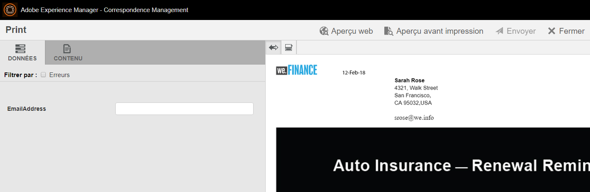

# Présentation du site de référence de renouvellement de l’assurance automobile We.Finance {#we-finance-auto-insurance-renewal-reference-site-walkthrough}

## Prérequis {#pre-requisites}

Configurez le site de référence comme décrit dans la section [Installation et configuration du site de référence Forms AEM 6.4](/help/forms/using/setup-reference-sites.md).

## Exemple d’utilisation du site de référence We.Finance  {#we-finance-reference-site-scenario}

Le site We.Finance est un site de services financiers conçu pour vous aider à découvrir les fonctionnalités de communication interactive d’AEM Forms.

Lisez la présentation détaillée du cas d’utilisation de l’assurance automobile We.Finance qui explique comment AEM forms et son intégration à Microsoft Dynamics permettent de personnaliser l’expérience client dans une société de services financiers. La présentation interactive est conçue pour faciliter la mise en oeuvre de transactions numériques complexes et la communication client dans une société financière.

**La présentation commence par le cas d’utilisation :**

Sarah Rose est déjà cliente chez We.Finance et a acheté une police d’assurance automobile. Elle doit renouveler sa police d’assurance aujourd’hui. Gloria Rios, courtier d’assurance chez We.Finance, envoie un rappel à Sarah concernant le renouvellement de sa police. Sarah suit les instructions figurant dans le courrier électronique et effectue la procédure.

## Présentation de la demande d’assurance automobile {#auto-insurance-application-walkthrough}

Le scénario de demande d’assurance automobile We.Finance est une narration visuelle pour l’utilisateur et repose sur deux personnages :

* Sarah Rose, une cliente chez We.Finance
* Gloria Rios, courtier d’assurance chez We.Finance

### Gloria envoie une notification de renouvellement de police d’assurance à partir de We.Finance {#gloria-sends-an-insurance-policy-renewal-communication-from-we-finance}

Gloria se connecte à l’instance AEM, clique **Renouvellement de l&#39;assurance automobile,** puis clique **Ouvrez l’interface utilisateur de l’agent.** Le clic préremplit le document d’assurance avec les informations de police de Sarah Rose. Clics Gloria **Envoyer** et un message s’affiche à l’écran &quot;Envoi commencé&quot;, puis en quelques secondes &quot;Envoyé avec succès&quot;.

Sarah reçoit un courrier électronique contenant le sujet &quot;Votre renouvellement d’assurance automobile&quot;.

#### Démonstration {#see-it-yourself}

Accédez à **Adobe Experience Manager** > **Forms** > **Forms et documents** > **We.Finance** > **Assurance automobile**. Sélectionnez la **Renouvellement d’assurance automobile** communication interactive et clic **Ouvrir l’interface utilisateur de l’agent**. La communication interactive s’ouvre dans l’interface utilisateur de l’agent. Saisissez une adresse électronique valide pour recevoir le courrier électronique contenant le document de stratégie joint, puis cliquez sur Envoyer.

Vous pouvez accéder à la communication interactive Renouvellement d’assurance automobile et la consulter directement depuis `https://[authorHost]: authorPort]/aem/formdetails.html/content/dam/formsanddocuments/we-finance/autoinsurance/auto-insurance-renewal.`

### Sarah reçoit une notification de renouvellement de police d’assurance de We.Finance et décide d’effectuer le renouvellement. {#sarah-receives-an-insurance-policy-renewal-communication-from-we-finance-and-decides-to-renew}

Sarah reçoit un courrier électronique contenant une pièce jointe de We.Finance qui lui rappelle que sa police d’assurance automobile est sur le point d’expirer. La pièce jointe est la version imprimée de sa lettre d’assurance automobile.

Sarah clique **Renouveler maintenant** et est dirigé vers la version web de sa lettre d’assurance automobile. En plus de cette lettre, Sarah trouve le nombre de jours restants pour l’expiration de sa stratégie. La page fournit à Sarah un aperçu de base des détails de sa police d’assurance, tels que le numéro de la police, le montant dû et d’autres informations, telles que les offres de remise et les récompenses de fidélité. Sarah clique à nouveau **Renouveler maintenant** au bas de la politique.

#### Fonctionnement {#how-it-works}

Les sorties web et imprimée de votre lettre d’assurance automobile sont créées à l’aide des fonctionnalités multicanaux des communications interactives.

Le bouton Renouveler maintenant dans le courrier électronique est lié à la demande de renouvellement d’assurance automobile qui se présente sous forme de communication interactive sur une instance de publication.

#### Démonstration {#see-it-yourself-1}

Vous devriez recevoir un courrier électronique avec un fichier PDF joint. Le PDF est une version imprimée de votre lettre d’assurance automobile. Cliquez sur **Renouveler maintenant** pour accéder à la version web de la stratégie. Vérifiez vos informations personnelles et vos informations de stratégie, puis cliquez sur **Renouveler maintenant** qui vous conduit à une autre communication interactive.

Le **Renouveler maintenant** dans le courrier électronique redirige Sarah vers la version web de la stratégie. Vous pouvez consulter l’URL suivante :

`https://[authorServer]:[authorPort]/content/document.html?schema=fdm&documentId=/content/forms/af/we-finance/autoinsurance/auto-insurance-renewal/channels/web.html&customerId=1`

Vous pouvez consulter le résumé détaillé de votre renouvellement d’assurance automobile, puis cliquer sur **Renouveler maintenant** au bas de la page.

### Sarah accède à la page de paiement {#sarah-reaches-the-payment-page}

We.Finance redirige Sarah vers la page de paiement. Sarah vérifie à nouveau son numéro de police et sa date d’expiration avec ses enregistrements. Sur le côté droit de la page, elle vérifie le récapitulatif des paiements de son renouvellement avec une remise de 10 % sur le montant total.

#### Fonctionnement {#how-it-works-1}

Le bouton Renouveler maintenant redirige Sarah vers la page de paiement. La page de paiement est un formulaire adaptatif.

#### Démonstration {#see-it-yourself-2}

Cliquez sur **Renouveler maintenant** pour accéder à la page de paiement. Renseignez les informations de votre carte de crédit, puis cliquez sur **Effectuez un paiement.**

Vous pouvez accéder à la page de paiement dans l’instance de création à l’adresse

`https://[authorServer]:[authorPort]/content/document.html?documentId=/content/forms/af/we-finance/credit-card/ccbillpayment.html&schema=fdm&customerId=1`

### Sarah effectue le paiement et termine le processus. {#sarah-makes-the-payment-and-completes-the-process}

Sarah remplit ses informations de carte de crédit et clique sur **Effectuer un paiement**.

#### Fonctionnement {#how-it-works-2}

Lorsque Sarah remplit les informations de carte de crédit et clique sur le bouton Envoyer, son paiement de carte de crédit est traité et un message de remerciement configuré dans le formulaire adaptatif s’affiche à l’écran.

#### Démonstration {#see-it-yourself-3}

Vous pouvez afficher le message de confirmation après avoir cliqué sur Effectuer le paiement à l’adresse

`https://[authorServer]:[authorPort]/content/forms/af/we-finance/credit-card/ccbillpayment/jcr:content/guideContainer.guideThankYouPage.html?owner=admin&status=Submitted`
