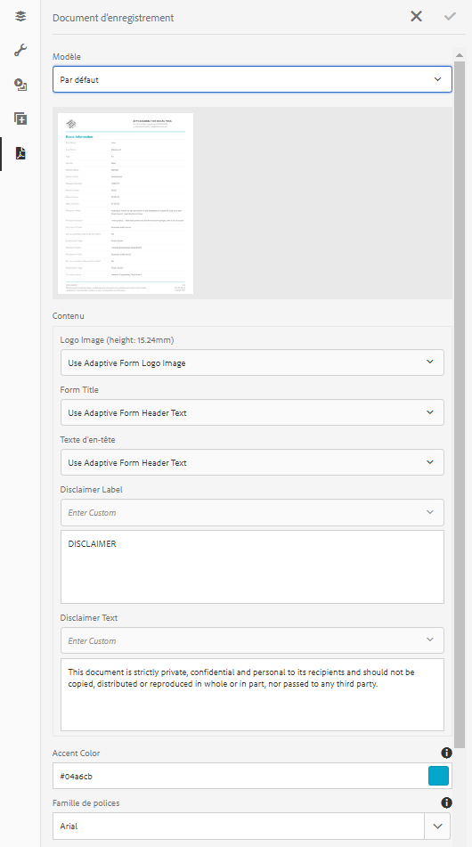

# Générer un document d’enregistrement pour les formulaires adaptatifs {#generate-document-of-record-for-adaptive-forms}

>[!CAUTION]
>
>AEM 6.4 a atteint la fin de la prise en charge étendue et cette documentation n’est plus mise à jour. Pour plus d’informations, voir notre [période de support technique](https://helpx.adobe.com/fr/support/programs/eol-matrix.html). Rechercher les versions prises en charge [here](https://experienceleague.adobe.com/docs/?lang=fr).

## Présentation {#overview}

Après l’envoi d’un formulaire, vos clients veulent généralement conserver un enregistrement, sous forme imprimée ou de document, des informations qu’ils ont intégrées au formulaire pour s’y reporter ultérieurement. On parle ici de document d’enregistrement.

Cet article explique comment générer un document d’enregistrement pour les formulaires adaptatifs.

>[!NOTE]
>
>La génération automatique de document d’enregistrement n’est pas prise en charge pour les formulaires adaptatifs XFA. Cependant, vous pouvez utiliser le fichier XDP utilisé pour créer le formulaire adaptatif comme document d’enregistrement.

## Types de formulaires adaptatifs et leurs documents d’enregistrement {#adaptive-form-types-and-their-documents-of-record}

Lorsque vous créez un formulaire adaptatif, vous pouvez sélectionner un modèle de formulaire. Vous avez le choix entre :

* [Modèles de formulaire](/help/forms/using/creating-adaptive-form.md#p-create-an-adaptive-form-based-on-an-xfa-form-template-p)

   Permet de sélectionner un modèle XFA pour votre formulaire adaptatif. Lorsque vous sélectionnez un modèle XFA, vous pouvez utiliser le fichier XDP associé pour créer le document d’enregistrement, comme décrit ci-dessus.

* [Schéma XML](/help/forms/using/creating-adaptive-form.md#p-create-an-adaptive-form-based-on-xml-or-json-schema-p)

   Permet de sélectionner une définition de schéma XML pour votre formulaire adaptatif. Lorsque vous sélectionnez un schéma XML pour votre formulaire adaptatif, vous pouvez :

   * Associez un modèle XFA pour le document d’enregistrement. Assurez-vous que le modèle XFA associé utilise le même schéma XML que votre formulaire adaptatif
   * Générer automatiquement un document d’enregistrement

* Aucun

   Permet de créer un formulaire adaptatif sans modèle de formulaire. Le document d’enregistrement est généré automatiquement pour votre formulaire adaptatif.

Lorsque vous sélectionnez un modèle de formulaire, configurez le document d’enregistrement à l’aide des options disponibles sous Configuration du modèle de document d’enregistrement. Voir [Configuration du modèle de document d’enregistrement](#document-of-record-template-configuration).

## Document d’enregistrement généré automatiquement {#automatically-generated-document-of-record}

Un document d’enregistrement permet à vos clients de conserver une copie du formulaire envoyé à des fins d’impression. Lorsque vous générez automatiquement un document d’enregistrement, à chaque fois que vous modifiez votre formulaire, son document d’enregistrement est immédiatement mis à jour. Par exemple, imaginons que vous supprimez le champ concernant l’âge pour les clients qui ont sélectionné les États-Unis comme pays. Lorsque ces clients génèrent un document d’enregistrement, le champ de page n’est pas visible dans le document d’enregistrement.

Voici les avantages apportés par un document d’enregistrement automatiquement généré :

* Il prend en charge la liaison de données.
* Il masque automatiquement les champs marqués comme exclus du document d’enregistrement au moment de l’envoi. Aucune opération supplémentaire n’est nécessaire.
* Il permet de gagner du temps lors de la conception d’un modèle de document d’enregistrement.
* Il permet de tester des styles et des aspects différents à l’aide de différents modèles de base et de sélectionner les meilleurs style et aspect pour le document d’enregistrement. L’utilisation de styles est facultative. Si vous ne spécifiez pas de style, les styles du système sont définis comme valeur par défaut.
* Cela garantit que toute modification du formulaire est immédiatement répercutée dans le document d’enregistrement.

## Composants pour générer automatiquement un document d’enregistrement {#components-to-automatically-generate-a-document-of-record}

Pour générer un document d’enregistrement pour les formulaires adaptatifs, il vous faut les éléments suivants :

**Formulaire adaptatif** : un formulaire adaptatif pour lequel vous souhaitez générer un document d’enregistrement.

**Modèle de base (recommandé)** : modèle XFA (fichier XDP) créé dans AEM Designer. Le modèle de base est utilisé pour spécifier les informations en termes de style et d’identité graphique pour le modèle de document d’enregistrement.

Voir [Modèle de base d’un document d’enregistrement](#base-template-of-a-dor).

>[!NOTE]
>
>Le modèle de base d’un document d’enregistrement est également appelé métamodèle de document d’enregistrement.

**Modèle de document d’enregistrement** : modèle XFA (fichier XDP) généré à partir d’un formulaire adaptatif.

Voir [Configuration du modèle de document d’enregistrement](#document-of-record-template-configuration).

**Données de formulaire** : informations renseignées par un utilisateur dans le formulaire adaptatif. Il fusionne avec le modèle de document d’enregistrement pour générer le document d’enregistrement.

## Mappage des éléments de formulaire adaptatif {#mapping-of-adaptive-form-elements}

Les sections suivantes décrivent comment les éléments de formulaire adaptatif apparaissent dans le document d’enregistrement.

### Champs {#fields}

<table> 
 <tbody> 
  <tr> 
   <th>Composant de formulaire adaptatif</th> 
   <th>Composant XFA correspondant</th> 
   <th>Inclus par défaut dans le modèle de document d’enregistrement ?</th> 
   <th>Remarques</th> 
  </tr> 
  <tr> 
   <td>Bouton</td> 
   <td>Bouton</td> 
   <td>false</td> 
   <td> </td> 
  </tr> 
  <tr> 
   <td>Case à cocher</td> 
   <td>Case à cocher</td> 
   <td>true</td> 
   <td> </td> 
  </tr> 
  <tr> 
   <td>Sélecteur de date</td> 
   <td>Champ Date/Heure</td> 
   <td>true</td> 
   <td> </td> 
  </tr> 
  <tr> 
   <td>Liste déroulante</td> 
   <td>Liste déroulante</td> 
   <td>true</td> 
   <td> </td> 
  </tr> 
  <tr> 
   <td>Signature tactile</td> 
   <td>Signature tactile</td> 
   <td>true</td> 
   <td> </td> 
  </tr> 
  <tr> 
   <td>Zone numérique</td> 
   <td>Champ numérique</td> 
   <td>true</td> 
   <td> </td> 
  </tr> 
  <tr> 
   <td>Zone de mot de passe</td> 
   <td>Champ Mot de passe</td> 
   <td>false</td> 
   <td> </td> 
  </tr> 
  <tr> 
   <td>Bouton radio</td> 
   <td>Bouton radio</td> 
   <td>true</td> 
   <td> </td> 
  </tr> 
  <tr> 
   <td>Zone de texte</td> 
   <td>Champ de texte</td> 
   <td>true</td> 
   <td> </td> 
  </tr> 
  <tr> 
   <td>Bouton Réinitialiser</td> 
   <td>Bouton de réinitialisation</td> 
   <td>false</td> 
   <td> </td> 
  </tr> 
  <tr> 
   <td>Bouton Envoyer</td> 
   <td><p>Bouton Envoyer par messagerie</p> <p>Bouton Envoyer via HTTP</p> </td> 
   <td>false</td> 
   <td> </td> 
  </tr> 
  <tr> 
   <td>Termes et conditions</td> 
   <td> </td> 
   <td>true</td> 
   <td> </td> 
  </tr> 
  <tr> 
   <td>Pièce jointe</td> 
   <td> </td> 
   <td>false</td> 
   <td>Non disponible dans le modèle de document d’enregistrement. Uniquement disponible dans le document d’enregistrement par les pièces jointes.</td> 
  </tr> 
 </tbody> 
</table>

### Conteneurs {#containers}

<table> 
 <tbody> 
  <tr> 
   <th>Composant de formulaire adaptatif</th> 
   <th>Composant XFA correspondant</th> 
   <th>Remarques</th> 
  </tr> 
  <tr> 
   <td>Panneau<br /> </td> 
   <td>Sous-formulaire<br /> </td> 
   <td>Le panneau répétable est mappé à un sous-formulaire répétable.</td> 
  </tr> 
 </tbody> 
</table>

### Composants statiques {#static-components}

| Composant de formulaire adaptatif | Composant XFA correspondant | Remarques |
|---|---|---|
| Image | Image | Qu’ils soient liés ou non, les composants TextDraw et Image apparaissent toujours dans le document d’enregistrement relatif à un formulaire adaptatif basé sur XSD, à moins que cela ne soit exclu dans les paramètres de document d’enregistrement. |
| Texte | Texte |

>[!NOTE]
>
>Dans l’IU classique, vous disposez de différents onglets pour modifier les propriétés des champs.

### Tableaux {#tables}

Les composants de tableau de formulaires adaptatifs tels que l’en-tête, le pied de page et la ligne sont associés aux composants XFA correspondants. Vous pouvez mapper des panneaux répétables aux tableaux dans un document d’enregistrement.

## Modèle de base d’un document d’enregistrement {#base-template-of-a-document-of-record}

Le modèle de base fournit des informations de style et d’aspect au document d’enregistrement. Il vous permet de personnaliser l’aspect par défaut du document d’enregistrement généré automatiquement. Par exemple, vous souhaitez ajouter le logo de votre société dans l’en-tête et les informations de copyright dans le pied de page du document d’enregistrement. Le gabarit du modèle de base est utilisé comme gabarit pour le modèle de document d’enregistrement. Le gabarit peut contenir des informations telles que l’en-tête, le pied de page et le numéro de page que vous pouvez appliquer au document d’enregistrement. Vous pouvez appliquer ces informations au document d’enregistrement à l’aide d’un modèle de base pour générer automatiquement un document d’enregistrement. L’utilisation d’un modèle de base permet de modifier les propriétés par défaut des champs.

Respectez les [conventions relatives aux modèles de base](#base-template-conventions) lorsque vous créez un modèle de base.

## Conventions relatives aux modèles de base {#base-template-conventions}

Un modèle de base est utilisé pour définir l’en-tête, le pied de page, le style et l’aspect d’un document d’enregistrement. L’en-tête et le pied de page peuvent comporter des informations, comme le logo de l’entreprise et la mention de droit d’auteur. Le gabarit de page du modèle de base est copié et utilisé comme gabarit de page du document d’enregistrement. Il contient l’en-tête, le pied de page, le numéro de page ainsi que toute autre information devant apparaître sur toutes les pages du document d’enregistrement. Même si vous utilisez un modèle de base non conforme aux conventions relatives aux modèles de base, le gabarit de page du modèle de base est quand même utilisé dans le modèle de document d’enregistrement. Il est vivement recommandé de concevoir votre modèle de base conformément à ses conventions et de l’utiliser pour la génération automatique de document d’enregistrement.

**Conventions en matière de gabarits de page**

* Dans le modèle de base, il est conseillé de nommer le sous-formulaire racine `AF_METATEMPLATE` et le gabarit de page `AF_MASTERPAGE`.

* Le gabarit de page « `AF_MASTERPAGE` » et situé sous le sous-formulaire racine `AF_METATEMPLATE` est privilégié pour extraire les informations sur l’en-tête, le pied de page et le style.

* En l’absence de gabarit de page `AF_MASTERPAGE`, le premier gabarit de page présent dans le modèle de base est utilisé.

**Conventions an matière de style des champs**

* Pour appliquer un style aux champs du document d’enregistrement, le modèle de base fournit les champs situés dans le sous-formulaire `AF_FIELDSSUBFORM` sous le sous-formulaire racine `AF_METATEMPLATE`.

* Les propriétés de ces champs sont appliquées aux champs du document d’enregistrement. Ces champs doivent respecter la convention d’affectation des noms de `AF_<name of field in all caps>_XFO`. Par exemple, le champ contenant une case à cocher doit être nommé `AF_CHECKBOX_XFO`.

Pour créer un modèle de base, procédez comme suit dans AEM Designer.

1. Cliquez sur **Fichier > Nouveau**.
1. Sélectionnez l’option **Basé sur un modèle**.

1. Sélectionnez la **Forms - Document d’enregistrement** catégorie.
1. Sélectionner **Modèle de base de DE**.
1. Cliquez sur **Suivant** et renseignez les informations nécessaires.

1. (Facultatif) Modifiez le style et l’aspect des champs que vous souhaitez appliquer aux champs du document d’enregistrement.
1. Enregistrez le formulaire.

Vous pouvez désormais utiliser le formulaire enregistré comme modèle de base de document d’enregistrement.\
Ne modifiez ou ne supprimez aucun des scripts du modèle de base.

**Modification du modèle de base**

* Si vous n’appliquez aucun style aux champs du modèle de base, il est conseillé de supprimer ces champs du modèle de base afin que toutes les mises à niveau du modèle de base soient automatiquement récupérées.
* Lors de la modification du modèle de base, ne supprimez, n’ajoutez ou ne modifiez pas les scripts.

>[!NOTE]
>
>Créez un modèle de base conforme aux conventions et en suivant scrupuleusement la procédure ci-dessus.

## Configuration du modèle de document d’enregistrement {#document-of-record-template-configuration}

Configurez le modèle de document d’enregistrement de votre formulaire pour permettre à vos clients de télécharger une copie imprimable du formulaire envoyé. Un fichier XDP fait office de modèle de document d’enregistrement. Le téléchargement des clients du document d’enregistrement est formaté selon la mise en page spécifiée dans le fichier XDP.

Effectuez les étapes suivantes pour configurer un document d’enregistrement pour les formulaires adaptatifs :

1. Dans l’instance d’auteur AEM, cliquez sur **Formulaires > Formulaires et documents**.
1. Sélectionnez un formulaire, puis cliquez sur **Afficher les propriétés**.
1. Dans la fenêtre Propriétés, appuyez sur **Modèle de formulaire**.

   Vous pouvez également sélectionner un modèle de formulaire lorsque vous créez un formulaire.

   >[!NOTE]
   >
   >Sous l’onglet Modèle de formulaire, veillez à sélectionner **Schéma** ou **Aucun** dans la liste déroulante **Choisir parmi**. **[!UICONTROL Les documents d’enregistrement ne sont pas pris en charge dans le cadre de formulaires basés sur XFA ou de formulaires adaptatifs auxquels un modèle de formulaire est appliqué.]**

1. Dans la section Configuration du modèle de document d’enregistrement de l’onglet Modèle de formulaire, sélectionnez l’une des options suivantes :

   **Aucun** : utilisez cette option si vous ne souhaitez pas configurer de document d’enregistrement pour le formulaire.

   **Associer un modèle de formulaire comme modèle de document d’enregistrement** : sélectionnez cette option si vous disposez d’un fichier XDP que vous souhaitez utiliser comme modèle pour le document d’enregistrement. Lorsque vous sélectionnez cette option, tous les fichiers XDP disponibles dans le référentiel AEM Forms s’affichent. Sélectionnez le fichier approprié.

   Le fichier XDP sélectionné est associé au formulaire adaptatif.

   **Générer un document d’enregistrement** : cette option permet d’utiliser un fichier XDP comme modèle de base pour définir le style et l’aspect du document d’enregistrement. Lorsque vous sélectionnez cette option, tous les fichiers XDP disponibles dans le référentiel AEM Forms s’affichent. Sélectionnez le fichier approprié.

   **[!UICONTROL Sélectionnez cette option pour utiliser un fichier XDP comme modèle de base pour définir le style et l’aspect du document d’enregistrement. Lorsque vous sélectionnez cette option, tous les fichiers XDP disponibles dans le référentiel AEM Forms s’affichent. Sélectionnez le fichier approprié.]**

   **Sélectionner le modèle Forms comme modèle de base pour générer un document d’enregistrement** Sélectionnez cette option pour utiliser un fichier XDP comme modèle de base pour définir le style et l’aspect du document d’enregistrement. Lorsque vous sélectionnez cette option, tous les fichiers XDP disponibles dans le référentiel AEM Forms s’affichent. Sélectionnez le fichier approprié.

   >[!NOTE]
   >
   >Assurez-vous que le schéma utilisé pour créer le formulaire adaptatif et le schéma (schéma de données) du formulaire XFA sont identiques si :
   >
   >* Votre formulaire adaptatif est basé sur un schéma
   >* Vous utilisez l’option **Associer le modèle de formulaire comme modèle de document d’enregistrement** pour les documents d’enregistrement.


1. Cliquez sur **Terminé**.

## Personnalisation des informations de marque dans un document d’enregistrement {#customize-the-branding-information-in-document-of-record}

Lors de la génération d’un document d’enregistrement, vous pouvez modifier les informations de marque du document d’enregistrement dans l’onglet Document d’enregistrement. L’onglet Document d’enregistrement inclut des options telles que le logo, l’apparence, la mise en page, l’en-tête et le pied de page, la clause de non-responsabilité et si vous souhaitez inclure des options de case à cocher et de bouton radio désélectionnées.

Pour localiser les informations d’identité graphique que vous saisissez dans l’onglet Document d’enregistrement, vous devez vous assurer que les paramètres régionaux du navigateur sont correctement définis. Pour personnaliser les informations d’identité graphique d’un document d’enregistrement, procédez comme suit :

1. Sélectionnez un panneau (panneau racine) dans le document d’enregistrement, puis appuyez sur .
1. Appuyez sur . L’onglet Document d’enregistrement s’affiche.
1. Sélectionnez le modèle par défaut ou un modèle personnalisé pour le rendu du document d’enregistrement. Si vous sélectionnez le modèle par défaut, un aperçu miniature du document d’enregistrement s’affiche sous la liste déroulante Modèle .

   

   Si vous choisissez de sélectionner un modèle personnalisé, parcourez une sélection XDP sur votre serveur AEM Forms. Si vous souhaitez utiliser un modèle qui ne se trouve pas déjà sur votre serveur AEM Forms, vous devez d’abord télécharger le fichier XDP sur votre serveur AEM Forms.

1. Selon que vous sélectionnez un modèle par défaut ou personnalisé, certaines ou toutes les propriétés suivantes s’affichent dans l’onglet Document d’enregistrement. Spécifiez-les en conséquence :

   * **Image du logo** : vous pouvez choisir d’utiliser l’image du logo à partir du formulaire adaptatif, en choisir une dans le gestionnaire des actifs numériques ou en télécharger une depuis votre ordinateur.
   * **Titre du formulaire**
   * **Texte d&#39;en-tête**
   * **Libellé de clause de non-responsabilité**
   * **Clause de non-responsabilité**
   * **Texte de la clause de non-responsabilité**
   * **Couleur d’accentuation** : la couleur dans laquelle le texte de l’en-tête et les lignes de séparation sont affichés dans le document ou l’enregistrement PDF
   * **Famille de polices** : la famille de polices du texte dans le document d’enregistrement PDF
   * **Pour les composants Case à cocher et Bouton radio, affichez uniquement les valeurs sélectionnées.**
   * **Séparateur pour plusieurs valeurs sélectionnées**
   * **Inclure les objets de formulaire qui ne sont pas liés au modèle de données**
   * **Exclure les champs masqués du document d’enregistrement**
   * **Masquer la description des panneaux**

   >[!NOTE]
   >
   >Si vous utilisez un modèle de formulaire adaptatif créé avec une version de Designer antérieure à la version 6.3, pour que les propriétés Couleur d’accentuation et Famille de polices fonctionnent, assurez-vous que les éléments suivants sont présents dans votre modèle de formulaire adaptatif sous le sous-formulaire racine :

   ```xml
   <proto>
   <font typeface="Arial"/>
   <fill>
   <color value="4,166,203"/>
   </fill>
   <edge>
   <color value="4,166,203"/>
   </edge>
   </proto>
   ```

1. Pour enregistrer les modifications d’identité graphique, appuyez sur Terminé.

## Mises en page de tableau et de colonne pour les panneaux d’un document d’enregistrement {#table-and-column-layouts-for-panels-in-document-of-record}

Votre formulaire adaptatif peut être long et comporter plusieurs champs. Vous ne souhaitez peut-être pas enregistrer un document d’enregistrement en tant que copie exacte du formulaire adaptatif. Vous pouvez désormais choisir une disposition de tableau ou de colonne pour enregistrer un ou plusieurs panneaux de formulaire adaptatif dans le document du PDF d’enregistrement.

Avant de générer un document d’enregistrement, sélectionnez Tableau ou Colonne dans les paramètres d’un panneau Mise en page du document d’enregistrement pour ce panneau. Les champs du panneau sont organisés en conséquence dans le document d’enregistrement.


Champs dans un panneau rendu dans une mise en page de tableau dans le document d’enregistrement


Champs dans un panneau rendu dans une mise en page de colonne dans le document d’enregistrement

## Paramètres d’un document d’enregistrement {#document-of-record-settings}

Les paramètres du document d’enregistrement vous permettent de choisir les options que vous souhaitez inclure dans celui-ci. Par exemple, une banque accepte le nom, l’âge, le numéro de sécurité sociale et le numéro de téléphone dans un formulaire. Le formulaire génère un numéro de compte bancaire et les détails de la banque. Vous pouvez choisir d’afficher uniquement le nom, le numéro de sécurité sociale, le compte bancaire et les détails de la banque dans le document d’enregistrement.

Les paramètres du document d’enregistrement d’un composant sont disponibles dans ses propriétés. Pour accéder aux propriétés d’un composant, sélectionnez le composant et cliquez sur  dans le recouvrement. Les propriétés sont répertoriées dans la barre latérale. Vous y trouvez les paramètres suivants.

**Paramètres sur le terrain**

* **Exclure du document d’enregistrement**: La définition de la propriété true exclut le champ du document d’enregistrement. Il s’agit d’une propriété pouvant faire l’objet d’un script appelée « `excludeFromDoR` ». Son comportement dépend de la propriété au niveau du formulaire **Exclure des champs du document d’enregistrement (DE) s’il est masqué**.

* **Afficher le panneau sous forme de tableau :** la définition de cette propriété permet d’afficher le panneau sous forme de tableau dans le document d’enregistrement si le panneau contient moins de 6 champs. Applicable au panneau uniquement.
* **Exclure le titre du document d’enregistrement :** la définition de la propriété exclut le titre du panneau/tableau du document d’enregistrement. Applicable au panneau et à la table uniquement.
* **Exclure la description du document d’enregistrement :** la définition de la propriété exclut la description du panneau/tableau du document d’enregistrement. Applicable au panneau et à la table uniquement.

**Paramètres des niveaux de formulaires**

* **Inclure les champs non liés dans le document d’enregistrement :** la définition de la propriété comprend les champs non liés du schéma basé sur le formulaire adaptatif du document d’enregistrement. Par défaut, le paramètre est true.
* **Exclure des champs du document d’enregistrement (DE) s’il est masqué** : la définition de cette propriété remplace le comportement de la propriété de niveau de champ Exclure du document d’enregistrement lorsque le paramètre est différent de true. Si des champs sont masqués au moment de l’envoi du formulaire, ils seront exclus du document d’enregistrement si la propriété est définie sur True, à condition que la propriété « Exclure du document d’enregistrement » ne soit pas définie.

## Considérations essentielles lors de l’utilisation de documents d’enregistrement {#key-considerations-when-working-with-document-of-record}

Gardez à l’esprit les points et restrictions suivants lorsque vous utilisez un document d’enregistrement pour les formulaires adaptatifs.

* Les modèles de document d’enregistrement ne prennent pas en charge le texte enrichi. Par conséquent, tout texte enrichi dans le formulaire adaptatif statique ou dans les informations renseignées par l’utilisateur final s’affiche en tant que texte brut dans le document d’enregistrement.
* Les fragments de document d’un formulaire adaptatif n’apparaissent pas dans le document d’enregistrement. Toutefois, les fragments de formulaire adaptatif sont pris en charge.
* Le document d’enregistrement est utilisé à des fins d’impression uniquement.
* La liaison de contenu dans le document de l’enregistrement généré pour le formulaire adaptatif de schéma XML n’est pas prise en charge.
* La liaison de contenu dans le document de l’enregistrement généré pour le formulaire adaptatif de schéma XML n’est pas prise en charge.
* La version localisée du document d’enregistrement est créée à la demande pour un paramètre régional lorsque l’utilisateur demande le rendu du document d’enregistrement. La localisation du document d’enregistrement s’accompagne de la localisation du formulaire adaptatif. Pour plus d’informations sur la localisation du document d’enregistrement et des formulaires adaptatifs, voir [Utilisation de processus de traduction AEM pour la localisation des formulaires adaptatifs et du document d’enregistrement](/help/forms/using/using-aem-translation-workflow-to-localize-adaptive-forms.md).
