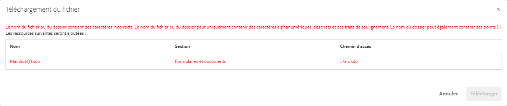

# Obtenir des documents XDP et PDF dans AEM Forms {#getting-xdp-and-pdf-documents-in-aem-forms}

>[!CAUTION]
>
>AEM 6.4 a atteint la fin de la prise en charge étendue et cette documentation n’est plus mise à jour. Pour plus d’informations, voir notre [période de support technique](https://helpx.adobe.com/fr/support/programs/eol-matrix.html). Rechercher les versions prises en charge [here](https://experienceleague.adobe.com/docs/?lang=fr).

## Présentation {#overview}

Vous pouvez importer vos formulaires de votre système de fichiers local vers le référentiel CRX, en les transférant dans AEM Forms. L’opération de chargement est prise en charge pour les types de ressources suivants :

* Modèles de formulaire (formulaires XFA)
* PDF forms
* Document (documents de PDF plats)

Vous pouvez charger les types de ressource pris en charge individuellement ou sous la forme d’une archive ZIP. Vous pouvez télécharger une ressource de type `Resource`, uniquement avec un formulaire XFA dans une archive ZIP.

>[!NOTE]
>
>Assurez-vous d’être membre du groupe `form-power-users` pour pouvoir télécharger des fichiers XDP. Contactez votre administrateur pour devenir membre du groupe.

## Téléchargement de formulaires {#uploading-forms}

1. Connectez-vous à l’interface utilisateur d’AEM Forms à l’adresse `https://[server]:[port]/aem/forms.html`.
1. Accédez au dossier dans lequel vous souhaitez charger le formulaire ou le dossier contenant les formulaires.
1. Dans la barre d’outils Actions, appuyez sur **Créer > Téléchargement du fichier**.

   

1. La boîte de dialogue Télécharger le ou les formulaires ou le package vous permet de rechercher et de sélectionner le fichier à télécharger. L’explorateur de fichiers affiche uniquement les formats de fichiers pris en charge (ZIP, XDP et PDF).

   >[!NOTE]
   >
   >Un nom de fichier ne peut contenir que des caractères alphanumériques, des tirets ou des traits de soulignement.

1. Cliquez sur Télécharger après la sélection du fichier pour télécharger les fichiers ou sur Annuler pour annuler le téléchargement. Une fenêtre contextuelle répertorie les ressources ajoutées et les ressources mises à jour à l’emplacement actuel.

   >[!NOTE]
   >
   >Pour un fichier ZIP, les chemins d’accès relatifs de toutes les ressources prises en charge s’affichent. Les ressources non prises en charge dans le fichier ZIP sont ignorées et ne sont pas répertoriées. Cependant, si l’archive ZIP contient uniquement des éléments non pris en charge, un message d’erreur s’affiche à la place de la boîte de dialogue contextuelle.

   

1. Si le nom d’une ou de plusieurs ressources n’est pas valide, une erreur apparaît. Corrigez les noms de fichiers en surbrillance rouge et effectuez un nouveau transfert.

   

Une fois le transfert terminé, un workflow en arrière-plan génère des miniatures pour chaque ressource, en fonction de l’aperçu de la ressource. Les nouvelles versions des ressources, si elles sont chargées, remplacent les ressources existantes.

### Mode protégé {#protected-mode}

Le serveur AEM Forms vous permet d’exécuter du code JavaScript. Un code JavaScript malveillant peut endommager un environnement AEM Forms. Le mode Protégé limite AEM Forms pour exécuter des fichiers XDP uniquement à partir de ressources et d’emplacements approuvés. Tous les fichiers XDP disponibles dans l’interface utilisateur d’AEM Forms sont considérés comme des ressources approuvées.

Le mode protégé est activé par défaut. Si nécessaire, vous pouvez désactiver le mode protégé :

1. Connectez-vous à la console Web AEM en tant qu’administrateur. L’URL est `https://[server]:[port]/system/console/configMgr`
1. Ouvrez Configurations Forms mobiles pour modification.
1. Désélectionnez l’option Mode protégé et cliquez sur **Enregistrer**. Le mode Protégé est désactivé.

## Mise à jour des formulaires XFA référencés {#updating-referenced-xfa-forms}

Dans AEM Forms, un modèle de formulaire XFA peut être référencé par un formulaire adaptatif ou un autre modèle de formulaire XFA. Un modèle peut également faire référence à une ressource ou à un autre modèle XFA.

Les champs d’un formulaire adaptatif faisant référence à un formulaire XFA sont liés aux champs disponibles dans le formulaire XFA. Lors de la mise à jour d’un modèle de formulaire, le formulaire adaptatif associé tente de se synchroniser avec XFA. Pour plus d’informations, voir [Synchronisation des formulaires adaptatifs avec le formulaire XFA associé](/help/forms/using/synchronizing-adaptive-forms-xfa.md).

La suppression d’un modèle de formulaire corrompt le formulaire adaptatif ou le modèle de formulaire dépendant. Un tel formulaire adaptatif est parfois appelé de manière informelle &quot;formulaire sale&quot;. Dans l’interface utilisateur d’AEM Forms, vous pouvez trouver les formulaires &quot;sales&quot; de deux manières différentes.

* Une icône d’avertissement s’affiche sur la miniature du formulaire adaptatif dans la liste des ressources et le message suivant s’affiche lorsque vous placez le pointeur de la souris sur l’icône d’avertissement.

   `Schema/Form Template for this adaptive form has been updated so please go to Authoring mode and rebase it with new version.`

Un indicateur est conservé pour indiquer si un formulaire adaptatif est sale. Ces informations sont disponibles sur la page des propriétés du formulaire, avec les métadonnées du formulaire. Pour les formulaires adaptatifs « dirty » uniquement, une propriété de métadonnées `Model Refresh` affiche la valeur `Recommended`.

