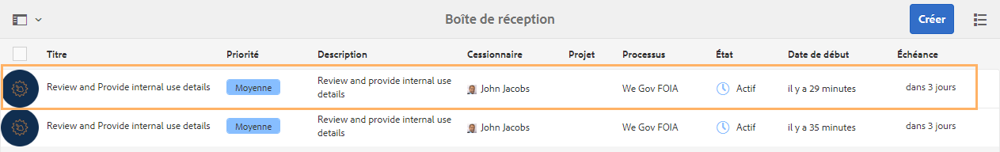
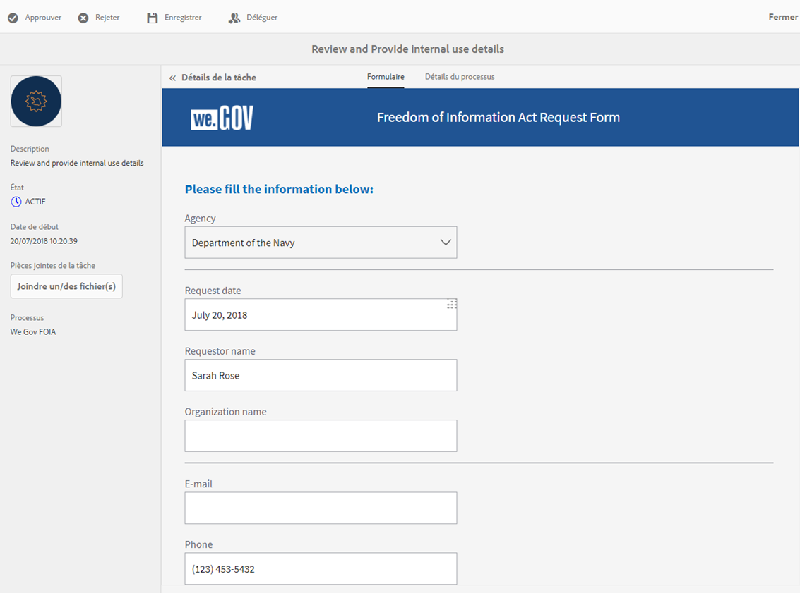
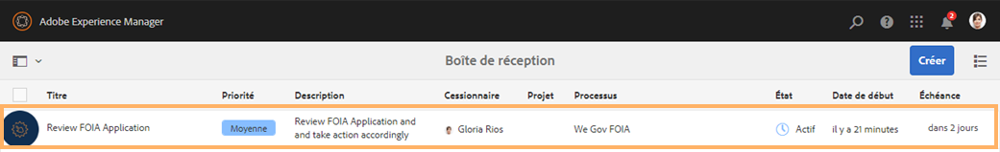
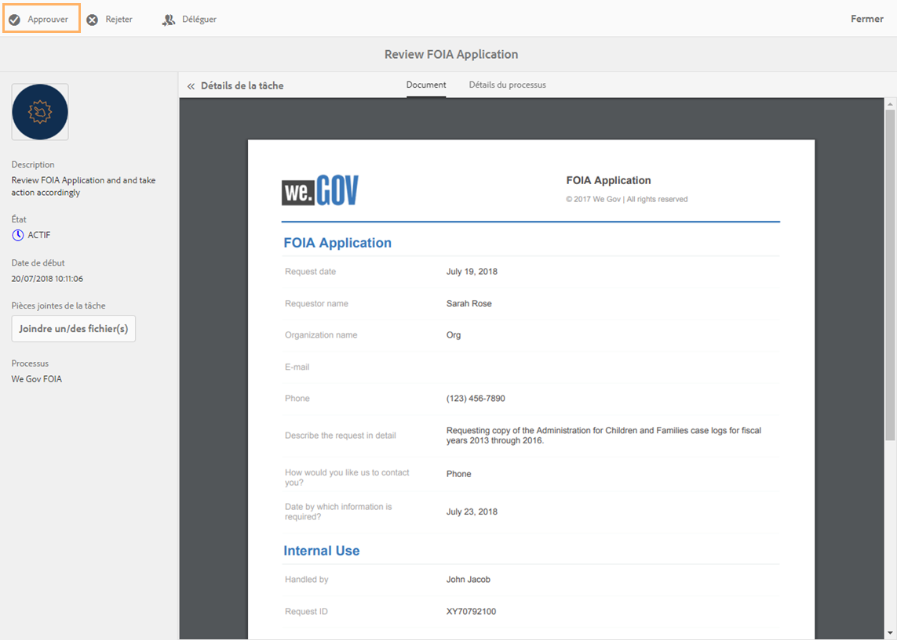

# Présentation de la loi sur l’accès à l’information pour le site de référence We.Gov {#we-gov-reference-site-foia-walkthrough}

>[!CAUTION]
>
>AEM 6.4 a atteint la fin de la prise en charge étendue et cette documentation n’est plus mise à jour. Pour plus d’informations, voir notre [période de support technique](https://helpx.adobe.com/fr/support/programs/eol-matrix.html). Rechercher les versions prises en charge [here](https://experienceleague.adobe.com/docs/?lang=fr).

## Condition préalable {#pre-requisite}

Configurez votre site de référence We.Gov comme décrit dans la section [Installation et configuration des sites de référence AEM Forms](/help/forms/using/setup-reference-sites.md).

## Scénario du site de référence &quot;Freedom of Information Act&quot; {#reference-site-freedom-of-information-act-scenario}

We.Gov est une organisation gérée par l&#39;État qui permet aux parents adoptifs de s&#39;inscrire à une allocation familiale s&#39;ils ont adopté un enfant. We.Gov permet également aux parents de demander des informations aux services gouvernementaux suivants en vertu de la loi sur la liberté d&#39;information :

* Defense Logistics Agency
* Ministère de la Défense Bureau de l&#39;Inspecteur général
* Ministère de la Justice - Bureau de la politique de l&#39;information
* Département de la Marine
* Agence de protection de l&#39;environnement

Pour plus d’informations à propos de la loi sur l’accès à l’information, voir [www.foia.gov](https://www.foia.gov).

Le scénario implique les personnages suivants :

* Sarah Rose, personne demandant des informations
* John Jacobs, le responsable de la demande la transfère au service approprié.
* Gloria Rios, la fonctionnaire du gouvernement qui fournit les informations conformément à la demande

## Sarah lance une demande d’informations sous FOIA {#sarah-initiates-request-for-information-under-foia}

Dans le cadre de la loi sur l’accès à l’information, Sarah demande une copie des registres des cas de l’Administration pour les enfants et les familles pour les années 2013 à 2016. Sarah envoie cette demande au ministère de la Justice - Bureau de la politique de l’information et indique également qu’elle est prête à payer jusqu’à 100 USD pour les frais d’impression et de poste.

### Fonctionnement {#how-it-works}

### Démonstration {#see-it-yourself}

Dans votre navigateur, ouvrez `https://<hostname>:<PublishPort>/wegov`. Sur le site We.Gov, appuyez sur Applications> Toutes les applications. Dans la page Toutes les applications, appuyez sur Appliquer sous Application dans le cadre de la loi sur l’accès à l’information.

## Sarah commence sa demande d’informations dans le cadre de la loi sur l’accès à l’information {#sarah-starts-her-application-for-information-under-foia}

Sarah clique sur **Appliquer** et sur la page Formulaire de demande dans le cadre de la Loi sur l’accès à l’information, Sarah saisit les informations suivantes :

* **Agence** : Sarah précise l’agence à laquelle la demande a été adressée : Ministère de la Justice - Bureau de la politique de l’information.

* **Versera jusqu’à** : Sarah indique qu’elle est prête à payer jusqu’à 100 dollars américains pour les frais d’impression et d’envoi.
* **Décrire la demande en détail** : Sarah indique « Demande de copie des registres des cas de l’Administration pour les enfants et les familles pour les années 2013 à 2016. »

Demande de copie des registres des cas de l’Administration pour les enfants et les familles pour les années 2013 à 2016

À tout moment, Sarah peut appuyer sur Enregistrer pour enregistrer le brouillon du formulaire et revenir ultérieurement pour remplir le formulaire et l’envoyer. Sarah envoie le formulaire.

>[!NOTE]
>
>Le workflow de reprise à partir d’un courrier électronique fonctionne uniquement avec les utilisateurs connectés. Dans le scénario du site de référence, assurez-vous que l’utilisateur Sarah Rose est ajouté. Les informations de connexion de Sarah sont `srose/password`.

## John Jacobs reçoit et approuve la demande {#john-jacobs-receives-and-approves-the-application}

John Jacobs reçoit les demandes et les achemine vers la bonne personne. AEM Boîte de réception lui permet de voir toutes les demandes envoyées au même endroit.

### Fonctionnement {#how-it-works-1}

Lorsque Sarah remplit et envoie la demande d’accès à l’information, un enregistrement de la demande est envoyé à la boîte de réception de John Jacobs. John Jacobs peut afficher la demande envoyée et l’accepter ou la refuser.

### Démonstration {#see-it-yourself-1}

Vous pouvez accéder à la boîte de réception AEM à l’adresse https://&lt;***hostname***>:&lt;***PublishPort***>/content/we-finance/global/en/login.html?resource=/aem/inbox.html. Connectez-vous à la boîte de réception AEM, en utilisant jjacobs/password comme nom d’utilisateur/mot de passe pour John Jacobs, et consultez la demande dans le cadre de la loi sur l’accès à l’information. Pour plus d’informations sur l’utilisation de la boîte de réception AEM pour les tâches du workflow relatives aux formulaires, voir [Gérer des applications et des tâches Forms dans la boîte de réception AEM](/help/forms/using/manage-applications-inbox.md).

John Jacobs peut voir, approuver ou rejeter la demande depuis le tableau de bord de la demande. John Jacobs sélectionne et ouvre les détails de la demande, puis, après avoir examiné la demande, l’approuve.

### <strong>Sarah reçoit un courrier électronique d’accusé de réception</strong> {#strong-sarah-receives-an-acknowledgement-email-strong}

Une fois que John Jacobs a approuvé la demande, Sarah reçoit un courrier électronique d’accusé de réception du site We.Gov. Sarah est informée des frais et du temps requis pour traiter sa demande. L&#39;email contient également des informations par email et par téléphone que Sarah peut contacter pour obtenir des informations sur son application.

## Gloria reçoit la demande d’approbation de second niveau de la loi sur l’accès à l’information {#gloria-receives-the-foia-request-for-second-level-approval}

Une fois que John Jacobs a rempli les informations requises et approuvé la demande de Sarah, les demandes sont envoyées à Gloria Rios pour approbation finale. Gloria examine le document d’enregistrement joint et approuve la demande.

### Fonctionnement {#how-it-works-2}

Lorsque John Jacobs approuve la demande de la loi sur l’accès à l’information, un PDF ou un document d’enregistrement de la demande est créé et envoyé à la boîte de réception de Gloria Rios. Gloria peut afficher la demande envoyée et l’accepter ou la refuser.

### Jugez-en par vous-même {#see-for-yourself}

Vous pouvez accéder à la boîte de réception AEM à l’adresse https://&lt;***hostname***>:&lt;***PublishPort***>/content/we-finance/global/en/login.html?resource=/aem/inbox.html. Connectez-vous à la boîte de réception AEM à l’aide de grios/password en tant que nom d’utilisateur/mot de passe pour Gloria Rios et consultez la demande dans le cadre de la loi sur l’accès à l’information.

Gloria ouvre la demande et examine les détails de la demande de la loi sur l’accès à l’information. Après avoir examiné les détails de la demande et vérifié la faisabilité de la remise des documents requis, Gloria approuve la demande.

## Sarah reçoit une notification l’informant que sa demande est approuvée {#sarah-receives-notification-that-her-request-is-approved}

Après que Gloria a approuvé la demande d’accès à l’information, Sarah reçoit un courrier électronique l’informant que sa demande est approuvée. Le courrier électronique contient également des informations sur le calendrier provisoire de remise du document et les coordonnées de contact pour le suivi de la demande.

