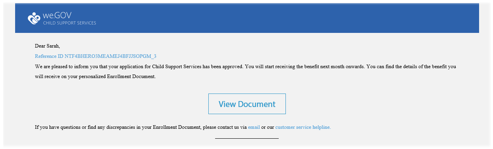

# Présentation du site de référence We.Gov {#we-gov-reference-site-walkthrough}

## Condition préalable {#pre-requisite}

Installez le site de référence We.Gov comme décrit dans [Installation et configuration des sites de référence d’AEM Forms](/help/forms/using/setup-reference-sites.md).

## Scénario de site de référence {#reference-site-scenario}

We.Gov est un organisme dépendant de l’État qui permet aux parents adoptifs de s’inscrire pour obtenir une allocation familiale s’ils ont adopté un enfant. Le site gère les éléments suivants :

* L’éligibilité du demandeur (le parent adoptif)
* Les informations personnelles et professionnelles du demandeur (si le demandeur peut bénéficier de l’allocation familiale)
* Détails personnels de l&#39;enfant adopté

   Le demandeur peut fournir des informations sur plus d&#39;un enfant
* Les détails du compte bancaire du demandeur sur lequel les allocations seront versées
* Le remboursement des frais de dossier
* L’évaluation de la demande
* L’approbation de la demande
* La communication automatisée avec le demandeur

Une fois la demande envoyée et les frais payés, le demandeur reçoit un courrier électronique de la part de l’organisme accompagné de l’accusé de réception de la demande.

L’organisme We.Gov reçoit la demande. Il fait évaluer la demande et approuve les demandes authentiques.

Une fois la demande approuvée, le demandeur reçoit un courrier électronique de la part du site We.Gov. L&#39;option **Document de Vue** du courrier électronique renvoie à un document contenant les détails d&#39;inscription du demandeur.

L’illustration ci-dessous présente le déroulement étape par étape du scénario du site de référence We.Gov.

Le scénario met en scène les personnages suivants :

* Sarah Rose, le parent adoptif qui demande une allocation familiale
* Joe, l’enfant adopté
* Gloria Rios, la responsable du département des approbations de We.Gov
* Conrad Simms, l’agent de terrain qui s’occupe de l’évaluation de la demande

## Sarah lance la procédure de vérification de son éligibilité  {#sarah-initiates-her-eligibility-check}

Un demandeur a la possibilité de vérifier l’éligibilité de sa demande d’allocation familiale. Le site propose aux utilisateurs de répondre à des questions pour leur permettre de déterminer si leur demande est éligible. Sarah, le parent adoptif, est un demandeur potentiel. Le formulaire d’éligibilité est disponible sur la page de demande auprès des services d’aide à l’enfance du site We.Gov. Pour vérifier son éligibilité, Sarah clique sur **[!UICONTROL Allocations familiales]** sur le site Web We.Gov. Sur la page des allocations familiales, Sarah clique sur **[!UICONTROL Vérifiez votre éligibilité]**.

En plus de la méthode ci-dessus, Sarah peut cliquer sur **[!UICONTROL Prise en main]** sur la page d’accueil. Sarah est dirigée vers la page Ensemble des demandes, où elle peut cliquer sur Demander sous **[!UICONTROL Demande auprès des Services d’aide à l’enfance]**. Sarah est alors dirigée vers la page de vérification de l’éligibilité.

Sur la page Vérifiez votre éligibilité aux allocations familiales, plusieurs questions sont posées à Sarah pour déterminer son éligibilité. Elle doit répondre aux questions suivantes :

* Est-elle le parent qui a la garde de l’enfant ?
* Son enfant et elle vivent-ils dans l’Etat de GX ?
* Dans quelle tranche d’âge l’enfant se situe-t-il ? Dans quelle classe l’enfant est-il ?

Sarah répond à ces questions et son éligibilité est confirmée. Ses réponses déterminent si elle peut bénéficier de l’allocation familiale.

Sarah est informée qu’elle peut bénéficier de l’allocation et que les frais de dossier s’élèvent à 25 €.

### Fonctionnement {#how-it-works}

L’éligibilité de Sarah est validée par une barrière d’éligibilité créée à l’aide de l’éditeur de règles. L’éditeur de règles vous permet de définir les conditions qui doivent être remplies avant qu’un demandeur ne puisse remplir le formulaire de demande. Lorsque Sarah (le demandeur) remplit toutes les conditions d’éligibilité, elle est redirigée vers le formulaire de demande.

La vérification de l’éligibilité fait partie du formulaire adaptatif de demande d’allocation familiale. La règle valide l’éligibilité dans les cas suivants :

* Le demandeur est un parent gardien
* Le demandeur et l’enfant résident dans l’État de GX
* Le demandeur a la responsabilité principale quotidienne des soins à l’enfant
* L’âge de l’enfant bénéficiant des services d’aide est inférieur à 16 ans. 

### Démonstration {#see-it-yourself}

Dans votre navigateur, ouvrez `https://<hostname>:<PublishPort>/content/we-gov/en.html`. Sur le site We.Gov, cliquez sur Allocations familiales. Sur la page des allocations familiales, cliquez sur Vérifiez votre éligibilité.

Pour afficher les règles :

1. Ouvrez le formulaire en mode de modification dans l’instance de rédaction. URL: `https://<hostname>:<AuthorPort>/editor.html/content/forms/af/we-gov/child-support/css.html`.
1. Sélectionnez un composant et cliquez sur .

   Toutes les règles appliquées dans le formulaire sont répertoriées dans l’éditeur de règles.

1. Dans le panneau de gauche, cliquez sur Règles `passMsg` et `failMsg` pour comprendre comment fonctionne la vérification d’éligibilité.

## Sarah commence sa demande d’allocation familiale {#sarah-starts-her-application-for-child-support}

Sarah clique sur **[!UICONTROL Commencer la demande]** après avoir été informée de son éligibilité à l’allocation familiale.\
 Sur la page de demande d’allocations familiales, Sarah fournit des informations dans les sections suivantes :

* **[!UICONTROL À propos du demandeur]** : permet à Sarah de fournir ses détails dans cette section. 

* **[!UICONTROL Informations sur l’enfant]** : permet à Sarah de fournir les informations de l’enfant, qui est couvert par les services d’aide.

* **[!UICONTROL Paiement]** : permet à Sarah de fournir ses informations bancaires afin que We.Gov puisse effectuer les versements d’aide mensuels.

* **[!UICONTROL Paiement de frais]** : permet à Sarah de fournir ses détails de carte de crédit pour payer les frais de dossier.

Par défaut, Sarah est redirigée vers la section **[!UICONTROL À propos du demandeur.]**

A tout moment, Sarah peut cliquer sur **[!UICONTROL Revenir plus tard]** et reprendre sa demande. Lorsqu’elle clique sur **[!UICONTROL Revenir plus tard]**, sa progression est enregistrée en tant que brouillon et elle a la possibilité de l’envoyer par courrier électronique à la version préliminaire.

Lorsqu’elle clique sur **[!UICONTROL Envoyer un courrier électronique]**, elle reçoit un courrier électronique contenant un lien vers le brouillon de son formulaire.

Le formulaire d’allocation familiale du site We.Gov utilise des formulaires adaptatifs. Elle peut utiliser le lien de son courrier électronique et remplir le formulaire sur son appareil mobile.

>[!NOTE]
>
>Le processus à partir d’un courrier électronique fonctionne avec les utilisateurs connectés uniquement. Dans le scénario de site de référence, assurez-vous que l’utilisateur Sarah Rose est ajouté. Les informations de connexion de Sarah sont `srose/password`.

Sarah peut fournir des informations dans n’importe quelle section, mais les frais de dossier sont acceptés uniquement après avoir fourni les informations requises dans toutes les sections. Une demande est incomplète tant que les frais requis ne sont pas réglés, et les champs marqués par un astérisque sont obligatoires.

### <strong>Sarah fournit ses informations</strong>  {#strong-sarah-provides-her-information-strong}

Après que Sarah a cliqué sur **[!UICONTROL Commencer la demande]**, elle est redirigée vers la section Informations sur le demandeur de la page de demande d’allocation familiale. Dans Informations sur le demandeur, Sarah parcourt les onglets et fournit ses informations personnelles pour la demande. Elle clique sur **[!UICONTROL Suivant]** pour parcourir les onglets. 

Dans Informations sur le demandeur, elle est invitée à fournir des informations dans les onglets suivants :

* **[!UICONTROL Informations de base]**

Sous Informations de base, Sarah fournit son BAT d’identification et ses informations personnelles. Les informations personnelles de Sarah incluent son nom, son adresse électronique et son numéro de sécurité sociale.

* **[!UICONTROL Relations]**

   Sous Relations, Sarah saisit des informations sur son état civil.

* **[!UICONTROL Informations supplémentaires]**

   Sous Informations supplémentaires, Sarah saisit un numéro d’identification, sa date de naissance, ainsi que l’adresse et le numéro de téléphone actuels.

### Sarah fournit des informations sur l’enfant {#sarah-provides-child-information}

Après que Sarah a fourni ses informations personnelles et cliqué sur **[!UICONTROL Suivant]**, elle est redirigée vers la section Informations sur l’enfant.

Dans la section Informations sur l’enfant, elle fournit les détails suivants :

* Nombre d’enfants permettant d’ouvrir des droits d’allocations
* Nom, numéro de sécurité sociale, date et lieu de naissance de l’enfant

Si Sarah sélectionne plusieurs enfants, elle obtient des formulaires supplémentaires activés avec les mêmes informations à remplir.\
Sarah sélectionne son seul enfant, Joe, puis saisit son nom.

### Sarah fournit des informations bancaires {#sarah-provides-payment-information}

Après que Sarah a fourni les informations sur l’enfant (ou les enfants) adopté(s) et cliqué sur **[!UICONTROL Suivant]**, elle est redirigée vers la section Informations bancaires.****

Dans la section Informations bancaires, elle fournit les détails de son compte bancaire sur lequel elle peut recevoir l’allocation familiale.\
Elle saisit son numéro de compte bancaire à 10 chiffres.

## Sarah paie les frais de dossier et signe le formulaire {#sarah-pays-the-application-fee-and-signs-the-form}

Après que Sarah a accepté les conditions générales de la demande, elle paie 25 € de frais de dossier. Les frais de dossier sont nécessaires pour traiter sa demande.\
Sarah entre les informations de sa carte de paiement, puis clique sur **[!UICONTROL Payer]**. Après avoir payé les frais, une version PDF de la demande apparaît avec un champ de signature.

Sarah peut choisir entre la saisie, la fonction d’écriture à la main, l’insertion d’une image de signature ou l’utilisation de l’écran tactile de son appareil mobile pour dessiner sa signature. Sarah saisit son nom et clique sur Cliquer pour signer.

Sa demande est envoyée au site We.Gov.

### <strong>Sarah reçoit un courrier électronique d’accusé de réception</strong> {#strong-sarah-receives-an-acknowledgement-email-strong}

Après que Sarah a réglé les frais de dossier, elle reçoit un courrier électronique d’accusé de réception de la part du site We.Gov.\
L’organisme We.Gov traite la demande et Sarah est informée qu’elle recevra une compensation mensuelle une fois sa demande approuvée.

### Fonctionnement {#how-it-works-1}

La demande d’allocation familiale utilise une combinaison de dispositions de panneaux telles que l’onglet, l’assistant et l’accordéon pour créer l’expérience. Elle utilise un modèle de formulaire appelé le modèle Enfant de We.Gov.

Le demandeur peut naviguer entre les sections pour remplir les différents composants du formulaire. Lorsque le demandeur remplit le formulaire, l’envoie, accepte les conditions générales et paie les frais de dossier, un processus personnalisé est lancé. Le processus personnalisé envoie un courrier électronique automatisé au demandeur pour accuser réception de l’envoi de sa demande. La demande est transmise au service concerné de l’organisme pour la vérification et l’approbation.

La mise en page du formulaire est spécifiée dans le thème du service des allocations familiales publiques. Le Style inclut le style des composants, l’arrière-plan de la page, le formatage d’état d’erreur des composants et les styles de police.

La vérification de l’éligibilité applique les règles indiquées dans le formulaire. Elle utilise les vérifications de validité spécifiées ci-dessous :

`SHOW passMsgWHEN (Does the child live in the state of GX? is equal to Yes) AND (Do you live in the state of GX? is equal to Yes) AND ( (Who has the main day-to-day care of the child? is equal to You) AND (Are you: is equal to The custodial parent) ) AND (Is the child you are applying for: is equal to Under 16 years) ELSE Hide`

`HIDE failMsg WHEN (Does the child lives in the state of GX? is equal to Yes) AND ( (Do you live in the state of GX? is equal to Yes) AND (Who has the main day-to-day care of the child? is equal to You) ) AND (Is the child you are applying for: is equal to Under 16 years) AND (Are you: is equal to The custodial parent) ELSE Show`

### Démonstration {#see-it-yourself-1}

Dans votre navigateur, ouvrez `https://<hostname>:<PublishPort>/content/forms/af/we-gov/child-support/css.html` et renseignez les informations requises. Lorsque vous envoyez la demande après avoir rempli les informations nécessaires, payé les frais et signé le document, vous recevez le courrier électronique d’accusé de réception.

Voir le modèle enfant We.Gov ici : `https://<hostname>:<AuthorPort>/editor.html/conf/we-gov/settings/wcm/templates/we-gov-child-template/structure.html`

Voir le thème ici : `https://<hostname>:<AuthorPort>/editor.html/content/dam/formsanddocuments-themes/we-gov/we-gov-theme-A/jcr:content`

Pour afficher toutes les règles, effectuez les étapes suivantes :

1. Ouvrez le formulaire en mode de création.

   URL: `https://<hostname>:<AuthorPort>/editor.html/content/forms/af/we-gov/child-support/css.html`

1. Sélectionnez un composant et appuyez sur . Toutes les règles sont répertoriées dans l’éditeur de règles, y compris les règles répertoriées ci-dessus.

## Gloria reçoit la demande {#gloria-receives-the-application}

Gloria, responsable des approbations pour We.Gov, peut consulter, approuver ou rejeter les demandes envoyées. La boîte de réception AEM lui permet de voir toutes les demandes envoyées dans un emplacement.

### Fonctionnement {#how-it-works-2}

Lorsque Sarah remplit et envoie la demande d’allocation familiale, un document PDF ou d’enregistrement de la demande est créé et envoyé dans la boîte de réception de Gloria Rios. Gloria peut afficher la demande envoyée et l’accepter ou la refuser.

### Démonstration {#see-it-yourself-2}

Ouvrir la page `https://<hostname***>:<PublishPort>/content/we-gov/en.html`. Sur la page, appuyez sur **[!UICONTROL Se connecter]**, cochez la case **[!UICONTROL Se connecter en tant que représentant]**, connectez-vous à la boîte de réception de l’AEM en utilisant grios/password comme nom d’utilisateur/mot de passe pour Gloria Rios. La demande d&#39;allocation familiale s&#39;affiche. Pour plus d’informations sur l’utilisation de AEM boîte de réception pour les tâches de processus centrées sur les formulaires, voir [Gestion des applications et tâches Forms dans AEM Boîte de réception](/help/forms/using/manage-applications-inbox.md).

Gloria peut voir, approuver ou refuser la demande à partir du tableau de bord des demandes.

### Fonctionnement {#how-it-works-3}

Gloria, responsable des approbations chez We.Gov, ouvre sa boîte de réception AEM. Elle voit une tâche de révision dans sa liste de tâches. Elle ouvre et vue la tâche de révision.

Elle voit un PDF du formulaire rempli avec les informations saisies par Sarah ainsi que les documents que Sarah a téléchargés.\
Gloria peut approuver ou rejeter la demande. Cependant, Gloria clique sur **[!UICONTROL Evaluation requise]** pour faire évaluer la demande.

La demande de Sarah est un point de départ dans le flux de travaux AEM  Elle lance le flux de travaux AEM  lorsque le formulaire de demande d’allocation familiale est envoyé. Le processus AEM crée une tâche pour Gloria, qui apparaît dans sa boîte de réception AEM. Lorsque Gloria demande une évaluation sur place, une nouvelle tâche est créée pour l’agent de terrain.

### Démonstration  {#see-it-yourself-3}

Si la configuration est terminée, le flux de travaux AEM commence immédiatement après l’envoi du formulaire. Connectez-vous à la boîte de réception avec les identifiants de Gloria.

Accédez à la boîte de réception à l’adresse https://&quot;a0/>hostname ***:&quot;a2/>PublishPort&lt;a3/&quot;/content/we-gov/en.html.********* Sur la page, appuyez sur **[!UICONTROL Se connecter]**, cochez la case **[!UICONTROL Se connecter en tant que représentant]** et utilisez les informations d’identification par défaut de Gloria :

* Nom d’utilisateur : grios
* Mot de passe : password

Dans sa boîte de réception AEM, la demande de Sarah est ajoutée en tant que tâche de révision. Sélectionnez la tâche puis cliquez sur **Evaluation requise** pour passer à l’étape suivante.

### Conrad obtient la tâche d’évaluation  {#conard-assessment-task}

Lorsque Gloria clique sur **[!UICONTROL Évaluation requise]**, Conrad obtient la tâche de révision dans sa boîte de réception AEM. La tâche est l’étape suivante du processus AEM défini dans le modèle de processus. Il voit la tâche de révision et l’ouvre.

Conrad reçoit la tâche d’évaluation du demandeur comme illustré ci-dessous.

L’évaluation d’allocation familiale est le formulaire associé à la tâche. Il obtient les informations de Sarah, avec les pièces justificatives (jointes aux détails de la tâche). Conrad remplit le formulaire d’évaluation sur le terrain sur un appareil et l’envoie pour réévaluation.

Conrad vérifie toutes les informations fournies par Sarah, et celle-ci signe l’évaluation. AEM Forms peut extraire l’emplacement et l’horodatage et les ajouter à la signature.

Conrad clique sur **[!UICONTROL Envoyer pour réévaluation]** et le processus AEM envoie l’évaluation à l’organisation We.Gov.

### Fonctionnement {#how-it-works-4}

Lorsque Gloria demande une évaluation, l’étape suivante du processus AEM est lancée et la tâche d’évaluation est ajoutée à la boîte de réception de Conrad. Conrad est l’agent de terrain.

Conrad se rend chez Sarah, vérifie que les informations fournies par Sarah sont authentiques, puis remplit le formulaire d’évaluation. Conrad peut accéder à un fichier PDF du formulaire complet que Sarah a rempli.

### Démonstration {#see-it-yourself-4}

Ouvrez la boîte de réception AEM sur votre tablette, puis utilisez les identifiants de Conrad pour vous connecter.

Les identifiants par défaut de Conrad sont les suivants :

* Nom d’utilisateur : csimms
* Mot de passe : password

Vous pouvez voir une nouvelle tâche de demande d’évaluation ajoutée dans la boîte de réception. Envoyez l’évaluation terminée, puis passez à l’étape suivante.

### Gloria passe en revue l’évaluation et approuve la demande  {#gloria-reviews-the-assessment-and-approves-the-application}

Après que Conrad a envoyé l’évaluation, Gloria voit une tâche de révision dans sa boîte de réception. Elle sélectionne et ouvre **[!UICONTROL Révision]**.

Sous Détails de la Tâche, Gloria voit la dernière action prise comme &quot;Soumettre pour réévaluation&quot; (par Conrad). Gloria voit que Conrad Simms a évalué la demande.

### Fonctionnement {#how-it-works-5}

Après que Conrad a envoyé l’évaluation, Gloria voit une tâche de révision dans sa boîte de réception. Elle sélectionne et ouvre Révision. Sous Détails de la tâche, Gloria voit le commentaire d’évaluation écrit par Conrad : « Tout est dans les règles ».

Gloria approuve la demande.

### Démonstration  {#see-it-yourself-5}

Ouvrez la boîte de réception et connectez-vous avec les identifiants de Gloria. Une nouvelle tâche appelée Révision apparaît dans la boîte de réception.

Ouvrez la tâche pour voir le statut de la dernière action effectuée. Approuvez la demande en fonction de l’évaluation.

## Sarah reçoit un courrier électronique d’approbation {#sarah-receives-an-approval-email}

Après que Gloria a approuvé la demande, Sarah reçoit un courrier électronique du site We.Gov lui indiquant que sa demande est approuvée.

Le bouton **[!UICONTROL Document de Vue]** du courriel renvoie aux détails de son inscription. Sarah clique sur **[!UICONTROL Document de Vue.]**

Le document d’inscription répertorie les informations telles que l’ID de référence, l’enfant couvert, la date de début, le numéro de compte bancaire, la fréquence des versements et le montant de l’allocation.

Sarah peut afficher les documents qu’elle a téléchargés sur la même page.

### Fonctionnement {#how-it-works-6}

Lorsque Gloria approuve la demande, Sarah reçoit un courrier électronique automatisé avec un lien vers le document d’inscription.

Le document d’inscription est une communication interactive qui peut être affichée sur n’importe quel périphérique. Il contient les détails de l’allocation familiale et les informations fournies par Sarah.

### Démonstration {#see-it-yourself-6}

Vérifiez le client de messagerie que vous avez configuré pour le courrier électronique automatisé avec un lien vers le document d’inscription.

Pour afficher le document dans votre navigateur, vous pouvez également ouvrir : `https://<hostname>:<PublishPort>/content/aemforms-refsite/doclink.html?document=/content/forms/af/we-gov/child-support/enrollment-document&referenceId=[reference-id]&channel=web`

## We.Gov analyse les performances de l&#39;application {#we-gov-analyzes-the-performance-of-the-application}

We.Gov, de temps à autre, examine les performances de son application de services d&#39;aide à l&#39;enfance afin de vérifier les problèmes éventuels des clients. Ils utilisent cette analyse pour prendre des décisions éclairées sur les modifications requises dans la demande de services d’aide à l’enfance afin d’améliorer l’expérience des utilisateurs, de réduire le taux d’abandon des formulaires et ainsi d’améliorer la conversion. Le site tire profit de l’intégration d’Adobe Analytics à AEM Forms pour son analyse. L’illustration suivante représente le tableau de bord des analyses.

### Fonctionnement {#how-it-works-7}

Les mesures de performances du formulaire de demande de services d’allocation familiale sont suivies à l’aide d’Adobe Analytics. Pour plus d’informations sur la configuration d’Adobe Analytics et l’affichage des rapports, voir [Configuration des analyses de formulaires et documents](/help/forms/using/configure-analytics-forms-documents.md).

### Démonstration {#see-it-yourself-7}

Pour que vous puissiez vue et explorer le rapport d’analyse, nous fournissons des données sources pour l’application de services d’aide à l’enfance dans le site de référence. Avant d’utiliser des données source, voir [Configuration d’Analytics](/help/forms/using/setup-reference-sites.md#configureanalytics). Effectuez les étapes suivantes dans l’instance d’auteur pour afficher le rapport avec les données source :

1. Accédez à **[!UICONTROL Forms &amp; Documents]** UI à l&#39;adresse https://&quot;a2/>hostname&lt;a3/&quot;:&quot;a4/>AuthorPort&lt;a5/&quot;/aem/forms.html/content/dam/formsanddocuments.****

1. Cliquez pour ouvrir le dossier **We.Gov**.
1. Sélectionnez **[!UICONTROL Application for Child Support Services]** formulaire adaptatif, puis cliquez sur **[!UICONTROL Activer Analytics]** dans la barre d’outils.

1. Sélectionnez de nouveau le formulaire et cliquez sur **[!UICONTROL Rapport Analytics]** dans la barre d’outils pour générer le rapport. Un rapport vierge s’affiche initialement.

Pour générer un rapport d’analyse avec des données sources :

1. Dans le navigateur d’adresses de CRXDE Lite, tapez : **/apps/we-gov/demo-artifacts/analyticsService d&#39;assistance TestData/Child Data Analytics Test Data**
1. Les données sources sont sélectionnées dans la structure de répertoires du côté gauche.
1. Cliquez deux fois sur le fichier sélectionné pour ouvrir son contenu dans le panneau de droite.
1. Copiez tout le contenu du fichier de données de test.
1. Dans CRXDE, accédez à : **/content/dam/formsanddocuments/we-gov/child-support/css/jcr:content/analyticsdatanode/lastsevendays**
1. Dans le champ analyticsdata sous Propriétés, collez le contenu copié du fichier de données de test.
1. Générez à nouveau un rapport d’analyse pour **[!UICONTROL Application for Child Support Services]**. Vous pouvez afficher les données sources dans le rapport généré.

