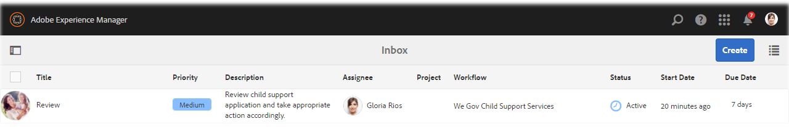

# Présentation du site de référence We.Gov {#we-gov-reference-site-walkthrough}

>[!CAUTION]
>
>AEM 6.4 a atteint la fin de la prise en charge étendue et cette documentation n’est plus mise à jour. Pour plus d’informations, voir notre [période de support technique](https://helpx.adobe.com/fr/support/programs/eol-matrix.html). Rechercher les versions prises en charge [here](https://experienceleague.adobe.com/docs/?lang=fr).

## Condition préalable {#pre-requisite}

Configurez votre site de référence We.Gov comme décrit dans la section [Installation et configuration des sites de référence AEM Forms](/help/forms/using/setup-reference-sites.md).

## Scénario de site de référence {#reference-site-scenario}

We.Gov est une organisation gérée par l&#39;État qui permet aux parents adoptifs de s&#39;inscrire à une allocation familiale s&#39;ils ont adopté un enfant. Le site gère les éléments suivants :

* Éligibilité du demandeur, du parent adoptif
* Informations personnelles et professionnelles du demandeur (si le demandeur est éligible à une allocation familiale)
* Informations personnelles de l&#39;enfant adopté

   Le demandeur peut fournir des détails sur plusieurs enfants
* Détails du compte bancaire du demandeur dans lequel le demandeur peut recevoir des allocations familiales
* Recouvrement des frais de dossier
* Évaluation de la demande
* Validation de la demande
* Communication automatisée avec le demandeur

Une fois la demande envoyée et ses frais payés, le demandeur reçoit un courrier électronique de l’organisation avec l’accusé de réception de la demande envoyée.

L’organisation We.Gov reçoit la demande. L’organisation fait évaluer la demande et approuve les demandes authentiques.

Une fois la demande approuvée, le demandeur reçoit un courrier électronique du site We.Gov. Le **Afficher le document** dans le courrier électronique renvoie à un document contenant les détails de l’inscription du demandeur.

L’infographie ci-dessous illustre le déroulement détaillé du scénario du site de référence We.Gov.

Le scénario implique les personnages suivants :

* Sarah Rose, le parent adoptif qui demande une allocation familiale
* Joe, l&#39;enfant adopté
* Gloria Rios, la responsable de la division d&#39;approbation, We.Gov
* Conrad Simms, l’agent de terrain qui s’occupe de l’évaluation des demandes

## Sarah lance sa vérification de l’éligibilité {#sarah-initiates-her-eligibility-check}

Un demandeur peut vérifier son éligibilité pour demander des allocations familiales. Le site permet aux utilisateurs de répondre à des questions afin de leur permettre de déterminer si leur demande est éligible aux avantages. Sarah, un parent adoptif, est un demandeur potentiel. Le formulaire d’éligibilité fait partie des demandes d’allocation familiale du site We.Gov. Pour vérifier son éligibilité, Sarah clique sur **[!UICONTROL Enfants pris en charge]** sur le site Web de We.Gov. Sur la page Allocations familiales, Sarah clique sur **[!UICONTROL Vérification de votre éligibilité]**.

Outre la méthode ci-dessus, Sarah peut cliquer sur **[!UICONTROL Prise en main]** sur la page d’accueil. Sarah accède à la page Toutes les demandes , où elle peut cliquer sur Demander sous **[!UICONTROL Demande de services d&#39;aide à l&#39;enfance]**. Sarah est ensuite redirigée vers la vérification d’éligibilité.

Sur la page Vérifier l’éligibilité des allocations familiales, Sarah reçoit une série de questions pour déterminer son éligibilité aux allocations familiales. A travers l&#39;ensemble des questions, on lui pose :

* Si elle est le parent qui a la garde de l’enfant
* Si elle et l&#39;enfant vivent dans l&#39;état de GX
* La tranche d&#39;âge de l&#39;éducation de l&#39;enfant et de l&#39;enfant.

Sarah répond à ces questions et son éligibilité est validée. Ses réponses déterminent si elle est éligible à l&#39;allocation familiale.

Sarah est informée qu’elle est éligible à l’allocation familiale et que les frais de dossier sont de 25 $.

### Fonctionnement {#how-it-works}

L’éligibilité de Sarah est validée par une barrière d’éligibilité créée à l’aide de l’éditeur de règles. L’éditeur de règles vous permet de spécifier les conditions qui sont remplies avant qu’un demandeur ne puisse remplir le formulaire de demande. Lorsque Sarah, le demandeur, remplit toutes les conditions d’éligibilité, elle accède au formulaire de demande.

La vérification de l’éligibilité fait partie du formulaire adaptatif de demande d’allocation familiale. La règle valide l’éligibilité lorsque :

* Le demandeur est un parent gardien
* Le demandeur et l’enfant restent dans l’état de GX
* Le demandeur a la principale garde quotidienne de l&#39;enfant
* L&#39;âge de l&#39;enfant bénéficiant d&#39;une aide est inférieur à 16 ans.

### Démonstration {#see-it-yourself}

Dans votre navigateur, ouvrez `https://<hostname>:<PublishPort>/content/we-gov/en.html`. Sur le site We.Gov, cliquez sur Allocations familiales. Dans la page des allocations familiales, cliquez sur Vérifiez votre éligibilité.

Pour afficher les règles :

1. Ouvrez le formulaire en mode d’édition sur l’instance de création. URL: `https://<hostname>:<AuthorPort>/editor.html/content/forms/af/we-gov/child-support/css.html`.
1. Sélectionnez un composant, puis cliquez sur .

   L’éditeur de règles s’ouvre, répertoriant toutes les règles appliquées dans le formulaire.

1. Dans le panneau de gauche, cliquez sur Règles . `passMsg` et `failMsg` pour comprendre le fonctionnement de la vérification d’éligibilité.

## Sarah commence sa demande d’allocation familiale {#sarah-starts-her-application-for-child-support}

Sarah clique **[!UICONTROL Démarrage de l’application]** après qu&#39;elle a été informée de son éligibilité à l&#39;allocation familiale.\
Dans la page de demande de services d’aide à l’enfance, Sarah fournit des détails dans les sections suivantes :

* **[!UICONTROL À propos du demandeur]**: Permet à Sarah de fournir ses détails dans cette section.

* **[!UICONTROL Informations sur les enfants]**: Permet à Sarah de fournir les informations sur l’enfant, qui est couvert par les services d’assistance.

* **[!UICONTROL Paiement]**: Permet à Sarah de fournir ses informations bancaires dans lesquelles We.Gov peut déposer une compensation mensuelle.

* **[!UICONTROL Paiement de frais]**: Permet à Sarah de fournir les informations de sa carte de crédit pour payer les frais de demande.

Par défaut, Sarah est redirigée vers la fonction **[!UICONTROL À propos du demandeur]** .

À tout moment, Sarah peut cliquer sur **[!UICONTROL Revenir plus tard]** et reprendre avec sa demande. Lorsqu’elle clique **[!UICONTROL Revenir plus tard]**, sa progression est enregistrée en tant que brouillon et elle a la possibilité d’envoyer le brouillon par courrier électronique.

Lorsqu’elle clique **[!UICONTROL Envoyer un courrier électronique]**, elle reçoit un courrier électronique contenant un lien vers le brouillon de son formulaire.

Le formulaire d’allocation familiale sur le site We.Gov utilise des formulaires adaptatifs. Elle peut utiliser le lien dans son email et remplir le formulaire sur son appareil mobile.

>[!NOTE]
>
>Le workflow de reprise à partir d’un courrier électronique fonctionne uniquement avec les utilisateurs connectés. Dans le scénario du site de référence, assurez-vous que l’utilisateur Sarah Rose est ajouté. Les informations de connexion de Sarah sont `srose/password`.

Sarah peut fournir des informations dans n’importe quelle section, mais les frais de dossier ne sont acceptés qu’après avoir fourni les informations requises dans toutes les sections. Une demande est incomplète sans paiement de frais et des champs marqués d’un astérisque sont requis.

### <strong>Sarah fournit ses informations</strong> {#strong-sarah-provides-her-information-strong}

Après que Sarah a cliqué sur **[!UICONTROL Démarrage de l’application]**, elle est redirigée vers la section Informations sur le demandeur de la page de demande de services d’aide à l’enfance . Sous Informations sur le demandeur, Sarah parcourt les onglets et fournit ses informations personnelles pour la demande. Elle clique **[!UICONTROL Suivant]** pour naviguer dans les onglets.

Sous Informations sur le demandeur, vous lui êtes demandé de fournir des informations dans les onglets suivants :

* **[!UICONTROL Informations de base]**

Sous Informations de base, Sarah fournit sa preuve d’identité et ses informations personnelles. Les informations personnelles de Sarah incluent son nom, son e-mail et son numéro de sécurité sociale.

* **[!UICONTROL Relations]**

   Sous Relation, Sarah saisit des informations sur son état civil.

* **[!UICONTROL Informations supplémentaires]**

   Sous Informations supplémentaires, Sarah saisit un numéro d’identification, sa date de naissance, ainsi que l’adresse et le numéro de téléphone actuels.

### Sarah fournit des informations sur les enfants {#sarah-provides-child-information}

Après que Sarah a fourni ses informations personnelles et cliqué **[!UICONTROL Suivant]**, elle est redirigée vers la section Informations sur l’enfant .

Dans la section Informations sur l’enfant, elle fournit les détails suivants :

* Nombre d&#39;enfants à demander des services d&#39;aide à l&#39;enfance
* Nom de l’enfant, numéro de sécurité sociale, date de naissance et lieu de naissance

Si Sarah choisit plusieurs enfants, elle obtient des formulaires supplémentaires activés avec les mêmes détails à remplir.\
Sarah sélectionne son seul enfant, Joe, et saisit son nom.

### Sarah fournit des informations de paiement {#sarah-provides-payment-information}

Après que Sarah a fourni des informations sur le ou les enfants adoptés et cliqué **[!UICONTROL Suivant]**, elle est dirigée vers la fonction **[!UICONTROL Informations sur le paiement]** .

Dans la section Informations bancaires, elle fournit les informations de compte bancaire dans lesquelles elle peut recevoir les allocations familiales.\
Elle saisit son numéro de compte bancaire à 10 chiffres.

## Sarah paie les frais de dossier et signe le formulaire {#sarah-pays-the-application-fee-and-signs-the-form}

Après que Sarah a accepté les conditions générales de la demande, elle paie des frais de 25 $. Des frais de dossier sont requis pour traiter sa demande.\
Sarah saisit les informations de sa carte de crédit et clique **[!UICONTROL Payer maintenant]**. Après avoir payé les frais, une version PDF de la demande s’affiche avec un champ de signature.

Sarah peut choisir d’entrer, d’utiliser l’option Dessiner pour écrire à la main, d’insérer une image de signature ou d’utiliser l’écran tactile de son mobile pour dessiner sa signature. Sarah saisit son nom et clique sur Cliquer pour signer.

Sa demande est envoyée au site We.Gov.

### <strong>Sarah reçoit un courrier électronique d’accusé de réception</strong> {#strong-sarah-receives-an-acknowledgement-email-strong}

Après que Sarah a payé les frais de dossier, elle reçoit un courrier électronique d’accusé de réception du site We.Gov.\
We.Gov traite la demande et Sarah est informée qu’elle recevra une compensation mensuelle une fois sa demande approuvée.

### Fonctionnement {#how-it-works-1}

La demande d’allocation familiale utilise une combinaison de dispositions de panneau telles que l’onglet supérieur, l’assistant et l’accordéon pour créer l’expérience. Il utilise un modèle de formulaire appelé Modèle Enfant We.Gov.

Le demandeur peut se déplacer dans plusieurs sections pour remplir différents composants du formulaire. Lorsque le demandeur remplit le formulaire, l’envoie, accepte les conditions générales et paie les frais, un processus personnalisé est lancé. Le workflow personnalisé envoie un courrier électronique automatisé au demandeur pour confirmer l’envoi de la demande. La demande est transmise au service concerné de l’organisation pour vérification et approbation.

La mise en page du formulaire est spécifiée dans le thème du service d’aide à l’enfance de l’État. Le style comprend le style du composant, l’arrière-plan de la page, le formatage de l’état d’erreur des composants et les styles de police.

La vérification de l’éligibilité utilise les règles spécifiées dans le formulaire. Elle utilise les contrôles de validité spécifiés ci-dessous :

`SHOW passMsgWHEN (Does the child live in the state of GX? is equal to Yes) AND (Do you live in the state of GX? is equal to Yes) AND ( (Who has the main day-to-day care of the child? is equal to You) AND (Are you: is equal to The custodial parent) ) AND (Is the child you are applying for: is equal to Under 16 years) ELSE Hide`

`HIDE failMsg WHEN (Does the child lives in the state of GX? is equal to Yes) AND ( (Do you live in the state of GX? is equal to Yes) AND (Who has the main day-to-day care of the child? is equal to You) ) AND (Is the child you are applying for: is equal to Under 16 years) AND (Are you: is equal to The custodial parent) ELSE Show`

### Démonstration {#see-it-yourself-1}

Dans votre navigateur, ouvrez `https://<hostname>:<PublishPort>/content/forms/af/we-gov/child-support/css.html` et renseignez les informations requises. Lorsque vous envoyez la demande après avoir rempli les informations requises, payé les frais et signé le document, vous recevez le courrier électronique d’accusé de réception.

Voir le modèle Enfant de We.Gov ici : `https://<hostname>:<AuthorPort>/editor.html/conf/we-gov/settings/wcm/templates/we-gov-child-template/structure.html`

Reportez-vous au thème ici : `https://<hostname>:<AuthorPort>/editor.html/content/dam/formsanddocuments-themes/we-gov/we-gov-theme-A/jcr:content`

Pour afficher toutes les règles, procédez comme suit :

1. Ouvrez le formulaire en mode création.

   URL : `https://<hostname>:<AuthorPort>/editor.html/content/forms/af/we-gov/child-support/css.html`

1. Sélectionnez un composant, puis appuyez sur . Toutes les règles sont répertoriées dans l’éditeur de règles, y compris les règles répertoriées ci-dessus.

## Gloria reçoit la demande {#gloria-receives-the-application}

Gloria, responsable des approbations chez We.Gov, peut afficher, approuver ou rejeter les demandes envoyées. AEM Boîte de réception lui permet de voir toutes les demandes envoyées au même endroit.

### Fonctionnement {#how-it-works-2}

Lorsque Sarah remplit et envoie la demande d’allocation familiale, un PDF ou un document d’enregistrement de la demande est créé et envoyé à la boîte de réception de Gloria Rios. Gloria peut afficher la demande envoyée et l’accepter ou la rejeter.

### Démonstration {#see-it-yourself-2}

Ouvrir la page `https://<hostname***>:<PublishPort>/content/we-gov/en.html`. Sur la page, appuyez sur . **[!UICONTROL Se connecter]**, sélectionnez la variable **[!UICONTROL Connexion en tant que représentant]** , connectez-vous à la boîte de réception d’AEM en utilisant grios/password comme nom d’utilisateur/mot de passe pour Gloria Rios. La demande d’allocation familiale s’affiche. Pour plus d’informations sur l’utilisation de la boîte de réception AEM pour les tâches du workflow relatives aux formulaires, voir [Gérer des applications et des tâches Forms dans la boîte de réception AEM](/help/forms/using/manage-applications-inbox.md).

Gloria peut voir, approuver ou rejeter la demande depuis le tableau de bord de la demande.

### Fonctionnement {#how-it-works-3}

Gloria, responsable des approbations chez We.Gov, ouvre sa boîte de réception AEM. Elle voit une tâche de révision dans sa liste de tâches. Elle ouvre et affiche la tâche de révision.

Elle voit un PDF du formulaire rempli avec les informations saisies par Sarah ainsi que les documents que Sarah a téléchargés.\
Gloria peut approuver ou rejeter la demande. Toutefois, Gloria clique **[!UICONTROL Évaluation requise]** pour faire évaluer la demande.

La demande de Sarah est un point de départ dans le processus AEM. Il lance le processus d’AEM lorsque le formulaire de demande d’allocation familiale est envoyé. Le processus AEM crée une tâche pour Gloria, qui s’affiche dans sa boîte de réception AEM. Lorsque Gloria demande une évaluation sur site, une nouvelle tâche est créée pour l’agent de terrain.

### Démonstration {#see-it-yourself-3}

Si la configuration est terminée, le processus d’AEM démarre immédiatement après l’envoi du formulaire. Connectez-vous à la boîte de réception à l’aide des informations d’identification de Gloria.

Accédez à la boîte de réception à l’adresse https://&lt;***hostname***>:&lt;***PublishPort***>/content/we-gov/en.html. Sur la page, appuyez sur . **[!UICONTROL Se connecter]**, sélectionnez la variable **[!UICONTROL Connexion en tant que représentant]** Utilisez les informations d’identification par défaut de Gloria :

* Nom d’utilisateur : grios
* Mot de passe : password

Dans sa boîte de réception d’AEM, la demande de Sarah est ajoutée en tant que tâche de révision. Sélectionnez la tâche, puis cliquez sur **Évaluation requise** pour passer à l’étape suivante.

### Conrad obtient la tâche d’évaluation {#conard-assessment-task}

Lorsque Gloria clique **[!UICONTROL Évaluation requise]**, Conrad obtient la tâche de révision dans sa boîte de réception AEM. La tâche est l’étape suivante du workflow AEM défini dans le modèle de workflow. Il voit la tâche de révision et l’ouvre.

Conrad obtient la tâche d’évaluation du demandeur comme illustré ci-dessous.

L’évaluation de l’allocation familiale est un formulaire associé à la tâche. Il obtient les détails de Sarah, ainsi que les documents annexes (joints dans les détails de la tâche). Conrad remplit le formulaire d’évaluation dans le champ sur un périphérique et l’envoie pour réévaluation.

Conrad vérifie toutes les informations fournies par Sarah et Sarah signe l’évaluation. AEM Forms peut prendre l’emplacement et l’horodatage et les ajouter à la signature.

Conrad clicks **[!UICONTROL Soumettre pour réévaluation]**, et le workflow AEM envoie l’évaluation à l’organisation We.Gov.

### Fonctionnement {#how-it-works-4}

Lorsque Gloria demande une évaluation, l’étape suivante du processus d’AEM est lancée et la tâche d’évaluation est ajoutée dans la boîte de réception de Conrad. Conrad est le personnage de l’agent de terrain.

Conrad se rend chez Sarah, vérifie que les informations fournies par Sarah sont authentiques et remplit le formulaire d’évaluation. Conrad peut accéder à un PDF du formulaire complet que Sarah a rempli.

### Démonstration {#see-it-yourself-4}

Ouvrez la boîte de réception AEM sur votre tablette et utilisez les informations d’identification de Conrad pour vous connecter.

Les informations d’identification par défaut de Conrad sont les suivantes :

* Nom d’utilisateur : csimms
* Mot de passe : password

Une nouvelle tâche de demande d’évaluation est ajoutée dans la boîte de réception. Envoyez l’évaluation terminée et passez à l’étape suivante.

### Gloria examine l’évaluation et approuve la demande {#gloria-reviews-the-assessment-and-approves-the-application}

Une fois que Conrad a envoyé l’évaluation, Gloria voit une tâche de révision dans sa boîte de réception. Elle sélectionne et ouvre **[!UICONTROL Réviser]**.

Sous Détails de la tâche, Gloria voit la dernière action effectuée comme &quot;Envoyer pour réévaluation&quot; (par Conrad). Gloria voit que Conrad Simms a évalué la demande.

### Fonctionnement {#how-it-works-5}

Une fois que Conrad a envoyé l’évaluation, Gloria voit une tâche de révision dans sa boîte de réception. Elle sélectionne et ouvre Révision. Sous Détails de la tâche, Gloria voit le commentaire d’évaluation de Conrad, qui est &quot;Tout ce qui est dans l’ordre&quot;.

Gloria approuve la demande.

### Démonstration {#see-it-yourself-5}

Ouvrez la boîte de réception et connectez-vous à l’aide des informations d’identification de Gloria. Une nouvelle tâche appelée Révision apparaît dans la boîte de réception.

Ouvrez la tâche pour voir le statut de la dernière action effectuée. Validez la demande en fonction de l’évaluation.

## Sarah reçoit un courrier électronique d’approbation {#sarah-receives-an-approval-email}

Après que Gloria a approuvé la demande, Sarah reçoit un courrier électronique de We.Gov lui indiquant que sa demande est approuvée.

Le **[!UICONTROL Afficher le document]** dans le courrier électronique renvoie à ses détails d’inscription. Sarah clique **[!UICONTROL Afficher le document.]**

Le document d’inscription répertorie des détails tels que l’ID de référence, l’enfant couvert, la date de début, le numéro de compte bancaire, la fréquence de paiement et le montant de paiement.

Sarah peut afficher les documents qu’elle a téléchargés dans la même page.

### Fonctionnement {#how-it-works-6}

Lorsque Gloria approuve la demande, Sarah reçoit un courrier électronique automatisé contenant un lien vers le document d’inscription.

Le document d’inscription est une communication interactive qui peut être affichée sur n’importe quel appareil. Il contient les détails du service d’allocation familiale et les informations fournies par Sarah.

### Démonstration {#see-it-yourself-6}

Vérifiez le client de messagerie que vous avez configuré pour l’e-mail automatisé avec un lien vers le document d’inscription.

Pour afficher le document dans votre navigateur, vous pouvez également ouvrir : `https://<hostname>:<PublishPort>/content/aemforms-refsite/doclink.html?document=/content/forms/af/we-gov/child-support/enrollment-document&referenceId=[reference-id]&channel=web`

## We.Gov analyse les performances de l’application {#we-gov-analyzes-the-performance-of-the-application}

We.Gov, de temps à autre, examine les performances de son application de services d’aide à l’enfance afin de vérifier les problèmes éventuels des clients. Ils utilisent cette analyse pour prendre des décisions éclairées au sujet des modifications requises dans la demande de services d’aide à l’enfance afin d’améliorer l’expérience utilisateur, de réduire le taux d’abandon des formulaires et ainsi d’améliorer la conversion. Ils tirent parti de l’intégration d’AEM Forms à Adobe Analytics pour leur analyse. L’image suivante illustre le tableau de bord des analyses.

### Fonctionnement {#how-it-works-7}

Les mesures de performances du formulaire de demande de services d’aide à l’enfance sont suivies à l’aide d’Adobe Analytics. Pour plus d’informations sur la configuration d’Adobe Analytics et l’affichage des rapports, voir [Configuration des analyses pour les formulaires et les documents](/help/forms/using/configure-analytics-forms-documents.md).

### Démonstration {#see-it-yourself-7}

Pour que vous puissiez afficher et explorer le rapport d’analyse, nous fournissons des données sources pour l’application de services d’aide à l’enfance dans le site de référence. Avant d’utiliser les données sources, reportez-vous à la section [Configuration d’Analytics](/help/forms/using/setup-reference-sites.md#configureanalytics). Effectuez les étapes suivantes dans l’instance d’auteur pour afficher le rapport avec les données sources :

1. Accédez à **[!UICONTROL Forms et documents]** Interface utilisateur à l’adresse https://&lt;*hostname*>:&lt;*AuthorPort*>/aem/forms.html/content/dam/formsanddocuments.

1. Cliquez pour ouvrir la **We.Gov** Dossier.
1. Sélectionner **[!UICONTROL Demande de services d&#39;aide à l&#39;enfance]** formulaire adaptatif, puis cliquez sur **[!UICONTROL Activation d’Analytics]** dans la barre d’outils.

1. Sélectionnez à nouveau le formulaire, puis cliquez sur **[!UICONTROL Rapport Analytics]** dans la barre d’outils pour générer le rapport. Un rapport vierge s’affiche initialement.

Pour générer un rapport d’analyse avec des données sources :

1. Dans le navigateur d’adresse de CRXDE Lite, saisissez : **/apps/we-gov/demo-artifacts/analyticsTestData/Service d’allocation familiale Analytics Test Data**
1. Les données sources sont sélectionnées dans la structure de répertoires du côté gauche.
1. Double-cliquez sur le fichier sélectionné pour ouvrir son contenu dans le panneau de droite.
1. Copiez tout le contenu du fichier de données de test.
1. Dans CRXDE, accédez à : **/content/dam/formsanddocuments/we-gov/child-support/css/jcr:content/analyticsdatanode/lastsevendays**
1. Dans le champ analyticsdata sous Propriétés, collez le contenu copié du fichier de données de test.
1. Générez à présent un rapport d’analyse pour **[!UICONTROL Demande de services d&#39;aide à l&#39;enfance]**. Les données sources sont visibles dans le rapport généré.
