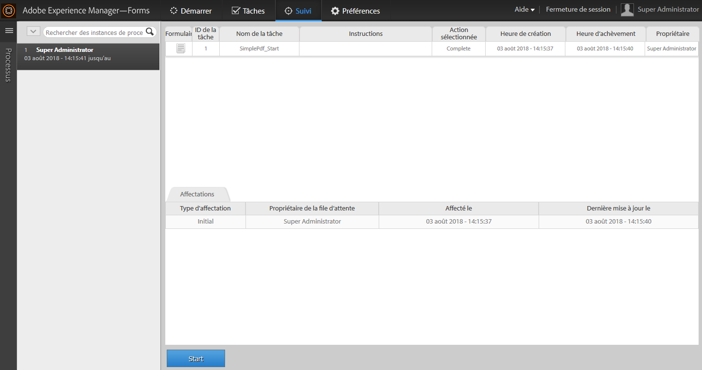
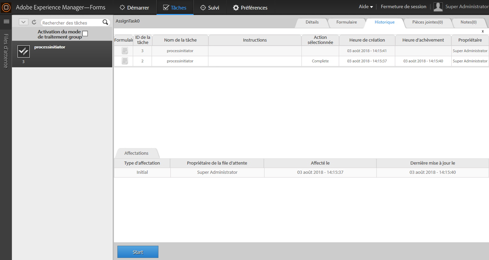

# Lancement d’un nouveau processus avec les données de processus existantes dans l’espace de travail AEM Forms {#initiating-a-new-process-with-existing-process-data-in-aem-forms-workspace}

Vous pouvez lancer un nouveau processus à l’aide des données de processus existantes. La nécessité de lancer un nouveau processus à partir des données de processus existantes survient lorsqu’un même formulaire doit être utilisé fréquemment et que son contenu inclut peu de modifications, comme les formulaires pour congés payés. Cette fonction permet de gagner du temps et de faciliter l’expérience des utilisateurs, en particulier lorsque le processus implique le remplissage de longs formulaires.

Vous trouverez ci-dessous les étapes à suivre pour lancer un nouveau processus à partir des données de processus existantes : -

1. Il peut effectuer l’une des opérations suivantes :

   * Dans Suivi, cliquez sur l’instance de processus dont vous souhaitez utiliser les données. Dans la vue Historique des processus dans le volet droit, cliquez sur la ligne de tâche correspondant au point de départ.
   * Dans Suivi, sélectionnez un modèle de recherche pour afficher une liste des instances de processus. Sélectionnez l’instance dont vous souhaitez utiliser les données.
   * Dans l’onglet **[!UICONTROL Tâches]**, sélectionnez une tâche. Cliquez sur l’onglet **[!UICONTROL Historique]** et sélectionnez une tâche qui a lancé une instance de processus.

    

1. Dans la barre d’outils de l’action Tâche, cliquez sur **[!UICONTROL Démarrer]**. Un formulaire adaptatif pour la nouvelle instance de processus est affiché avec des données préremplies.

1. Mettez à jour les données le cas échéant, et cliquez sur **[!UICONTROL Terminer]** ou sur le bouton approprié dans le formulaire.

