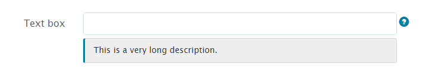

# Styles intégrés des composants de formulaire adaptatif {#inline-styling-of-adaptive-form-components}

>[!CAUTION]
>
>AEM 6.4 a atteint la fin de la prise en charge étendue et cette documentation n’est plus mise à jour. Pour plus d’informations, voir notre [période de support technique](https://helpx.adobe.com/fr/support/programs/eol-matrix.html). Rechercher les versions prises en charge [here](https://experienceleague.adobe.com/docs/?lang=fr).

Vous pouvez définir l’aspect général et le style d’un formulaire adaptatif en spécifiant les styles à l’aide de [éditeur de thèmes](/help/forms/using/themes.md). Vous pouvez également appliquer des styles CSS intégrés à des composants de formulaire adaptatif individuels et prévisualiser les modifications à la volée. Les styles intégrés remplacent les styles fournis dans le thème.

## Application des propriétés de style CSS intégré {#apply-inline-css-properties}

Pour ajouter des styles intégrés à un composant :

1. Ouvrez votre formulaire dans l’éditeur de formulaires, puis choisissez le mode Style. Pour choisir le mode Style, dans la barre d’outils de la page, appuyez sur ](assets/canvas-drop-down.png)canvas-drop-down. Les propriétés de style s’ouvrent dans la barre latérale.

   Vous pouvez également sélectionner des composants dans l’arborescence de hiérarchie de formulaire dans la barre latérale. L’arborescence de hiérarchie de formulaires est disponible sous forme d’objets de formulaire dans la barre latérale.

   Vous pouvez également sélectionner un composant dans la barre latérale. Dans le mode Style, vous pouvez afficher les composants répertoriés sous Objets de formulaire. Cependant, la liste Objets de formulaire dans la barre latérale répertorie les composants tels que les champs et les panneaux. Les champs et les panneaux sont des composants génériques qui peuvent contenir des composants tels que des zones de texte et des boutons radio.

   Lorsque vous sélectionnez un composant dans la barre latérale, tous les sous-composants sont répertoriés et les propriétés du composant sélectionné s’affichent. Vous pouvez sélectionner un sous-composant spécifique et le mettre en forme.

1. Cliquez sur un onglet de la barre latérale pour spécifier les propriétés CSS. Vous pouvez spécifier des propriétés telles que :

   * Dimensions et position (paramètre d’affichage, remplissage, hauteur, largeur, marge, position, index z, flottant, clair, débordement)
   * Texte (famille de polices, épaisseur, couleur, taille, hauteur de ligne et alignement)
   * Arrière-plan (image et gradient, couleur d’arrière-plan)
   * Bordure (largeur, style, couleur, rayon)
   * Effets (ombre, opacité)
   * Avancé (permet de saisir un CSS personnalisé pour le composant)

1. De même, vous pouvez appliquer des styles pour d’autres parties d’un composant tels que Widget, Légende et Aide.
1. Appuyez sur **Terminé** pour confirmer les modifications ou sur **Annuler** pour annuler les modifications.

## Exemple : styles intégrés pour un composant de champ {#example-inline-styles-for-a-field-component}

Les images suivantes illustrent une zone de texte avant et après l’application des styles intégrés.

Composant de zone de texte avant d’appliquer les propriétés de style intégré

Notez la modification du style de la zone de texte comme illustré ci-dessous après l’application des propriétés CSS suivantes.

<table> 
 <tbody> 
  <tr> 
   <td>
Sélecteur
 </td> 
   <td>
propriété CSS
 </td> 
   <td>
Valeur
 </td> 
   <td>
Effet
 </td> 
  </tr> 
  <tr> 
   <td>
Champ
 </td> 
   <td>
bordure
 </td> 
   <td>
Largeur de la bordure = 2px
 
Style de bordure = Plein
 
Couleur de la bordure = #1111
 </td> 
   <td>
Crée une bordure large noire 2px autour du champ.
 </td> 
  </tr> 
  <tr> 
   <td>
Zone de texte
 </td> 
   <td>
background-color
 </td> 
   <td>
#6495ED
 </td> 
   <td>
Modifie la couleur d’arrière-plan en CornflowerBlue (#6495ED)
 
Remarque : Vous pouvez spécifier un nom de couleur ou son code hexadécimal dans le champ de valeur.
 </td> 
  </tr> 
  <tr> 
   <td>
Libellé
 </td> 
   <td>
Dimensions et position &gt; largeur
 </td> 
   <td>
100 px
 </td> 
   <td>
Définit la largeur sur 100 px pour le libellé.
 </td> 
  </tr> 
  <tr> 
   <td>Icône d’aide du champ</td> 
   <td>Texte &gt; Couleur de la police</td> 
   <td>#2ECC40</td> 
   <td>Modifie la couleur de la face de l’icône d’aide.</td> 
  </tr> 
  <tr> 
   <td>
Description longue
 </td> 
   <td>
text-align
 </td> 
   <td>
centre
 </td> 
   <td>
Aligne la description longue pour faciliter le centrage.
 </td> 
  </tr> 
 </tbody> 
</table>

**Figure :** *Composant de zone de texte après application des propriétés de style intégré*

En suivant les étapes ci-dessus, vous pouvez sélectionner et mettre en forme d’autres composants, tels que les panneaux, les boutons d’envoi et les boutons radio.

>[!NOTE]
>
>Les propriétés de style varient en fonction du composant sélectionné.
