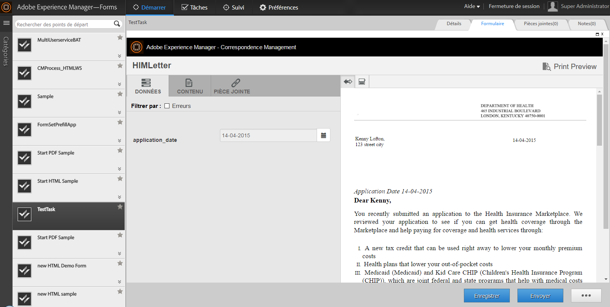

# Intégrer des applications tierces à l’espace de travail AEM Forms {#integrating-third-party-applications-in-aem-forms-workspace}

>[!CAUTION]
>
>AEM 6.4 a atteint la fin de la prise en charge étendue et cette documentation n’est plus mise à jour. Pour plus d’informations, voir notre [période de support technique](https://helpx.adobe.com/fr/support/programs/eol-matrix.html). Rechercher les versions prises en charge [here](https://experienceleague.adobe.com/docs/?lang=fr).

L’espace de travail AEM Forms prend en charge la gestion d’affectation de tâches et d’activités d’exécution pour les formulaires et les documents. Ces formulaires et documents peuvent être des formulaires XDP Forms, Flex® ou des guides (obsolètes) qui ont été rendus aux formats XDP, PDF, HTML ou Flex.

Ces fonctionnalités sont encore améliorées. AEM Forms prend désormais en charge la collaboration avec des applications tierces comprenant des fonctionnalités semblables à l’espace de travail AEM Forms. Une partie courante de cette fonctionnalité est le flux de travail d’affectation et d’approbation ultérieure d’une tâche. AEM Forms offre une expérience unique et unifiée aux utilisateurs d’AEM Forms Enterprise afin que toutes ces affectations de tâches ou approbations pour les applications prises en charge puissent être gérées via l’espace de travail AEM Forms.

Par exemple, considérons Correspondence Management comme exemple de candidat pour l’intégration à l’espace de travail AEM Forms. Correspondence Management possède le concept d’une « Lettre », qui peut être rendue et autorise des actions.

## Création d’actifs de Correspondence Management {#create-correspondence-management-assets}

Commencez par créer un exemple de modèle de Gestion des correspondances qui est généré dans l’espace de travail AEM Forms. Pour plus de détails, voir [Créer un modèle de lettre](/help/forms/using/create-letter.md).

Utilisez l’URL pour accéder au modèle de Gestion des correspondances et vérifiez s’il peut être généré correctement. L’URL a un modèle similaire à `https://[server]:[port]/lc/content/cm/createcorrespondence.html?cmLetterId=encodedLetterId&cmUseTestData=1&cmPreview=0;`.

où `encodedLetterId` correspond à l’ID de lettre codé URL. Spécifiez le même ID de lettre lors de la définition du processus de rendu pour la tâche d’espace de travail dans Workbench.

## Création d’une tâche pour le rendu et l’envoi d’une lettre dans AEM Workspace {#create-a-task-to-render-and-submit-a-letter-in-aem-workspace}

Avant d’exécuter ces étapes, vérifiez que vous êtes membre des groupes suivants :

* cm-agent-users
* Utilisateurs de Workspace

Pour plus d’informations, voir [Ajout et configuration d’utilisateurs](/help/forms/using/admin-help/adding-configuring-users.md).

Suivez les étapes ci-dessous pour créer une tâche afin de générer et envoyer une lettre dans AEM Workspace :

1. Lancez Workbench. Connectez-vous à localhost en tant qu’administrateur.
1. Cliquez sur Fichier > Nouveau > Application. Dans le champ Nom de l’application, saisissez `CMDemoSample`, puis cliquez sur Terminer.
1. Sélectionnez `CMDemoSample/1.0` et cliquez avec le bouton droit sur `NewProcess`. Dans le champ Nom, saisissez `CMRenderer`, puis cliquez sur Terminer.
1. Faites glisser le sélecteur d’activité Point de départ et configurez-le :

   1. Dans Données de présentation, sélectionnez Utiliser une ressource CRX.

      

   1. Recherchez une ressource. Dans la boîte de dialogue Select Form Asset, l’onglet Lettres répertorie toutes les lettres sur le serveur.

      

   1. Sélectionnez la lettre appropriée et cliquez sur **OK**.

1. Cliquez sur Gérer les profils d’action. La boîte de dialogue Gérer le profil d’action s’affiche. Assurez-vous que le processus de rendu et le processus d’envoi sont correctement sélectionnés.
1. Pour ouvrir la lettre avec un fichier de données XML, recherchez et sélectionnez le fichier de données approprié dans le processus de préparation des données.
1. Cliquez sur OK.
1. Définissez les variables pour Sortie du point de départ et Pièces jointes de la tâche. Les variables définies contiendront les données Sortie de point de départ et Pièces jointes de tâche.
1. (Facultatif) Pour ajouter un autre utilisateur dans le workflow, faites glisser un sélecteur d’activité, configurez-le et affectez-le à un utilisateur. Créez un wrapper personnalisé (exemple ci-dessous) ou téléchargez et installez le DSC (indiqué ci-dessous) pour extraire le modèle de lettre, la sortie de point de départ et la pièce jointe de tâche.

   Voici un exemple d’élément wrapper personnalisé :

   ```java
   public LetterInstanceInfo getLetterInstanceInfo(Document dataXML) throws Exception {
   try {
   if(dataXML == null)
   throw new Exception("dataXML is missing");
   
   CoreService coreService = getRemoteCoreService();
   if (coreService == null)
   throw new Exception("Unable to retrive service. Please verify connection details.");
   Map<String, Object> result = coreService.getLetterInstanceInfo(IOUtils.toString(dataXML.getInputStream(), "UTF-8"));
   LetterInstanceInfo letterInstanceInfo = new LetterInstanceInfo();
   
   List<Document> attachmentDocs = new ArrayList<Document>();
   List<byte[]> attachments = (List<byte[]>)result.get(CoreService.ATTACHMENT_KEY);
   if (attachments != null){
   for (byte[] attachment : attachments)
   { attachmentDocs.add(new Document(attachment)); }
   
   }
   letterInstanceInfo.setLetterAttachments(attachmentDocs);
   
   byte[] updateLayout = (byte[])result.get(CoreService.LAYOUT_TEMPLATE_KEY);
   if (updateLayout != null)
   { letterInstanceInfo.setLetterTemplate(new Document(updateLayout)); }
   
   else
   { throw new Exception("template bytes missing while getting Letter instance Info."); }
   
   return letterInstanceInfo;
   } catch (Exception e)
   { throw new Exception(e); }
   
   }
   ```

   [Obtenir le fichier](assets/dscsample.zip)`DSCSample.zip`

Télécharger DSC : un exemple de DSC est disponible dans le fichier joint ci-dessus. Téléchargez et décompressez le fichier `DSCSample.zip` fichier . Avant d’utiliser le service DSC, vous devez le configurer. Pour plus d’informations, [Configuration du service DSC](/help/forms/using/add-action-button-in-create-correspondence-ui.md#p-configure-the-dsc-service-p).

   Dans la boîte de dialogue Définir l’activité, sélectionnez l’activité appropriée tel que getLetterInstanceInfo et cliquez sur **OK**.

1. Déployez l’application. Si vous y êtes invité, archivez et enregistrez les ressources.
1. Connectez-vous à l’espace de travail AEM forms à l’adresse `https://[server]:[port]/lc/content/ws`.
1. Ouvrez la tâche que vous avez ajoutée, CMRenderer. La lettre Correspondence Management s’affiche.

   

1. Renseignez les données requises et envoyez la lettre. La fenêtre se ferme. Dans ce processus, la tâche est affectée à l’utilisateur spécifié dans le workflow à l’étape 9.

   >[!NOTE]
   >
   >Le bouton Envoyer n’est pas activé tant que toutes les variables requises de la lettre ne sont pas renseignées.
