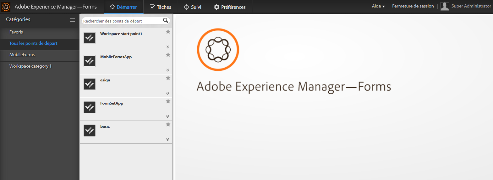

# Présentation de l’espace de travail AEM Forms {#introduction-to-aem-forms-workspace}

Le processus des formulaires améliore l’efficacité organisationnelle en automatisant et en fournissant une visibilité des processus métier critiques relatifs aux documents et aux formulaires. À l’aide du module Process Management, vous pouvez construire des processus complets simplifiés incluant des personnes, des systèmes, du contenu et des règles de gestion. L’espace de travail AEM Forms ajoute de nouvelles fonctionnalités pour étendre et intégrer l’espace de travail et le rendre plus convivial.

L’espace de travail AEM Forms est compatible avec d’autres périphériques et facteurs de formulaire. Il permet de gérer les tâches sur les clients sans Flash Player® ni Adobe® Reader®. Il facilite le rendu de formulaires HTML, en plus des formulaires PDF.

**Fonctionnalités essentielles**:

* Permettez aux participants aux processus de travailler où qu’ils soient, grâce à des formulaires PDF dynamiques, des interfaces mobiles et des applications Web.
* Intégrez facilement les composants d’espace de travail à vos applications Web. Comme l’espace de travail AEM Forms est un logiciel basé sur des composants, il peut être facilement personnalisé et réutilisé.
* Étendez les processus métier à la fois aux travailleurs mobiles en ligne et hors ligne à l’aide de l’application de l’espace de travail AEM Forms.
* Affichez les rapports pour contrôler les retards, les files d’attente de travaux et les indicateurs de performances clés (KPI). Vous pouvez utiliser les API pour extraire des données à des fins d’analyse plus approfondie en utilisant des outils de génération de rapports tiers.
