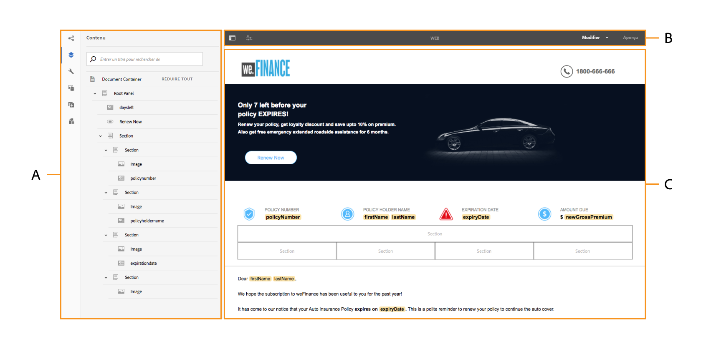

# Introduction à l’interface utilisateur de création d’une communication interactive {#introduction-to-interactive-communication-authoring-ui}

Introduction aux différents éléments de l’interface utilisateur permettant de créer une communication interactive

The user interface for authoring [Interactive Communication](/help/forms/using/interactive-communications-overview.md) is intuitive and provides the following for authoring print and web channel of the Interactive Communication:

* Editeur de document glisser-déposer WYSIWYGM
* Référentiel intégré pour les ressources : les ressources téléchargées et créées sur le serveur sont disponibles dans l’explorateur d’actifs de l’interface de création Interactive Communication.

Lorsque vous [créez une communication interactive ou en modifiez une existante](/help/forms/using/create-interactive-communication.md), vous utilisez les éléments suivants de l’interface utilisateur :

* [Barre latérale](#sidebar)
* [Barre d’outils Page](#page-toolbar)

* [Barre d’outils de composants](#component-toolbar)
* Zone de contenu

**A.** Barre latérale **B.** Barre d&#39;outils de la page **C.** Zone de contenu

## Barre latérale {#sidebar}

[Cliquez sur l’image pour l’agrandir](assets/sidebar-comps-1.png)

**A.** Navigateur de Canaux **B.** Explorateur de contenu **C.** Explorateur de propriétés **D.** Explorateur de ressources E. Explorateur de composants F. Explorateur de sources de données - Explorateur de modèles de données G. Explorateur de sources de données - Contenu du Principal ************

La barre latérale contient les éléments suivants :

* **Explorateur de canaux**

   L’explorateur de canaux vous permet de basculer entre les canaux d’impression et les canaux Web de la communication interactive. En fonction du canal que vous avez sélectionné dans l’explorateur de canaux, les navigateurs, tels que Contenu et Composants, affichent les options.

* **Explorateur de contenu**

   Dans l’explorateur de contenu, vous pouvez voir la hiérarchie des objets du document pour le canal sélectionné. L’auteur peut accéder au composant spécifique en appuyant sur cet élément dans l’arborescence de l’objet de document. L’auteur peut alors rechercher des objets dans le canal web et les réorganiser depuis l’arborescence.

* **Explorateur de propriétés**

   Permet de modifier les propriétés d’un composant. Les propriétés affichées varient en fonction du composant. Par exemple, pour afficher les propriétés du conteneur de document :

   Sélectionnez un composant, puis appuyez sur au niveau  du champ > Conteneur **de** Document, puis sur .

* **Explorateur de ressources**

   Sépare différents types de contenu, tels que les fragments de mise en page, les images, les documents, les pages et les vidéos. L’auteur peut glisser-déposer des actifs dans la communication interactive.

* **Explorateur de composants**

   Comprend les composants que vous pouvez utiliser pour créer les canaux Web et d’impression d’un document. Vous pouvez faire glisser des composants vers la communication interactive pour ajouter des éléments et configurer l’élément ajouté selon les exigences. Le tableau ci-dessous décrit les composants répertoriés dans l’explorateur de composants pour les canaux d’impression et web :

| **Composant** | **Canal d’impression** | **Canal web** | **Fonctionnalité** |
|---|---|---|---|
| Graphique | ✓ | ✓ | Ajoute un graphique que vous pouvez utiliser dans une communication interactive pour la représentation visuelle des données bidimensionnelles extraites d’un élément de collection du modèle de données de formulaire. |
| Fragment de document | ✓ | ✓ | Permet d’ajouter un composant, un texte, une liste ou une condition réutilisable à une communication interactive. Le composant réutilisable que vous ajoutez à une communication interactive peut être basé sur un modèle de données de formulaire ou sans modèle de données de formulaire. |
| Image | ✓ | ✓ | Permet d’insérer une image. |
| Panneau | - | ✓ | Le composant Panneau est un espace réservé pour regrouper d’autres composants et contrôle la disposition d’un groupe de composants dans une communication interactive. Un composant de panneau vous permet également de permettre la répétition d’un groupe de composants pour l’utilisateur final, par exemple dans plusieurs entrées requises pour remplir les informations d’identification. Il est également recommandé d’utiliser un panneau pour un onglet d’une communication interactive avec plusieurs onglets. |
| Tableau | &amp;ast; | ✓ | Ajoute un tableau qui permet de classer les données par lignes et par colonnes. |
| Zone cible | &amp;ast;&amp;ast; | ✓ | Insère une zone cible dans un canal web pour organiser les composants spécifiques au canal web. |
| Text (Texte) | - | ✓ | Ajoute le texte au canal web d’une communication interactive. Le texte peut utiliser des objets de modèle de données de formulaire pour rendre le contenu dynamique. |

&amp;ast; Utilisez Fragments de mise en page dans le canal d’impression pour ajouter des tableaux.

&amp;ast;&amp;ast; Dans le canal d’impression, les zones de cible sont prédéfinies dans le modèle XDP/impression. Vous ne pouvez pas ajouter de nouvelles zones cibles à l’aide de l’interface utilisateur de création de communication interactive.

* **Explorateur de sources de données**

   L’explorateur de sources de données affiche les sources de données disponibles dans le modèle de données de formulaire que vous avez sélectionné lors de la création de la communication interactive.

### Points clés pour l’utilisation de composants {#key-points-for-working-with-components}

Les points clés lorsque vous utilisez des composants de communication interactive sont les suivants :

* Chaque composant est associé à des propriétés qui contrôlent son apparence et ses fonctionnalités. To configure the properties of a component, tap the component and tap  to open the component properties in the Properties browser.
* Un composant est identifié par son nom d’élément. When you tap , you can change the name of the component by changing the Element Name field value in the properties browser. Vous pouvez saisir uniquement des lettres, des chiffres, des traits d’union (-) et des traits de soulignement (_) dans le champ Nom de l’élément. D’autres caractères spéciaux ne sont pas autorisés et le nom de l’élément doit commencer par une lettre.
* Vous pouvez modifier la propriété Title d’un composant Interactive Communication intégré dans l’éditeur sans ouvrir le navigateur Propriétés tant que le titre est visible dans la communication interactive. Pour ce faire :

   1. Appuyez pour sélectionner un composant qui a une propriété Titre et dont la propriété Masquer le titre est désactivée.
   1. Appuyez sur  pour rendre le titre modifiable.
   1. Modifiez le titre et appuyez sur la touche Retour ou appuyez n’importe où en dehors du composant pour enregistrer les modifications. Appuyez sur la touche Échap pour annuler les modifications.

## Barre d’outils de composants {#component-toolbar}

Lorsque vous sélectionnez un composant, une barre d’outils s’affiche, vous permettant de l’utiliser. Vous avez la possibilité de couper, coller, déplacer et spécifier les propriétés des composants. Vous avez le choix entre :

A.**Configurer** : Permet d’afficher les propriétés du composant dans la barre latérale. ****,

B. **Edit Rules**: When you tap Edit Rules, Rule Editor appears in which you can edit and create rules for the selected component. Dans l’éditeur de règles, vous pouvez également sélectionner d’autres objets de formulaire (composants) et modifier/créer des règles pour ces objets de formulaire.

C.** Copier** : permet de copier un composant et le coller ailleurs dans la communication interactive.

D. **Cut**: You can use the cut option to move a component from one place to another in the Interactive Communication.

E. **Delete**: Lets you delete the component from the Interactive Communication.

F. **Insert Component**: Lets you insert a component above the selected component.

G. **Paste**: Lets you paste the component you cut or copied using the options described above.

H. **Groupe** : permet de sélectionner plusieurs composants permettant de couper, copier ou coller plusieurs composants ensemble.

I.**Parent** : Permet de sélectionner le parent d’un composant.

J. **More**: Provides more options to work with the selected component.

* Afficher l’expression SOM (pour les panneaux uniquement)
* Regrouper les objets dans le panneau (pour les panneaux uniquement)
* Modifier le fragment (pour les fragments uniquement)
* Enregistrer un panneau en tant que fragment (pour les panneaux uniquement)
* Ajouter un panneau enfant (pour les panneaux uniquement)
* Ajouter une barre d’outils de panneau (pour les panneaux uniquement)
* Remplacer (pas pour les panneaux)

## Barre d’outils Page {#page-toolbar}

La barre d’outils Page située en haut de l’écran propose des options vous permettant de prévisualisation à la communication interactive et de modifier ses propriétés. Vous pouvez prévisualisation la communication interactive lors de sa création et apporter des modifications en conséquence. Dans la barre d’outils de la page, vous voyez :

* Toggle Side Panel : Lets you show or hide Sidebar.
* Page information : Lets you view page properties.
* Emulator : Lets you emulate the look of your Interactive Communication for different display sizes such as tablets and phones.
* Modifier : Sélectionne d’autres modes comme Modifier, Style, Développeur et Conception.

   * Modifier : Permet de modifier les propriétés de la communication interactive et de ses composants. Exemple : l’ajout d’un composant, le dépôt d’une image et l’indication des champs obligatoires.
   * Style : définit l’aspect des composants de votre communication interactive. Par exemple, en mode Style, vous pouvez sélectionner un panneau et définir sa couleur d’arrière-plan.
   * Développeur : Permet aux développeurs de :

      * Découvrez la composition de la communication interactive.
      * Déboguer en temps réel afin de mieux résoudre les problèmes.
   * Cible : Permet d’activer ou de désactiver des composants personnalisés ou des composants prêts à l’emploi qui ne sont pas répertoriés dans la barre latérale.

* Prévisualisation : Permet de prévisualisation l’aspect de la communication interactive lorsque vous la publiez.

