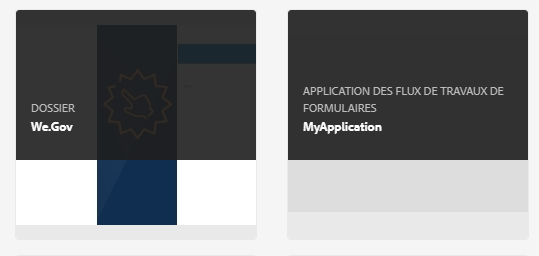

# Présentation de la gestion des formulaires {#introduction-to-managing-forms}

>[!CAUTION]
>
>AEM 6.4 a atteint la fin de la prise en charge étendue et cette documentation n’est plus mise à jour. Pour plus d’informations, voir notre [période de support technique](https://helpx.adobe.com/fr/support/programs/eol-matrix.html). Rechercher les versions prises en charge [here](https://experienceleague.adobe.com/docs/?lang=fr).

AEM Forms fournit une interface utilisateur simplifiée mais puissante pour créer et gérer des formulaires, des documents, des thèmes, des lettres, des fragments de document, des dictionnaires de données et des ressources associées. Il permet de gérer le cycle de vie complet des formulaires, documents et ressources associés, depuis l’ordinateur de bureau d’un développeur jusqu’à l’offre\
sur un serveur de portail pour les utilisateurs finaux. Vous pouvez utiliser l’interface utilisateur d’AEM Forms pour :

* Accès aux composants AEM Forms
* Accès aux configurations AEM Forms

>[!NOTE]
>
>Pour plus d’informations sur les autres outils et options d’AEM, voir [Utilisation de l’environnement de création](/help/sites-authoring/home.md).

## Accès aux composants AEM Forms {#access-aem-forms-components}

Outre les options permettant de créer des formulaires, des documents et des ressources connexes, AEM propose des options pour créer des sites, des ressources, gérer une instance AEM, etc. Vous pouvez cliquer sur le logo  Experience Manager pour accéder à tous les outils disponibles. Outre les liens vers les consoles d’autres composants, il contient également des liens pour AEM Forms . Pour accéder à AEM Forms, cliquez sur le **Logo du Experience Manager**  > **navigation**  > **Forms**. Les liens des consoles suivantes sont affichés :

* Formulaires et documents
* Thèmes
* Lettres
* Fragments de document
* Dictionnaires de données

### Formulaires et documents  {#forms-documents}

Forms et documents fournit des options pour créer une communication interactive, un formulaire adaptatif, un fragment de formulaire adaptatif et un jeu de formulaires. Pour AEM Forms on JEE uniquement, Forms &amp; Documents permet d’importer des fichiers à partir d’un stockage local et de synchroniser les ressources AEM Forms avec Workbench.

Le bouton de création est le point de départ du processus de création ou de chargement d’une ressource AEM Forms. Il permet de créer : 

* **Communication interactive** : une communication interactive est une correspondance, une déclaration ou un document numérique HTML personnalisé, interactif et bien adapté aux périphériques. Réactives par nature, les communications interactives modifient automatiquement leur mise en forme et leur conception en fonction du périphérique et des paramètres de l’utilisateur. Pour en savoir plus, consultez la section [Aperçu des communications interactives](/help/forms/using/interactive-communications-overview.md).

* **Formulaire adaptatif :** un formulaire adaptatif est un formulaire engageant et réactif. Vous pouvez en outre créer un formulaire adaptatif qui s’adapte dynamiquement aux entrées utilisateur en ajoutant ou en supprimant des sections de formulaire en fonction des réponses, des périphériques et de l’environnement de travail des utilisateurs. L’article [Introduction à la création de formulaires adaptatifs](/help/forms/using/introduction-forms-authoring.md) fournit plus d’informations sur les formulaires adaptatifs.

* **Fragment de formulaire adaptatif :** Bien que chaque formulaire soit conçu à des fins spécifiques, certains segments sont communs à la plupart des formulaires, comme pour fournir des détails personnels tels que le nom et l’adresse, les détails de famille, les informations sur les revenus, etc. Vous pouvez créer un actif pour les sections de ce type. Ces segments réutilisables et autonomes s’appellent des fragments de formulaire adaptatif. Pour plus de détails, l’article relatif aux [fragments de formulaire adaptatif](/help/forms/using/adaptive-form-fragments.md).

* **Jeu de formulaires :** Un jeu de formulaires est un ensemble de formulaires HTML5 regroupés et présentés aux utilisateurs finaux sous la forme d’un jeu unique de formulaires. Lorsque les utilisateurs finaux commencent à remplir un jeu de formulaires, les formulaires passent facilement d’un formulaire à un autre. À la fin, l’utilisateur peut envoyer tous les formulaires en un seul clic, sous forme d’entité unique. Pour plus d’informations, voir [Jeu de formulaires dans AEM Forms](/help/forms/using/formset-in-aem-forms.md).

* **Dossier :** L’interface utilisateur d’AEM Forms utilise des dossiers pour classer les ressources. Elle prend en charge deux types de dossiers :

   * **Dossier général :** Ces dossiers sont utilisés pour les ressources créées dans l’interface utilisateur d’AEM Forms. Ces dossiers n’ont pas de structure de dossiers stricte. Vous pouvez renommer, créer des sous-dossiers et stocker des formulaires adaptatifs, des communications interactives, des fragments de formulaire adaptatif, des modèles de formulaire (XDP), des formulaires PDF, des documents et les ressources associées dans ces dossiers.
   * **Dossier du Forms Workflow :** Les dossiers de workflow Forms sont créés lorsque les processus Workbench (archives de LiveCycle) sont migrés et synchronisés avec l’interface utilisateur d’AEM Forms. Il est interdit de renommer, de créer un sous-dossier, de créer une communication interactive ou un fragment de formulaire adaptatif. Il est interdit de supprimer un dossier de version ou de créer et charger un formulaire adaptatif, un fragment de formulaire adaptatif ou une communication interactive parallèlement au dossier de version.

**A.** Dossier général **B.** Dossier Forms Workflow

Le panneau Forms et Document propose également des options pour :

* **Importez des fichiers depuis le stockage local :** Vous pouvez importer des PDF forms et des documents, des modèles de formulaire (formulaires XFA) et d’autres ressources (schémas d’image et XML pour les schémas XSD). Pour obtenir des instructions détaillées, voir [Importation et exportation de ressources vers AEM Forms](/help/forms/using/import-export-forms-templates.md).

* **Synchronisation des ressources AEM Forms avec Workbench :** Vous pouvez utiliser l’option Fichiers de Workbench pour synchroniser les ressources entre l’interface utilisateur d’AEM Forms et Workbench. Cela permet de s’assurer que toutes les ressources sont disponibles dans l’interface utilisateur d’AEM Forms et dans la sélection des ressources crx-repository de Workbench.

### Thèmes  {#themes}

Un thème contient des détails de style pour les composants et les panneaux. Les thèmes ont une identité indépendante. Ainsi, vous pouvez réutiliser un thème sur plusieurs formulaires adaptatifs. Vous pouvez spécifier des styles pour un composant ou modifier les propriétés CSS pour différents composants utilisés dans vos formulaires. Les styles incluent des propriétés telles que les couleurs d’arrière-plan, les couleurs d’état, la transparence et la taille. Vous pouvez enregistrer les personnalisations dans un thème et les placer sur les composants de votre formulaire sous la forme d’un paramètre prédéfini. Lorsque vous ajoutez le thème à votre formulaire, le style spécifié se reflète sur les composants correspondants de votre formulaire. Avec AEM 6.2 Forms, vous pouvez créer des thèmes et les appliquer à vos formulaires.

Pour plus d’informations sur la création et l’utilisation des thèmes, voir [Thèmes dans AEM Forms](/help/forms/using/themes.md).

### Lettres  {#letters}

Une lettre de formulaires AEM est une correspondance sécurisée, personnalisée et interactive. Vous pouvez utiliser AEM Forms pour assembler rapidement des lettres (également appelées correspondances) à partir de contenu prévalidé et personnalisé dans un processus simplifié.

Pour plus d’informations sur la création et l’utilisation de lettres, voir [Créer une lettre](/help/forms/using/create-letter.md).

### Fragments de document {#document-fragments}

Les fragments de document sont des éléments ou composants réutilisables d’une correspondance qui permettent de composer des lettres. Les fragments de document sont de type texte, liste, condition et fragment de mise en page. Pour plus d’informations sur la création et l’utilisation de fragments de document, voir [création de fragments de document](/help/forms/using/document-fragments.md).

### Dictionnaires de données {#data-dictionaries}

En règle générale, les utilisateurs professionnels n’ont pas besoin de connaître les représentations de métadonnées telles que XSD (schéma XML) et les classes Java. Cependant, ils ont le plus souvent besoin de l’accès à ces structures de données et à leurs attributs dans le but de créer des solutions. AEM Forms utilise le dictionnaire de données pour permettre aux utilisateurs professionnels d’utiliser des informations provenant de sources de données principales sans connaître les détails techniques de leurs modèles de données sous-jacents.

Pour plus d’informations sur la création et l’utilisation de dictionnaires de données, voir l’article [Créer un dictionnaire de données](/help/forms/using/data-dictionary.md).

## Accès aux configurations AEM Forms {#accessing-aem-forms-configurations}

Le panneau d’outils AEM contient des outils pour divers composants. Pour accéder aux outils spécifiques à AEM Forms, cliquez sur le **Logo du Experience Manager**  > **outils**  > **Forms**. Les outils permettant d’exécuter les fonctions suivantes s’affichent :

* **Configuration du dossier de contrôle :** Un administrateur peut configurer un dossier réseau, appelé dossier de contrôle, de sorte que lorsqu’un utilisateur y place un fichier (par exemple un fichier de PDF), une opération préconfigurée est lancée et manipule le fichier. <!-- Fix broken link For detailed information, see Create and Configure a watched folder. -->

* **Configuration du service hors ligne de l’application Forms :** Le service hors ligne de l’application AEM Forms met en cache les chemins ou URL des ressources utilisées dans un formulaire. La mise en cache des chemins ou des URL des ressources utilisées dans un formulaire améliore les performances côté serveur. Pour configurer le composant hors ligne côté serveur de l’application AEM Forms, voir [Travailler en mode hors ligne](/help/forms/using/work-offline-mode.md).

* **Configuration de PDF Generator :** Un administrateur peut configurer les paramètres d’AEM Forms PDF Generator, ajouter des comptes d’utilisateurs et importer ou exporter la configuration vers PDF Generator.
* **Publier les actifs de Correspondence Management :** AEM Forms vous permet de publier simultanément toutes les lettres, les fragments de document et les dictionnaires de données ainsi que les dépendances associées à partir d’une instance d’auteur. Les éléments publiés comportent tous les éléments de Correspondence Management et dépendances connexes. Pour plus d’informations, voir [Publier et dépublier des formulaires et des documents](/help/forms/using/publishing-unpublishing-forms.md#publishallthecorrespondencemanagementassets).
* **Exporter les actifs de Correspondence Management :** Vous pouvez télécharger tous les actifs de Correspondence Management et les dépendances connexes sous la forme d’un package à partir d’une instance d’AEM forms. Pour la procédure détaillée, voir [Importation et exportation des actifs dans AEM Forms](/help/forms/using/import-export-forms-templates.md#importandexportassetsincorrespondencemanagement)

## Éléments courants de l’interface utilisateur {#commonelements}

* **Rail de gauche :** Vous pouvez cliquer sur l’icône du rail de gauche  pour afficher les fonctionnalités Chronologie et Références d’AEM Forms.

   * **Montage :** vous pouvez ajouter et afficher un commentaire sur un actif qui est disponible à des fins d’examen dans le montage. Pour des instructions détaillées, voir [Création et gestion de révisions des actifs d’un formulaire](/help/forms/using/create-reviews-forms.md).
   * **Références :** Une ressource AEM Forms peut être utilisée dans plusieurs ressources AEM Forms. Par exemple, un fragment de document peut être utilisé dans plusieurs lettres. Les références sont une liste des actifs (d’autres formulaires ou ressources) dans lesquels l’actif sélectionné est utilisé et également la liste des autres actifs que l’actif sélectionné utilise.

* **Chemin de navigation :** Un chemin de navigation représente le titre de la console ou du dossier actif. Vous pouvez cliquer sur l’option Chemin de navigation pour naviguer entre les niveaux de dossiers supérieurs dans la hiérarchie.
* **Sélecteur d’affichage :** vous pouvez cliquer sur l’icône du sélecteur d’affichage  ou  pour passer rapidement d’un affichage sous forme de liste et à un affichage sous forme de carte. Pour plus d’informations sur les composants de l’interface utilisateur courants, voir [Utilisation de l’environnement de création](/help/sites-authoring/basic-handling.md).
* **Rechercher :** l’option de recherche  permet de rechercher le contenu et les outils dont vous avez besoin et d’y accéder rapidement. Saisissez le nom de la fonctionnalité de contenu ou de produit, puis sélectionnez l’une des suggestions. Par exemple, saisissez « Documents » pour rechercher et accéder rapidement à la console Formes et documents ou Fragments de document. Pour plus de détails sur la recherche, voir l’article sur la [recherche](/help/sites-authoring/search.md) AEM 6.2.
* **Barre d’outils Actions**: Lorsque vous sélectionnez une ressource, la barre d’outils Actions s’affiche au-dessus de la liste des ressources. Il contient tous les outils de gestion de la ressource sélectionnée. Vous pouvez placer votre curseur sur l’icône d’outil pour afficher l’info-bulle qui en décrit la fonctionnalité

>[!NOTE]
>
>Lorsqu’un utilisateur effectue une recherche dans n’importe quelle console Forms &amp; Documents, le rail contient uniquement **Filtres et options**. Vous pouvez utiliser Filtres et options pour effectuer une recherche avancée.

* **Barre d’outils Actions**: Lorsque vous sélectionnez une ressource, la barre d’outils Actions s’affiche au-dessus de la liste des ressources. Il contient tous les outils de gestion de la ressource sélectionnée. Vous pouvez placer votre curseur sur l’icône d’outil pour afficher l’info-bulle qui en décrit la fonctionnalité

