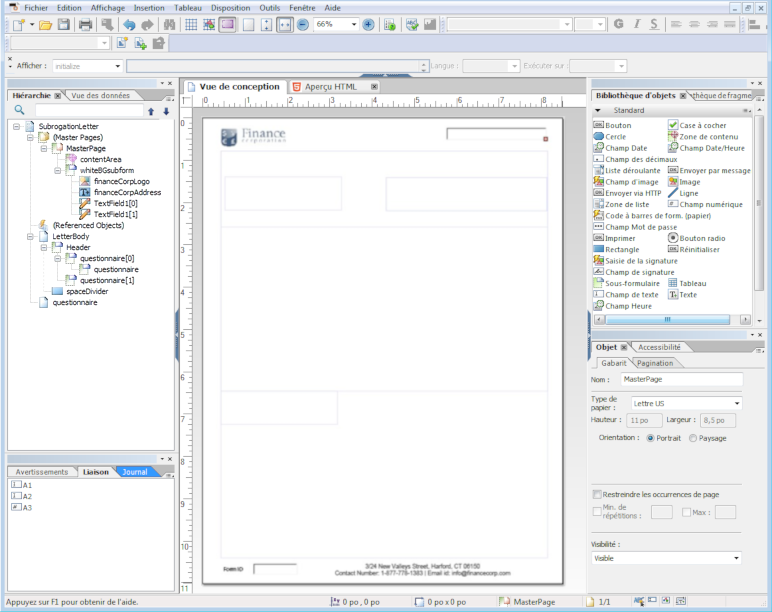

# Conception de la mise en page {#layout-design}

Les modèles de formulaire XFA ou XDP sont ceux de :

* [Lettres](/help/forms/using/create-letter.md)
* [Canal d’impression](/help/forms/using/web-channel-print-channel.md#printchannel) des [communications interactives](/help/forms/using/interactive-communications-overview.md)

* Fragments de mise en page

Les XDP sont conçus dans Adobe Forms Designer. Cet article fournit des détails sur la conception de vos fichiers XDP pour créer des correspondances/communications interactives efficaces, comme l’emplacement d’utilisation des champs de formulaire ou des zones de cible et le moment d’utilisation des fragments de mise en page.

## Création d’une mise en page pour des lettres ou pour le canal d’impression des communications interactives {#creating-a-layout-for-letters-or-for-interactive-communications-print-channel}

Une mise en page définit l’apparence graphique d’une lettre/ ou d’un canal d’impression d’une communication interactive. La mise en page peut contenir des champs de formulaire types comme « Adresse » et « Numéro de référence ». Elle contient également des sous-formulaires vides indiquant les zones cible. Le concepteur de formulaires crée la mise en page et, une fois celle-ci terminée, le spécialiste des applications l’envoie au serveur AEM. À partir de là, la mise en page peut être sélectionnée lors de la création d’un modèle de correspondance ou du canal d’impression d’une communication interactive.

Procédez comme suit pour créer des mises en page pour des lettres/le canal d’impression des communications interactives :

1. Analysez la mise en page et déterminez le contenu qui se répétera sur toutes les pages. Il s’agit en général de l’en-tête et du pied de page. Ce contenu est placé sur les gabarits de la mise en page. Le contenu restant va dans le corps des pages de la mise en page. Dans un dossier de police, le logo et l’adresse de la société pourront être ajoutés à l’en-tête ou au pied de page du gabarit Par exemple, l’avis d’annulation utilise la même présentation.
1. Lors de la conception des pages courantes, divisez le contenu des pages en sections. Chaque section est conçue comme un sous-formulaire intégré dans la mise en page ou comme une mise en page de fragment. Si la section contient un tableau, modélisez-la comme fragment de mise en page.
1. Une mise en page peut être conçue comme suit :

   1. Faites de chaque section un sous-formulaire distinct contenant tous les éléments de la section.
   1. Faites de chaque section un enfant du même sous-formulaire parent. La mise en page du sous-formulaire parent est définie de manière à permettre à la mise en page des sections de s’ajuster si les sections précédentes accueillent des données fusionnées en quantité importante.
   1. La section Résidence principale peut être réutilisée dans d’autres mises en page. Créez-la comme une mise en page de fragment.
   1. La section Détails d’intérêt supplémentaires ne contient que deux éléments placés l’un au-dessous de l’autre, elle peut contenir des données de grande taille et elle est conçue comme une mise en page souple.
   1. D’autres sections contiennent des éléments à des positions spécifiques ; elles sont donc conçues comme des mises en page positionnées.
   1. Eclatez une section en plusieurs sous-formulaires si la section contient des éléments à des positions spécifiques et si ces éléments contiennent de grandes quantités de données. Organisez ensuite les sous-formulaires pour obtenir le comportement souhaité.
   1. Pour la section Résidence principale, ajoutez une zone cible d’espace réservé. Cet espace réservé est lié au fragment Résidence principale au moment de la conception de la lettre/communication interactive.
   1. Téléchargez la mise en page (et le fragment qui utilise la mise en page, le cas échéant) sur le serveur AEM Forms.

## Utilisation d’un schéma {#using-schema}

Vous pouvez utiliser un schéma dans une mise en page ou dans un fragment de mise en page, mais ce n’est pas obligatoire. Si vous utilisez un schéma, vérifiez les éléments suivants :

1. La mise en page et tous les fragments de mise en page utilisés dans une lettre/communication interactive utilisent le même schéma que la lettre/communication interactive.
1. Tous les champs obligatoires à remplir avec des données sont liés au schéma.

## Création de champs associables  {#creating-relatable-fields}

Par défaut, tous les champs sont considérés comme pouvant être associés à diverses sources de données. Si votre mise en page contient des champs qui ne sont pas associables à une source de données, nommez ces champs à l’aide d’un suffixe « _int » (interne), par exemple pageCount_int.

Un champ associable doit :

* être un XFA &lt;field> ou &lt;exclGroup>
* disposer d’une référence de liaison XFA ;
* s’il s’agit d’un champ &lt;exclGroup>, il doit contenir au moins un champ de bouton radio enfant, faute de quoi son type de valeur ne pourra pas être déterminé.

Un champ associable doit :

* avoir un nom.

Un champ associable ne doit pas :

* inclure de suffixe « _int » dans son nom ;
* avoir une liaison définie comme « aucune » ;
* être l’enfant d’un élément &lt;exclGroup>

Dès lors qu’un champ associable répond aux critères décrits ci-dessus, il peut être situé à n’importe quel emplacement et dans n’importe quel niveau d’imbrication de la mise en page. Vous pouvez utiliser les champs associables dans les pages de gabarit.

La configuration de la mise en page des champs est plus flexible que celle des sous-formulaires de zone cible. Mais les champs sont liés à un seul type de valeur. Vous pouvez définir un champ pour qu’il soit grand ou définir le champ avec une hauteur ou une largeur fixes, etc. Le résultat du module ou de la règle est envoyé dans le champ. 

## Quand utiliser des sous-formulaires et des champs de texte  {#deciding-when-to-use-subforms-and-text-nbsp-fields}

Utilisez un sous-formulaire si vous voulez capturer plusieurs contenus de module dans une mise en forme de haut en bas à flux vertical (plusieurs paragraphes ou images). Votre mise en page doit gérer le fait que le sous-formulaire se développe en hauteur afin d’accueillir son contenu. Si vous n’êtes pas sûr que la longueur du contenu associé au sous-formulaire/à la cible ne dépassera jamais l’espace réservé dans la mise en page pour le sous-formulaire, créez ce dernier en tant qu’enfant dans un conteneur de sous-formulaires à mise en page souple. Cette procédure garantit que les objets de mise en page situés en dessous du sous-formulaire se déplaceront vers le bas au fur et à mesure que le sous-formulaire s’agrandira.

Utilisez un champ si vous souhaitez capturer dans votre schéma de mise en page des données de module ou d’élément du dictionnaire de données (car les champs sont liés à des données) ou pour afficher un contenu de module dans une page de gabarit. N’oubliez pas que le contenu d’une page de gabarit ne présente pas une mise en page souple modulable en fonction du contenu de la page. Assurez-vous donc que le champ d’image est utilisé comme logo de l’en-tête. Le tableau qui suit indique plusieurs critères permettant de décider quand utiliser un sous-formulaire ou un champ dans une mise en page.

<table> 
 <tbody> 
  <tr> 
   <td>
<strong>Utilisez un sous-formulaire lorsque</strong>
 </td> 
   <td>
<strong>Utilisez un champ de texte lorsque</strong>
 </td> 
  </tr> 
  <tr> 
   <td>
Il contient une combinaison d’éléments, tels que Nom de famille et Prénom.
 </td> 
   <td>
Il contient un seul élément, tel que Numéro de police.
 </td> 
  </tr> 
  <tr> 
   <td>
Il comprend plusieurs paragraphes.
 </td> 
   <td>
Le texte passe à la ligne suivante et est justifié.
 </td> 
  </tr> 
  <tr> 
   <td>
Les groupes de données conditionnels, facultatifs et répétitifs sont liés à des sous-formulaires afin de réduire le risque d’erreurs de conception susceptibles de survenir lorsque des scripts sont utilisés pour obtenir les mêmes résultats.
 </td> 
   <td>
Les éléments tels que le logo et l’adresse de votre organisation apparaissent sur toutes les pages d’une lettre/communication interactive. Dans ce cas, créez des champs de formulaire pour ces éléments et placez-les sur la page de gabarit. Si vous définissez la liaison du champ sur « Aucune liaison de données », le champ Aucun champ apparaît comme champ associable dans l’Éditeur de lettre/communication interactive. Si vous souhaitez associer certains types de contenu à ces champs, ces derniers doivent contenir des liaisons.
 
Si l’adresse de votre société contient plusieurs lignes de données, utilisez deux champs de texte avec l’option « Autoriser plusieurs lignes » pour représenter l’adresse dans la mise en page.
 
Si le type de données d’un champ de texte est défini comme texte brut, la sortie du module se fait en version texte brut plutôt qu’en version texte enrichi (toutes les mises en forme sont ignorées). Pour conserver la mise en forme, définissez le type de données du champ de texte comme texte enrichi.
 </td> 
  </tr> 
  <tr> 
   <td>
Le texte fait l’objet d’une mise en page souple.
 </td> 
   <td>
Les champs de texte et d’image sont utilisés dans les pages de gabarit. Les pages de gabarit ne peuvent pas utiliser de sous-formulaires comme zones cible.
 </td> 
  </tr> 
  <tr> 
   <td>
Les objets sont groupés et organisés sans lier le sous-formulaire à un élément de données.
 </td> 
   <td>
 
 </td> 
  </tr> 
  <tr> 
   <td>
Le sous-formulaire contient un champ de texte. Le sous-formulaire peut s’agrandir sans écraser les autres objets situés plus bas dans la mise en page.
 </td> 
   <td>
Vous avez besoin d’accéder facilement à ses données dans le post-traitement.
 </td> 
  </tr> 
 </tbody> 
</table>

## Configuration d’éléments répétitifs  {#setting-up-repetitive-elements}

Lorsque des éléments comme le logo et l’adresse de votre organisation figurent sur toutes les pages d’une lettre/communication interactive, créez des champs de formulaire pour ces éléments et placez-les sur la page de gabarit. Utilisez la liaison Nom (Nom du champ) pour ces champs.

## Spécifiez le format de rendu du serveur  {#specify-the-server-nbsp-render-format}

Utilisez le format de rendu du serveur de la mise en page pour le formulaire XML dynamique, faute de quoi aucune lettre/communication interactive basée sur cette mise en page ne s’affichera correctement. Par défaut, le format de rendu du serveur dans LiveCycle Designer est défini comme formulaire XML dynamique. Pour vous assurer que vous utilisez le format correct :

* Dans Designer, cliquez sur **[!UICONTROL Fichier > Propriétés du formulaire > Par défaut]** et assurez-vous que le paramètre Format/Rendu PDF est défini sur Formulaire XML dynamique.

