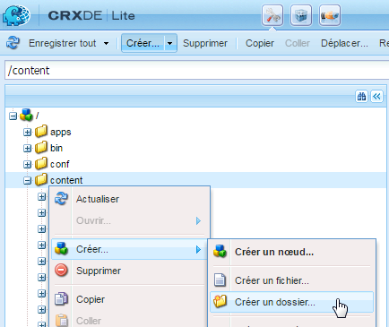
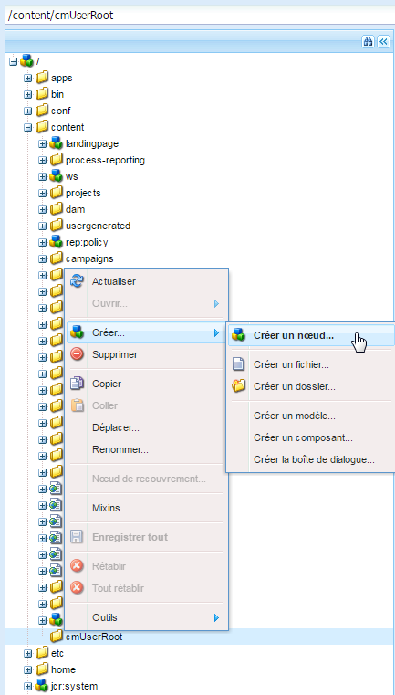
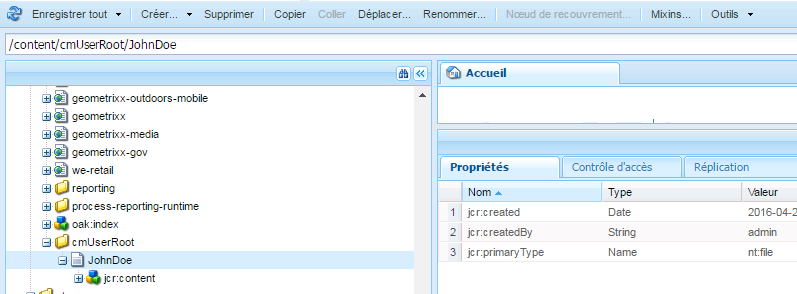
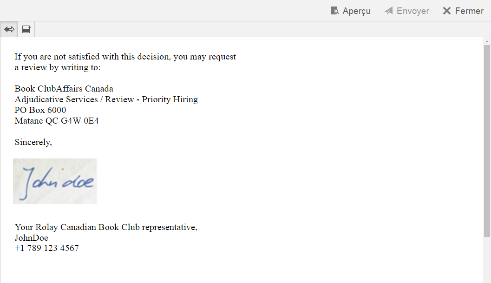

# Gérer les images de signature d’agent {#manage-agent-signature-images}

## Présentation {#overview}

Dans Correspondence Management, vous pouvez utiliser une image pour rendre la signature de l’agent dans les lettres. Après avoir configuré l’image de signature de l’agent, lors de la création d’une lettre, vous pouvez rendre l’image de signature de l’agent dans la lettre en tant que signature de l’agent expéditeur.

Le DDE agentSignatureImage est un DDE calculé qui représente l’image de la signature de l’agent. L’expression de ce DDE calculé utilise une nouvelle fonction personnalisée qui est exposée par le bloc de création Expression Manager. Cette fonction personnalisée prend agentID et agentFolder comme paramètres d’entrée et récupère le contenu d’image en se basant sur ces paramètres. Le dictionnaire de données système SystemContext donne aux lettres dans Correspondence Management l’accès aux informations dans le contexte système actuel. Le contexte du système contient des informations sur l’utilisateur actuellement connecté, ainsi que sur les paramètres de configuration actifs.

Vous pouvez ajouter des images sous le dossier cmuserroot. Dans [Propriétés de configuration de Correspondence Management](/help/forms/using/cm-configuration-properties.md), à l’aide de la propriété Racine de l’utilisateur de CM, vous pouvez changer le dossier d’où l’image de la signature de l’agent est récupérée.

La valeur du DDE agentFolder est extraite du paramètre de configuration CMUserRoot pour les propriétés de configuration de Correspondence Management. Par défaut, ce paramètre de configuration pointe vers/content/cmUserRoot dans le référentiel CRX. Vous pouvez modifier la valeur de la configuration CMUserRoot dans Propriétés de configuration.\
Vous pouvez également remplacer la fonction personnalisée par défaut de manière à définir votre propre logique pour récupérer l’image de la signature de l’utilisateur.

## Ajouter l’image de la signature de l’agent {#adding-agent-signature-image}

1. Assurez-vous que l’image de la signature de l’agent porte le même nom que le nom d’utilisateur AEM de l’utilisateur. (L’extension n’est pas nécessaire pour le nom de fichier de l’image.)
1. Dans CRX, créez un dossier intitulé `cmUserRoot` dans le dossier de contenu.

   1. Accédez à `https://[server]:[port]/crx/de`. Le cas échéant, connectez-vous en tant qu’administrateur.

   1. Cliquez avec le bouton droit sur le dossier **contenu** et sélectionnez **Créer** > **Créer un dossier**.

      

   1. Dans la boîte de dialogue Créer un dossier, saisissez le nom de dossier`cmUserRoot` . Cliquez sur **Enregistrer tout**.

      >[!NOTE]
      >
      >cmUserRoot correspond à l’emplacement par défaut où AEM recherche l’image de la signature de l’agent. Vous pouvez toutefois le modifier en modifiant la propriété Racine de l’utilisateur de CM dans les [propriétés de configuration de Correspondence Management](/help/forms/using/cm-configuration-properties.md).

1. Dans l’explorateur de contenu, accédez au dossier cmUserRoot et ajoutez-y l’image de la signature de l’agent.

   1. Accédez à `https://[server]:[port]/crx/explorer/index.jsp`. Connectez-vous en tant qu’administrateur, si nécessaire.
   1. Cliquez sur **Explorateur de contenu**. L’explorateur de contenu s’ouvre dans une nouvelle fenêtre.
   1. Dans l’explorateur de contenu, accédez au dossier cmUserRoot et sélectionnez-le. Cliquez avec le bouton droit sur le dossier **cmUserRoot** et sélectionnez **Nouveau nœud**.

      

      Effectuez les entrées suivantes de la rangée pour le nouveau nœud, puis cliquez sur la coche verte.

      **Nom :** JohnDoe (ou le nom du fichier de signature de votre agent)

      **Type :** nt:file

      Sous le dossier `cmUserRoot`, un nouveau dossier appelé `JohnDoe` (ou le nom que vous avez donné à l’étape précédente) est créé.

   1. Cliquez sur le nouveau dossier que vous avez créé (ici`JohnDoe` ). L’explorateur de contenu affiche le contenu du dossier en grisé.

   1. Cliquez avec le doublon sur la propriété **jcr:content**, définissez son type sur **nt:resource**, puis cliquez sur la coche verte pour enregistrer l’entrée.

      Si la propriété n’est pas disponible, vous devez d’abord créer une propriété avec le nom jcr:content.

      

      Parmi les sous-propriétés de jcr:content se trouve jcr:data en grisé. Double-cliquez sur jcr:data. La propriété devient modifiable et le bouton Choisir un fichier apparaît dans l’entrée. Cliquez sur **Choisir Fichier** et sélectionnez le fichier image à utiliser comme logo. Le fichier image n’a pas besoin d’extension.

      
   Cliquez sur **Enregistrer tout**.

1. Assurez-vous que le XDP/la mise en page que vous utilisez dans la lettre a un champ d’image en bas à gauche (ou tout autre emplacement de votre choix dans la mise en page où vous souhaitez rendre la signature) afin de rendre l’image de signature.
1. Lors de la création de la correspondance, sous l’onglet Données, sélectionnez un champ d’image pour l’image de la signature en procédant comme suit :

   1. Sélectionnez Système dans le menu contextuel Type de liaison dans le volet de droite.

   1. Sélectionnez le DDE agentSignatureImage dans la liste du volet Eléments de données pour le dictionnaire de données SystemContext.

   1. Enregistrez la lettre.

1. Lorsque la lettre est rendue, vous pouvez voir votre signature dans l’aperçu de lettre dans le champ d’image en fonction de la mise en page.

   

